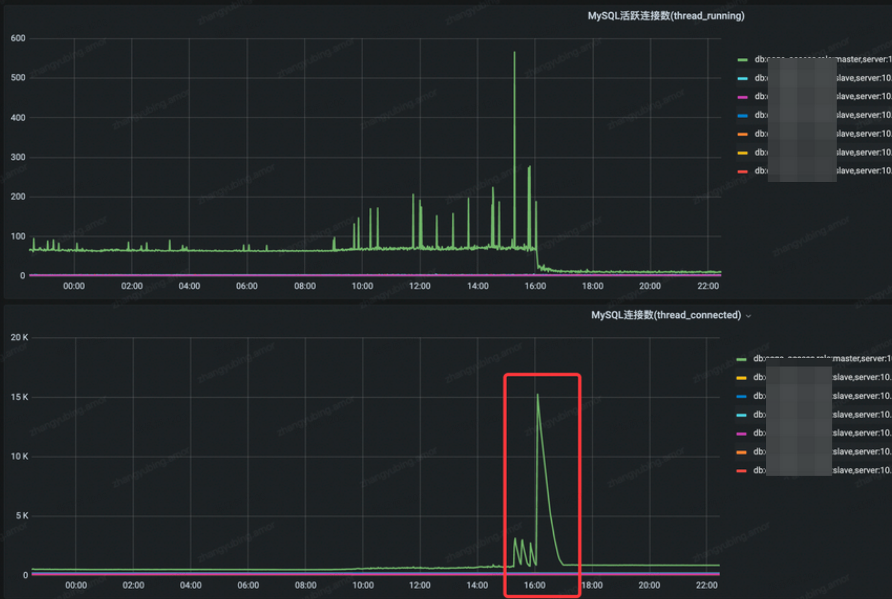

# Mysql存储引擎-InnoDB

## 踩坑 & 处理

### 上游无限重试，重复执行update语句，锁等待严重，最终链接过多导致数据库OOM

场景是 
```
faas -> 请求算法服务返回相似商品 -> 相似商品召回送审
```
触发背景
1.  faas执行失败会无限重试，直到成功
2. 算法服务返回相似商品过多，1000个，<b>请求算法服务的时间+相似召回送审的时间</b>超过faas的设置时间，<b>稳定超时</b>，因此触发了无限重试
3. 在送审阶段，有一个更新语句如下，有<b>热点行</b>的<b>异步更新</b>，该表有不到1000条数据，因为一直异步更新，一直在申请连接池的连接，开事务进行更新，最终导致DB OOM

```sql
> 异步执行的语句
update t_dimension_daily_count set count = count + 1 
where daily_time = ? and stype = ? and sub_type = ?

> 数据库条数
select count(1) from t_dimension_daily_count;
count(1) = 942
```

报错从 1205 变成了 1105
```
Error 1205: Lock wait timeout exceeded; try restarting transcation

Error 1105: get master conn error，Error 1040: Too many connections
```

### 插入数据过大

str: field varchar(5)

```
insert into checkVarcharLimit(`id`,`str`) values(10, '244444');

ERROR 1406 (22001): Data too long for column 'str' at row 1
```

### 查询超时

背景

- 该店铺是top店铺，送审了很多次
- detail表有好几个大字段（`LongText`类型），使用`select *`会拿所有的数据，查询超时

解决方案最终选择的是 `select id, shop_id, task_id`，速度很快

```
索引是这个 KEY `idx_shop_id` (`shop_id`)

select * from t_access_shop_audit_detail where shop_id = 22713444 and commit_type = -70 limit 0, 1;   // 执行超时

SQL分析

explain select * from t_access_shop_audit_detail where shop_id = 22713444 and commit_type = -70 limit 0, 1;

key 是使用了 idx_shop_id，走了索引，但是执行还是会超时
```

### 数据库事务使用不当

背景

- 数据库事务里面执行了数据更新，然后发了个消息到mq，最后事务commit。
- 消费者消费消息，读master节点，还是老数据

解决方法：先commit事务，再发消息


### 索引失效

背景

- 商家送审来资质数据，命中机审条件，可以免审掉部分资质（审核中 -> 审核通过）
- 资质审核状态表数据量级在 2亿行左右（配置的45天归档）
- submit_serial 表示一次提审，qualification_id 表示 资质数据的id，两个均建立了索引

- 上线期间，资质审核状态表的数据有倍增的情况（商家只提审了3983条资质数据），但是数据最终被膨胀了13倍 (51779条资质数据)
- 更新的sql的qualification_id并未做去重，从而 qualification_id 有很多，出问题后，DBA 同步 <b>in查询过多，不走索引，会导致锁全表</b>


```sql
update t_access_shop_qualification_audit set status=3 
where qualification_id in (?) and submit_serial = ?
```

当时的快照分析 （单位是秒）

| Query_time | Lock_time | Rows_examined | Rows_sent | Rows_affected | Bytes_sent |
| ----  | ---- | ---- |  ----  | ---- | ---- |
| 74074.921875 | 61.889305 | 216959004 | 0 | 51753 | 67 | 

- 后面配置了 sql 超时10s kill，然后db的连接数瞬间上去了，导致db没法响应请求（<b>3分钟不可用</b>）



临时解决方案

not in 里面的数据不会很多，最多不超过10个，并且强制走 idx_submit_serial 索引（不过效果待验证

```sql
update t_access_shop_qualification_audit force index (idx_submit_serial) 
set status=3 where submit_serial=? and qualification_id not in (?)
```

长期解决方案

改为小事务，分批更新状态，如果中间出错，直接抛出，交给重试

```sql 
groupSize := 300
for i := 0; i < len(audits); i += groupSize {
    auditGroup := audtis[i:math.Min(i+groupSize, len(audits))]

    tx.begin()
    for _, audit := range auditGroup {
        update t_access_shop_qualification_audit set status=3 where submit_serial=audit.SubmitSerial and qualification_id=audit.QualificationId
    }
    tx.Commit()
}
```