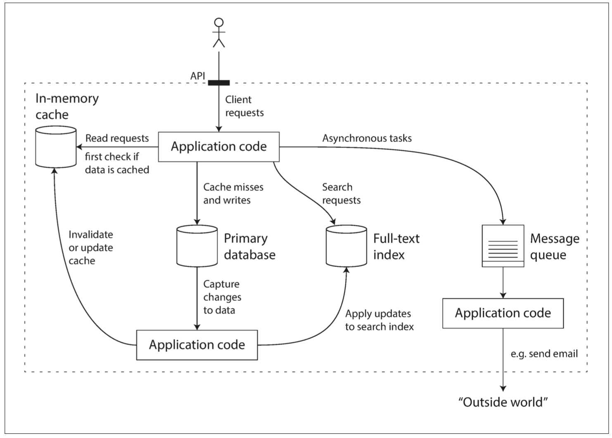

# 设计数据密集型应用

## 一、数据系统基石

### 可靠性，可伸缩性，可维护性

作为软件维护者，要对软件系统有全方面的认知，指标可观测，尽可能服务无状态，根据流量自行扩缩容，并且考虑兜底，降级方案，做到常态化演练。
 

案例有Twitter的推文发布。

- 对于粉丝多的博主，粉丝获取博文采用拉的方式。(发件箱查询，压力在读)
- 对于粉丝少的博主，粉丝获取博文采用推的方式。(收件箱查询，压力在写)

 
### 数据模型与查询语言
 
介绍了NoSQL，命令式和声明式查询，图查询还没接触过(今年抽空简单用下)
目前生产系统用的MongoDB，Redis，MySQL，ES。
 
案例有Linkedin的简历数据模型设计。

- 考虑点在于，数据一对多，范式设计，数据冗余，id标识。

### 存储与检索

#### 存储结构

日志结构（log-structured） 的存储引擎，面向页面（page-oriented） 的（例如B树）

- 对于日志结构存储引擎，日志是主要的存储位置。日志段在后台压缩，并进行垃圾回收。
- 对于覆写单个磁盘块的 B 树，每次修改都会先写入 预写式日志（Write Ahead Log, **WAL**），以便崩溃后索引可以恢复到一个一致的状态。

案例

BitCask

- 内存构建哈希索引，数据顺序存储
- 同样键对应的值，采取新值覆盖旧值的做法
- 内存索引构建快照，为了崩溃恢复更快

LSM树：LevelDB、RocksDB （待看源码）

- 内存有序索引memTable（采用红黑树，AVL树维护），磁盘维护 SSTable（Sorted String Table），有序结构
- 采用 Bloom过滤器 确定键是否存在

B树：MySQL

- 采用页管理的机制，根据键的索引，找到数据的页，更新页的数据
- 如果数据页存储空间不足以支持本次插入/更新，页分裂
- 如果删除导致页内数据较少，页合并

主键索引，普通索引，聚集索引，非聚集索引，覆盖索引

全文搜索，模糊索引

#### 事务还是分析？

**比较事务处理和分析系统的特点**

|     属性     |      事务处理系统 OLTP       |      分析系统 OLAP       |
| :----------: | :--------------------------: | :----------------------: |
| 主要读取模式 |    查询少量记录，按键读取    |    在大批量记录上聚合    |
| 主要写入模式 |   随机访问，写入要求低延时   | 批量导入（ETL）或者事件流  |
|   主要用户   |    终端用户，通过 Web 应用     | 内部数据分析师，用于决策支持 |
|  处理的数据  | 数据的最新状态（当前时间点） |   随时间推移的历史事件   |
|  数据集尺寸  |           GB ~ TB            |         TB ~ PB          |

- OLTP系统通常面向用户，这意味着系统可能会收到大量的请求。为了处理负载，应用程序通常只访问每个查询中的少部分记录。应用程序使用某种键来请求记录，存储引擎使用索引来查找所请求的键的数据。磁盘寻道时间往往是这里的瓶颈。
- 数据仓库和类似的分析系统主要由业务分析人员使用。通常每个查询开销高昂，需要在短时间内扫描数百万条记录。磁盘带宽（而不是查找时间）往往是瓶颈，**列式存储**是这种工作负载越来越流行的解决方案。

### 编码与演化

数据前向兼容，后向兼容

数据编码方式：JSON，XML，MsgPack，Thrift，ProtoBuf

数据流流转方式

- 数据库，写入后读取
- RPC 和 REST API，同步调用
- 异步消息，消息代理作为缓冲区，上游无需关注下游系统情况

## 二、分布式系统

- 许多处理器，内存和磁盘可以在同一个操作系统下相互连接，快速的相互连接允许任意处理器访问内存或磁盘的任意部分。在这种 共享内存架构（shared-memory architecture） 中，所有的组件都可以看作一台单独的机器，购买更强大的机器，有时称为 **垂直伸缩**，即 vertical scaling，或 向上伸缩，即 scale up
- 无共享架构（shared-nothing architecture，有时被称为 **水平伸缩**，即 horizontal scaling，或 向外伸缩，即 scaling out

### 复制

#### 领导者和追随者 

客户端写入主库（leader|master|primary），主库发送复制流（replication log），或变更消息（change stream），从库（followers|read replicas|slaves|secondaries|hot-standby）接受数据，按相同的处理顺序来处理

- 同步，主库和从库同步更新数据
- 半同步，主库和一个从库同步更新数据，其他从库异步更新数据
- 异步，主库更新数据，从库异步更新数据

| 复制方式 | 主库 | 从库 | 
| :----: | :----: | :----: |
| 同步复制 | 同步 |  所有从库都同步更新数据 |
| 半同步复制 | 同步 |  一个从库同步更新数据，其他从库异步更新数据| 
| 异步复制 | 同步 | 所有从库都异步复制数据 | 

增加新从库，其过程如下所示：

1. 在某个时刻获取主库的一致性快照（如果可能，不必锁定整个数据库）。对于某些场景，可能需要第三方工具，例如用于 MySQL 的 innobackupex。
2. 将快照复制到新的从库节点。
3. 从库连接到主库，并拉取快照之后发生的所有数据变更。这要求快照与主库复制日志中的位置精确关联。该位置有不同的名称，例如 PostgreSQL 将其称为 日志序列号（log sequence number，LSN），MySQL 将其称为 二进制日志坐标（binlog coordinates）。
当从库处理完快照之后积累的数据变更，我们就说它 赶上（caught up） 了主库，现在它可以继续及时处理主库产生的数据变化了。

复制日志分类

- 语句复制
    * 考虑是确定性语句，类似`now()`需要提前转义
- 传输预写式日志
    * 日志结构存储引擎LSM等，WAL日志
- 逻辑日志复制
    * 基于行，如 MYSQL 的 binlog
- 基于触发器的复制
    * 触发器允许你将数据更改（写入事务）发生时自动执行的自定义应用程序代码注册在数据库系统中。触发器有机会将更改记录到一个单独的表中，使用外部程序读取这个表，再加上一些必要的业务逻辑，就可以将数据变更复制到另一个系统去。

#### 复制延迟问题

- 读己之写
    * 写后读一致性（read-after-write consistency），也称为 读己之写一致性（read-your-writes consistency）
- 单调读
    * 实现单调读的一种方式是确保每个用户总是从同一个副本进行读取（不同的用户可以从不同的副本读取）。
    * 例如，可以基于用户 ID 的散列来选择副本，而不是随机选择副本。但是，如果该副本出现故障，用户的查询将需要重新路由到另一个副本
- 一致前缀读
    * 一种解决方案是，确保任何因果相关的写入都写入相同的分区
- 复制延迟

#### 多主复制

协同编辑场景下，需要多个人/多个设备的数据互相同步。

实现冲突合并解决有多种途径：

- 给每个写入一个唯一的 ID（例如时间戳、长随机数、UUID 或者键和值的哈希），挑选最高 ID 的写入作为胜利者，并丢弃其他写入。如果使用时间戳，这种技术被称为 最后写入胜利（LWW, last write wins）。虽然这种方法很流行，但是很容易造成数据丢失
- 为每个副本分配一个唯一的 ID，ID 编号更高的写入具有更高的优先级。这种方法也意味着数据丢失
- 以某种方式将这些值合并在一起 - 例如，按字母顺序排序，然后连接它们（合并的标题可能类似于 “B/C”）
- 用一种可保留所有信息的显式数据结构来记录冲突，并编写解决冲突的应用程序代码（也许通过提示用户的方式）

#### 小结

复制的目的

- 高可用性；即使在一台机器（或多台机器，或整个数据中心）停机的情况下也能保持系统正常运行
- 延迟；将数据放置在地理上距离用户较近的地方，以便用户能够更快地与其交互
- 可伸缩性；通过在副本上读，能够处理比单机更大的读取量

复制的三种主要方法

- 单主复制；客户端将所有写入操作发送到单个节点（主库），该节点将数据更改事件流发送到其他副本（从库）。
- 多主复制；客户端将每个写入发送到几个主库节点之一，其中任何一个主库都可以接受写入。主库将数据更改事件流发送给彼此以及任何从库节点。
- 无主复制；客户端将每个写入发送到几个节点，并从多个节点并行读取，以检测和纠正具有陈旧数据的节点。

复制延迟一致性模型

- 写后读一致性；用户应该总是能看到自己提交的数据。
- 单调读；用户在看到某个时间点的数据后，他们不应该再看到该数据在更早时间点的情况。
- 一致前缀读；用户应该看到数据处于一种具有因果意义的状态：例如，按正确的顺序看到一个问题和对应的回答。

### 分区

分区的目标是在多台机器上均匀分布数据和查询负载，避免出现热点（负载不成比例的节点）。

分区方式

- 键范围分区
- 散列分区

请求分区路由方式

- 节点路由；数据在B节点，客户端->A节点 中转-> B节点
- 代理路由；数据在B节点，客户端->proxy->B节点，proxy使用zk，etcd维护元数据
- 客户端路由；客户端知道所有节点信息，客户端做路由

### 事务

#### 小结

脏读

- 一个客户端读取到另一个客户端尚未提交的写入。**读已提交** 或更强的隔离级别可以防止脏读。

读取偏差（不可重复读）

- 在同一个事务中，客户端在不同的时间点会看见数据库的不同状态。快照隔离 经常用于解决这个问题，它允许事务从一个特定时间点的一致性快照中读取数据。快照隔离通常使用 多版本并发控制（MVCC） 来实现。

丢失更新

- 两个客户端同时执行 **读取 - 修改 - 写入序列**。其中一个写操作，在没有合并另一个写入变更情况下，直接覆盖了另一个写操作的结果。所以导致数据丢失。快照隔离的一些实现可以自动防止这种异常，而另一些实现则需要手动锁定（SELECT FOR UPDATE）。

写入偏差

- 一个事务读取一些东西，根据它所看到的值作出决定，并将该决定写入数据库。但是，写入时，该决定的前提不再是真实的。只有可串行化的隔离才能防止这种异常。

幻读

- 事务读取符合某些搜索条件的对象。另一个客户端进行写入，影响搜索结果。快照隔离可以防止直接的幻像读取，但是写入偏差上下文中的幻读需要特殊处理，例如索引范围锁定。

其他关于数据库方面的知识可以看 《MySQL技术内幕 InnoDB存储引擎 第2版》

#### 案例

需要可重复读的场景

案例
背景：转账，用户A 500元，用户B 500元，A给B转100元（如果不可重复读）

事务1

- 操作a. A-100
- 操作b. B+100 
- 操作c. commit

事务2

- 操作d. 读A 500元                                       
- 操作e. 读B  600元

按照 d->a->b->c->e 的顺序执行

此时事务2里 A和B一共1100，违反了数据一致性

## 引用

- https://vonng.gitbooks.io/ddia-cn/content/