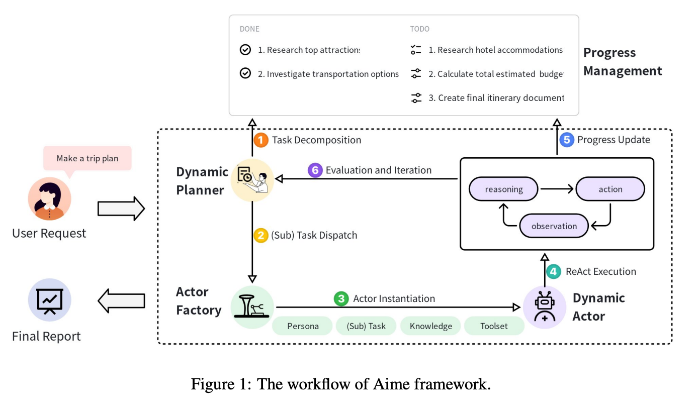
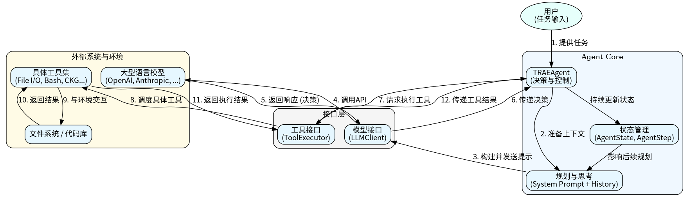
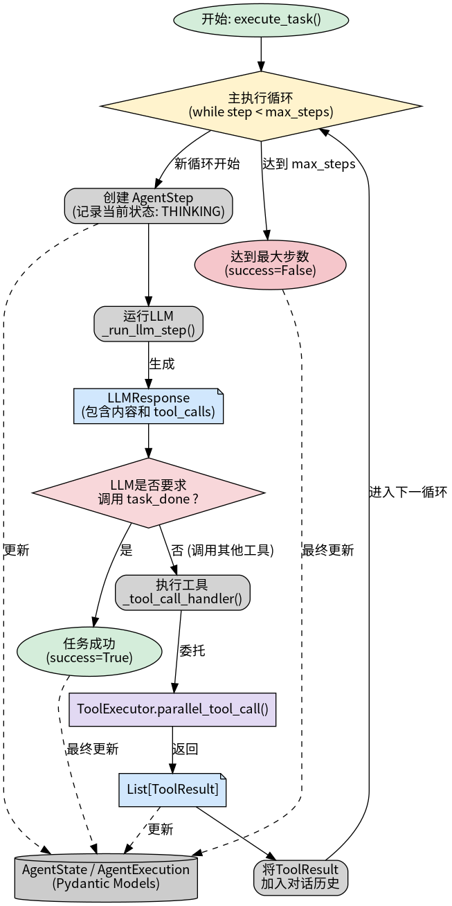

# Agent调研

## 背景

背景：Manus的发布让人眼前一亮，突出的点在于

- 处理任务会先生成TodoList，过程中不断更新TodoList
- 能较好的利用工具、包括浏览器、搜索引擎、生成文档

## 通用 Agent

### 架构分析

针对体验较好的通用Agent进行简要分析，[论文:Aime: Towards Fully-Autonomous Multi-Agent Framework](https://arxiv.org/pdf/2507.11988)



- Dynamic Planner（动态规划者）：将目标分解为可执行子任务的层次结构、并维护一个全局任务列表
- Actor Factory（执行器工厂）：根据特定任务实例化执行器、包含 `Person`，`Task`，`Knowledge`，`ToolSet`
- Actor（执行器）：采用`ReAct`模式
- Progress Updater（进度更新器）：根据执行器的输出、更新全局任务列表

以下是一次任务执行的详情debug，略有删减：

### 执行示例

Step1：接收用户需求
```markdown
将这篇论文 `https://arxiv.org/pdf/2507.11988` 生成一个清晰、有深度和信息量的文档。
文档语言应为 `中文` 
- 摘要总结：提取论文摘要进行总结，梳理核心的创新/功能点 
- 总结并阐述核心功能/创新点的方案，总结要精简
```

Step2：Planner拆分任务

> 观察下方输出，可知Planner既生成了Todo List，还生成了下一步任务的角色、目标、任务、工具

```markdown
## Progress
- [ ] **Phase 1: 论文分析与摘要生成**
    - [ ] 从指定 URL 下载并阅读学术论文
    - [ ] 分析论文以提炼其核心论点、方法和结论
    - [ ] 将核心要点总结为指定的目标语言（中文）
    - [ ] 生成包含该摘要的初始文档
- [ ] **Phase 2: 关联文献检索与分析**
    - [ ] 识别目标论文的作者和研究团队
    - [ ] 检索同一团队的其他相关论文
    - [ ] 检索具有相似方法或结论的论文
    - [ ] 检索具有不同或相反观点的论文
    - [ ] 分析并整理检索到的文献
- [ ] **Phase 3: 文档丰富化与终稿**
    - [ ] 读取初始摘要文档和整理好的关联文献分析
    - [ ] 将关联文献的分析结果整合到摘要文档中
    - [ ] 使用综合内容更新最终文档

## Rationale
好的，我将遵循您提供的SOP来完成这项任务。整个流程分为三个清晰的阶段：首先，深入分析您指定的论文并生成一份核心摘要的文档；其次，进行关联文献的检索与分析，以丰富报告的深度与广度；最后，将所有信息整合，生成一份全面、详实的最终版文档。

现在，我将开始执行第一阶段的任务：下载并分析论文 `https://arxiv.org/pdf/2507.11988`，然后生成一份包含核心要点和深度解读的初始中文文档。

## Action (mewtwo)
param="task_brief"
下载并分析指定的Arxiv论文，生成一份核心摘要的中文文档。
"""param="task"
**任务目标:** 根据指定的学术论文 `https://arxiv.org/pdf/2507.11988`，生成一份精炼、有深度的核心要点中文摘要文档。

**详细步骤:**
1.  **获取并阅读论文**: 使用 `arxiv` 工具，从指定的 URL (`https://arxiv.org/pdf/2507.11988`) 下载并阅读论文的全部内容。
2.  **提炼与总结核心内容**: 请深入理解论文内容，并生成一份高质量的中文总结。总结内容必须严格遵循用户要求，包含以下部分：
    - **摘要总结**: 提取并总结论文摘要，梳理其核心的创新/功能点。应涵盖研究背景、主要贡献、方法概述和结论等完整要素。
    - **核心功能/创新点阐述**: 精简地总结并阐述论文的核心功能/创新点。在总结时，不仅要说明“是什么”，还要深入阐述其“为什么重要”以及“与现有方法的区别”。
3.  **确保内容质量**:
    - **学术严谨性**: 准确引用论文中的关键数据、实验结果和技术细节，避免信息失真。
    - **可读性**: 确保文档结构层次清晰，包含完整的标题层级和逻辑脉络。
4.  **创建文档**: 使用 `files` 工具将这份中文总结报告生成一个Markdown文件。文档标题应清晰反映论文主题。
"""
"""param="persona"
你是一位资深的AI领域研究员，精通特定领域的学术知识，擅长快速阅读英文文献并精准地提炼核心内容。你能够用清晰、专业的中文，并结合图表、高亮等形式，深入浅出地阐述复杂的学术概念和技术方案，确保报告的专业性和可读性。
"""
"""param="tools_selection_thought"
files:maybe
terminal:no
research:no
search:no
knowledgebase_search:no
browser:no
arxiv:yes
"""
"""param="tools"
arxiv,files
"""
```

Step3: 执行第一步任务

```markdown
任务已成功完成。

我严格按照任务要求，完成了对学术论文 `https://arxiv.org/pdf/2507.11988` 的深度分析与总结，并生成了一份高质量的文档。

**执行流程回顾:**
1.  **论文获取与处理:** 使用 `mcp:arxiv_download_paper` 工具成功下载了指定论文，并将其转换为易于处理的 Markdown 格式 (`papers/2507.11988.md`)。
2.  **内容阅读与分析:** 通过 `mcp:arxiv_read_paper` 工具完整阅读了论文内容，为后续提炼核心观点奠定了基础。
3.  **核心内容提炼:** 我深入分析了论文的研究背景、方法论和实验结果，撰写了一份详尽的中文摘要报告 (`report.md`)，内容涵盖了“摘要总结”和“核心功能/创新点阐述”两大板块，确保了学术严谨性和信息完整性。
4.  **文档生成:** 最后，调用 `files` 工具，将 `report.md` 的内容转化为一份结构清晰、排版专业的文档。

最终的文档不仅准确传达了论文的核心思想，还通过精心的排版和内容组织，增强了报告的可读性。
```

Step4: 更新进度

```markdown
- [x] **Phase 1: 论文分析与摘要生成**
    - [x] 从指定 URL 下载并阅读学术论文
    - [x] 分析论文以提炼其核心论点、方法和结论
    - [x] 将核心要点总结为指定的目标语言（中文）
    - [x] 生成包含该摘要的初始文档
- [ ] **Phase 2: 关联文献检索与分析**
    - [ ] 识别目标论文的作者和研究团队
    - [ ] 检索同一团队的其他相关论文
    - [ ] 检索具有相似方法或结论的论文
    - [ ] 检索具有不同或相反观点的论文
    - [ ] 分析并整理检索到的文献
- [ ] **Phase 3: 文档丰富化与终稿**
    - [ ] 读取初始摘要文档和整理好的关联文献分析
    - [ ] 将关联文献的分析结果整合到摘要文档中
    - [ ] 使用综合内容更新最终文档
```

Step5: 规划第二步任务

```markdown
## Progress
- [x] **Phase 1: 论文分析与摘要生成**
    - [x] 从指定 URL 下载并阅读学术论文
    - [x] 分析论文以提炼其核心论点、方法和结论
    - [x] 将核心要点总结为指定的目标语言（中文）
    - [x] 生成包含该摘要的初始文档
- [ ] **Phase 2: 关联文献检索与分析**
    - [ ] 识别目标论文的作者和研究团队
    - [ ] 检索同一团队的其他相关论文
    - [ ] 检索具有相似方法或结论的论文
    - [ ] 检索具有不同或相反观点的论文
    - [ ] 分析并整理检索到的文献
- [ ] **Phase 3: 文档丰富化与终稿**
    - [ ] 读取初始摘要文档和整理好的关联文献分析
    - [ ] 将关联文献的分析结果整合到摘要文档中
    - [ ] 使用综合内容更新最终文档

## Rationale
第一阶段“论文分析与摘要生成”已成功完成，并产出了一份高质量的文档。现在，我们将进入SOP的第二阶段：“关联文献检索与分析”。

此阶段的目标是围绕核心论文《AIME: 迈向完全自主的多智能体框架》进行深入的学术背景挖掘，以增强最终报告的深度和全面性。我将委派一个具备强大文献检索和分析能力的`mewtwo` agent来执行此任务。该agent将首先从已下载的论文中识别作者和研究团队，然后从三个维度（作者相关工作、相似研究、不同/相反思路的研究）进行全面的文献检索，最后将所有发现整理成一份结构化的Markdown文件，为第三阶段的内容整合做准备。

## Action (mewtwo)
"""param="task_brief"
围绕核心论文进行全面的关联文献检索与分析。
"""
"""param="task"
**任务目标:** 围绕目标论文 `AIME: Towards Fully Autonomous Multi-agent Frameworks` (存储于 `papers/2507.11988.md`)，执行一个全面的关联文献检索与分析任务。

**详细步骤:**
1.  **识别作者与团队**: 首先，从已有的论文文件 `papers/2507.11988.md` 中识别出主要作者及其所属的研究团队。
2.  **执行三类检索**:
    *   **作者相关工作**: 查找主要作者在多智能体系统、自主AI框架等相关领域的其他重要论文。
    *   **相似研究**: 查找与“AIME”框架思想类似的论文，特别是那些尝试解决相同问题（如自主协作、动态任务规划）或使用相似方法（如分层控制、多智能体通信）的论文。
    *   **不同/相反思路的研究**: 查找提出不同技术路线（例如，中心化控制 vs. AIME的去中心化协作）或对AIME观点提出挑战的论文。
3.  **整理并输出结果**: 将检索到的所有相关论文整理成一个结构化的列表。对于每一篇论文，请提供：
    *   标题和作者。
    *   论文的公开访问链接 (优先使用 arXiv 链接)。
    *   简要说明其与目标论文的关联性（属于上述哪一类，核心观点是什么）。
4.  **保存结果**: 将最终的整理结果保存到一个名为 `related_literature_report.md` 的 Markdown 文件中，以便后续步骤使用。
"""
"""param="persona"
你是一名顶尖的AI领域文献研究员，拥有强大的信息检索和分析能力。你能够快速定位一个研究领域内的关键论文、追踪特定学者或团队的研究脉络，并识别出不同技术路线的代表性工作。
"""
"""param="tools_selection_thought"
files:maybe
terminal:no
research:no
search:yes
knowledgebase_search:no
browser:no
arxiv:yes
"""
"""param="tools"
arxiv,search,files
"""
```

Step6: 执行第二步任务

```markdown
任务已成功完成。

我严格按照任务要求，围绕目标论文 `AIME: Towards Fully-Autonomous Multi-agent Frameworks`，执行了全面的关联文献检索与分析。

**执行流程回顾:**
1.  **识别作者与团队**: 我首先分析了论文 `papers/2507.11988.md`，准确识别出了主要作者（Yexuan Shi 等）及其所属机构（ByteDance），并提炼了论文的核心主题。
2.  **执行三类检索**: 基于分析结果，我设计了精准的检索策略，并利用 `search` 工具高效地查找了三类文献：
    *   **作者相关工作**: 探索了主要作者在分布式系统和数据联邦等领域的研究，为其设计 AIME 框架提供了技术背景。
    *   **相似研究**: 找到了如 `AgentNet`、`MetaGPT` 等在理念或目标上与 AIME 相似的框架，并进行了对比分析。
    *   **不同/相反思路的研究**: 检索了探讨中心化与去中心化控制策略的文献，为理解 AIME 的混合架构设计提供了理论视角。
3.  **整理并输出结果**: 我将所有检索和分析结果系统地整理成了一份结构清晰的 Markdown 报告。
4.  **保存结果**: 最终报告已保存为 `related_literature_report.md` 文件。

这份报告为深入理解 AIME 框架的技术背景、创新点及其在现有研究格局中的位置提供了坚实的基础。
```

Step7: 进度更新

```markdown
- [x] **Phase 1: 论文分析与摘要生成**
    - [x] 从指定 URL 下载并阅读学术论文
    - [x] 分析论文以提炼其核心论点、方法和结论
    - [x] 将核心要点总结为指定的目标语言（中文）
    - [x] 生成包含该摘要的初始文档（文档）
- [x] **Phase 2: 关联文献检索与分析**
    - [x] 识别目标论文的作者和研究团队
    - [x] 检索同一团队的其他相关论文
    - [x] 检索具有相似方法或结论的论文
    - [x] 检索具有不同或相反观点的论文
    - [x] 分析并整理检索到的文献
- [ ] **Phase 3: 文档丰富化与终稿**
    - [ ] 读取初始摘要文档和整理好的关联文献分析
    - [ ] 将关联文献的分析结果整合到摘要文档中
    - [ ] 使用综合内容更新最终文档
```

Step8：规划第三步任务

```markdown
## Progress
- [x] **Phase 1: 论文分析与摘要生成**
    - [x] 从指定 URL 下载并阅读学术论文
    - [x] 分析论文以提炼其核心论点、方法和结论
    - [x] 将核心要点总结为指定的目标语言（中文）
    - [x] 生成包含该摘要的初始文档（文档）
- [x] **Phase 2: 关联文献检索与分析**
    - [x] 识别目标论文的作者和研究团队
    - [x] 检索同一团队的其他相关论文
    - [x] 检索具有相似方法或结论的论文
    - [x] 检索具有不同或相反观点的论文
    - [x] 分析并整理检索到的文献
- [ ] **Phase 3: 文档丰富化与终稿**
    - [ ] 读取初始摘要文档和整理好的关联文献分析
    - [ ] 将关联文献的分析结果整合到摘要文档中
    - [ ] 使用综合内容更新最终文档

## Rationale
前两个阶段的任务已圆满完成。我们已经有了一份关于核心论文的深度摘要文档，以及一份详尽的关联文献分析报告。

现在，我们进入SOP的最后阶段——“文档丰富化与终稿”。此阶段的核心任务是将第二阶段产出的学术背景和关联研究分析，无缝地整合到第一阶段生成的初始摘要文档中，从而形成一份内容更全面、视角更宏大的最终报告。

我将指派一名具备严谨学术编辑能力的 `mewtwo` agent 来执行此项任务。它将读取并合并两个核心文件，然后使用整合后的内容覆盖并更新已创建的文档，确保最终产出的报告逻辑连贯、结构清晰、信息完整。

## Action (mewtwo)
"""param="task_brief"
将关联文献分析报告整合到已有的论文摘要文档中，生成最终版报告。
"""
"""param="task"
**任务目标:** 将关联文献分析报告补充到已有的中文精要文档中，形成最终的综合性报告。

**详细步骤:**
1.  **读取文件内容**:
    *   读取之前生成的中文摘要报告文件 `report.md`。
    *   读取包含关联文献分析的报告文件 `related_literature_report.md`。
2.  **内容整合**:
    *   创建一个新的 Markdown 内容。首先，包含 `report.md` 的全部内容。
    *   然后，在末尾添加一个新的大标题，例如 `## 关联研究与学术背景`。
    *   接着，将 `related_literature_report.md` 的全部内容追加到这个新标题下方。
3.  **更新文档**:
    *   使用 `lark_creation` 工具的文档更新功能。
    *   定位到之前创建的文档 URL: `https://bytedance.larkoffice.com/docx/MJJTdZnPwoD9Apx7hpHcSKk8nHe`。
    *   用整合后的全新 Markdown 内容，**覆盖并更新**该文档的全部内容，完成最终报告。
"""
"""param="persona"
你是一位严谨的学术编辑，擅长整合不同来源的信息，将多份文档合并成一份逻辑连贯、结构清晰的综合性报告。你对细节一丝不苟，确保最终产出的文档具有极高的专业水准和可读性。
"""
"""param="tools_selection_thought"
files:yes
terminal:no
research:no
search:no
knowledgebase_search:no
browser:no
arxiv:no
"""
"""param="tools"
files
"""
```

Step9: 执行第三步任务

```markdown
任务已成功完成。

我已按照要求，将论文摘要报告与关联文献分析报告成功合并，并生成了一份综合性的文档。

**执行步骤：**
1.  **文件合并**：通过 `bash` 命令，我将 `report.md` 与 `related_literature_report.md` 的内容合并到 `final_report.md` 文件中，并加入了新的二级标题以区分内容。
2.  **文档生成**：我使用 `lark_creation` 工具，基于整合后的 `final_report.md`，创建了最终的报告。

最终的报告内容全面，结构清晰，达到了预期的任务目标。
```

Step10: 进度更新

```markdown
- [x] **Phase 1: 论文分析与摘要生成**
    - [x] 从指定 URL 下载并阅读学术论文
    - [x] 分析论文以提炼其核心论点、方法和结论
    - [x] 将核心要点总结为指定的目标语言（中文）
    - [x] 生成包含该摘要的初始文档（文档）
- [x] **Phase 2: 关联文献检索与分析**
    - [x] 识别目标论文的作者和研究团队
    - [x] 检索同一团队的其他相关论文
    - [x] 检索具有相似方法或结论的论文
    - [x] 检索具有不同或相反观点的论文
    - [x] 分析并整理检索到的文献
- [x] **Phase 3: 文档丰富化与终稿**
    - [x] 读取初始摘要文档和整理好的关联文献分析
    - [x] 将关联文献的分析结果整合到摘要文档中
    - [x] 使用综合内容更新最终文档
```

Step11: 任务完成

```markdown
我已成功对您指定的论文《AIME: 迈向完全自主的多智能体框架》进行了深入分析，并根据您的要求生成了一份清晰、有深度的文档。这份文档详细总结了 AIME 框架的核心创新点，包括其自主规划与执行、动态工具使用、分层多智能体协作以及混合架构设计，旨在解决大型语言模型在复杂任务中自主性不足的问题。我确保了报告内容详实、逻辑清晰，并结合了相关文献分析，完全符合您对深度和信息量的要求。
```

## 代码 Agent

当前市场上比较较为火的是 Cursor、Claude Code、Trae

### Trae 系统架构

[Trae Agent Code Repo](https://github.com/bytedance/trae-agent)

系统架构



数据流图



新奇的点

- [Prompt](https://github.com/bytedance/trae-agent/blob/main/trae_agent/prompt/agent_prompt.py)
- [Ckg（Code Knowledge Grpah）](https://github.com/bytedance/trae-agent/blob/main/trae_agent/tools/ckg/ckg_database.py): 维护代码的函数和类的原信息到本地数据库，
- [sequential thinking](https://github.com/bytedance/trae-agent/blob/main/trae_agent/tools/sequential_thinking_tool.py)：对之前想法进行质疑和修改，

代码入口

```python
task_args = {
    "project_path": working_dir,
    "issue": task,
    "must_patch": "true" if must_patch else "false",
    "patch_path": patch_path,
}
agent.new_task(task, task_args)
_ = asyncio.run(agent.execute_task())
```

## 感想

现有的Agent的使用体验

- 对于从0到1的项目的构建提效是很大的
- 对于维护很久的代码仓需要更大的上下文才能使Agent理解，这是未来的突破点

## 附录

- [Manus官方的Context Engineer的经验分享](https://manus.im/blog/Context-Engineering-for-AI-Agents-Lessons-from-Building-Manus)
    * 利用 KV Cache，降低模型调用成本
    * 利用 响应预填充，引导模型强制使用对应的工具
- [Trae 文章解读](https://www.cnblogs.com/xiaoqi/p/18971235/Trae-Agent)