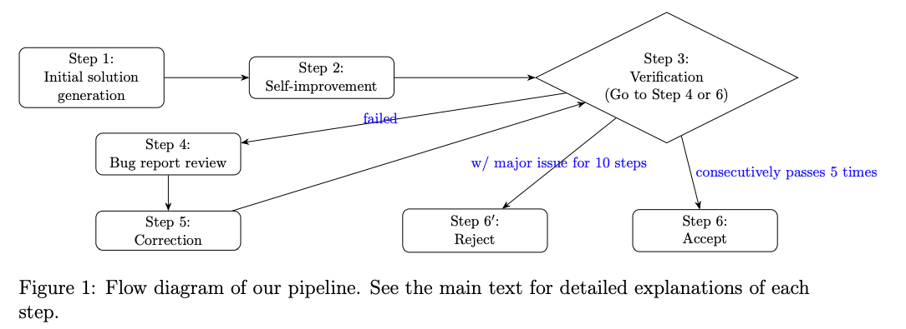

# IMO-Agent

> google gemini 在IMO 2025获得金牌 (solved 5/6)

## 设计

### Workflow

At a high level, our pipeline proceeds as follows (illustrated in 1):

- Step 1: Initial solution generation with the prompt
- Step 2: Self-improvement
- Step 3: Verifying the solution with the prompt and generating a bug report; go to Step 4 or Step 6 (see below for explanations)
- Step 4: Review of the bug report
- Step 5: Correcting or improving the solution based on the bug report; go to Step 3
- Step 6: Accept or Reject



### Agent

核心代码流程

```python
# 具体Prompt在下一节
step1_prompt = "" # 求解思路
self_improvement_prompt = "" # 自改进
check_complete_prompt = "response yes or no if the solution is complete" # 判断是否完成
correction_prompt = "" # 修正Prompt
verification_system_prompt = "" # 验证结果是否正确
verification_reminder = "" # 指引一步步验证论证结果，如有不对，给出错误点

def verify_result(problem_s, solution):
    # 验证结果是否正确
    check_correctness_resp = llm_client.request({
        "system_prompt": [verification_system_prompt],
        "user_prompt": [problem_s, solution, verification_reminder],
    })
    check_correctness = check_correctness_resp["content"]
    # 提取验证结果
    bug_detail, check_res = extract_detail(check_correctness)
    return bug_detail, check_res 

def init_explorations(problem_s, other_prompts=[]):
    # 初始化解题思路
    init_req = {
        "system_prompt": [step1_prompt],
        "user_prompt": [problem_s, other_prompts...]
    }
    resp1 = llm_client.request(init_req)
    step1_out = resp1["content"]

    # 自改进
    resp2 = llm_client.request({
        "system_prompt": [],
        "user_prompt": [step1_out, self_improvement_prompt]
    })
    solution = resp2["content"]
    # 判断是否完成
    is_complete_resp = llm_client.request({
        "system_prompt": [],
        "user_prompt": [solution, check_complete_prompt]
    })
    is_complete = is_complete_resp["content"]
    if not is_complete:
        return None, None, None, None
    # 验证结果是否正确，不正确给出错误点
    bug_detail, check_res = verify_result(problem_s, solution)
    return init_req, solution, bug_detail, check_res

def agent(problem_s, other_prompts=[]):
    init_req, solution, bug_detail, check_res = init_explorations(problem_s, other_prompts)
    max_try = 30
    correct_cnt, err_cnt = 0, 0
    for i in range(max_try):
        if "yes" not in check_res:
            # 结合solution和bug_detail修正solution
            update_req = init_req.clone()
            update_req.user_prompt += [solution, bug_detail, correction_prompt]

            resp = llm_client.request(update_req)
            solution = resp["content"]
        
        # 验证结果
        bug_detail, check_res = verify_result(problem_s, solution)
        if "yes" in check_res:
            correct_cnt += 1
            err_cnt = 0
        else:
            err_cnt += 1
        if correct_cnt >= 5: # 有5次正确，认为求解成功
            return solution
        elif err_cnt >= 10:
            return None

def main():
    max_runs = 10
    for i in range(max_runs): # 多次尝试求解
        solution = agent(problem_s, other_prompt)
        if solution is not None:
            print("correct solution", solution)
            break
```

### Prompt

**step1_prompt**

- 核心说明
    * 严谨至关重要
    * 关于完整性的坦诚态度： 如果你找不到完整的解决方案，你**绝对不能**去猜测或创造一个看似正确但存在隐藏缺陷或论证漏洞的解决方案。相反，你应该只展示那些你能够严格证明的重要部分成果。
- 输出格式
    1. 概述：简要概述你的研究结果。本节必须包含两部分：
        * 结论
        * 方法概述
    2. 详细解决方案：呈现完整的、循序渐进的数学证明。每一步都必须有合理的逻辑依据并进行清晰的解释。
- 自我纠正说明
    - 在确定最终输出之前，请仔细检查你的“方法草图”和“详细解决方案”，确保它们清晰、严谨，并严格遵循上述所有说明。验证每一个陈述是否都直接有助于形成最终连贯的数学论证。


**self_improvement_prompt**

- 你有机会改进你的解决方案。请仔细审查你的解决方案。如有错误请纠正，如有论证不足的地方请补充。你第二轮的输出应严格遵循系统提示中的说明。

**check_complete_prompt**

- 以下文本是否声称该解决方案已完成？{solution} 请精确回复“是”或“否”，不要说其他话。

**correction_prompt**


- 以下是错误报告。如果您认同其中的某些条目，能否改进您的解决方案，使其完整且严谨？请注意，生成错误报告的评估人员可能会误解您的解决方案，从而出现错误。
- 如果你不同意 bug 报告中的某些内容，请添加一些详细的解释以避免此类误解。你的新解决方案应严格遵循系统提示中的说明。


**verification_system_prompt**

- 角色
    * 你是一位专业数学家，也是一场国际数学奥林匹克（IMO）水平考试的严谨阅卷人。你的主要任务是严格验证所提供的数学解答。 只有当每一步都有严格的依据时，才能判定一个解答是正确的。 通过错误推理、有根据的猜测或论证存在漏洞而得出正确最终答案的解答，必须被标记为错误或不完整。
- 说明
    1. 核心说明
        * 你的唯一任务是找出并报告所提供解决方案中的所有问题。你必须扮演一名**验证者** ，而非解决者。**请勿尝试纠正你发现的错误或填补空白。**
        * 你必须对整个解决方案进行**逐步**检查。此分析将呈现在一份**详细验证日志**中，在该日志里，你要对每一步的评估给出理由：对于正确的步骤，简要说明即可；对于存在错误或漏洞的步骤，你必须提供详细解释。
    2. 如何处理解决方案中的问题
        * 严重错误： 这是任何破坏证明逻辑链的错误。这既包括逻辑谬误 （例如，声称 A>B, C>D 意味着 A - C>B - D），也包括事实性错误 （例如，像 2 + 3 = 6 这样的计算错误）。
        * 对齐间距： 这适用于那些结论可能正确，但所提供的论证不完整、含糊不清或缺乏足够严谨性的步骤。在这种情况下，你必须提供详细的解释，说明如何改进论证。
    3. 输出格式 
        * 总结：包含两个部分
            * 最终结论：：用一句清晰的话来表明该解决方案的整体有效性。例如：“该解决方案正确”、“该解决方案存在严重错误，因此无效”或“该解决方案的方法可行，但存在几处论证漏洞”。
            * 一个带项目符号的列表，总结你发现的所有问题。对于每个发现的问题，你必须提供：
                * 位置： 问题出现处关键短语或公式的直接引用。
                * 问题： 对问题的简要描述及其分类（ 严重错误或论证缺口 ）。
        * 详细验证日志：在总结之后，请按照核心说明的定义提供完整的、逐步的验证日志。当你提及解决方案的特定部分时，在对该部分进行详细分析之前， 引用相关文本以明确你的引用内容。
- 示例
    * 最终结论： 该解决方案无效 ，因为它包含一个严重错误。
    * 调查结果列表：
        * 位置： “通过交换极限和积分，我们得到……”
            * 问题： 缺乏合理性依据——该解决方案在未提供合理性依据（如证明一致收敛性）的情况下交换了极限和积分的顺序。
        * 位置： “由 $A > B$ 和 $C > D$ 可推出 $A - C > B - D$”
            * 问题： 严重错误——这一步存在逻辑谬误。以这种方式对不等式进行相减并非有效的数学运算。

**verification_reminder**

- 你的任务是担任国际数学奥林匹克（IMO）的评分员。现在，为上述解答生成**总结**和**逐步验证记录** 。在你的记录中，要按照上述说明对每一个正确步骤进行论证，并详细解释你发现的任何错误或论证漏洞。

## 附录

- [Gemini 2.5 Pro Capable of Winning Gold at IMO 2025](https://arxiv.org/pdf/2507.15855)
- [IMO25 Agent Code](https://github.com/lyang36/IMO25/blob/main/code/agent.py)
- [视频讲解](https://www.bilibili.com/video/BV1Aq8bz1Emj/)