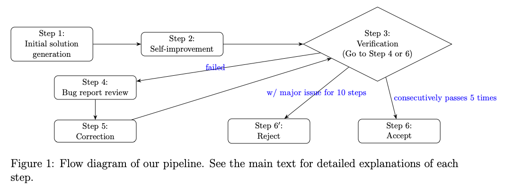

# IMO-Agent: 架构分析

**背景**：Google Gemini 在 IMO 2025 中获得了金牌（解决了 6 道题中的 5 道）。

本文分析该 Agent 为实现高精度数学推理而设计的核心工作流。

## 1. 系统设计 (System Design)

IMO-Agent 利用迭代式的“生成-验证-优化”循环来确保数学上的严谨性。

与标准的思维链 (Chain-of-Thought, CoT) 提示不同，该架构明确分离了 **证明者 (Solver)** 和 **验证者 (Verifier/Critic)** 的角色，以减轻模型幻觉并填补逻辑漏洞。

### 1.1 工作流管道 (Workflow Pipeline)

该管道实施了**拒绝采样 (Rejection Sampling)** 和**迭代优化 (Iterative Refinement)** 策略：

1.  **初始推理 (Chain-of-Thought)**：模型使用结构化的 CoT 生成基准数学证明。
2.  **自我纠正 (Self-Correction)**：在外部验证之前，模型会审查自己的输出以修复明显的错误（类似于“草稿”阶段）。
3.  **对抗性验证 (Adversarial Verification)**：一个专门的“Resolver”实例（被设定为严厉的 IMO 阅卷人）仔细审查解决方案，寻找逻辑谬误或漏洞。
4.  **反馈循环 (Feedback Loop)**：
    *   如果 Resolver 拒绝了解决方案，系统会生成一份结构化的**错误报告 (Bug Report)**。
    *   求解器 (Solver) 利用这份报告来修补解决方案。
    *   此循环重复进行，直到解决方案通过验证或达到最大重试次数。
5.  **一致性检查 (Consistency Check / Majority Voting)**：系统执行多次独立运行（最多 30 次），并要求达到共识阈值（例如 5 次有效验证）才接受最终答案，从而降低误报概率。



## 2. 核心实现 (Core Implementation)

以下参考实现展示了编排逻辑。为了反映生产级标准，我们强调了类型安全 (Type Safety) 和模块化。

```python
from typing import List, Optional, Tuple, Dict, Any

# --- 配置与提示词 (Prompts) ---
# 系统提示词旨在强制执行特定角色（求解器 vs 验证者）
PROMPTS = {
    "step1_solver": "...", # 用于生成严谨证明的指令
    "self_improvement": "...", # 自我审查指令
    "completeness_check": "response yes or no if the solution is complete",
    "correction": "...", # 基于错误报告修复问题的指令
    "verification_system": "...", # 角色设定：IMO 阅卷人
    "verification_reminder": "..." # 逐步验证指引
}

class LLMClient:
    """模拟 LLM 交互的客户端接口。"""
    def request(self, payload: Dict[str, Any]) -> Dict[str, str]:
        # 具体实现细节省略
        pass

llm_client = LLMClient()

def extract_detail(content: str) -> Tuple[str, str]:
    """解析 LLM 输出，将错误报告与最终判决分离开来。"""
    # 具体解析逻辑
    pass

def verify_result(problem_statement: str, solution: str) -> Tuple[str, str]:
    """
    调用验证者 (Verifier) Agent 来审计解决方案。
    
    Args:
        problem_statement: 数学问题描述。
        solution: 提议的证明/解决方案。
        
    Returns:
        Tuple[str, str]: (Bug 详情, 验证结果 'yes'/'no')
    """
    resp = llm_client.request({
        "system_prompt": [PROMPTS["verification_system"]],
        "user_prompt": [problem_statement, solution, PROMPTS["verification_reminder"]],
    })
    
    raw_content = resp["content"]
    bug_detail, check_res = extract_detail(raw_content) 
    return bug_detail, check_res

def init_explorations(problem_statement: str, context: List[str] = []) -> Tuple[Optional[Dict], Optional[str], Optional[str], Optional[str]]:
    """
    生成初始解决方案候选，并执行一次自我纠正 (Self-Correction)。
    """
    # 阶段 1: 初始生成
    init_req = {
        "system_prompt": [PROMPTS["step1_solver"]],
        "user_prompt": [problem_statement] + context
    }
    resp1 = llm_client.request(init_req)
    initial_draft = resp1["content"]

    # 阶段 2: 自我纠正 (优化)
    resp2 = llm_client.request({
        "system_prompt": [],
        "user_prompt": [initial_draft, PROMPTS["self_improvement"]]
    })
    refined_solution = resp2["content"]

    # 阶段 3: 完整性检查
    completeness_resp = llm_client.request({
        "system_prompt": [],
        "user_prompt": [refined_solution, PROMPTS["completeness_check"]]
    })
    
    if "yes" not in completeness_resp["content"].lower():
        return None, None, None, None

    # 阶段 4: 初始验证
    bug_detail, check_res = verify_result(problem_statement, refined_solution)
    return init_req, refined_solution, bug_detail, check_res

def agent_workflow(problem_statement: str, context: List[str] = []) -> Optional[str]:
    """
    Agent 主入口，实现了重试 (Retry) 与共识 (Consensus) 逻辑。
    """
    # 初始化基础解决方案
    init_req, solution, bug_detail, check_res = init_explorations(problem_statement, context)
    if not solution:
        return None

    MAX_ITERATIONS = 30
    SUCCESS_THRESHOLD = 5  # 需要 5 次成功验证来确认有效性
    FAILURE_THRESHOLD = 10 # 如果失败次数过多，则提前退出
    
    correct_cnt = 0
    err_cnt = 0

    for i in range(MAX_ITERATIONS):
        # 如果验证失败，尝试修正
        if "yes" not in check_res:
            update_req = init_req.copy() 
            # 将 Bug 报告反馈给求解器
            update_req["user_prompt"] += [solution, bug_detail, PROMPTS["correction"]]
            
            resp = llm_client.request(update_req)
            solution = resp["content"]
        
        # 重新验证（可能已更新的）解决方案
        bug_detail, check_res = verify_result(problem_statement, solution)
        
        if "yes" in check_res:
            correct_cnt += 1
            err_cnt = 0 # 成功时重置错误计数
        else:
            err_cnt += 1
            
        # 共识与终止条件
        if correct_cnt >= SUCCESS_THRESHOLD:
            # 我们对该解决方案有高置信度
            return solution
        elif err_cnt >= FAILURE_THRESHOLD:
            # 解决方案不稳定或不正确
            return None 

    return None
```

## 3. 提示词工程策略 (Prompt Engineering Strategy)

系统的性能在很大程度上依赖于**角色扮演 (Role-Playing)** 和**约束强制 (Constraint Enforcement)**。

### 3.1 求解器提示词 (`step1_solver`)
*   **目标**：强制严谨性并防止幻觉。
*   **关键指令**：“如果你找不到完整的解决方案，你**绝对不能**去猜测。”（优先考虑精确率 Precision 而非召回率 Recall）。
*   **结构**：要求结构化输出：
    1.  **概述**：结论 + 方法。
    2.  **详细解决方案**：带有逻辑依据的逐步证明。

### 3.2 优化提示词 (`self_improvement`)
*   **机制**：它强制模型在提交之前重新阅读自己的输出，作为针对常见计算或推理错误的自查机制。

### 3.3 验证者人设 (`verification_system`)

*   **角色**：“专业数学家 / IMO 阅卷人”。
*   **行为**：对抗性。明确指示*不要*修复错误，而只是报告错误。这防止验证者受到求解器逻辑的偏差影响。
*   **错误分类**：
    *   **严重错误 (Critical Error)**：破坏逻辑链的错误（例如，逻辑谬误、计算错误）。
    *   **对齐/缺口 (Alignment/Gap)**：结论正确但证明不充分或存在歧义。

## 4. 评估与指标 (Evaluation & Metrics)

该 Agent 定义成功不仅仅是生成*一个*正确答案，而是生成一个经得起**重复验证**的解决方案 (`correct_cnt >= 5`)。这模仿了科学同行评审过程，即结果只有在可复现和可验证后才被接受。

---

### 提示词 (原始)

**step1_prompt**

```
- 核心说明
    * 严谨至关重要
    * 关于完整性的坦诚态度： 如果你找不到完整的解决方案，你**绝对不能**去猜测或创造一个看似正确但存在隐藏缺陷或论证漏洞的解决方案。相反，你应该只展示那些你能够严格证明的重要部分成果。
- 输出格式
    1. 概述：简要概述你的研究结果。本节必须包含两部分：
        * 结论
        * 方法概述
    2. 详细解决方案：呈现完整的、循序渐进的数学证明。每一步都必须有合理的逻辑依据并进行清晰的解释。
- 自我纠正说明
    - 在确定最终输出之前，请仔细检查你的“方法草图”和“详细解决方案”，确保它们清晰、严谨，并严格遵循上述所有说明。验证每一个陈述是否都直接有助于形成最终连贯的数学论证。
```

**self_improvement_prompt**

```
- 你有机会改进你的解决方案。请仔细审查你的解决方案。如有错误请纠正，如有论证不足的地方请补充。你第二轮的输出应严格遵循系统提示中的说明。
```

**check_complete_prompt**

```
- 以下文本是否声称该解决方案已完成？{solution} 请精确回复“是”或“否”，不要说其他话。
```

**correction_prompt**

```
- 以下是错误报告。如果您认同其中的某些条目，能否改进您的解决方案，使其完整且严谨？请注意，生成错误报告的评估人员可能会误解您的解决方案，从而出现错误。
- 如果你不同意 bug 报告中的某些内容，请添加一些详细的解释以避免此类误解。你的新解决方案应严格遵循系统提示中的说明。
```

**verification_system_prompt**

```
- 角色
    * 你是一位专业数学家，也是一场国际数学奥林匹克（IMO）水平考试的严谨阅卷人。你的主要任务是严格验证所提供的数学解答。 只有当每一步都有严格的依据时，才能判定一个解答是正确的。 通过错误推理、有根据的猜测或论证存在漏洞而得出正确最终答案的解答，必须被标记为错误或不完整。
- 说明
    1. 核心说明
        * 你的唯一任务是找出并报告所提供解决方案中的所有问题。你必须扮演一名**验证者** ，而非解决者。**请勿尝试纠正你发现的错误或填补空白。**
        * 你必须对整个解决方案进行**逐步**检查。此分析将呈现在一份**详细验证日志**中，在该日志里，你要对每一步的评估给出理由：对于正确的步骤，简要说明即可；对于存在错误或漏洞的步骤，你必须提供详细解释。
    2. 如何处理解决方案中的问题
        * 严重错误： 这是任何破坏证明逻辑链的错误。这既包括逻辑谬误 （例如，声称 A>B, C>D 意味着 A - C>B - D），也包括事实性错误 （例如，像 2 + 3 = 6 这样的计算错误）。
        * 对齐间距： 这适用于那些结论可能正确，但所提供的论证不完整、含糊不清或缺乏足够严谨性的步骤。在这种情况下，你必须提供详细的解释，说明如何改进论证。
    3. 输出格式 
        * 总结：包含两个部分
            * 最终结论：：用一句清晰的话来表明该解决方案的整体有效性。例如：“该解决方案正确”、“该解决方案存在严重错误，因此无效”或“该解决方案的方法可行，但存在几处论证漏洞”。
            * 一个带项目符号的列表，总结你发现的所有问题。对于每个发现的问题，你必须提供：
                * 位置： 问题出现处关键短语或公式的直接引用。
                * 问题： 对问题的简要描述及其分类（ 严重错误或论证缺口 ）。
        * 详细验证日志：在总结之后，请按照核心说明的定义提供完整的、逐步的验证日志。当你提及解决方案的特定部分时，在对该部分进行详细分析之前， 引用相关文本以明确你的引用内容。
- 示例
    * 最终结论： 该解决方案无效 ，因为它包含一个严重错误。
    * 调查结果列表：
        * 位置： “通过交换极限和积分，我们得到……”
            * 问题： 缺乏合理性依据——该解决方案在未提供合理性依据（如证明一致收敛性）的情况下交换了极限和积分的顺序。
        * 位置： “由 $A > B$ 和 $C > D$ 可推出 $A - C > B - D$”
            * 问题： 严重错误——这一步存在逻辑谬误。以这种方式对不等式进行相减并非有效的数学运算。
```

**verification_reminder**

```
- 你的任务是担任国际数学奥林匹克（IMO）的评分员。现在，为上述解答生成**总结**和**逐步验证记录** 。在你的记录中，要按照上述说明对每一个正确步骤进行论证，并详细解释你发现的任何错误或论证漏洞。
```

## 附录 (Appendix)
- [论文: Gemini 2.5 Pro at IMO 2025](https://arxiv.org/pdf/2507.15855)
- [源代码](https://github.com/lyang36/IMO25/blob/main/code/agent.py)
- [视频讲解](https://www.bilibili.com/video/BV1Aq8bz1Emj/)
