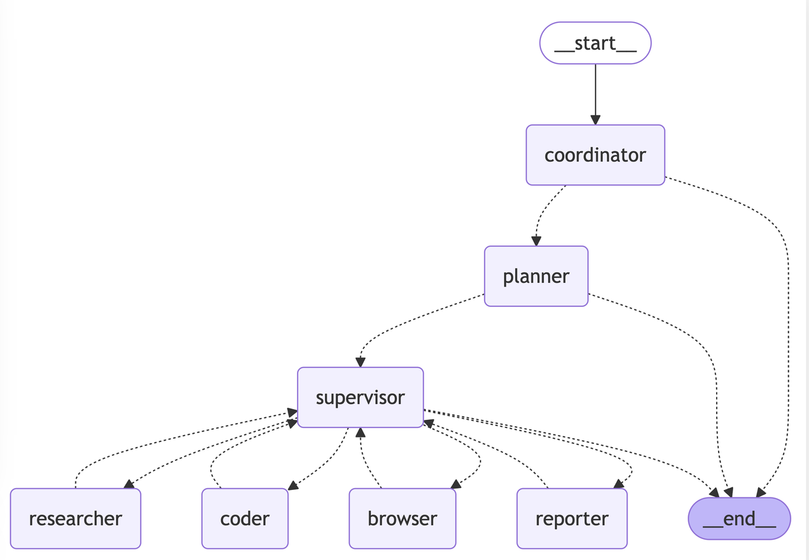

# LangManus 技术架构分析

## 1. 系统概述

LangManus 是一个基于 [LangGraph](https://langchain-ai.github.io/langgraph/) 构建的**多智能体协同系统**。

通过 **Multi Agent** 和 **单个AgentReAct** (Reasoning + Acting) 范式实现复杂任务的自动化处理。

该系统的核心设计理念是将复杂的用户指令解耦为：`理解 -> 规划 -> 分发 -> 执行 -> 汇报` 的标准化流水线，通过专门角色的 Agent 协作来提升任务完成的准确率和鲁棒性。



## 2. 核心架构设计

### 2.1 调度模式：分层与总线

LangManus 采用了 **Supervisor-Worker** 与 **Plan-and-Execute** 相结合的混合调度模式：

*   **Coordinator**: 作为入口网关，负责初步意图识别。简单任务直接处理，复杂任务下发。
*   **Planner**: 负责“大脑”的工作。它不直接执行任务，而是将自然语言需求转化为结构化的 **DAG (有向无环图)** 或 **Step-by-Step** 的执行计划。
*   **Supervisor**: 作为“工头”，维护执行状态。它依据 Planner 的计划，动态决策下一个调用的 Worker Agent，并负责上下文的传递与聚合。
*   **Workers**: 具体的执行单元（Coder, Researcher, Browser 等），专注于特定领域的任务执行。

### 2.2 状态管理 (State Management)

系统利用 LangGraph 的 `StateGraph` 进行状态流转，核心状态对象 `State` 继承自 `MessagesState`：

```python
class State(MessagesState):
    """
    全局上下文状态，贯穿整个 Workflow 生命周期
    """
    # 配置常量
    TEAM_MEMBERS: list[str]  # 可用的 Worker 列表

    # 运行时状态
    next: str                # 下一步路由的目标节点
    full_plan: str           # Planner 生成的全局计划
    deep_thinking_mode: bool # 是否开启深度推理模式 (e.g. o1/r1)
    search_before_planning: bool # 规划前是否需要先检索上下文
```

这种设计确保了所有 Agent 都能访问到全局的历史对话（`messages`）和当前的执行计划（`full_plan`），实现了**上下文共享**。

## 3. 组件深度解析

### 3.1 核心编排层 (Orchestration Layer)

#### Coordinator (协调者)
*   **职责**: 流量入口与路由。
*   **机制**: 快速判断用户意图。如果是闲聊或简单问答，直接回复；如果是复杂任务，触发 `handoff_to_planner()`。
*   **技术点**: 降低了昂贵的 Planner/Reasoning 模型的调用频率，优化响应延迟和成本。

#### Planner (规划者)
*   **职责**: 任务拆解与路径规划。
*   **输出结构**:
    ```ts
    interface Plan {
      thought: string;      // 思考过程 (CoT)
      title: string;        // 任务标题
      steps: Step[];        // 具体的执行步骤
    }
    ```
*   **深度**: 支持 `Deep Thinking` 模式，可接入推理能力更强的模型（如 o1-preview 或 deepseek-reasoner）来处理复杂的逻辑拆解。

#### Supervisor (监督者)
*   **职责**: 动态路由与结果验收。
*   **Prompt 策略**:
    ```text
    Given the conversation below, who should act next?
    Or should we FINISH?
    Response from {agent}: ...
    ```
*   **路由机制**: 基于 LLM 的 Function Calling 或 Structured Output，输出 `{'next': 'coder'}` 或 `{'next': 'FINISH'}`。它构成了一个**循环反馈回路 (Loop)**，直到任务结束。

### 3.2 执行层 (Execution Layer)

#### Researcher (研究员)
*   **能力**: 信息检索与聚合。
*   **工具栈**: `Tavily` (搜索), `Crawl4AI` / `Jina` (爬虫)。
*   **流程**: 搜索 -> 获取内容 -> 清洗(Readability/Markdownify) -> 总结。

#### Coder (工程师)
*   **能力**: 代码生成与执行。
*   **沙箱**: 使用 `PythonREPL` 执行生成的 Python 代码。
*   **安全**: 这是一个高风险组件，通常需要配合 Docker 容器或受限环境运行（注：Demo 中使用了本地 REPL，生产环境需加固）。

#### Browser (浏览者)
*   **能力**: 模拟人类浏览器操作。
*   **技术栈**: `browser-use` + `Playwright`。
*   **场景**: 处理动态网页、需要登录的站点或复杂的 UI 交互任务。

#### Reporter (汇报者)
*   **职责**: 最终产物生成。
*   **输出**: 将所有 Worker 的执行结果聚合成结构清晰的 Markdown 报告（摘要、发现、结论）。

## 4. Workflow 生命周期分析

以 `1+3=?` 为例，分析其在 DAG 中的流转：

1.  **Start**: 用户输入进入系统。
2.  **Coordinator**: 识别为需要计算的任务 -> `handoff_to_planner`。
3.  **Planner**:
    *   生成 Plan: `[Coder: 计算1+3, Reporter: 生成报告]`。
    *   State 更新: `full_plan` 写入上下文。
4.  **Supervisor (Loop Start)**:
    *   读取 Plan 和 History。
    *   决策: 下一步给 `Coder`。
5.  **Coder**:
    *   接收指令。
    *   执行: `print(1+3)` -> Output: `4`。
    *   State 更新: Coder 的输出追加到 `messages`。
6.  **Supervisor (Loop Continue)**:
    *   看到 Coder 完成，检查 Plan。
    *   决策: 下一步给 `Reporter`。
7.  **Reporter**:
    *   读取所有历史（包括 Coder 的结果）。
    *   生成最终报告。
8.  **Supervisor (Loop End)**:
    *   决策: 任务完成 -> `FINISH`。
9.  **End**: 输出流结束。

## 5. 关键技术实现细节

### 5.1 流式事件驱动 (Streaming Architecture)
系统利用 `astream_events` 实现了细粒度的实时反馈，这对于长耗时的 Agent 任务至关重要。

```python
# 后端通过 SSE (Server-Sent Events) 推送细粒度状态
if kind == "on_chain_start" and name == "planner":
    yield {"event": "start_of_workflow", ...}
elif kind == "on_tool_start":
    yield {"event": "tool_execution", ...}
```
前端可以据此渲染详细的“思考过程”和“工具调用”动效。

### 5.2 动态工具与依赖注入
Agent 的工具集是动态配置的，支持：

*   **PythonREPL**: 任意代码执行。
*   **Bash**: 系统级操作。
*   **File I/O**: 文件系统持久化。

### 5.3 异构模型混合调度

系统配置允许不同 Agent 使用不同能力的模型：

*   **Reasoning LLM (o1/r1)**: 用于 Planner，处理复杂逻辑。
*   **Basic LLM (GPT-4o/Sonnet)**: 用于 Supervisor/Reporter，平衡速度与质量。
*   **Vision LLM**: 用于 Browser Agent，理解网页 UI。

## 6. 技术栈清单

| 类别 | 库/工具 | 用途 |
| :--- | :--- | :--- |
| **Framework** | `langgraph`, `langchain` | 核心编排与 Agent 抽象 |
| **Model** | `langchain-openai`, `langchain-deepseek` | 模型接入层 |
| **Web/Search** | `tavily-python`, `jina` | 搜索与内容提取 |
| **Browser** | `browser-use`, `playwright` | 浏览器自动化 |
| **Data** | `pandas`, `yfinance` | 数据处理与金融工具 |
| **Server** | `fastapi`, `uvicorn` | REST API 与 SSE 流式服务 |
| **Utils** | `readabilipy`, `markdownify` | 网页内容清洗 |

---
