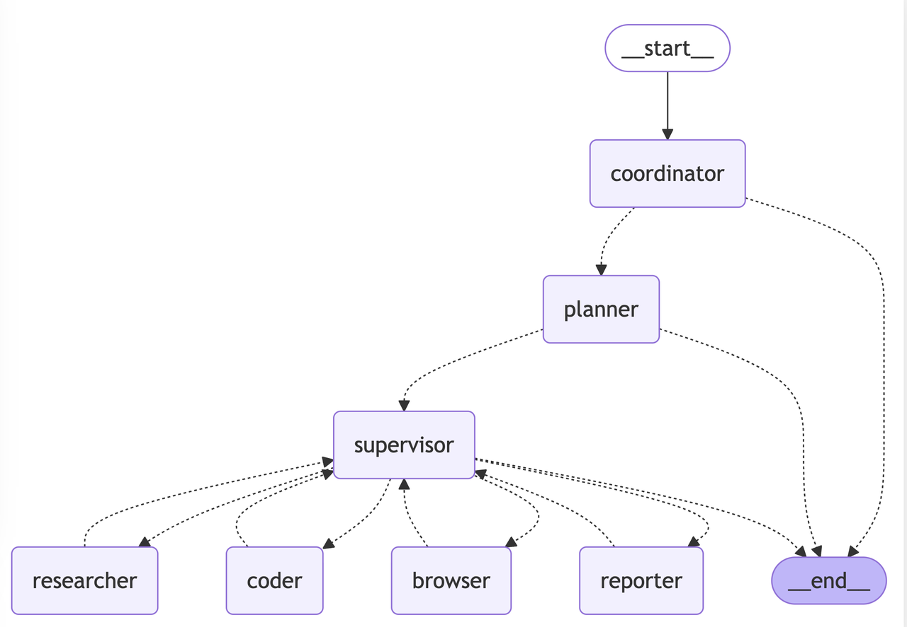

## 目标

阅读[LangManus](https://github.com/Darwin-lfl/langmanus)代码，学习`ReAct Agent`的设计



- coordinator：自行处理简单问题，复杂问题移交planner
- planner：协调多Agent，设计计划->明确步骤->具体执行
- supervisor：team组长，用来派活儿
- researcher：使用搜索和爬虫来解决问题
- reporter：根据输入总结成报告
- browser：理解自然语言指令并将其转化为浏览器操作
- coder：用Python和Bash解决问题

## Demo演示

用一个demo的日志来看当前LangManus如何执行的

```
Enter your query: 1+3=?

INFO     [src.workflow] Starting workflow with user input: 1+3=?
== Coordinator == 
INFO     [src.graph.nodes] Coordinator talking.
INFO     [src.graph.nodes] coordinator response: handoff_to_planner()

== Planner ==
INFO     [src.graph.nodes] Planner generating full plan
INFO     [src.graph.nodes] Planner Current state messages: [HumanMessage(content='1+3=?', additional_kwargs={}, response_metadata={}, id='bf92f5ce-81ac-4521-94d9-8f89fad6b0b9')]
INFO     [src.graph.nodes] Planner response: 
{
  "thought": "用户需要计算1加3的结果。这是一个简单的数学问题，需要用到coder代理进行计算。",
  "title": "计算1+3",
  "steps": [
    {
      "agent_name": "coder",
      "title": "执行数学计算",
      "description": "使用Python代码计算1+3的数值结果"
    },
    {
      "agent_name": "reporter",
      "title": "生成最终报告",
      "description": "将计算结果以Markdown格式整理成最终报告"
    }
  ]
}

== Supervisor ==
INFO     [src.graph.nodes] Supervisor evaluating next action
INFO     [src.graph.nodes] Current state messages: [HumanMessage(content='1+3=?', additional_kwargs={}, response_metadata={}, id='bf92f5ce-81ac-4521-94d9-8f89fad6b0b9'), HumanMessage(content='\n\n{\n  "thought": "用户需要计算1加3的结果。这是一个简单的数学问题，需要用到coder代理进行计算。",\n  "title": "计算1+3",\n  "steps": [\n    {\n      "agent_name": "coder",\n      "title": "执行数学计算",\n      "description": "使用Python代码计算1+3的数值结果"\n    },\n    {\n      "agent_name": "reporter",\n      "title": "生成最终报告",\n      "description": "将计算结果以Markdown格式整理成最终报告"\n    }\n  ]\n}', additional_kwargs={}, response_metadata={}, name='planner', id='8577f517-bf44-41d0-848c-2772c549c6eb')]
INFO     [src.graph.nodes] Supervisor response: {'next': 'coder'}

== Coder == 
INFO     [src.graph.nodes] Supervisor delegating to: coder
INFO     [src.graph.nodes] Code agent starting task
INFO     [src.tools.python_repl] Executing Python code
WARNING  [langchain_experimental.utilities.python] Python REPL can execute arbitrary code. Use with caution.
INFO     [src.tools.python_repl] Code execution successful
INFO     [src.graph.nodes] Code agent response: ### 1 + 3 的计算结果

通过Python代码计算，1 + 3 的结果为 4。具体代码如下：
\`\`\`python
print(1 + 3)
\`\`\`
该代码直接执行加法运算 `1 + 3`，并使用 `print` 函数将结果输出，输出结果为 4。

综上所述，1 + 3 的结果是 4。  
INFO     [src.graph.nodes] Code agent completed task

== Supervisor == 
INFO     [src.graph.nodes] Supervisor evaluating next action
INFO     [src.graph.nodes] Current state messages: [HumanMessage(content='1+3=?', additional_kwargs={}, response_metadata={}, id='bf92f5ce-81ac-4521-94d9-8f89fad6b0b9'), HumanMessage(content='\n\n{\n  "thought": "用户需要计算1加3的结果。这是一个简单的数学问题，需要用到coder代理进行计算。",\n  "title": "计算1+3",\n  "steps": [\n    {\n      "agent_name": "coder",\n      "title": "执行数学计算",\n      "description": "使用Python代码计算1+3的数值结果"\n    },\n    {\n      "agent_name": "reporter",\n      "title": "生成最终报告",\n      "description": "将计算结果以Markdown格式整理成最终报告"\n    }\n  ]\n}', additional_kwargs={}, response_metadata={}, name='planner', id='8577f517-bf44-41d0-848c-2772c549c6eb'), HumanMessage(content='Response from coder:\n\n<response>\n### 1 + 3 的计算结果\n\n通过Python代码计算，1 + 3 的结果为 4。具体代码如下：\n```python\nprint(1 + 3)\n```\n该代码直接执行加法运算 `1 + 3`，并使用 `print` 函数将结果输出，输出结果为 4。\n\n综上所述，1 + 3 的结果是 4。  \n</response>\n\n*Please execute the next step.*', additional_kwargs={}, response_metadata={}, name='coder', id='9fd08d12-abfa-4f1a-806b-c37ab8a11a6c')]
INFO     [src.graph.nodes] Supervisor response: {'next': 'reporter'}

== Reporter == 
INFO     [src.graph.nodes] Supervisor delegating to: reporter
INFO     [src.graph.nodes] Reporter write final report
INFO     [src.graph.nodes] Reporter Current state messages: [HumanMessage(content='1+3=?', additional_kwargs={}, response_metadata={}, id='bf92f5ce-81ac-4521-94d9-8f89fad6b0b9'), HumanMessage(content='\n\n{\n  "thought": "用户需要计算1加3的结果。这是一个简单的数学问题，需要用到coder代理进行计算。",\n  "title": "计算1+3",\n  "steps": [\n    {\n      "agent_name": "coder",\n      "title": "执行数学计算",\n      "description": "使用Python代码计算1+3的数值结果"\n    },\n    {\n      "agent_name": "reporter",\n      "title": "生成最终报告",\n      "description": "将计算结果以Markdown格式整理成最终报告"\n    }\n  ]\n}', additional_kwargs={}, response_metadata={}, name='planner', id='8577f517-bf44-41d0-848c-2772c549c6eb'), HumanMessage(content='Response from coder:\n\n<response>\n### 1 + 3 的计算结果\n\n通过Python代码计算，1 + 3 的结果为 4。具体代码如下：\n```python\nprint(1 + 3)\n```\n该代码直接执行加法运算 `1 + 3`，并使用 `print` 函数将结果输出，输出结果为 4。\n\n综上所述，1 + 3 的结果是 4。  \n</response>\n\n*Please execute the next step.*', additional_kwargs={}, response_metadata={}, name='coder', id='9fd08d12-abfa-4f1a-806b-c37ab8a11a6c')]
INFO     [src.graph.nodes] Reporter response:
<执行数学计算结果报告>
<执行摘要>
本次任务旨在计算1 + 3的结果。通过Python代码实现了该计算，最终得出结果为4。
<关键发现>
- 利用Python代码 `print(1 + 3)` 可准确计算出1 + 3的和为4。

<详细分析>
代码 `print(1 + 3)` 中，`1 + 3` 执行了加法运算，将两个数值相加，`print` 函数则负责将运算结果展示出来，展示的结果为4。

<结论和建议>
- **结论**：1 + 3 的计算结果为4。
- **建议**：对于类似简单数学计算，可继续采用Python等编程语言进行快速准确的运算。信息来源为coder执行计算后提供的内容。  
INFO     [src.graph.nodes] Supervisor evaluating next action
INFO     [src.graph.nodes] Current state messages: [HumanMessage(content='1+3=?', additional_kwargs={}, response_metadata={}, id='bf92f5ce-81ac-4521-94d9-8f89fad6b0b9'), HumanMessage(content='\n\n{\n  "thought": "用户需要计算1加3的结果。这是一个简单的数学问题，需要用到coder代理进行计算。",\n  "title": "计算1+3",\n  "steps": [\n    {\n      "agent_name": "coder",\n      "title": "执行数学计算",\n      "description": "使用Python代码计算1+3的数值结果"\n    },\n    {\n      "agent_name": "reporter",\n      "title": "生成最终报告",\n      "description": "将计算结果以Markdown格式整理成最终报告"\n    }\n  ]\n}', additional_kwargs={}, response_metadata={}, name='planner', id='8577f517-bf44-41d0-848c-2772c549c6eb'), HumanMessage(content='Response from coder:\n\n<response>\n### 1 + 3 的计算结果\n\n通过Python代码计算，1 + 3 的结果为 4。具体代码如下：\n```python\nprint(1 + 3)\n```\n该代码直接执行加法运算 `1 + 3`，并使用 `print` 函数将结果输出，输出结果为 4。\n\n综上所述，1 + 3 的结果是 4。  \n</response>\n\n*Please execute the next step.*', additional_kwargs={}, response_metadata={}, name='coder', id='9fd08d12-abfa-4f1a-806b-c37ab8a11a6c'), HumanMessage(content='Response from reporter:\n\n<response>\n### 执行数学计算结果报告\n#### 执行摘要\n本次任务旨在计算1 + 3的结果。通过Python代码实现了该计算，最终得出结果为4。\n\n#### 关键发现\n- 利用Python代码 `print(1 + 3)` 可准确计算出1 + 3的和为4。\n\n#### 详细分析\n代码 `print(1 + 3)` 中，`1 + 3` 执行了加法运算，将两个数值相加，`print` 函数则负责将运算结果展示出来，展示的结果为4。\n\n#### 结论和建议\n- **结论**：1 + 3 的计算结果为4。\n- **建议**：对于类似简单数学计算，可继续采用Python等编程语言进行快速准确的运算。信息来源为coder执行计算后提供的内容。  \n</response>\n\n*Please execute the next step.*', additional_kwargs={}, response_metadata={}, name='reporter', id='047db3f5-00bb-42ad-95b5-d2ea3639ada2')]
INFO     [src.graph.nodes] Supervisor response: {'next': 'FINISH'}
INFO     [src.graph.nodes] Workflow completed
INFO     [src.workflow] Workflow completed successfully
```

## 设计

整体分为 Workflow -> Agent -> Prompt三层

### Workflow

**Service**

1. 通过LangGraph构建Agent 调度图 `build_graph()`
2. 传入用户的输入，执行LangGraph事件流 `astream_events`

代码片段
```python
if kind == "on_chain_start" and name in streaming_llm_agents:
    if name == "planner":
        yield {
            "event": "start_of_workflow",
            "data": {"workflow_id": workflow_id, "input": user_input_messages},
        }
    ydata = {
        "event": "start_of_agent",
        "data": {
            "agent_name": name,
            "agent_id": f"{workflow_id}_{name}_{langgraph_step}",
        },
    }
elif kind == "on_chain_end" and name in streaming_llm_agents:
    ydata = {
        "event": "end_of_agent",
        "data": {
            "agent_name": name,
            "agent_id": f"{workflow_id}_{name}_{langgraph_step}",
        },
    }
....
```

**Graph**

重点是构建了对应的节点，节点之间通过执行「Agent决策」 来调用

- Coordinator：执行用户请求，goto planner/end
- Planner：生成计划，goto supervisor/end
    * 深度思考：使用推理模型推理
    * 联网搜索：通过搜索工具检索标题和内容补充到用户的输入中
- Supervisor：根据Planner决策哪个Agent来执行，go TeamMembers/end
- Researcher：检索和爬虫相关信息，goto Supervisor
- Coder：运算代码，goto Supervisor
- Browser：操作浏览器，goto Supervisor
- Reporter：生成报告

上下文数据

```python
class State(MessagesState):
    """State for the agent system, extends MessagesState with next field."""

    # Constants
    TEAM_MEMBERS: list[str]

    # Runtime Variables
    next: str
    full_plan: str
    deep_thinking_mode: bool
    search_before_planning: bool
```

在下一步需要`Supervisor`决策下一步要执行的Agent时，给LLM的输入是

```
Response from {agent}:
<response>
{agent_response}
</response>

*Please execute the next step.*
```

### Agent

**config**

- 定义了LLMType: 包含 basic，reasoning，vision 三类
- 定义不同Agent的LLMType

**agents**

- 使用langchain包对LLMType建立了 reasoning_llm, basic_llm, vl_llm
- 创建了多Agent
    * research_agent
        - Tool：tavily_tool, crawl_tool
    * coder_agent
        - Tool：python_repl_tool, bash_tool
    * browser_agent
        - Tool：browser_tool

**api**

- 提供后端api接口，支持流式的数据返回，核心是调用run_agent_workflow
- 设计了 Chat -> Message -> Content 的三层结构

**Tool**

- bash：通过subprocess执行shell命令
- browser：使用BrowserAgent执行用户请求
- crawl：使用Crawler爬虫
- langchain内置的Tool
    * file_management：WriteFileTool
    * python_repl：PythonREPL
    * search：TavilySearchResults

**crawler**

- 使用jina client进行爬虫，用readabilipy提取请求
    * 转成markdown格式（for debug）
    * 转成 大模型需要的message格式（for 运行）

### Prompt

按图1所示的Agent，Prompt里描述了各自的职责

**coordinator**

输出 `handoff_to_planner()` 移交planner

**planner**

- 理解用户需求，整理成 Thought
- 设计 step-by-step 计划
- 明确Agent的职责和输出（交由Agent的连续步骤合并为一个步骤分发给一个Agent）

**supervisor**

分析问题 -> 分发Agent -> 检查输出并继续分发

- 分发输出：{"next": "researcher"}
- 结束输出： {"next": "FINISH"}

**researcher**

- 理解问题 -> 设计方案 -> 执行方案 -> 总结结果
- 搜索：tavily_tool；爬虫：crawl_tool

**reporter**

报告包括：摘要、关键点、详细描述、总结和建议

**browser**

访问网页 -> 执行操作（点击、输入、滚动）-> 提取信息

**coder**

分析需求 -> 设计解决方案 -> 实现方案 -> 测试方案 -> 记录方法论 -> 呈现结果

**file_manager**

保存文件：WriteFileTool，读取文件：ReadFileTool

## 附录

### planner 输出结构

```ts
interface Step {
  agent_name: string;
  title: string;
  description: string;
  note?: string;
}

interface Plan {
  thought: string;
  title: string;
  steps: Step[];
}
```

### 依赖包

```python
== langchain、graph组件
"langchain-community>=0.3.19",
"langchain-experimental>=0.3.4",
"langchain-openai>=0.3.8",
"langchain-deepseek>=0.1.2",
"langgraph>=0.3.5",

== 网页中提取主要内容和元数据，转换
"httpx>=0.28.1",
"readabilipy>=0.3.0",
"markdownify>=1.1.0",

== 环境配置读取
"python-dotenv>=1.0.1",
"socksio>=1.0.0",

== AI浏览器
"browser-use>=0.1.0",

== 数据分析
"pandas>=2.2.3",
"numpy>=2.2.3",
"yfinance>=0.2.54", （金融市场数据，股票数据）

== server端
"fastapi>=0.110.0",
"uvicorn>=0.27.1",
"sse-starlette>=1.6.5",
```