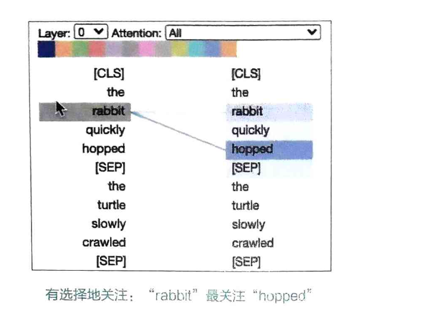

# Attention is All You Need

## 介绍

- 注意力机制是一种通用的机制，它可以在不同的场景中使用，例如在机器翻译、图像识别、语音识别等任务中。
- 注意力机制的核心思想是，在处理一个序列时，模型可以根据当前的输入和历史的输入来选择哪些部分是最重要的。
- 核心组件包括Query、Key和Value，通过计算相似度得分来决定关注哪些部分。



## 注意力类型

### 点积注意力

- 点积注意力是一种常见的注意力机制，它通过计算查询向量和键向量之间的点积来计算注意力权重。
- 点积注意力的计算过程如下：
    - 首先，将查询向量和键向量进行点积运算，得到一个相似度得分。
    - 然后，使用 softmax 函数对相似度得分进行归一化，得到注意力权重。

```python
import torch # 导入 torch
import torch.nn.functional as F # 导入 nn.functional
# 1. 创建两个张量 x1 和 x2，注意两个张量的batch_size和feature_dim必须相同
x1 = torch.randn(2, 3, 4) # 形状 (batch_size, seq_len1, feature_dim)
x2 = torch.randn(2, 5, 4) # 形状 (batch_size, seq_len2, feature_dim)
# 2. 计算原始权重，将x2从(batch_size, seq_len2, feature_dim)转置为(batch_size, feature_dim, seq_len2)，然后做批量矩阵乘法，生成形状 (batch_size, seq_len1, seq_len2)
raw_weights = torch.bmm(x1, x2.transpose(1, 2)) 
# 3. 用 softmax 函数对原始权重进行归一化，沿seq_len2维度（dim=2）做归一化，固定的（batch_size, seq_len1）的权重和为1
attn_weights = F.softmax(raw_weights, dim=2)
# 4. 将注意力权重与 x2 相乘，计算加权和，生成形状为(batch_size, seq_len1, feature_dim)
attn_output = torch.bmm(attn_weights, x2)
```

### 缩放点积注意力

- 缩放点积注意力是一种改进的注意力机制，它通过缩放点积来计算注意力权重。
- 缩放点积注意力的计算过程如下：
    - 首先，将查询向量和键向量进行点积运算，得到一个相似度得分。
    - 然后，将相似度得分除以一个缩放因子，通常是查询向量的维度的平方根。
    - 最后，使用 softmax 函数对缩放后的相似度得分进行归一化，得到注意力权重。

```python
import torch # 导入 torch
import torch.nn.functional as F # 导入 nn.functional
# 1. 创建两个张量 x1 和 x2，注意两个张量的batch_size和feature_dim必须相同
x1 = torch.randn(2, 3, 4) # 形状 (batch_size, seq_len1, feature_dim)
x2 = torch.randn(2, 5, 4) # 形状 (batch_size, seq_len2, feature_dim)
# 2. 计算相似度得分，(batch_size, seq_len1, seq_len2)
raw_weights = torch.bmm(x1, x2.transpose(1, 2)) 
# 3. 缩放权重，形状 (batch_size, seq_len1, seq_len2)
scaling_factor = x1.size(-1) ** 0.5  # sqrt(x1.shape[-1])2
scaled_weights = raw_weights  / scaling_factor
# 4. 用 softmax 函数对原始权重进行归一化，沿seq_len2维度（dim=2）做归一化，固定的（batch_size, seq_len1）的权重和为1
attn_weights = F.softmax(scaled_weights, dim=2)
# 5. 将注意力权重与 x2 相乘，计算加权和，生成形状为(batch_size, seq_len1, feature_dim)
attn_output = torch.bmm(attn_weights, x2)
```

### 编码器-解码器注意力

注意力机制是怎么对Seq2Seq做的增强？解码器要对编码器进行注意。(点积注意通常用于将编码器隐藏状态与解码器隐藏状态联系起来)

- x1：解码器在各个时间步的隐藏状态。
- x2：编码器在各个时间步的隐藏状态。
    - 解码器的每个时间步都会根据编码器的隐藏状态计算一个注意力权重，然后将这些权重用于编码器隐藏状态，以生成一个上下文向量（编码器-解码器注意力的输出）。
    - 这个上下文向量将包含关于编码器输入序列的有用信息，解码器可以利用这个信息生成更准确的输出序列。

### 注意力机制中的Q、K、V

Transformer中经常提到Q、K、V三个向量：

- 查询（Query）：指当前要处理的新，模型根据查询向量在输入序列中查找相关信息。
- 键（Key）：指来自输入序列的一组表示，根据查询向量计算注意力权重，注意力权重反映了不同位置的输入数据与查询的相关性（重点关注啥）。
- 值（Value）：指来自输入序列的一组表示，用于根据注意力权重计算加权和，得到最终的注意力输出向量，包含了与查询最相关的输入信息。

```python
#1. 创建 Query、Key 和 Value 张量
q = torch.randn(2, 3, 4) # 形状 (batch_size, seq_len1, feature_dim)
k = torch.randn(2, 4, 4) # 形状 (batch_size, seq_len2, feature_dim)
v = torch.randn(2, 4, 4) # 形状 (batch_size, seq_len2, feature_dim)
# 2. 计算点积，得到原始权重，形状为 (batch_size, seq_len1, seq_len2)
raw_weights = torch.bmm(q, k.transpose(1, 2))
# 3. 将原始权重进行缩放（可选），形状仍为 (batch_size, seq_len1, seq_len2)
scaling_factor = q.size(-1) ** 0.5
scaled_weights = raw_weights / scaling_factor
# 4. 应用 softmax 函数，使结果的值在 0 和 1 之间，且每一行的和为 1
attn_weights = F.softmax(scaled_weights, dim=-1) # 形状仍为 (batch_size, seq_len1, seq_len2)
# 5. 与 Value 相乘，得到注意力分布的加权和 , 形状为 (batch_size, seq_len1, feature_dim)
attn_output = torch.bmm(attn_weights, v)
```

#### 案例解释

假设你是一个学生，正在图书馆写论文，需要找参考书， 找书的过程就是 Q、K、V 的互动：

- 你的问题（Q - Query）：你想研究“恐龙为什么会灭绝？”
- 书架上的书名（K - Key）：每本书的书名（比如《地球历史》《火山爆发》《陨石撞击》）
- 书里的具体内容（V - Value）：每本书里的详细知识

第一步：匹配问题与书名（Q 和 K 的点积）

- 你对比自己的问题（Q）和每本书的书名（K）

    * 《陨石撞击》的书名和你的问题最相关 → 匹配度高
    * 《火山爆发》次之
    * 《地球历史》太宽泛，匹配度低

第二步：计算注意力权重（Softmax）

- 根据匹配度，给每本书分配一个“注意力分数”
    * 《陨石撞击》得分最高（比如 70%）
    * 《火山爆发》得分中等（比如 25%）
    * 《地球历史》得分最低（比如 5%）

第三步：整合知识（V 的加权和）

- 你重点读《陨石撞击》（70%的注意力），结合《火山爆发》（25%的注意力），忽略《地球历史》
- 最终答案 = 70% × 陨石书内容 + 25% × 火山书内容 + 5% × 地球书内容

### 自注意力

自注意力就是自己对自己注意，允许模型在同一序列中不同位置之间建立依赖关系。上面的例子，自变量x，就实现了自注意力。

```python
 # 一个形状为 (batch_size, seq_len, feature_dim) 的张量 x
x = torch.randn(2, 3, 4) # 形状 (batch_size, seq_len, feature_dim)
# 定义线性层用于将 x 转换为 Q, K, V 向量
linear_q = torch.nn.Linear(4, 4)
linear_k = torch.nn.Linear(4, 4)
linear_v = torch.nn.Linear(4, 4)
# 通过线性层计算 Q, K, V
Q = linear_q(x) # 形状 (batch_size, seq_len, feature_dim)
K = linear_k(x) # 形状 (batch_size, seq_len, feature_dim)
V = linear_v(x) # 形状 (batch_size, seq_len, feature_dim)
# 计算 Q 和 K 的点积，作为相似度分数 , 也就是自注意力原始权重
raw_weights = torch.bmm(Q, K.transpose(1, 2)) # 形状 (batch_size, seq_len, seq_len)
# 将自注意力原始权重进行缩放
scale_factor = K.size(-1) ** 0.5  # 这里是 4 ** 0.5
scaled_weights = raw_weights / scale_factor # 形状 (batch_size, seq_len, seq_len)
# 对缩放后的权重进行 softmax 归一化，得到注意力权重
attn_weights = F.softmax(scaled_weights, dim=2) # 形状 (batch_size, seq_len, seq_len)
# 将注意力权重应用于 V 向量，计算加权和，得到加权信息
attn_outputs = torch.bmm(attn_weights, V) # 形状 (batch_size, seq_len, feature_dim)
print("attn_output", attn_outputs.shape)
```

#### 和普通注意力的区别

- 普通注意力机制：Q、K、V可能来自不同的序列（如编码器-解码器注意力）
- 自注意力机制：Q、K、V都来自同一个序列的不同变换

### 多头注意力
多头注意力是一种改进的注意力机制，它通过使用多个注意力头来捕捉不同的特征表示。
- 多头注意力的计算过程如下：
    - 首先，将查询向量和键向量进行线性变换，得到多个头的查询和键。
    - 然后，计算每个头的点积注意力权重。
    - 最后，将多个头的注意力权重进行拼接，得到最终的注意力输出向量。

