# 自然语言处理（Natural Language Processing）

演进史

- 基于规则: 通过基于语法和语义规则的方法来解决NLP问题
- 基于统计: 通过统计学习方法来解决NLP问题
- 基于深度学习: 随着计算机算力、深度学习技术的发展，大数据驱动的NLP技术成为主流

发展历程

|模型/技术|语言结构层级|核心能力|
|--|--|--|
|n-gram/BOW|单词/短语|词频统计|
|Word2Vec|词法/语义|词法关联|
|RNN|短句|序列递进建模|
|Seq2Seq|句子级映射|端到端句子生成|
|Attention|长句/跨句|动态上下文聚焦|
|Transformer|段落/文章|全局依赖建模与并行化|
|GPT|篇章/文章|全局依赖建模与并行化|

## 单词理解/生成

### n-gram

[n-gram](https://github.com/Draymonders/bing-agent/blob/main/src/nlp/basic/n-gram.ipynb): 计算连续的n个单词的频率

### 词袋模型（Bag of Words）

[BOW](https://github.com/Draymonders/bing-agent/blob/main/src/nlp/basic/bag_of_word.ipynb): 将语句分词，形成one-hot向量，计算向量相似度。

## 词法理解/生成（Word2Vec）

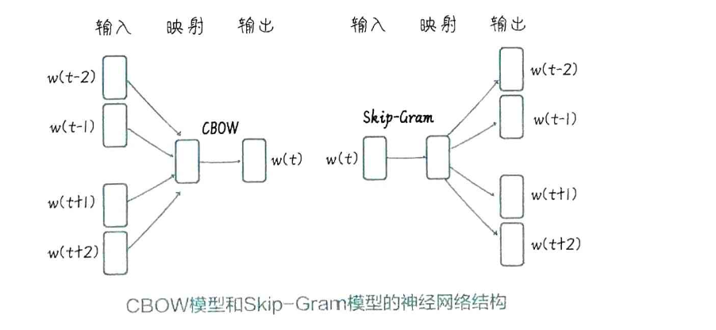

### 连续词袋模型（continuous bag of words）

[cbow](https://github.com/Draymonders/bing-agent/blob/main/src/nlp/word_vector/cbow.ipynb): 用上下文词推断当前词

### skip-gram

[skip-gram](https://github.com/Draymonders/bing-agent/blob/main/src/nlp/word_vector/skip_gram.ipynb)：用中心词预测周围词

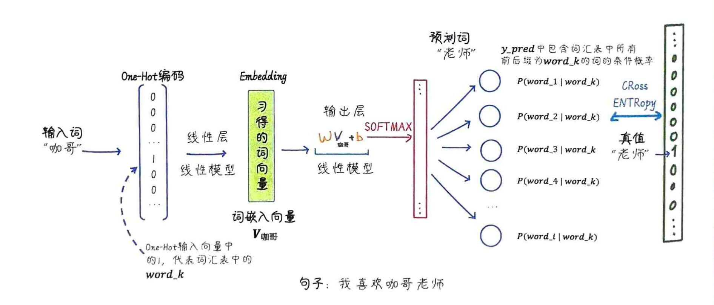

## 短句理解/生成

### 神经概率语言模型 （Neural Probabilistic Language Model）

[nplm](https://github.com/Draymonders/bing-agent/blob/main/src/nlp/nplm/nplm.ipynb): 输入的序列经过神经网络，转换成输出单词

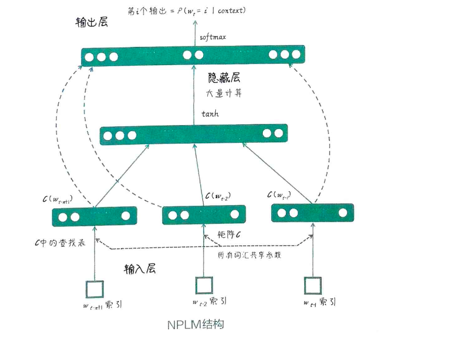

### 循环神经网络 (Recurrent Neural Network) 

[rnn](https://github.com/Draymonders/bing-agent/blob/main/src/nlp/nplm/rnn.ipynb): 输入的序列先转换为隐藏状态，再将隐藏状态转换为输出，每次预测一个词，循环预测

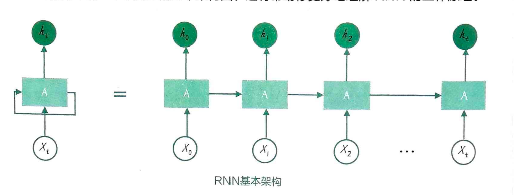

## 句子理解/生成

### 序列到序列模型（Sequence to Sequence）

[seq2seq](https://github.com/Draymonders/bing-agent/blob/main/src/nlp/seq2seq/seq2seq.ipynb): 拆分编码器和解码器，编码器负责将输入序列转换为隐藏状态，解码器负责将隐藏状态转换为输出序列。

相较于RNN，seq2seq可以处理不同长度的输入和输出（如翻译任务）

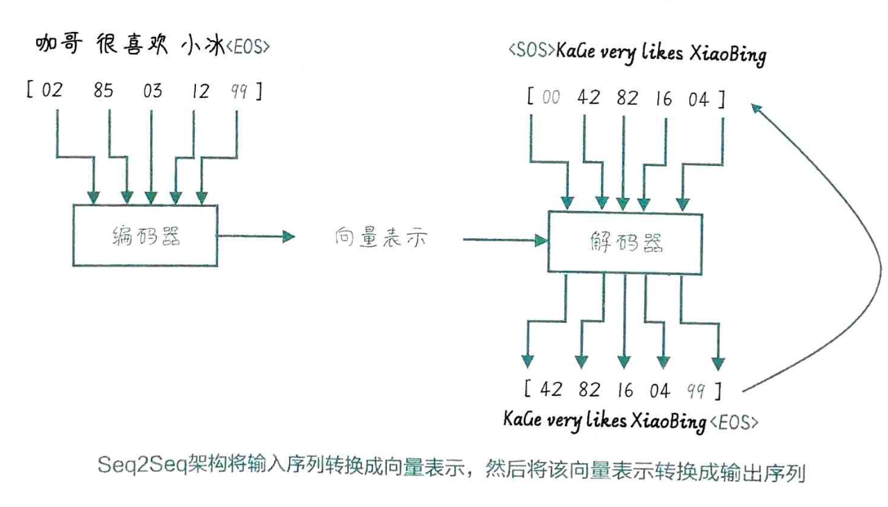

## 上下文理解

### 注意力机制（Attention Mechanism）

[attention](https://github.com/Draymonders/bing-agent/blob/main/src/nlp/attention/main.ipynb): 注意力机制，通过Q、K计算注意力权重，再将注意力权重与V相乘，得到加权和。

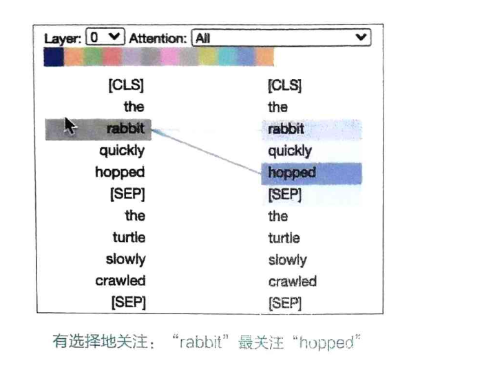

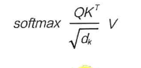

## 段落理解/生成

### Transformer

[Transformer](https://github.com/Draymonders/bing-agent/blob/main/src/nlp/transformer/transformer.ipynb)：

- 多头注意力：提升对输入序列中重要信息的提取
- 编解码多头注意力：提升输出序列对输入序列隐藏状态重要信息的提取
- 位置编码：让模型理解序列中单词的位置信息
- 填充编码：固定序列长度
- 后续掩码：让模型只关注当前单词之前的单词，避免未来信息泄露

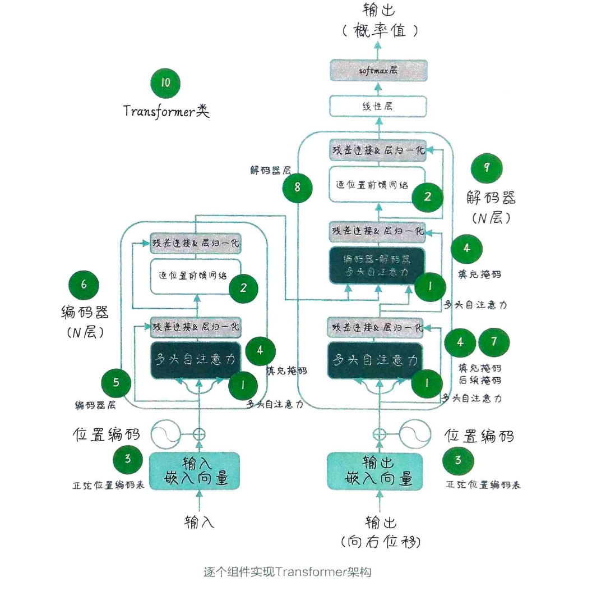

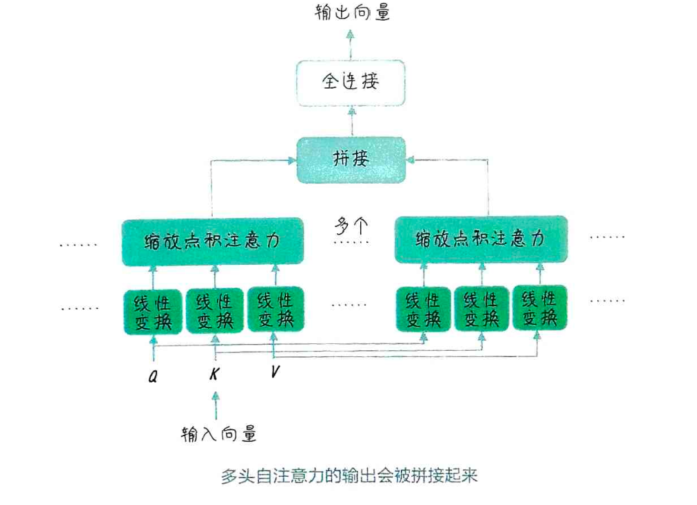

## 文章理解/生成

- BERT：仅用了Transformer的编码器部分，适合文本分类任务
- GPT：仅用了Transformer的解码器部分，适合文本生成任务

### GPT（Generative Pre-trained Transformer）

- [wiki-gpt](https://github.com/Draymonders/bing-agent/blob/main/src/nlp/gpt/gpt.ipynb)
- [微调wiki-gpt成chatgpt](https://github.com/Draymonders/bing-agent/blob/main/src/nlp/gpt/light_chatgpt.ipynb)

文本生成中的自回归方案

- 贪婪搜索：每个时间步只选择概率最高的输出单词。
- 集束搜索：每个时间步保持多个候选序列(TopK)，目的是在序列生成任务中找到最优输出序列。

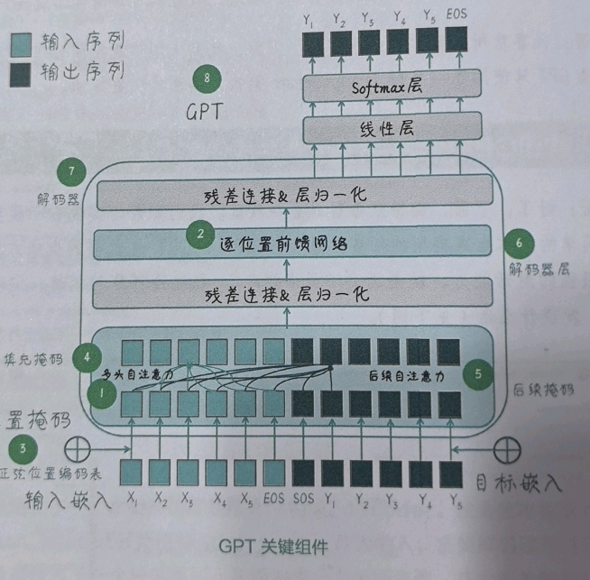

#### SFT (基于监督学习的强化学习)

提供标注数据，如提供ChatGPT对应的User Input/Ai Output，让模型学习如何生成符合预期的文本。

#### RHLF (基于人类反馈的强化学习)

人工标注了对应的数据，并提供了答案的分值/反馈，让模型学习如何生成符合预期的文本。

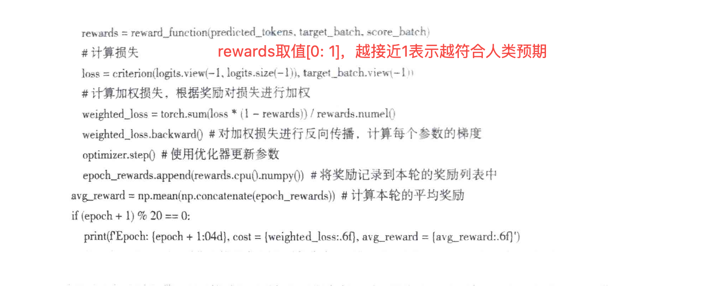

## 附录

- 《GPT图解 大模型是怎样构建的》
- [插图解释Transformer](https://jalammar.github.io/illustrated-transformer/)
- [插图解释GPT-2](http://jalammar.github.io/illustrated-gpt2/)