# 自然语言处理（Natural Language Processing）

> Language is the source of all civilizations.

自然语言处理（NLP）旨在让计算机理解、生成和处理人类语言。

从早期的规则系统到如今的大语言模型（LLM），NLP 经历了从符号主义（Symbolism）到连接主义（Connectionism）的深刻范式转移。

## 技术演进范式

NLP 的发展史是从**表示学习（Representation Learning）**到**建模能力（Modeling Capacity）**不断升级的过程。

- **规则时代 (Rule-based)**: 依赖语言学家手工构建语法规则和词典。
    - **特点**: 高精度，低召回，无法泛化，维护成本极高。
    - **代表**: 早期专家系统。
- **统计时代 (Statistical NLP)**: 基于大规模语料库进行统计推断。
    - **特点**: 引入概率模型，泛化能力提升，但受限于特征工程（Feature Engineering）。
    - **代表**: n-gram, HMM, CRF, SVM。
- **深度学习时代 (Deep Learning)**: 自动特征提取，端到端（End-to-End）学习。
    - **特点**: 引入分布式表示（Word Embeddings），解决维数灾难；通过神经网络拟合复杂函数。
    - **代表**: Word2Vec, RNN, CNN, Seq2Seq。
- **大模型时代 (Foundation Models)**: “预训练 + 微调”范式。
    - **特点**: 自监督学习（Self-Supervised Learning），Scaling Laws 生效，涌现能力（Emergent Abilities）。
    - **代表**: Transformer, BERT, GPT, LLaMA。

## 核心技术发展历程

| 技术/模型 | 核心思想 | 解决的痛点 | 局限性/工程挑战 |
|---|---|---|---|
| **n-gram/BOW** | 词频统计，离散表示 | 数字化文本，简单高效 | **数据稀疏，维度灾难**，忽略语序和语义相似性 |
| **Word2Vec** | **分布式表示**，词向量 | 解决稀疏性，捕捉词汇语义关系 (King-Man+Woman=Queen) | 静态 Embedding，**无法解决多义词**问题 (Context-free) |
| **RNN/LSTM** | 循环结构，处理变长序列 | 捕捉序列依赖，引入时间维度 | **梯度消失/爆炸**，无法并行训练 (时间复杂度 O(T)) |
| **Seq2Seq** | Encoder-Decoder 架构 | 解决输入输出长度不一致问题 (如翻译) | **信息瓶颈**：固定长度 Context Vector 难以承载长序列信息 |
| **Attention** | 动态权重分配 | 打破固定长度瓶颈，直接关注相关信息 | 计算量随序列长度增长，早期仍依赖 RNN 结构 |
| **Transformer** | **Self-Attention** 全并行 | 彻底抛弃循环，实现并行计算，捕捉长距离依赖 | **显存占用大** (Attention Matrix $O(N^2)$)，位置信息需额外编码 |
| **BERT** | 双向 Encoder，Masked LM | 深度双向语境理解，适合 NLU 任务 | 预训练与微调模式不一致 (Mask 标记)，不擅长生成任务 |
| **GPT 系列** | 单向 Decoder，Next Token Prediction | 统一生成范式，Few-shot/Zero-shot 能力 | 早期版本容易产生幻觉，上下文窗口限制 |

---

## 1. 离散符号与统计模型 (The Era of Sparsity)

### n-gram
基于马尔可夫假设（Markov Assumption），即当前词出现的概率仅取决于前 $n-1$ 个词。

- **工程视角**: 随着 $n$ 增大，参数空间呈指数级爆炸，导致严重的数据稀疏问题。通常 $n$ 取 2 或 3。
- [n-gram 代码实现](https://github.com/Draymonders/bing-agent/blob/main/src/nlp/basic/n-gram.ipynb)

### 词袋模型（Bag of Words, BOW）
忽略语序，仅考虑词频。将文本表示为高维稀疏向量（One-hot 组合）。

- [BOW 代码实现](https://github.com/Draymonders/bing-agent/blob/main/src/nlp/basic/bag_of_word.ipynb)

---

## 2. 词的分布式表示 (Word Embeddings)

这是 NLP 的第一个“黑魔法”时刻。通过将词映射到低维稠密向量空间（Dense Vector Space），使得语义相似的词在空间中距离更近。

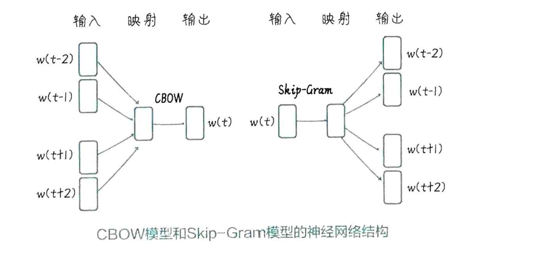

### Word2Vec
Google 提出的高效训练词向量的方法。

- **核心假设**: Distributional Hypothesis —— 词的含义由其上下文决定。
- **工程优化**: 引入 **Negative Sampling** (负采样) 和 **Hierarchical Softmax** 替代全量的 Softmax，极大地降低了训练时的计算复杂度。

#### CBOW (Continuous Bag of Words)
用上下文预测中心词。适合小型语料库。
- [cbow 代码实现](https://github.com/Draymonders/bing-agent/blob/main/src/nlp/word_vector/cbow.ipynb)

#### Skip-gram
用中心词预测上下文。在大型语料库表现更好，对生僻词更敏感。
- [skip-gram 代码实现](https://github.com/Draymonders/bing-agent/blob/main/src/nlp/word_vector/skip_gram.ipynb)

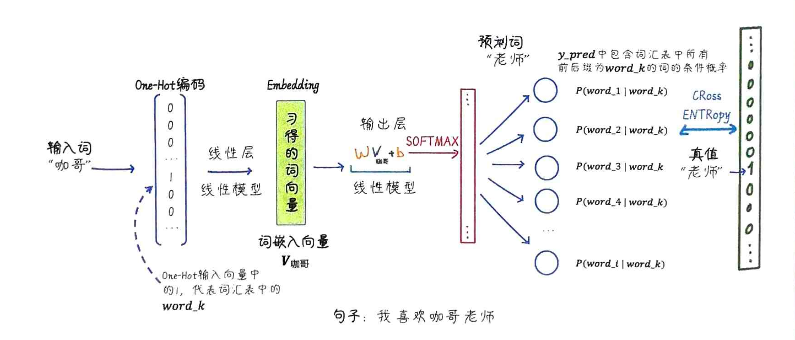

---

## 3. 序列建模与递归网络 (Sequence Modeling)

### 神经概率语言模型 (NPLM)
Bengio 早期提出的神经网络语言模型，虽然训练慢，但奠定了 Word Embedding + Neural Network 的基础。
- [nplm 代码实现](https://github.com/Draymonders/bing-agent/blob/main/src/nlp/nplm/nplm.ipynb)
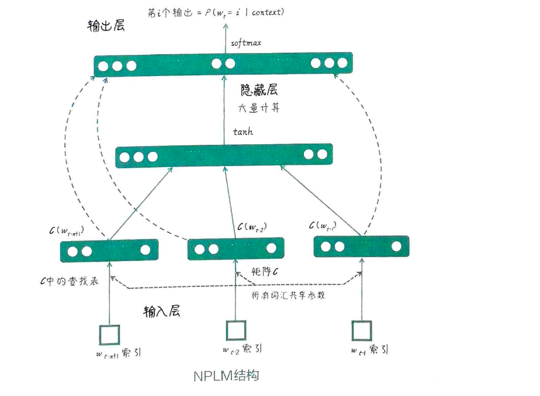

### 循环神经网络 (RNN)
通过引入隐藏状态（Hidden State） $h_t = f(x_t, h_{t-1})$ 来传递历史信息。

- **痛点**: 反向传播时存在**梯度消失（Vanishing Gradient）**问题，导致难以捕捉长距离依赖。
- **改进**: LSTM 和 GRU 通过引入门控机制（Gating Mechanism）缓解了这一问题。
- [rnn 代码实现](https://github.com/Draymonders/bing-agent/blob/main/src/nlp/nplm/rnn.ipynb)
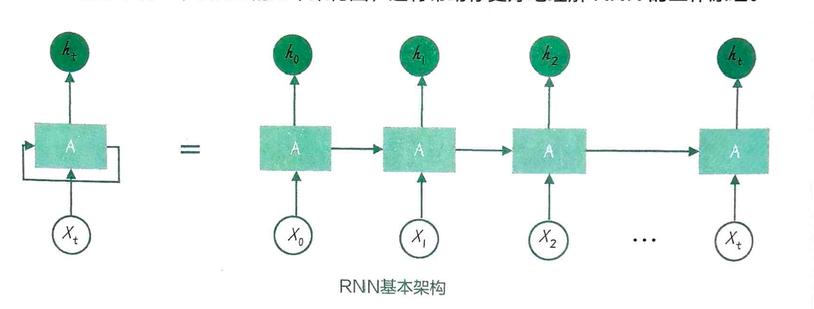

---

## 4. 序列到序列与注意力机制 (Seq2Seq & Attention)

### Seq2Seq (Encoder-Decoder)
将输入序列编码为固定长度向量，再解码为输出序列。
- [seq2seq 代码实现](https://github.com/Draymonders/bing-agent/blob/main/src/nlp/seq2seq/seq2seq.ipynb)
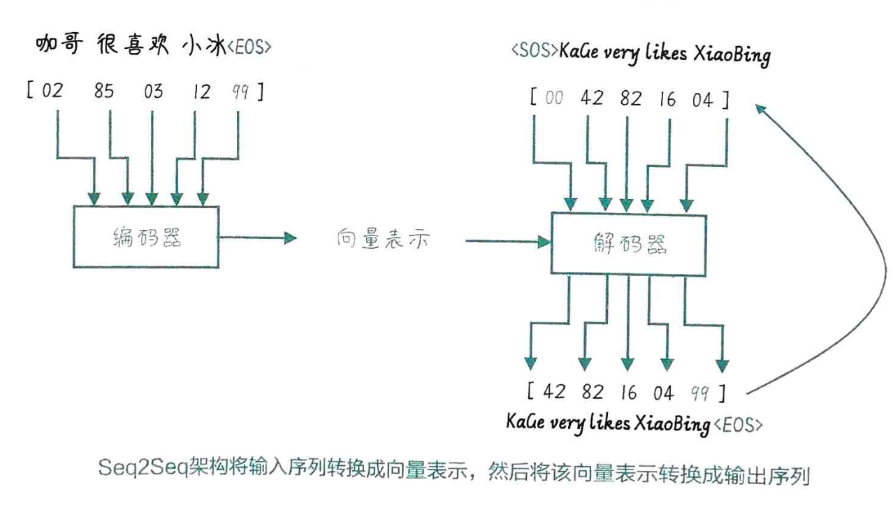

### Attention Mechanism (注意力机制)
Attention 的本质是**加权求和**。它允许 Decoder 在生成的每一步都能“看”到 Encoder 的所有隐藏状态，并根据相关性聚焦于特定区域。

$$ Attention(Q, K, V) = softmax(\frac{QK^T}{\sqrt{d_k}})V $$

- **Q (Query)**: 当前解码状态
- **K (Key)**: 编码器各时刻状态
- **V (Value)**: 编码器各时刻内容
- **$\sqrt{d_k}$**: 缩放因子，防止点积过大导致 Softmax 进入饱和区（梯度消失）。

- [attention 代码实现](https://github.com/Draymonders/bing-agent/blob/main/src/nlp/attention/main.ipynb)
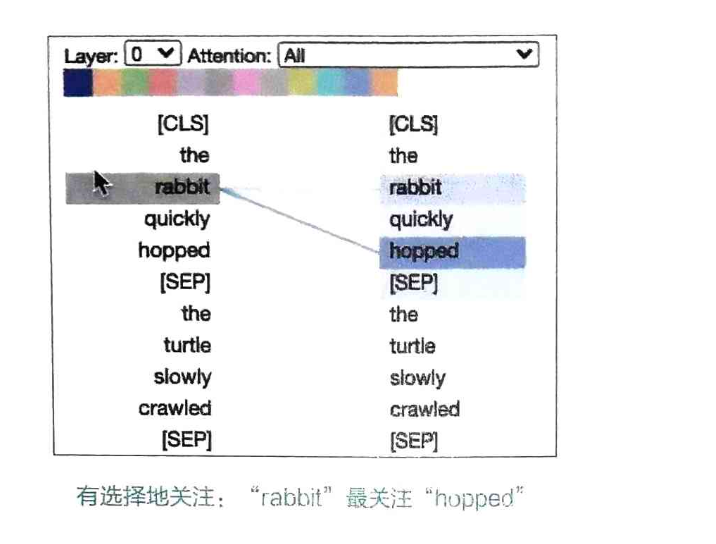
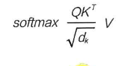

---

## 5. Transformer: 大模型的基石

Google 2017 年论文 *Attention Is All You Need* 彻底改变了 NLP。Transformer 抛弃了 RNN，完全依赖 Self-Attention。

- **Self-Attention**: 捕捉序列内部的依赖关系，实现 $O(1)$ 的路径长度（RNN 是 $O(T)$）。
- **Multi-Head Attention**: 将 Embedding 拆分为多个头，让模型在不同的子空间（Subspaces）学习特征（如语法、语义、指代关系）。
- **Positional Encoding**: 由于 Attention 是置换不变的（Permutation Invariant），必须显式注入位置信息。
- **并行化**: 训练时可以并行计算整个序列，极大地加速了大规模预训练。

- [Transformer 代码实现](https://github.com/Draymonders/bing-agent/blob/main/src/nlp/transformer/transformer.ipynb)

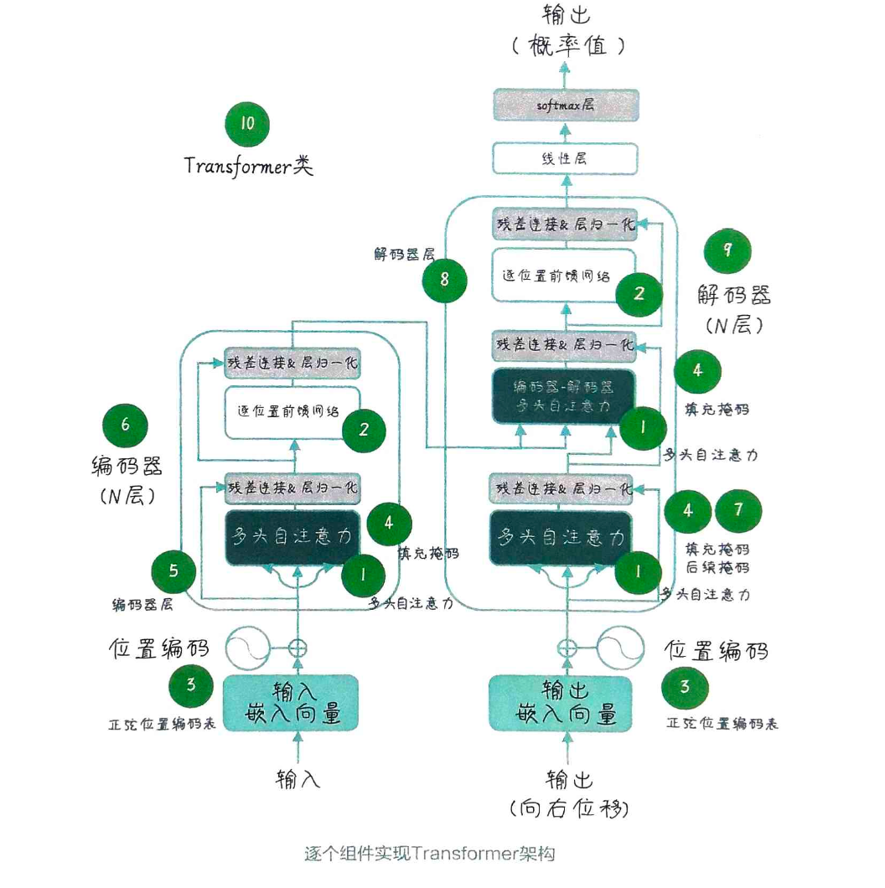
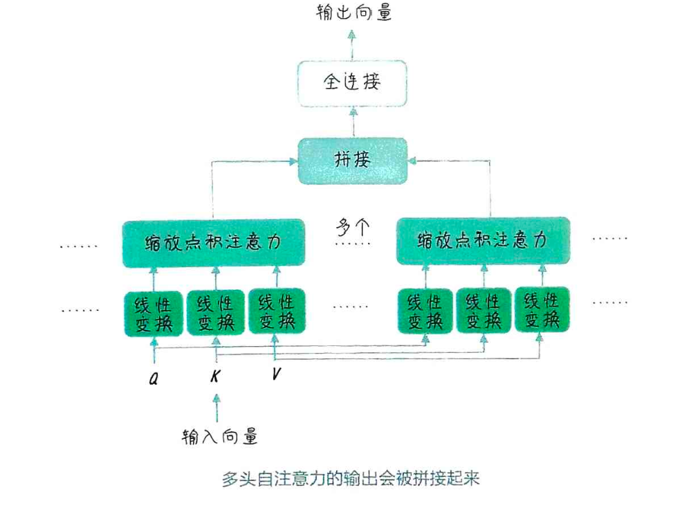

---

## 6. 生成式 AI 与大语言模型 (LLM)

LLM 的核心不仅仅是模型变大，而是**Scaling Laws**（缩放定律）的验证：模型性能与参数量、数据量、计算量呈幂律关系。

### GPT (Generative Pre-trained Transformer)
坚持使用 **Decoder-only** 架构，通过自回归（Autoregressive）目标进行无监督预训练。

- **演进路线**:
    - **GPT-1**: 验证了 Pre-train + Fine-tune 的有效性。
    - **GPT-2**: Zero-shot 尝试，证明了模型在大规模数据下可以学会多任务。
    - **GPT-3**: In-context Learning (ICL)，无需梯度更新即可通过 Prompt 引导模型完成任务。
    - **InstructGPT/ChatGPT**: 引入 RLHF，解决对齐问题。

- [wiki-gpt 代码实现](https://github.com/Draymonders/bing-agent/blob/main/src/nlp/gpt/gpt.ipynb)
- [微调wiki-gpt成chatgpt](https://github.com/Draymonders/bing-agent/blob/main/src/nlp/gpt/light_chatgpt.ipynb)
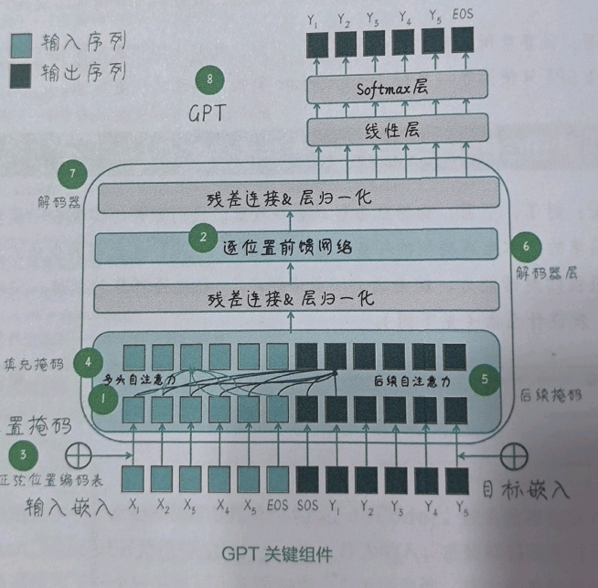

### 文本生成策略
- **Greedy Search**: 局部最优，容易陷入重复循环。
- **Beam Search**: 维护 Top-K 路径，全局更优，但缺乏多样性。
- **Temperature Sampling**: 调整 Softmax 分布平滑度，控制生成的多样性与创造力。
- **Top-k / Top-p (Nucleus) Sampling**: 截断低概率尾部，防止生成离谱内容。

---

## 7. 对齐技术 (Alignment): 让 AI 更像人

单纯的 Next Token Prediction 训练出来的模型可能是有毒的、胡言乱语的。需要通过对齐技术使其符合人类价值观（Helpful, Honest, Harmless）。

### SFT (Supervised Fine-Tuning)
**指令微调 (Instruction Tuning)**。使用高质量的 `(Prompt, Response)` 数据对预训练模型进行微调，教会模型“理解指令”而不仅仅是“续写文本”。

### RLHF (Reinforcement Learning from Human Feedback)
基于人类反馈的强化学习，是 ChatGPT 的核心护城河。

1.  **SFT 模型**: 初始化策略。
2.  **Reward Model (RM)**: 训练一个打分模型，拟合人类对回答优劣的偏好（Ranking Loss）。
3.  **PPO (Proximal Policy Optimization)**: 使用强化学习算法优化生成模型，使其生成的回答能获得 RM 的高分，同时通过 KL Divergence 约束防止模型跑偏（Reward Hacking）。

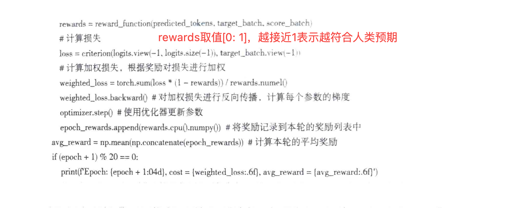

---

## 8. 工程前沿与落地挑战

作为研发，在落地 LLM 时需关注：

- **RAG (Retrieval-Augmented Generation)**: 检索增强生成。解决 LLM 知识过期和幻觉问题。
    - **架构**: Query -> Embedding -> Vector DB Search -> Context + Query -> LLM。
- **PEFT (Parameter-Efficient Fine-Tuning)**: 参数高效微调。
    - **LoRA (Low-Rank Adaptation)**: 冻结主干参数，仅训练低秩旁路矩阵，显存占用降低 90%。
- **Agent (智能体)**: LLM 作为大脑，调用工具（Tools）、规划任务（Planning）、维护记忆（Memory）。
- **Inference Optimization (推理优化)**:
    - **Quantization**: INT8/INT4 量化 (GPTQ, AWQ)。
    - **FlashAttention**: 硬件感知的 IO 优化，加速 Attention 计算。
    - **vLLM / PagedAttention**: 优化 KV Cache 显存管理，提升吞吐量。

---

## 附录与推荐阅读

- [The Illustrated Transformer (Jay Alammar)](https://jalammar.github.io/illustrated-transformer/) - 经典的图解 Transformer
- [The Illustrated GPT-2 (Jay Alammar)](http://jalammar.github.io/illustrated-gpt2/)
- [State of GPT (Andrej Karpathy)](https://www.youtube.com/watch?v=bZQun8Y4L2A) - 必看的 GPT 现状综述
