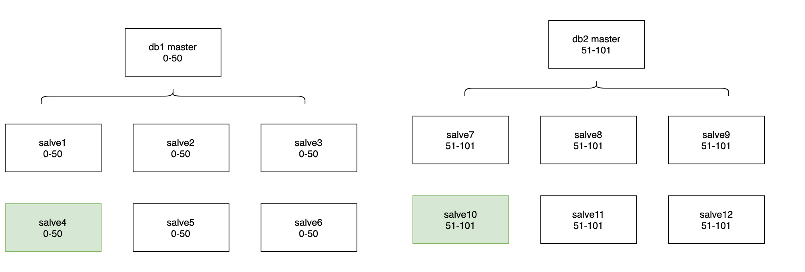
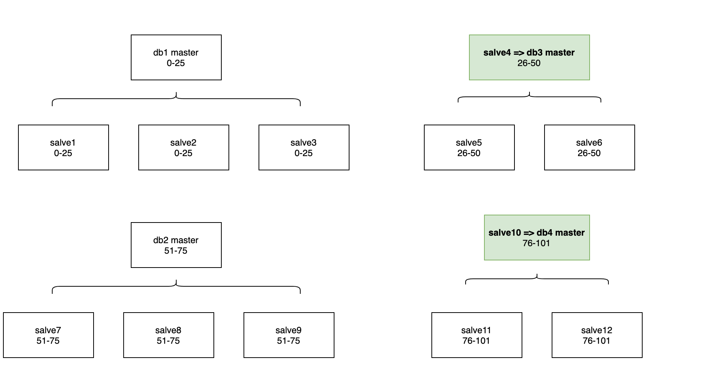

# MySQL技术内幕 InnoDB存储引擎 第2版

## 环境安装

`docker-compose --file docker-compose.yml up -d` 启动mysql容器

docker-compose.yml文件如下

volumes里面挂载了两个目录
- 配置文件`~/data/mysql/conf/my.cnf`，
- 数据目录，方便在宿主机看到数据 `~/data/mysql/data`

```
version: "3"

services:
  mysql:
    image: mysql:5.7
    command: --default-authentication-plugin=mysql_native_password --character-set-server=utf8mb4 --collation-server=utf8mb4_unicode_ci
    restart: always
    ports:
      - 3306:3306
    environment:
      MYSQL_ROOT_PASSWORD: root
    volumes:
      - ~/data/mysql/conf/my.cnf:/etc/mysql/my.cnf
      - ~/data/mysql/data:/var/lib/mysql
```
`mysql -u root -p root` 连接到mysql，查看innodb引擎 情况

```
> show engine INNODB STATUS\G

***************************[ 1. row ]***************************
Type   | InnoDB
Name   |
Status |
=====================================
2022-06-04 14:51:57 0x7faf007f8700 INNODB MONITOR OUTPUT
=====================================
Per second averages calculated from the last 53 seconds
-----------------
BACKGROUND THREAD
-----------------
srv_master_thread loops: 2 srv_active, 0 srv_shutdown, 267 srv_idle
srv_master_thread log flush and writes: 269
----------
SEMAPHORES
----------
OS WAIT ARRAY INFO: reservation count 2
OS WAIT ARRAY INFO: signal count 2
RW-shared spins 0, rounds 4, OS waits 2
RW-excl spins 0, rounds 0, OS waits 0
RW-sx spins 0, rounds 0, OS waits 0
Spin rounds per wait: 4.00 RW-shared, 0.00 RW-excl, 0.00 RW-sx
------------
TRANSACTIONS
------------
Trx id counter 1795
Purge done for trx's n:o < 0 undo n:o < 0 state: running but idle
History list length 0
LIST OF TRANSACTIONS FOR EACH SESSION:
---TRANSACTION 421865085982560, not started
0 lock struct(s), heap size 1136, 0 row lock(s)
--------
FILE I/O
--------
I/O thread 0 state: waiting for completed aio requests (insert buffer thread)
I/O thread 1 state: waiting for completed aio requests (log thread)
I/O thread 2 state: waiting for completed aio requests (read thread)
I/O thread 3 state: waiting for completed aio requests (read thread)
I/O thread 4 state: waiting for completed aio requests (read thread)
I/O thread 5 state: waiting for completed aio requests (read thread)
I/O thread 6 state: waiting for completed aio requests (write thread)
I/O thread 7 state: waiting for completed aio requests (write thread)
I/O thread 8 state: waiting for completed aio requests (write thread)
I/O thread 9 state: waiting for completed aio requests (write thread)
Pending normal aio reads: [0, 0, 0, 0] , aio writes: [0, 0, 0, 0] ,
 ibuf aio reads:, log i/o's:, sync i/o's:
```

bufferPoolSize
```
> show variables like 'innodb_buffer_pool_size'\G
(END)
***************************[ 1. row ]***************************
Variable_name | innodb_buffer_pool_size
Value         | 134217728     => 128MB
```

查看mysql相关配置

```shell
cd / 
find . -name "*mysql*" | grep "log"

或者用 mysqlCli 查询
mysqlCli> show variables like '%datadir%'\G
```
查询得知，mysql容器相关的文件存放在 `/var/lib/mysql`

## Buffer Pool


- 按照 file -> shard -> buffer page的结构，shard内部对page进行缓存管理，采用LRU策略。
    * insert buffer & change buffer
- 每个shard最多有 pgsize 个page，如果page满了，会触发lru，如果清理的page是dirty的，则落盘
- [github 简单的实现](https://github.com/Draymonders/bfile)

## 日志文件

日志分为以下几种

* slow log，<b>二进制文件</b>，记录查询较慢的sql，借助 `mysqldumpslow` 分析，MySQL本身的文件
* bin log，<b>逻辑日志</b>，记录数据库执行 更新的sql，供salve复制数据，MySQL本身的文件
* redo log，<b>物理日志</b>，WAL日志，保证持久性，InnoDB特有
* undo log，<b>逻辑日志</b>，记录事务执行过程中的相反操作（insert 变为 delete），（update 变为反向update）


### Binlog

- <b>逻辑日志</b>，用于主从同步

开启binlog需要在 `my.cnf` 配置

```
[mysqld]
log_bin=mysql-bin
server-id=1
```

#### Binlog 存储

```
> show master status\G

***************************[ 1. row ]***************************
File              | mysql-bin.000003
Position          | 856
Binlog_Do_DB      |
Binlog_Ignore_DB  |
Executed_Gtid_Set |
```

查看binlog格式，binlog有三种格式`STATEMENT`，`ROW`，`MIX`

```
> select @@session.binlog_format;
+-------------------------+
| @@session.binlog_format |
+-------------------------+
| ROW                     |
+-------------------------+
```


建表并初始化数据

```sql
CREATE TABLE `t_sample` (
  `id` bigint(20) NOT NULL AUTO_INCREMENT,
  `name` varchar(16) COLLATE utf8mb4_unicode_ci NOT NULL DEFAULT '',
  PRIMARY KEY (`id`)
) ENGINE=InnoDB AUTO_INCREMENT=3 DEFAULT CHARSET=utf8mb4 COLLATE=utf8mb4_unicode_ci

insert into t_sample(name) values("bing"),("draymonder");
```

#### 更新数据的binlog

```sql
update t_sample set name ='amor' where id=2;
```

查看binlog文件，需要使用mysql自带的 `mysqlbinlog` ，用cat不行，因为binlog是二进制文件

```sql
> mysqlbinlog --start-position=856 mysql-bin.000003 -v

# at 993
#220605  6:16:18 server id 1  end_log_pos 1047 CRC32 0x62752495 	Table_map: `amor`.`t_sample` mapped to number 110
# at 1047
#220605  6:16:18 server id 1  end_log_pos 1117 CRC32 0xdcaf7236 	Update_rows: table id 110 flags: STMT_END_F

BINLOG '
MkqcYhMBAAAANgAAABcEAAAAAG4AAAAAAAEABGFtb3IACHRfc2FtcGxlAAIIDwJAAACVJHVi
MkqcYh8BAAAARgAAAF0EAAAAAG4AAAAAAAEAAgAC///8AgAAAAAAAAAKZHJheW1vbmRlcvwCAAAA
AAAAAARhbW9yNnKv3A==
'/*!*/;
### UPDATE `amor`.`t_sample`
### WHERE
###   @1=2
###   @2='draymonder'
### SET
###   @1=2
###   @2='amor'
# at 1117
#220605  6:16:18 server id 1  end_log_pos 1148 CRC32 0x24efb3f3 	Xid = 42
COMMIT/*!*/;
SET @@SESSION.GTID_NEXT= 'AUTOMATIC' /* added by mysqlbinlog */ /*!*/;
DELIMITER ;
# End of log file
/*!50003 SET COMPLETION_TYPE=@OLD_COMPLETION_TYPE*/;
/*!50530 SET @@SESSION.PSEUDO_SLAVE_MODE=0*/;
```

#### 删除数据的binlog

```sql
delete from t_sample where name='amor';

> mysqlbinlog --start-position=856 mysql-bin.000003 -v

# at 1285
#220605  6:27:50 server id 1  end_log_pos 1339 CRC32 0x5567ded4 	Table_map: `amor`.`t_sample` mapped to number 110
# at 1339
#220605  6:27:50 server id 1  end_log_pos 1388 CRC32 0x07ba59c7 	Delete_rows: table id 110 flags: STMT_END_F

BINLOG '
5kycYhMBAAAANgAAADsFAAAAAG4AAAAAAAEABGFtb3IACHRfc2FtcGxlAAIIDwJAAADU3mdV
5kycYiABAAAAMQAAAGwFAAAAAG4AAAAAAAEAAgAC//wCAAAAAAAAAARhbW9yx1m6Bw==
'/*!*/;
### DELETE FROM `amor`.`t_sample`
### WHERE
###   @1=2
###   @2='amor'
# at 1388
#220605  6:27:50 server id 1  end_log_pos 1419 CRC32 0x79c74b7b 	Xid = 59
COMMIT/*!*/;
SET @@SESSION.GTID_NEXT= 'AUTOMATIC' /* added by mysqlbinlog */ /*!*/;
DELIMITER ;
# End of log file
/*!50003 SET COMPLETION_TYPE=@OLD_COMPLETION_TYPE*/;
/*!50530 SET @@SESSION.PSEUDO_SLAVE_MODE=0*/;
```


### RedoLog

为了取得更好的读写性能，InnoDB会将数据缓存在内存中（InnoDB Buffer Pool），对磁盘数据的修改也会落后于内存，这时如果进程或机器崩溃，会导致内存数据丢失，为了保证数据库本身的一致性和持久性，InnoDB维护了REDO LOG。

修改Page之前需要先将修改的内容记录到REDO中，并保证REDO LOG早于对应的Page落盘，也就是常说的WAL，Write Ahead Log。当故障发生导致内存数据丢失后，InnoDB会在重启时，通过重放REDO，将Page恢复到崩溃前的状态。


#### Redolog 存储

```
root@8a83121d6e85:/var/lib/mysql# ls -lsh | grep "ib"
4.0K -rw-r----- 1 mysql mysql 1.4K Jun  5 06:05 ib_buffer_pool
 48M -rw-r----- 1 mysql mysql  48M Jun  5 06:29 ib_logfile0
 48M -rw-r----- 1 mysql mysql  48M Jun  5 06:05 ib_logfile1
 76M -rw-r----- 1 mysql mysql  76M Jun  5 06:29 ibdata1
 12M -rw-r----- 1 mysql mysql  12M Jun  5 06:26 ibtmp1
```

innodb 存储引擎至少有1个重做日志文件组（group），每个group至少有2个文件，如默认的`ib_logfile0`和`ib_logfile1`，InnoDB先写`ib_logfile0`，写满了后，切换到`ib_logfile1`，再写满后，再继续写`ib_logfile0`

```
show variables like 'innodb%log%'\G

***************************[ 8. row ]***************************
Variable_name | innodb_log_file_size
Value         | 50331648    => 48MB
***************************[ 9. row ]***************************
Variable_name | innodb_log_files_in_group
Value         | 2                    => 2个

> show variables like '%flush%'\G

***************************[ 7. row ]***************************
Variable_name | innodb_flush_log_at_trx_commit
Value         | 1           =>  每提交一个事务，就刷盘 redo log buffer 到 log文件里
```

```
> show engine innodb status\G;  （插入大量的数据）
---
LOG
---
Log sequence number 127664222
Log flushed up to   120711324
Pages flushed up to 70622487
Last checkpoint at  62890079
```

- log sequence number: 代表当前的重做日志redo log(in buffer)在内存中的LSN
- log flushed up to: 代表刷到redo log file on disk中的LSN
- pages flushed up to: 代表已经刷到磁盘数据页上的LSN
- last checkpoint at: 代表上一次检查点所在位置的LSN

log sequence number >= log flushed up to >= pages flushed up to >= last checkpoint at


大概格式

```
（Page ID，Record Offset，(Filed 1, Value 1) … (Filed i, Value i) … )
```

其中，PageID指定要操作的Page页，Record Offset记录了Record在Page内的偏移位置，后面的Field数组，记录了需要修改的Field以及修改后的Value。


InnoDB中通过min-transaction实现，简称mtr，需要原子操作时，调用mtr_start生成一个mtr，mtr中会维护一个动态增长的m_log，这是一个动态分配的内存空间，将这个原子操作需要写的所有REDO先写到这个m_log中，当原子操作结束后，调用mtr_commit将m_log中的数据拷贝到InnoDB的Log Buffer。

#### redo log 大小设置

1. 设置过大，恢复需要花很长时间。
2. 设置过小，一个事务可能被记录在了不同的 redo log子log上。设置的太小会导致频繁的 `async checkpoint`，频繁刷盘

#### redo log、bin log 区别

1. binlog是mysql有的，和存储引擎无关，redo log是 InnoDB特有的。
2. binlog记录的逻辑日志，redo log记录的物理日志（关于每个页的更改的物理情况）
3. redo log是InnoDB实现的wal日志。二进制日志只在每次事务提交的时候一次性写入缓存中的日志文件，redo log一直会记录。
4. 为了保证存储引擎层和上层二进制日志的一致性，二者之间使用了 <b>两阶段事务</b>

#### Redo log 相关文章

- [庖丁解InnoDB之REDO LOG](http://catkang.github.io/2020/02/27/mysql-redo.html)
- [binlog、redo log](https://cloud.tencent.com/developer/article/1679325)


### Undo Log

1. 逻辑日志，记录事务执行过程中的相反操作（insert 变为 delete），（update 变为反向update）
2. 实现MVCC的非锁定读。读快照的能力

## InnoDB中的锁

- 全局锁
- 表锁 (lock read/write)
- 行级锁（需要时才加上，**事务结束后**释放）
    * 共享锁（S Lock）：允许事务读一行数据
    * 排它锁（X Lock）：允许事务删除 or 更新数据
- 意向锁：对一行进行加锁，需要对数据库、表、页加<b>粗粒度</b>的锁

### 锁相关

Record lock、Gap lock、Next-key lock

- [参考阅读](https://blog.51cto.com/u_15177525/3314017)

### 一致性读

#### 一致性非锁定读

- 在 `READ COMMITED` 事务隔离级别下，对于快照数据，非一致性读总是读取<b>最新的行数据版本</b>
- 在 `REPEATABLE READ` 事务隔离级别下，对于快照数据，非一致性读总是读取<b>事务开始时的行数据版本</b>

查看隔离级别
```sql
select @@tx_isolation
+-----------------+
| @@tx_isolation  |
+-----------------+
| REPEATABLE-READ |
+-----------------+
```

- 只读，不加锁

```sql
-- 
事务1
begin;
select id, name from amor.t_sample where id = 100;

=>
+-----+------+
| id  | name |
+-----+------+
| 100 | amor |
+-----+------+
---
事务2
begin;
update amor.t_sample set name = 'tr 2' where id = 100;
commit;
--- 
事务1
select id, name from amor.t_sample where id = 100;

=> 
+-----+------+
| id  | name |
+-----+------+
| 100 | amor |
+-----+------+
commit;
---
```

#### 一致性锁定读

- S锁 `lock in share mode`

```sql
-- 
事务1
begin;
select id, name from amor.t_sample where id = 100 lock in share mode;

=>
+-----+------+
| id  | name |
+-----+------+
| 100 | amor |
+-----+------+
---
事务2
begin;
update amor.t_sample set name = 'tr 3' where id = 100;
commit;    => 因为事务1加了读锁，所以这里是阻塞的，等事务1 commit/rollback 才能完成事务2的commit
--- 
事务1
select id, name from amor.t_sample where id = 100;

=> 
+-----+------+
| id  | name |
+-----+------+
| 100 | amor |
+-----+------+
commit;
---
```

- X锁 `for update`

```sql
-- 
事务1
begin;
select id, name from amor.t_sample where id = 100 for update;

=>
+-----+------+
| id  | name |
+-----+------+
| 100 | tr 3 |
+-----+------+
---
事务2
begin;
select id, name from amor.t_sample where id = 100;  => 这里是用的非锁定读，可以正常读数据

=> 
+-----+------+
| id  | name |
+-----+------+
| 100 | tr 3 |
+-----+------+

select id, name from amor.t_sample where id = 100 lock in share mode;  因为事务1加了X锁，所以这里是阻塞的，等事务1 commit/rollback 才能完成这里的查询


update amor.t_sample set name = 'tr 4' where id = 100;
commit;
--- 
事务1
select id, name from amor.t_sample where id = 100;

=> 
+-----+------+
| id  | name |
+-----+------+
| 100 | tr 3 |
+-----+------+
commit;
---
```

## 索引

- 主键索引(聚簇索引) -> 叶子存所有数据
  - 使用自增主键更好 (业务主键的话，写树操作成本高)
- 非主键索引 -> 叶子存主键值(查询所有数据需要回表到主键索引去查)
- 覆盖索引 (尽可能走索引，增加查询效率)

### 索引引用

[MySQL索引原理及慢查询优化](https://tech.meituan.com/2014/06/30/mysql-index.html)

## 事务 TODO

- redolog 保证事务原子性和持久性
- undolog 保证事务 一致性

事务隔离实现

- 未提交读
- 已提交读 -> 每句SQL执行时创建视图
- 可重复读 -> 事务开始时创建视图
- 串行读


## 扩容

背景：

- db 存储快满了，因此需要扩容，执行时间为凌晨
- db扩容期间会有 5s 左右时间不可写
- db的架构为 proxy + 主从，查询必须带分片键

扩容前



扩容后



## 附录

- InnoDB undo log 漫游 http://mysql.taobao.org/monthly/2015/04/
- InnoDB redo log漫游 http://mysql.taobao.org/monthly/2015/05/
- Innodb change buffer介绍 http://mysql.taobao.org/monthly/2015/07/
- InnoDB 事务子系统介绍 http://mysql.taobao.org/monthly/2015/12/
- InnoDB index lock前世今生 http://mysql.taobao.org/monthly/2015/07/05/
