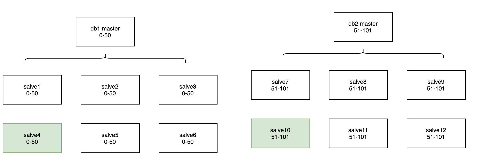
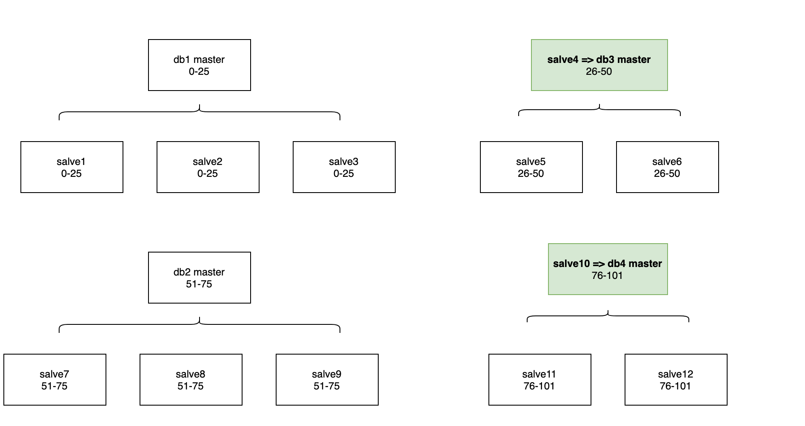
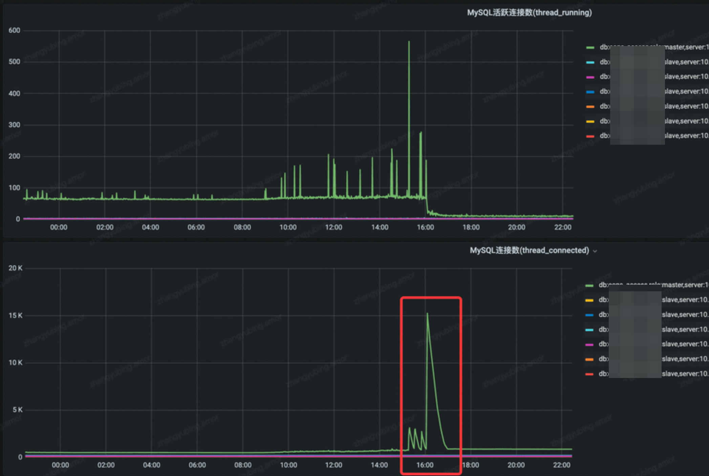

# MySQL InnoDB 简介

本文档简要介绍 InnoDB 存储引擎的核心特性，涵盖：环境搭建、日志机制、索引原理、内存管理、锁机制、事务模型及扩容方案、实践踩坑。

## 1. 环境安装 (Environment)

基于 Docker Compose 快速搭建 MySQL 5.7 实验环境，便于复现与调试。

### 1.1 部署配置

创建 `docker-compose.yml`，挂载配置与数据目录以保证数据持久化及配置可修改。

```yaml
version: "3"

services:
  mysql:
    image: mysql:5.7
    command: --default-authentication-plugin=mysql_native_password --character-set-server=utf8mb4 --collation-server=utf8mb4_unicode_ci
    restart: always
    ports:
      - 3306:3306
    environment:
      MYSQL_ROOT_PASSWORD: root
    volumes:
      # 配置文件挂载
      - ~/data/mysql/conf/my.cnf:/etc/mysql/my.cnf
      # 数据文件挂载
      - ~/data/mysql/data:/var/lib/mysql
```

### 1.2 启动与状态检查

```bash
# 启动容器
docker-compose up -d

# 检查容器状态
docker ps | grep mysql
```

连接 MySQL 并查看 InnoDB 引擎状态：
```sql
mysql -u root -p
-- 查看 InnoDB 核心状态（包含锁、I/O、Buffer Pool等信息）
SHOW ENGINE INNODB STATUS\G
```

## 2. 日志系统 (Logging)

MySQL 的日志系统是保证数据持久性（Durability）、原子性（Atomicity）及主从复制的关键。

### 2.1 日志体系概览

| 日志类型 | 归属层级 | 类型 | 关键作用 | 刷盘策略 |
| :--- | :--- | :--- | :--- | :--- |
| **Binlog** | Server 层 | 逻辑日志 | 主从复制、数据恢复、审计 | `sync_binlog` |
| **Redo Log** | InnoDB 层 | 物理日志 | 崩溃恢复 (Crash Safe)、持久性 | `innodb_flush_log_at_trx_commit` |
| **Undo Log** | InnoDB 层 | 逻辑日志 | 事务回滚、MVCC (多版本并发控制) | 独立/系统表空间 |
| **Slow Log** | Server 层 | 文本日志 | 慢查询分析 | `long_query_time` |

### 2.2 Binlog (归档日志)

记录所有对数据库执行更改的 SQL 语句，主要用于主从复制和 Point-in-Time Recovery (PITR)。

*   **格式 (`binlog_format`)**：
    *   `STATEMENT`: 记录 SQL 原句（可能导致主从不一致）。
    *   `ROW`: 记录行变更前后的值（推荐，数据更安全）。
    *   `MIXED`: 混合模式。
*   **常用操作**：
    ```sql
    -- 查看当前 Binlog 写入位置
    SHOW MASTER STATUS\G
    ```
    ```bash
    # 解析 Binlog (因是二进制文件，需用工具查看)
    mysqlbinlog --start-position=856 mysql-bin.000003 -v
    ```

### 2.3 Redo Log (重做日志)

**WAL (Write-Ahead Logging)** 技术的核心。修改数据页前，先记录 Redo Log，保证事务的 **Durability (持久性)**。

*   **机制**：循环写入固定大小的文件组（如 `ib_logfile0`, `ib_logfile1`）。
*   **CheckPoint**：当 Redo Log 写满或系统空闲时，触发 Checkpoint 将脏页刷新到磁盘，推进 LSN (Log Sequence Number)。
*   **关键参数**：
    *   `innodb_log_file_size`: 单个日志文件大小。
    *   `innodb_flush_log_at_trx_commit`:
        *   `0`: 每秒写入磁盘（性能最好，Crash 可能丢1秒数据）。
        *   `1`: 每次事务提交写入磁盘（默认，最安全）。
        *   `2`: 每次提交写入 OS Cache（MySQL Crash 不丢，OS Crash 丢）。

### 2.4 Undo Log (回滚日志)

*   **作用**：
    1.  **事务回滚**：记录数据的反向操作（Insert -> Delete, Update -> Reverse Update），保证 **Atomicity (原子性)**。
    2.  **MVCC**：构建数据的历史版本，实现一致性非锁定读。

### 2.5 三种日志配合完成一次事务更新

以一个包含多条 Update 语句的事务为例，整个过程遵循 **两阶段提交 (2PC)** 协议，确保物理层（Redo Log）和逻辑层（Binlog）的数据一致性。

#### 1. 执行阶段 (Transaction Begin -> Loop Updates)

当开启事务并逐条执行 UPDATE 语句时：

*   **Undo Log (回滚日志)**:
    *   **动作**：执行每条 UPDATE 前，先将数据的“旧值”写入 Undo Log。
    *   **作用**：支持事务原子性（回滚）和 MVCC（快照读）。
*   **Redo Log (重做日志)**:
    *   **动作**：修改内存数据页时，生成对应的 Redo Log 记录（含对 Undo Log 页的修改），写入 **Redo Log Buffer**。
    *   **状态**：此时通常未强制刷盘。
*   **Binlog (归档日志)**:
    *   **动作**：生成的 Binlog Event 写入当前线程的 **Binlog Cache**。
    *   **状态**：此时不会写入文件，外部不可见。

#### 2. 提交阶段 (Transaction Commit)

执行 `COMMIT` 时，进入两阶段提交：

1.  **Prepare 阶段**: 将 Redo Log Buffer 刷盘，标记事务为 **`PREPARE`**。
2.  **Write Binlog 阶段**: 将 Binlog Cache 写入 Binlog 文件并持久化。
3.  **Commit 阶段**: 在 Redo Log 中记录 **`COMMIT`** 标记。

#### 3. 总结对照

| 日志类型 | 生成时机 | 落盘时机 (默认高可靠) | 多条 Update 处理 |
| :--- | :--- | :--- | :--- |
| **Undo Log** | Update 执行前 | 随 Redo Log 机制 | 针对每行生成回滚记录 |
| **Redo Log** | Update 执行时 | **Commit (Prepare)** | 记录物理页修改 |
| **Binlog** | Update 执行时 (Cache) | **Commit (Binlog)** | 批量写入，保证完整性 |

## 3. 索引文件 (Indexing)

InnoDB 采用 **B+ 树** 作为索引的物理存储结构，高度通常在 2-4 层，通过减少磁盘 I/O 次数提升查询效率。

### 3.1 聚簇索引 vs 二级索引
*   **聚簇索引 (Clustered Index)**：
    *   **定义**：叶子节点存储完整的**行数据**。InnoDB 表必须有且仅有一个聚簇索引（通常是主键）。
    *   **优势**：根据主键查询无需回表，速度最快。
*   **二级索引 (Secondary Index)**：
    *   **定义**：叶子节点存储 `索引列值 + 主键值`。
    *   **回表 (Look Up)**：查询非覆盖索引列时，需先查二级索引拿到主键，再回查聚簇索引获取完整数据。

### 3.2 覆盖索引
当 SQL 查询的列完全包含在二级索引中时，无需回表操作，直接返回结果。这是 SQL 优化的重要手段。

## 4. 内存缓冲池 (Buffer Pool)

InnoDB 将磁盘数据页缓存到内存中，利用 Buffer Pool 弥补磁盘 I/O 瓶颈。

### 4.1 内存管理策略
*   **Page**: 内存页（默认 16KB）。
*   **LRU 算法优化**: 采用 **Midpoint Insertion Strategy**。新读取的页插入到 LRU 列表的 5/8 处（Old Sublist 头部），而非 List 头部。
    *   **目的**：防止全表扫描等一次性大查询将热点数据（New Sublist）挤出内存。
*   **Change Buffer**: 针对非唯一二级索引的写操作（Insert/Update/Delete），如果数据页不在内存，先在 Buffer 中记录变更，稍后 Merge，减少随机磁盘 I/O。

### 4.2 监控
```sql
SHOW VARIABLES LIKE 'innodb_buffer_pool_size';
-- 建议设置为机器物理内存的 60%-80% (专用 DB 服务器)
```

## 5. 锁机制 (Locking)

### 5.1 锁类型

*   **共享锁 (S Lock)**: 读锁。允许事务读，阻止其他事务写。
    *   `SELECT ... LOCK IN SHARE MODE`
*   **排他锁 (X Lock)**: 写锁。允许事务读写，阻止其他事务读写。
    *   `SELECT ... FOR UPDATE`, `UPDATE`, `DELETE`

### 5.2 锁算法 (Row-Level Locking)
InnoDB 的行锁是加在**索引**上的，而非记录本身。

1.  **Record Lock**: 锁单行记录。
2.  **Gap Lock**: 间隙锁。锁两个记录之间的空隙，防止其他事务插入数据，解决**幻读**问题。
3.  **Next-Key Lock**: Record Lock + Gap Lock。锁住行记录及其之前的间隙。

### 5.3 意向锁 (Intention Lock)

表级锁，用于快速判断表中是否有行被上锁，提高加表锁的效率（如 `LOCK TABLES`）。

## 6. 事务 (Transactions)

### 6.1 ACID 特性与实现

*   **A (Atomicity)**: 原子性。由 **Undo Log** 保证，支持回滚。
*   **C (Consistency)**: 一致性。事务前后的数据完整性约束，由代码逻辑、约束及 AID 共同保证。
*   **I (Isolation)**: 隔离性。由 **MVCC** (快照读) + **锁** (当前读) 保证。
*   **D (Durability)**: 持久性。由 **Redo Log** 保证。

### 6.2 隔离级别 (Isolation Levels)

| 隔离级别 | 脏读 | 不可重复读 | 幻读 | 实现方式 |
| :--- | :---: | :---: | :---: | :--- |
| **Read Uncommitted** | √ | √ | √ | 读不加锁 |
| **Read Committed (RC)** | × | √ | √ | MVCC (每次 Select 生成新 ReadView) |
| **Repeatable Read (RR)** | × | × | × | **默认**。MVCC (首次 Select 生成 ReadView) + Next-Key Lock |
| **Serializable** | × | × | × | 强制事务串行执行 |

### 6.3 MVCC (多版本并发控制)

*   **快照读 (Snapshot Read)**: 普通的 `SELECT`。读取 Undo Log 中的历史版本，不加锁，高并发。
*   **当前读 (Current Read)**: `INSERT`, `UPDATE`, `DELETE`, `SELECT ... FOR UPDATE`。读取最新版本，并加锁。

## 7. 扩容方案 (Scaling)

当单机数据库达到瓶颈（磁盘容量、I/O、CPU）时，需要进行扩容。

### 7.1 垂直扩容 (Scale Up)

简单粗暴，提升单机硬件配置（CPU、内存、SSD）。成本高，有物理上限。

### 7.2 水平扩容 (Scale Out)

通常指**分库分表 (Sharding)**。

*   **架构模式**: Proxy (如 ShardingSphere-Proxy, MyCat) 或 Client (Sharding-JDBC) + 数据库集群。
*   **扩容流程示例**:
    1.  **规划**: 确定新的分片策略（如 `hash(uid) % n`）。
    2.  **双写/同步**: 
        *   方案A: 停机迁移（简单但影响业务）。
        *   方案B: 存量同步 + 增量追平（基于 Binlog）。
    3.  **校验**: 数据一致性校验。
    4.  **切流**: 切换读写流量到新集群。
*   **注意事项**:
    *   扩容期间可能存在短暂的不可写（ReadOnly）。
    *   查询必须尽可能带上分片键（Sharding Key），否则会触发全路由扫描。

### 7.3 业务扩容（Practice）

背景：

- db 存储快满了，不扩容会导致系统不可用，执行时间为凌晨
- db扩容期间会有 5s 左右时间不可写
- db的架构为 proxy + 主从，查询必须带分片键

扩容前



扩容后



## 8. 实践踩坑

### 数据库OOM

**场景链路**：`FaaS -> 请求算法服务 (返回相似商品) -> 相似商品召回送审`

**问题现象**：数据库连接数飙升，报错从“锁等待超时”恶化为“无法获取连接”，最终导致数据库 OOM。

**触发原因分析**：

1.  **上游稳定超时**：算法服务返回商品过多（约1000个），导致“算法处理 + 召回送审”的总耗时超过 FaaS 设置的超时阈值。
2.  **无限重试风暴**：FaaS 超时后触发无限重试机制，导致请求量指数级放大的同时，并未解决根本的超时问题。
3.  **热点行更新导致连接耗尽**：
    *   送审流程包含一个异步更新语句（见下文），针对 `t_dimension_daily_count` 表（仅约 900 条数据）。
    *   高并发重试请求导致大量事务同时竞争更新同一批数据行（**热点行竞争**）。
    *   行锁等待时间变长，事务无法快速提交，占用的数据库连接无法释放。
    *   最终连接池被打满，抛出 `Too many connections`。

```sql
-- 产生热点行竞争的异步更新语句
UPDATE t_dimension_daily_count SET count = count + 1 
WHERE daily_time = ? AND stype = ? AND sub_type = ?;

-- 表数据量极少，加剧了锁冲突概率
SELECT count(1) FROM t_dimension_daily_count; -- count(1) = 942
```

**报错演变**：

```
Phase 1: 锁竞争严重
Error 1205: Lock wait timeout exceeded; try restarting transaction

Phase 2: 连接池耗尽
Error 1105: get master conn error
Error 1040: Too many connections
```

### 插入数据过大

**场景**：向 `VARCHAR(5)` 类型的字段插入超过 5 个字符的数据。

**复现 SQL**：

```sql
-- str 字段定义为 varchar(5)
INSERT INTO checkVarcharLimit (`id`, `str`) VALUES (10, '244444');
```

**报错信息**：

```
ERROR 1406 (22001): Data too long for column 'str' at row 1
```

### 大字段 (LongText) 导致查询超时

**场景背景**：

*   **业务特征**：Top 店铺频繁送审，`detail` 表中累积了大量历史记录。
*   **表结构**：`t_access_shop_audit_detail` 表包含多个 `LongText` 类型的大字段。
*   **问题现象**：执行 `SELECT *` 查询单条记录时稳定超时，即使使用了 `LIMIT 1`。

**问题 SQL 分析**：

```sql
-- 索引情况：KEY `idx_shop_id` (`shop_id`)

-- 慢查询语句
SELECT * FROM t_access_shop_audit_detail 
WHERE shop_id = 22713444 AND commit_type = -70 
LIMIT 0, 1;
```

**原因定位**：

虽然 Explain 显示走了 `idx_shop_id` 索引，但由于 `SELECT *` 会强制回表读取所有字段，包括多个 `LongText` 大字段。**大字段的 I/O 开销极大**（尤其是当数据页不在 Buffer Pool 时，需要从磁盘读取大量 LOB 页），导致单行查询也非常慢。

**解决方案**：

**按需查询，避免 SELECT \***。仅查询业务所需的轻量级字段（覆盖索引更佳）。

```sql
-- 优化后（毫秒级响应）
SELECT id, shop_id, task_id FROM t_access_shop_audit_detail 
WHERE shop_id = 22713444 AND commit_type = -70 
LIMIT 0, 1;
```

### 事务与 MQ 发送时机不当

**场景背景**：

在同一个事务中执行了“更新数据”和“发送 MQ 消息”两个操作：

1.  `Begin Transaction`
2.  `Update Data` (更新数据库)
3.  `Send MQ Message` (发送消息通知下游)
4.  `Commit Transaction`

**问题现象**：

下游消费者收到 MQ 消息后，立即反查数据库（哪怕是读 Master 主库），仍然查询到**旧数据**。

**原因分析**：

MQ 发送通常非常快，消费者消费也很快。当消费者反查数据库时，生产者的事务可能**尚未完成 Commit**（例如还在等待 Redo Log 落盘或网络延迟）。由于数据库的**隔离性 (Read Committed/Repeatable Read)**，未提交的事务对其他 Session 不可见，因此消费者读到了旧数据。

**解决方案对比**：

| 方案 | 描述 | 风险 | 适用场景 |
| :--- | :--- | :--- | :--- |
| **事务内发送** (反例) | 先发 MQ，后 Commit | **消费者查不到数据**；若 Commit 失败，消息已发导致数据不一致。 | **禁止使用** |
| **事务后发送** (推荐) | 先 Commit，后发 MQ | 若 Commit 成功但发 MQ 失败，会导致**消息丢失**（下游无感知）。 | 绝大多数非强一致业务 |
| **事务消息** (最佳) | 利用 RocketMQ 事务消息 | 保证本地事务与 MQ 发送的最终一致性。 | 金融、订单等核心链路 |


### `IN` 子句过多导致索引失效

**场景背景**：

*   **业务逻辑**：商家提交资质审核后，系统自动命中“机审”规则，批量将资质状态从“审核中”更新为“审核通过”。
*   **数据规模**：`t_access_shop_qualification_audit` 表数据量约 **2亿行**。
*   **索引情况**：`submit_serial` (提审流水号) 和 `qualification_id` (资质ID) 均建有索引。

**触发原因**：

1.  **数据异常膨胀**：某次上线期间，商家实际提审了 3983 条资质，但由于代码逻辑缺陷，`qualification_id` 未去重，导致构建的 SQL `IN` 列表中包含 **51779** 个 ID（膨胀 13 倍）。
2.  **优化器误判**：当 `IN` 列表中的元素数量过多时，MySQL 优化器认为走二级索引回表的成本高于全表扫描，因此放弃索引，直接执行 **全表扫描 (Full Table Scan)**。
3.  **全表锁**：Update 语句触发全表扫描，扫描了 **2.1亿行** 数据，导致长时间持有大量行锁（甚至升级为表级锁效果），严重阻塞其他业务。

**慢查询快照分析**：

```sql
UPDATE t_access_shop_qualification_audit SET status=3 
WHERE qualification_id IN (?, ?, ...) AND submit_serial = ?;
```

| 指标 | 数值 | 说明 |
| :--- | :--- | :--- |
| **Query_time** | 74074 s | 查询执行时间极长 |
| **Rows_examined** | 216,959,004 | **扫描了全表 2.1 亿行数据** |
| **Rows_affected** | 51,753 | 实际只更新了 5 万行 |

**后果**：
后续虽然配置了 SQL 10s 超时 Kill，但大量连接积压导致 DB 连接数打满，数据库 **不可用约 3 分钟**。



**解决方案**：

**1. 临时方案 (Force Index)**：
如果 `NOT IN` 的数据量很小（<10个），强制指定走 `idx_submit_serial` 索引，避免全表扫描。

```sql
UPDATE t_access_shop_qualification_audit FORCE INDEX (idx_submit_serial) 
SET status=3 WHERE submit_serial=? AND qualification_id NOT IN (?);
```

**2. 长期方案 (分批小事务)**：
将大批量更新拆分为多个小批次事务（如每批 100 条）。既能避免大事务导致的 Undo Log 膨胀，又能减少锁持有时间，降低死锁风险。

```go
// 伪代码示例
groupSize := 100
for i := 0; i < len(audits); i += groupSize {
    end := int(math.Min(float64(i+groupSize), float64(len(audits))))
    auditGroup := audits[i:end]

    // 开启小事务
    tx.Begin()
    for _, audit := range auditGroup {
        // 基于主键或唯一索引单条更新
        tx.Exec("UPDATE t_access_shop_qualification_audit SET status=3 WHERE submit_serial=? AND qualification_id=?", 
            audit.SubmitSerial, audit.QualificationId)
    }
    tx.Commit() // 及时提交，释放锁资源
}
```

## 附录：参考资料

- [MySQL 索引原理及慢查询优化](https://tech.meituan.com/2014/06/30/mysql-index.html)
- [InnoDB Undo Log 漫游](http://mysql.taobao.org/monthly/2015/04/)
- [InnoDB Redo Log 漫游](http://mysql.taobao.org/monthly/2015/05/)
