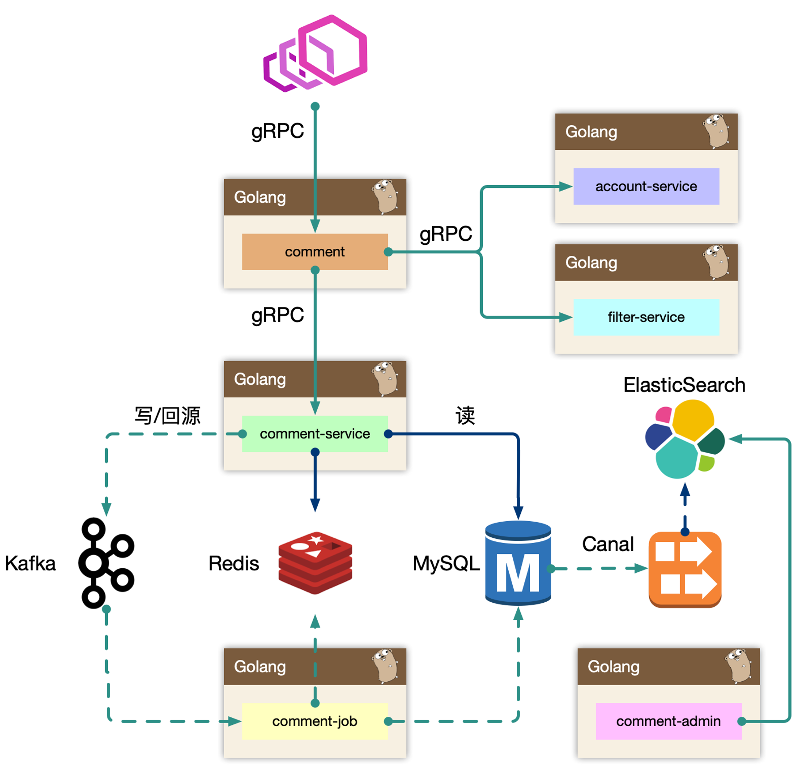
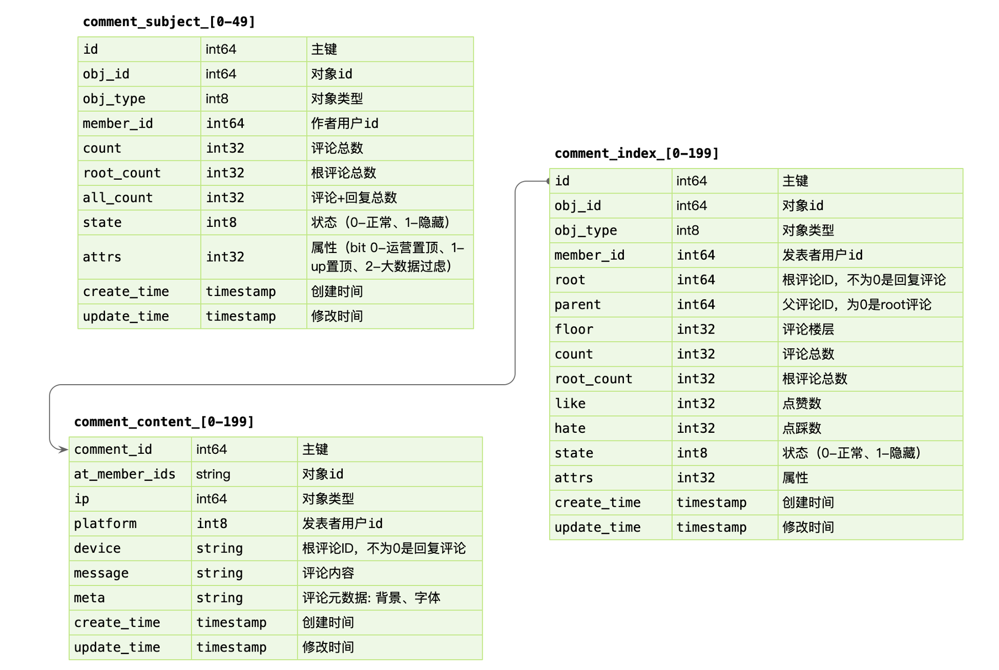
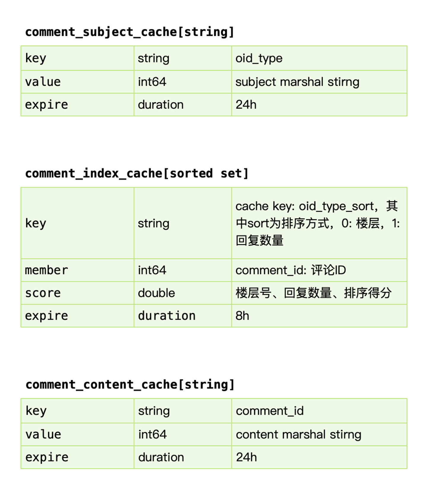
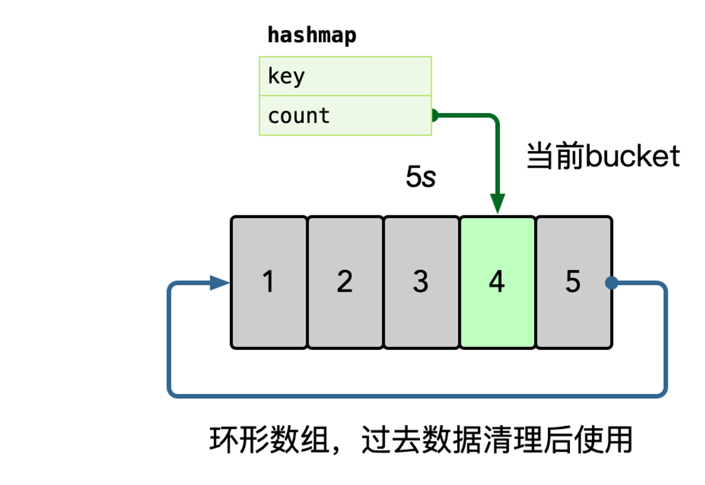

# 评论设计

## 概览

评论中台，可以接入各种业务形态。

- 发布评论: 支持回复楼层、楼中楼
- 读取评论: 按照时间、热度排序
- 删除评论: 用户删除、作者删除
- 管理评论: 作者置顶、后台运营管理（搜索、删除、审核等）

要考虑热点的情况，如明星结婚/出轨等热点事件。

## 设计分析

Cache-Aside 模式，先读取缓存，再读取存储。

缓存和数据 交由 comment-job 去 build （由 Kafka 去抗热点的写压力 ）

### 存储分析

#### 数据写入

事务更新 comment_subject，comment_index，comment_content 三张表，其中 content 属于非强制需要一致性考虑的。

可以先写入 content，之后事务更新其他表。即便 content 先成功，后续失败仅仅存在一条 ghost 数据。

#### 数据读取

基于 obj_id + obj_type 在 comment_index 表找到评论列表，WHERE root = 0 ORDER BY floor。

之后根据 comment_index 的 id 字段捞出 comment_content 的评论内容。对于二级的子楼层，WHERE parent/root IN (id...)。

#### 缓存

关键是 comment_index_cache，缓存增量加载 + lazy 加载 （如果访问的第3页，把第4页的评论预先加载进缓存）

### 可用性设计

#### 读穿透

对于热门的主题，如果存在缓存穿透的情况，会导致大量的同进程、跨进程的数据回源到存储层，可能会引起存储过载的情况，如何只交给同进程内，一个人去做加载存储?

使用归并回源的思路:
https://pkg.go.dev/golang.org/x/sync/singleflight

同进程只交给一个人去获取 mysql 数据，然后批量返回。

<b>同时这个 lease owner 投递一个 kafka 消息，做 index cache 的 recovery 操作。</b> 这样可以大大减少 mysql 的压力，以及大量透穿导致的密集写 kafka 的问题。

更进一步的，后续连续的请求，仍然可能会短时 cache miss，我们可以在进程内设置一个 short-lived flag，标记最近有一个人投递了 cache rebuild 的消息，直接 drop。

#### 热点读

流量热点是因为突然热门的主题，被高频次的访问，因为底层的 cache 设计，一般是按照主题 key 进行一致性 hash 来进行分片，但是热点 key 一定命中某一个节点，这时候 remote cache 可能会变为瓶颈，因此做 cache 的升级 local cache 是有必要的，我们一般使用单进程自适应发现热点的思路，附加一个短时的 ttl local cache，可以在进程内吞掉大量的读请求。

在内存中使用 hashmap 统计每个 key 的访问频次，这里可以使用滑动窗口统计，即每个窗口中，维护一个 hashmap，之后统计所有未过去的 bucket，汇总所有 key 的数据。

之后使用小堆计算 TopK 的数据，自动进行热点识别。

也可以其他缓存方式 LFU 这种

