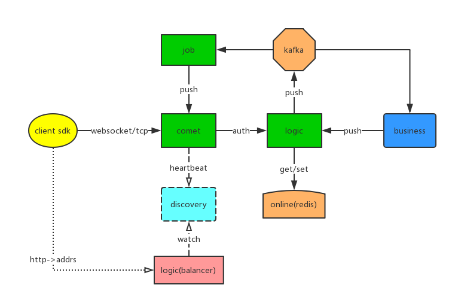

# go im 

## 概览

go im 项目实现了<b> 在线通讯 </b>（沟通的双方都在线），离线的部分需要自行设计实现。

下游依赖有 `Redis` 和 `Kafka`

名词解释

|   / | 名词解释 |
|  ----  | ----  |
| roomId | 房间id，当做群聊，直播间这种 |
| mId |  memberId 用户Id |
| channel | 用户与comet的链接被抽象成了channel （可能是tcp，websocket链接）|
| room | 群聊，被bucket所管理 |
| bucket | 对一部分 channel 和 room 进行管理。  每个member 只会在一个bucket中，一个room的信息会分布在多个comet节点的多个bucket中。 这么做的目的是锁拆分。|

实现上，靠三部分

comet：长链接层，用户直连的是comet节点。

logic：逻辑处理层，接受用户传来的消息，通过 job 进行削峰，发给comet层的对应链接具体的消息。

job：接收logic下发的消息（Message），然后分发给对应的comet节点。

## 设计分析

### comet

- 和 logic 交互的rpc
    - Connect / DisConnect / Heartbeat
    - RenewOnline {serverId, roomCount}
    - Receive {mId，opBody}
- 对外提供的rpc        
    - PushMsg {channelKey, op, body}
    - Broadcast 广播全服
    - BroadcastRoom  直播间广播
    - Rooms  活跃直播间

### logic

- 消息使用
    - PushMsg，分片key为私聊memberId所在的server
    - BroadcastRoomMsg，分片key为room
    - BroadcastMsg，分片key为 广播类型 op
- http接口
    - PushMids 私聊
    - PushRoom 群聊
    - PushAll 全员广播

### job

开固定数量的goroutine去处理

- 消费全员广播消息
    - broadcast(pushMsg.Operation, pushMsg.Msg, pushMsg.Speed)
- 消费私聊消息 
    - pushKeys(pushMsg.Operation, pushMsg.Server, pushMsg.Keys, pushMsg.Msg)
- 消费群聊消息
    - getRoom(pushMsg.Room).Push(pushMsg.Operation, pushMsg.Msg)

## 疑问

### 1. 广播全员、群组消息的话，是发送到单个partition，还是多个partition。

    - 每个job节点通过注册中心获取了全量的 comet 节点
    - so 发送到单个partition，交由job节点同步调用所有的 comet 节点
