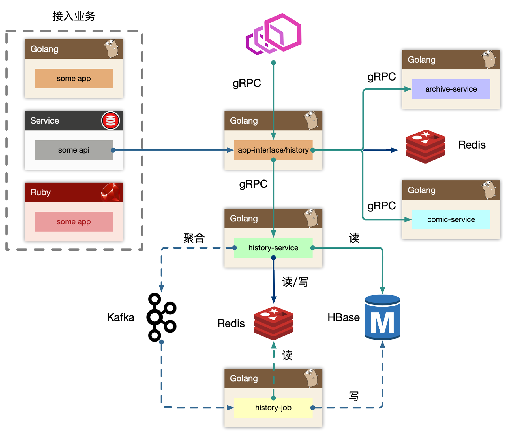
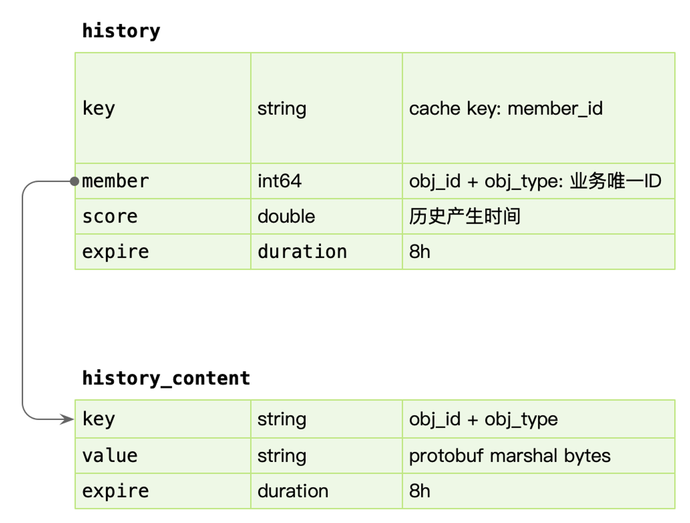
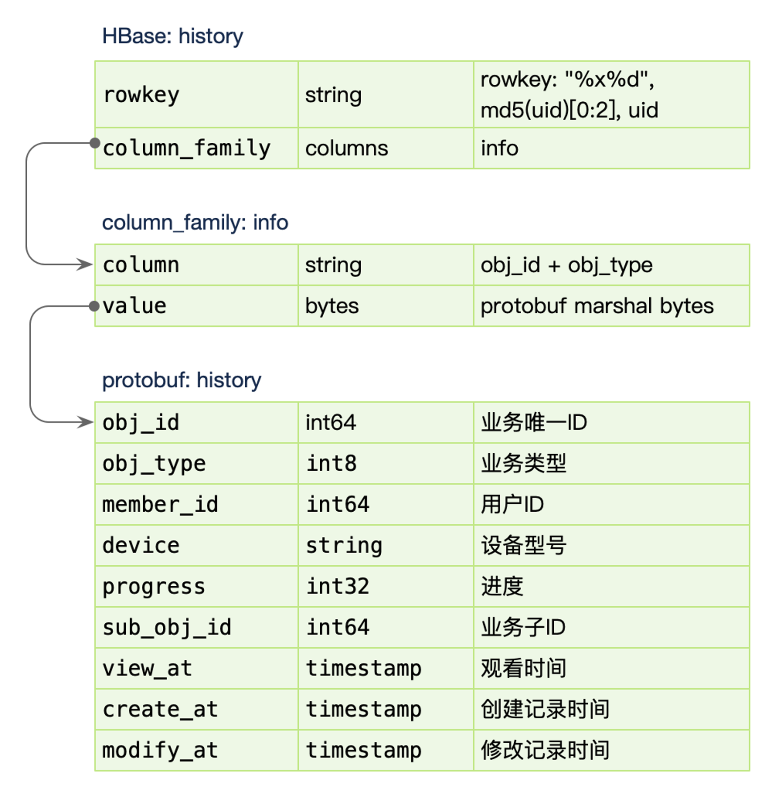

# 视频播放进度同步设计

## 概览

功能概述：

1. 视频播放进度同步：假想作为b站的用户，用手机登录b站刷视频，接着切换到平板上，能同步读取到视频的最新进度。
2. 提供历史视频观看的时间线，支持该用户按照时间倒序查看所播放过的视频。
    - https://www.bilibili.com/account/history

假想b站日活跃用户为 50w，每分钟大概10w个用户访问不同的视频，平均上报视频进度为5s一次。这是多么密集的写操作啊，如果直接更新数据库的话，势必会打挂DB。

所以该场景为 **写多读多** 的场景，为了高可用的设计，可以接受**丢失小部分数据**。

按照毛老师的讲解，依赖的中间件为 `Kafka`, `Redis`, `HBase`

## 设计分析

分场景分析

### 1. 视频播放进度同步

由于用户多，导致的读/写请求非常多，db很难抗住。所以使用了Redis来作为该场景的主要读写中间件。

针对写场景

1. 用户发起进度同步（如A视频，进度从5%推进到15%）
2. 更新Redis缓存信息
    - 将 `timestamp, {itemId, itemType}` 追加到 最近访问记录 `key(uid)` （采用sorted set结构）
    - 将 `key(uid, itemId, itemType)` 更新 Redis 中的播放进度以及其他附加信息（详见下图）
     

3. 在 history-service 进行内存聚合，按照 `uid, List<{itemId,itemType}>` 去聚合
4. 将上面聚合的信息发送到Kafka中
5. Kafka 消费者 history-job 获取 uid 以及 `{itemId, itemType}`，实时读取 Redis 的值，将其写入到 HBase 中

针对读场景

1. 用户请求最新的进度
2. 按照 `key(uid, itemId, itemType)` 读取 Redis 播放进度

优化原则： **尽可能优化写入操作，将一批写请求尽可能聚合**。

由于同一个uid，其实短时间内访问的视频有限，因此聚合的效果并不是特别好

再封装一层 region，region的分配可以按照 uid % 100，将region发往kafka。

因此优化后的 Kafka 的单个存储结构 region 为 `List<{uid, List<itemId, itemType>}>`。

能保证有序么？

- uid % region 不会变，因此会送到 kafka的同一个 partition，也就保证了 uid 的消息是有序的。

### 2. 播放历史设计

针对读场景

1. 用户请求播放历史
2. 按照 key(uid) 去获取 redis 里的拉链信息。（拉链信息保存一天的，Redis集群的内存 和 缓存命中率的trade off）
3. 拉链信息找不到，从 HBase 获取数据。（由于该操作并不频繁，因此无需将HBase的数据回刷 到 Redis）

### 3. 用户第一次登录缓存如何设计

经常有当月第一次登录，有xxx奖励的活动。

如果判定当月第一次登录呢？简单的想

1. 用户首次登录，setnx key(uid)，设置成功，就标识当天是第一次登录，并写入缓存 key(uid, date)
2. 后续请求，通通读缓存 key(uid, date) 判断是否第一次登录，并做逐级本地缓存

优化思路，数据下沉到上游，减少最上游的无效请求是最有效的。

1. 写缓存key(uid, date) 成功后，将该数据发往客户端，并写入cookie
2. 用户读取到cookie后，后续将该 flag 通过 http header 的方式透传

可这样存在安全问题... 万一被黑灰产给控制了，薅了羊毛..

## 引用

- https://blog.csdn.net/jiaomeng/article/details/1495500
- https://blog.csdn.net/yizishou/article/details/78342499
