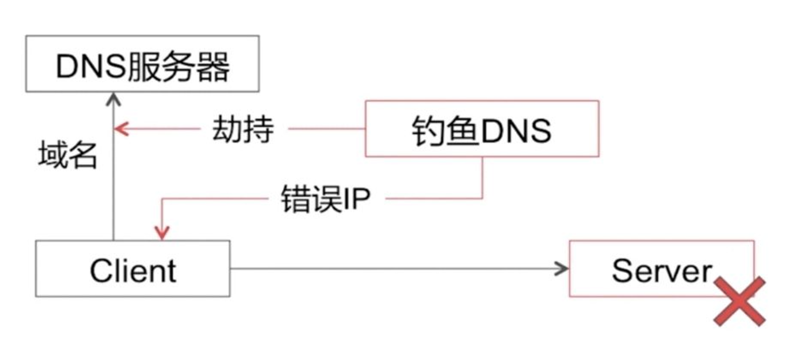
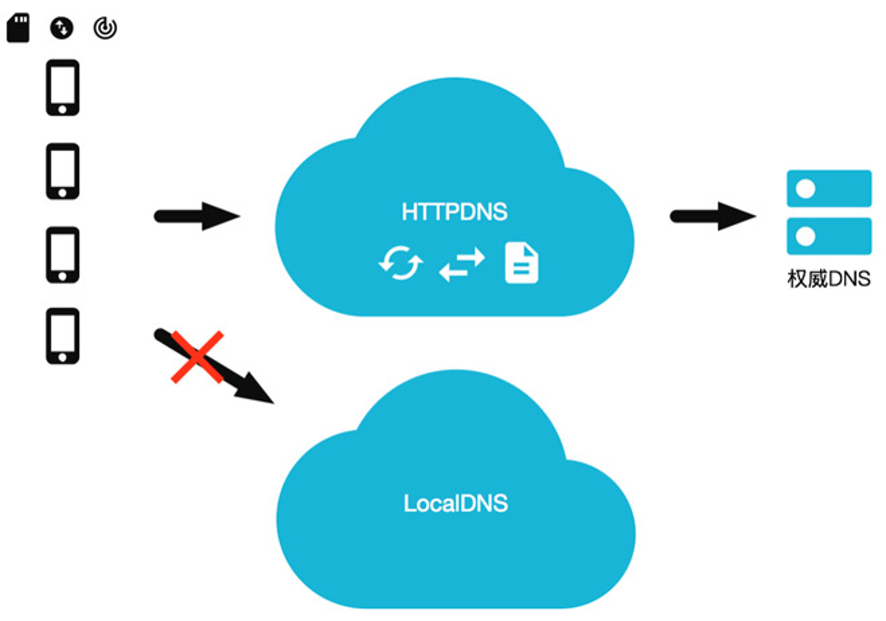
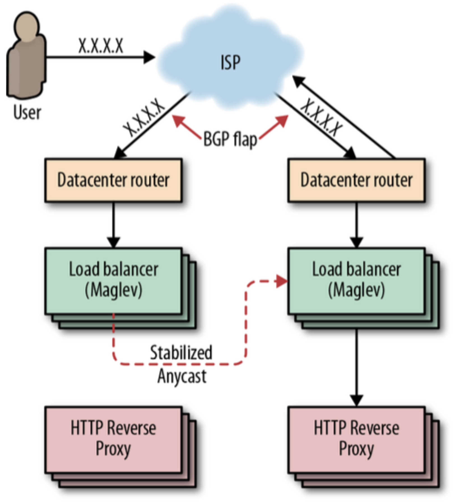
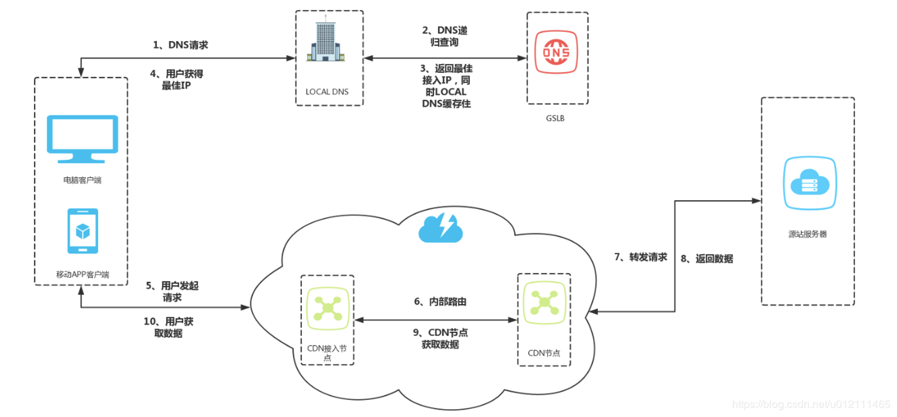
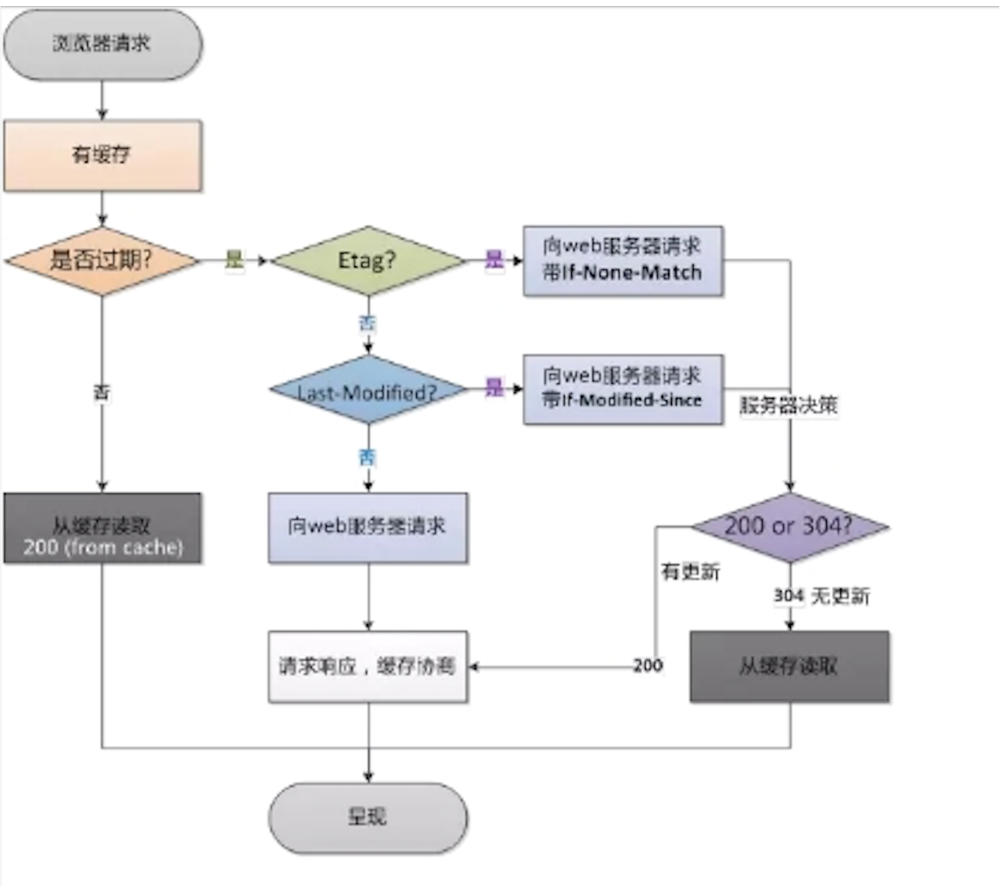
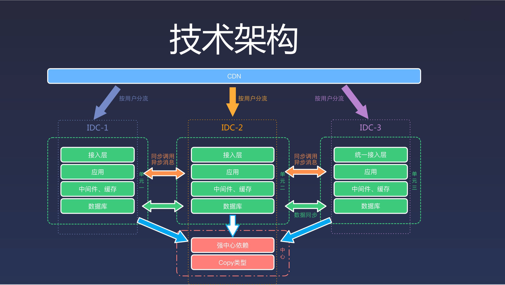

# DNS & CDN & 异地多活

## 概念

- DNS
- CDN
- 多活架构

## 设计

### DNS

DNS（Domain Name System，域名系统），DNS 服务用于在网络请求时，将域名转为 IP 地址。能够使用户更方便的访问互联网，而不用去记住能够被机器直接读取的 IP 数串。

传统的基于 UDP 协议的公共 DNS 服务极易发生 DNS 劫持，从而造成安全问题。

HTTPDNS 利用 HTTP 协议与 DNS 服务器交互，代替了传统的基于 UDP 协议的 DNS 交互，绕开了运营商的 Local DNS，有效防止了域名劫持，提高域名解析效率。

另外，由于 DNS 服务器端获取的是真实客户端 IP 而非 Local DNS 的 IP，能够精确定位客户端地理位置、运营商信息，从而有效改进调度精确性。

如果只有一个 VIP，即可以增加 DNS 记录的 TTL，减少解析的延迟。

<b>Anycast</b> 可以使用一个 IP，将数据路由到最近的一组服务器，通过 BGP 宣告这个 IP，但是这存在两个问题：
- 如果某个节点承载过多的用户会过载
- BGP 路由计算可能会导致连接重置

### CDN

#### 功能

缓存代理

- 通过智能 DNS 的筛选，用户的请求被透明地指向离他最近的省内骨干节点，最大限度的缩短用户信息的传输距离。

路由加速

- 利用接入节点和中继节点或者多线节点互联互通。

安全保护

- 无论面对是渗透还是 DDoS攻击，攻击的目标大都会被指向到了 CDN，进而保护了用户源站。

节省成本

- CDN 节点机房只需要在当地运营商的单线机房，或者带宽相对便宜的城市，采购成本低。

#### 方式

内容路由

- DNS系统、应用层重定向，传输层重定向。

内容分发

- PUSH：主动分发，内容管理系统发起，将内容从源分发到 CDN 的 Cache 节点。
- PULL：被动分发技术，用户请求驱动，用户请求内容中 miss，从源中或者其他 CDN 节点中实时获取内容。

内容存储

- 随机读、顺序写、小文件的分布式存储。

内容管理

- 提高内容服务的效率，提高 CDN 的缓存利用率。

#### 一致性

Expires

- 即在 HTTP 头中指明具体失效的时间(HTTP/1.0)

Cache Control

- max-age 在 HTTP 头中按秒指定失效的时间，优先级高于Expires(HTTP/1.1)

Last-Modified / If-Modified-Since

- 文件最后一次修改的时间（精度是秒，HTTP/1.0），需要 Cache-Control 过期。
Etag
- 当前资源在服务器的唯一标识（生成规则由服务器决定）优先级高于 Last-Modified

### 多活架构

通俗讲，就是多机房承载所有用户的流量

多活不是整个体系业务的多活，而是分成不同维度，不同重要性的多活，比如我们业务观看体验为主（淘宝以交易单元，买家为维度），那么第一大前提就是浏览、观看上的多活。我们将资源分为三类：
- Global 资源：多个 Zone（机房）共享访问的资源，每个 Zone 访问本 Zone 的资源，但是 Global 层面来说是单写 Core Zone（核心机房），即：单写+多读、利用数据复制（写Zone 单向）实现最终一致性方案实现；
- Multi Zone 资源：多个 Zone 分片部署，每个 Zone 拥有部分的 Shard 数据，比如我们按照用户维度拆分，用户 A 可能在 ZoneA，用户 B 可能在 ZoneB，即：多写+多读、利用数据复制（写 Zone 双向复制）方案实现；
- Single Zone 资源：单机房部署业务；

核心主要围绕：PC/APP 首页可观看、视频详情页可打开、账号可登陆、鉴权来开展

- 对于观看类业务，可能采用 Global 资源策略
- 对于社区类（评论、弹幕）可能会采用 Multi Zone 的策略

#### 蚂蚁多活

整体架构包含RZone、GZone和CZone。

其中GZone部署的是无法拆分的数据和业务，GZone的数据和业务被RZone依赖，GZone全局只部署一份，而RZone部署的是可拆分的业务和对应的数据。每个RZone内的数据分片如图所示有五副本，实现三地五中心部署，每个分片内只有一个可写入的主副本，其余副本按照Paxos协议做数据强一致。

每个RZone内实现业务单元封闭，独立完成自己的所有业务。而CZone的出现是因为GZone全局只有一份，不同城市的RZone可能依赖GZone服务和数据的时候需要远距离调用，延迟比较大，所以在每个城市部署一个CZone作为GZone的只读副本，为本城市的RZone提供服务。

#### 饿了么多活

## 引用

饿了么

http://afghl.github.io/2018/02/11/distributed-system-multi-datacenter-1.html
https://zhuanlan.zhihu.com/p/32009822
https://zhuanlan.zhihu.com/p/32587960
https://zhuanlan.zhihu.com/p/33430869
https://zhuanlan.zhihu.com/p/34958596

OPPO

https://mp.weixin.qq.com/s/RQiurTi_pLkmIg_PSpZtvA
https://mp.weixin.qq.com/s/LCn71j3hgm5Ij5tHYe8uoA

Facebook

https://zhuanlan.zhihu.com/p/20827183

阿里

https://www.cnblogs.com/davidwang456/articles/8192860.html
https://mp.weixin.qq.com/s/ty5GltO9M648OXSWgLe_Sg
https://developer.aliyun.com/article/57715
https://toutiao.io/posts/y8qekd/preview
https://tech.antfin.com/community/articles/922

苏宁

https://mp.weixin.qq.com/s/WK8N4xFxCoUvSpXOwCVIXw
https://mp.weixin.qq.com/s/ooPLV039BAGBsiDZagWNHw
https://mp.weixin.qq.com/s/VPkQhJLl_ULwklP1sqF79g
https://mp.weixin.qq.com/s/ty5GltO9M648OXSWgLe_Sg
https://mp.weixin.qq.com/s/GdfYsuUajWP-OWo6lbmjVQ
https://developer.aliyun.com/article/57715
https://mp.weixin.qq.com/s/RQiurTi_pLkmIg_PSpZtvA
https://mp.weixin.qq.com/s/LCn71j3hgm5Ij5tHYe8uoA
http://afghl.github.io/2018/02/11/distributed-system-multi-datacenter-1.html
https://zhuanlan.zhihu.com/p/42150666
https://zhuanlan.zhihu.com/p/20827183
https://myslide.cn/slides/733
https://blog.csdn.net/u012422829/article/details/83718296
https://blog.csdn.net/u012422829/article/details/83932829
https://www.cnblogs.com/king0101/p/11908305.html
https://mp.weixin.qq.com/s/WK8N4xFxCoUvSpXOwCVIXw
https://mp.weixin.qq.com/s/jd9Os1OAyCXZ8rXw8ZIQmg
https://cloud.tencent.com/developer/article/1441455
https://mp.weixin.qq.com/s/RQiurTi_pLkmIg_PSpZtvA
https://help.aliyun.com/document_detail/72721.html
https://mp.weixin.qq.com/s/h_KWwzPzszrdGq5kcCudRA
https://www.cnblogs.com/davidwang456/articles/8192860.html
https://mp.weixin.qq.com/s/GdfYsuUajWP-OWo6lbmjVQ
https://www.cnblogs.com/king0101/p/11908305.html
https://zhuanlan.zhihu.com/p/42150666
https://help.aliyun.com/document_detail/72721.html
https://blog.csdn.net/u012422829/article/details/83718296
https://blog.csdn.net/u012422829/article/details/83932829
https://mp.weixin.qq.com/s/jd9Os1OAyCXZ8rXw8ZIQmg

https://mp.weixin.qq.com/s?__biz=MzI3MDA2OTE0Nw==&mid=2247483726&idx=1&sn=a086311f82f24ca704286dfde97d23f9&chksm=ead7fdbadda074ac90d5603ee005ffd60660e84cf0cf795981c4ce22ec622aaeeff101e1b66f&scene=21#wechat_redirect
https://cloud.tencent.com/developer/article/1042081?from=article.detail.1441455
