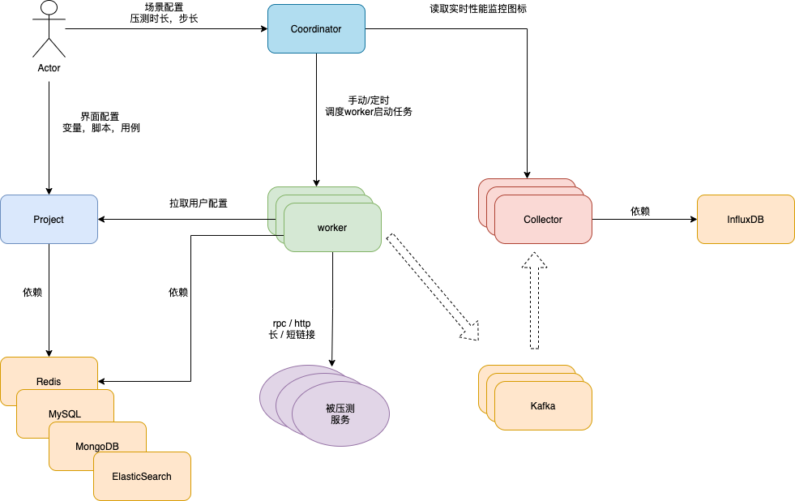
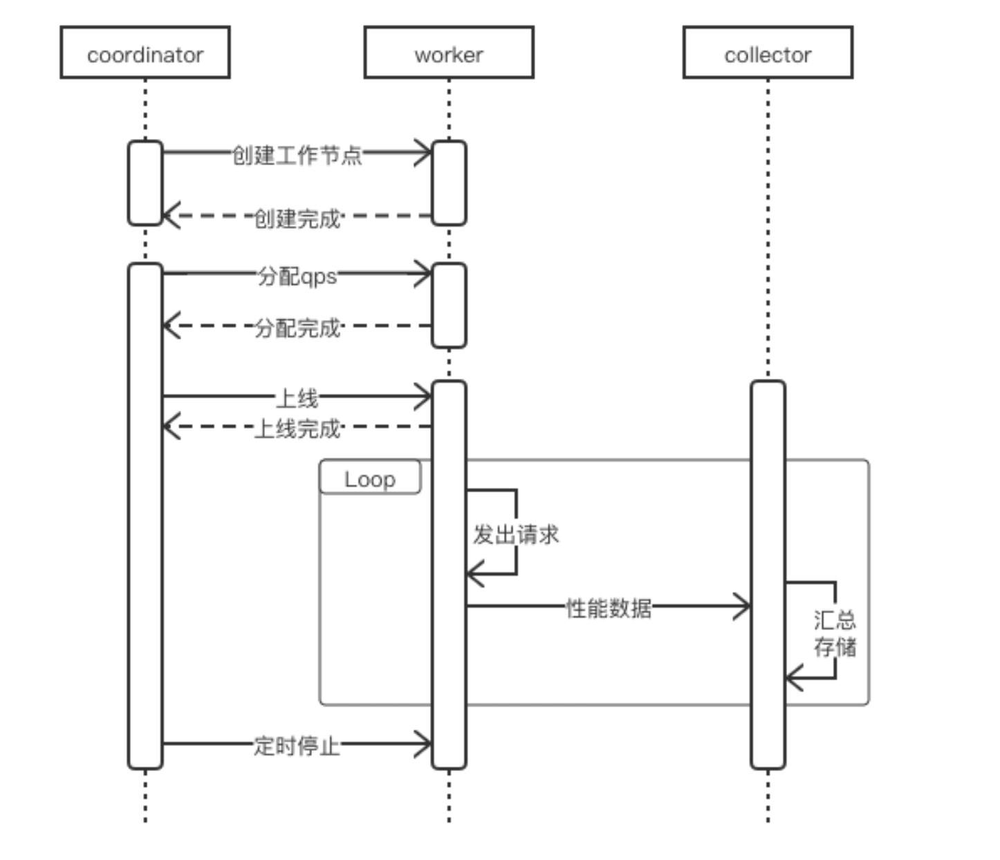
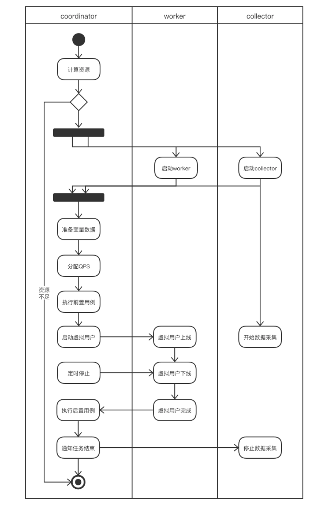
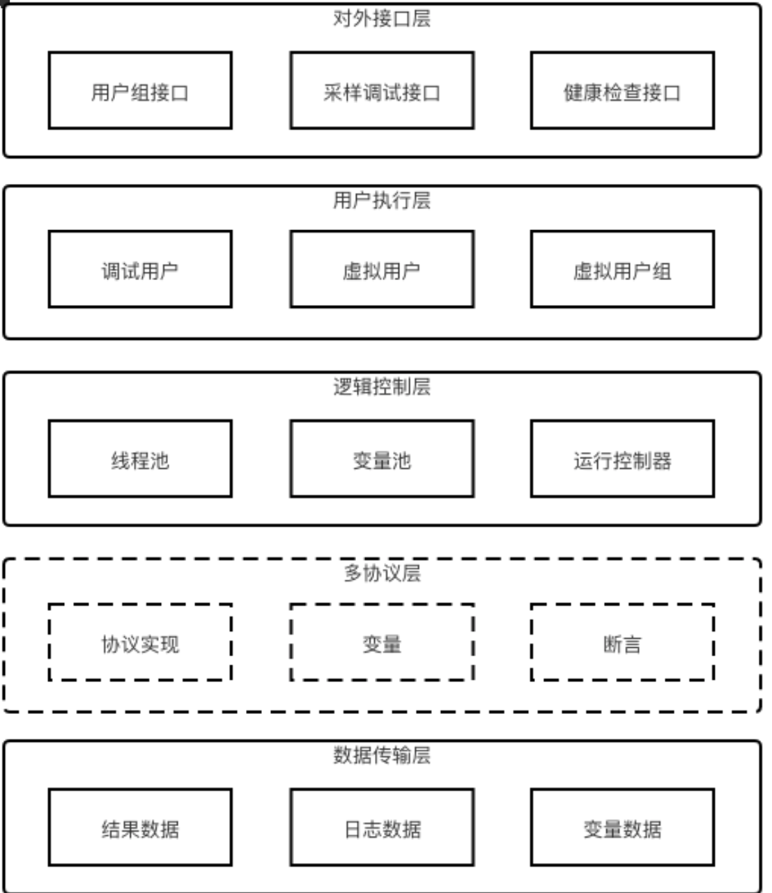
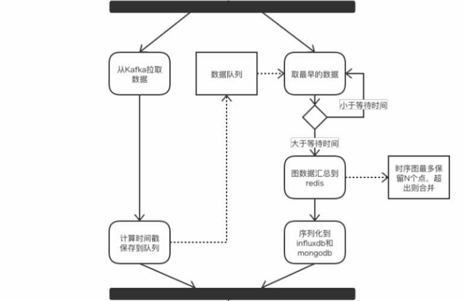

# 性能测试平台

## 概览

性能测试平台经历了两个大版本迭代

- sturnus，支撑公司各产品线的性能测试，降低使用门槛，提升测试效率。
- arcus，借助 k8s 能力，部署为工具，资源分配更合理。

压测平台，最核心的功能主要有：数据构造、任务调度、压测熔断、压测引擎、压测监控等。

|   / | 名词解释 |
|  ----  | ----  |
| coordinator | 调度者，加载性能场景数据，发起整个性能测试任务。 |
| worker | 压力引擎，支持 HTTP / SDK 协议 | 
| collector | 提供本次任务所有worker的数据汇总计算，生成曲线图数据并将详细数据存入mongodb和influxdb | 
| project | 管理用户的数据，包括变量，脚本，用例，场景 | 

依赖的中间件有 `Kafka`, `Redis`, `Mysql`, `MongoDB`, `ElasticSearch`





## 服务设计

### 时序图

整体的时序图




### Coordinator



#### 要解决的问题

1. 通过注册中心，获取到所有同任务组的workers的状态
    - 实时获取各个worker的qps，对新任务分配子任务到多个worker上（调度）
2. 通过 Quartz 进行定时任务的调度，依赖 MySQL 持久化定时任务。
3. 运行场景时，将worker需要的配置信息准备好，发往worker（减少worker的依赖，增加worker的稳定性）

#### 对外提供HTTP接口

- 运行场景、停止场景 startScene / stopScene
- 场景增加、减少 压力 increase / reduce
- 获取场景运行监控数据 sceneSummary （通过collector来获取数据）

### Worker



#### 要解决的问题

1. 构造数据，对 request header / body 进行替换。
    - 依赖 Redis 生成全局、持久变量。(用户组间共享使用)
2. 通过 BIO 的方式，调用http / rpc client 发出压力 （连接池优化）
3. 将性能测试过程数据发往collector，由collector进行汇总计算
4. 提供稳定QPS 和 非稳定QPS

#### 对外提供接口

- 当前worker剩余QPS qpsRemain
- 单任务运行，暂停，状态，start / stop / status 
    - 任务生命周期管理
    - /pre/start, /pre/stop,/pre/status
    - /post/start, /post/stop, /post/status
- 服务调试，状态快照  debug
- 健康检查  liveness，readness


### 稳定/非稳定QPS

非稳定QPS 

QPS与响应时间的波动相反，即pct99越高，QPS越低，pct99 越低，QPS越高

```go
for req in reqs {
    resp, err := client.Send(req) // block until resp received
}
```


稳定QPS，固定时间段发出固定的请求，比如一秒只发1000的请求。

```go
for req in reqs {
    go send(req)
}

func send(req) {
    limiter.Acquire() // 获取令牌桶的令牌（比如1s只发1000请求，发到1001个请求，当前时刻就获取不到）
    resp, err := client.Send(req) // block until resp received
}
```

### Collector



#### 要解决的问题

- 接收worker发来的数据，进行汇总，持久化到 influxdb 和 mongoDB 
    - 数据量太大的情况下 influxdb 算出的数据快照存 mongoDB 一份
- 将全量的性能数据全部落到 influxdb，会扛不住。
    - 本地merge性能数据，多节点数据通过redis进行merge，最终将每秒的数据落到 influxdb

#### 对外接口

- 获取qps，qps
- 时延数据，latency
- 虚拟用户数据，vuser

#### 数据统计方式

- QPS计算规则
    * 统计每秒返回的响应数
- Latency计算规则
    * 汇总1秒内所有的Latency数据，使用桶排序算法分别计算最大，最小，均值和百分比值。
- 时序图数据点合并
    * 当图中的数据点超过一定数量时，需要缩减数据点的规模，防止数据膨胀，影响前后端性能。与相邻的点进行合并，同时加大新增点的时间间隔，随着时间的推移曲线会变的平滑，但依然能反应出整体变化趋势。


合并（merge）方式 `avg_latency * size + this_latency / (size + 1)`


## 疑问


### 1. collector如何计算pct99？

桶排序

比如计算pct99，伪代码如下

```go
sortedMap := desendMap<int, int>  
// key为lantency，比如99，表示0.099秒
// val为当前lantency 出现次数
// map是以key为降序的，eg. {1000:1, 999:2, 100:3}

pct := 99  // 例如要计算 pct99
func calc(sortedMap, pct) int {
    pos = (mp.count() * (100 - 99)) / 100   // => 获取 1% 的位置
    index := 0
    for k, v in sortedMap {
        index += v
        if index == pos {
            return k
        }
    }
    return -1
}
```

### 2. 性能监控 和  被压服务的QPS对不上，存在丢数据

1. 生产者，worker将性能过程数据放入到本地队列中，后台启动守护线程去把本地队列里数据提交kafka中（由于active过高，线程上下文切换较慢，导致发送慢）
2. 由于kafka还被用来做日志采集，在请求出错时，大量错误堆栈进kafka会导致kafka压力太大 （优化分离kafka日志统计 和 计算功能）
3. 消费者，collector消费堆积
    - 可能本地merge计算数据较多，导致部分慢节点没算完，数据已经merge进 influxdb 了
    - 网络抖动，collector接收到消息时，数据也可能已经被merge到 influxdb 了

### 3. QPS调度算法

理想情况

1. 每台机器通过 网卡IO、磁盘使用率、内存、cpu使用率、线程池当前活跃线程数、计算当前可支持的QPS （抽象成一个一维指标）
2. coordinator 获取到所有 workers 的 剩余QPS，`sort(workers, func(i, j) {return worker[i].Qps > worker[j].Qps})`
3. 假设需要qps `N`, 寻找位置`i`，满足`(i * qps[i]) >= N`，然后 `{0,1,2..i}`的worker各自扣除 `qps[i]`


### 4. worker 构造数据对 Redis 压力很大

#### 4.1 自增变量

最初方案

- 比如自增变量，每次调用redis `incr key`，在高qps的情况下，redis经常容易出现 Timeout

优化方案 <b>batch io操作</b>

- 采用batch操作，每次调用redis `incr key 100`。具体要加多少，依赖过去的qps，和被压服务的负载。

#### 4.2 持久变量

场景：压测 kv 服务，会有worker执行存图片，将图片的key写入到redis中，另外有worker执行根据key读取图片内容，判断能否读出。

最初方案

- 将图片的key 存为 list，每次写入，为`append key`, 每次读取，为`pop key`。

很容易出现大key，导致 Timeout

优化方案 <b>建立二级索引</b>

1. 一级索引 `{timestamp, batch_keys}` 每秒存一个string，这个 string 为二级索引的key
2. 二级索引 `batch_keys` -> `{obj_1, obj_2, ... obj_n }`，取到 obj_xx，访问kv服务能拿到图片的内容

#### 4.3 CSV 变量

最初方案

- 将csv文件内容放到redis中，避免加载csv太耗时，但是读取csv文件内容 也很容易timeout

优化方案 

- 同自增变量，增加了 `dataPool`，采用生产者-消费者模型，提前预加载 csv部分行内容，

理想方案

- 所有worker共享一个分布式存储，场景初始化中，本地缓存该csv文件，redis只维护计数器。

