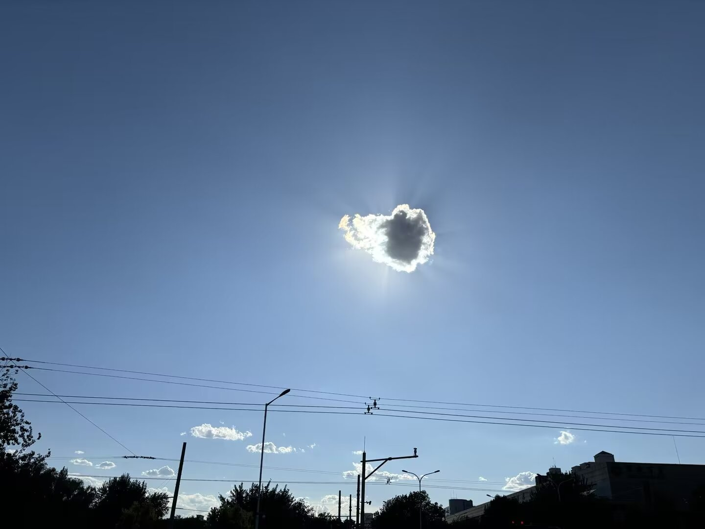

# 骑行

## 2024.06

### 大饼第一辆山地车

鉴于同事送的自行车刹车不太行了，不能绕能，观望了几天了后，于2024.06.01在咸鱼花1900上淘了辆 `Giant Atx 830`，是从北邮的毕业生手里淘的，车子看起来挺新，最开始不是很喜欢配色，后面渐渐喜欢上了

### 三环骑行

06.01 第一次提完爱车骑行三环，骑到西三环中路已经累的不行了，到北三环的时候，膝盖已经巨疼了（搜了小红书才知道，起步用了高的档位，起步应该用小档位

06.15 第二次骑行三环，明显比第一次好多了

### 首钢大桥

6.30 小红书有位爬山/骑车的女孩计划骑车去首钢，问我去不问，我社恐啊，就没回复去，但是周六的时候没事干，就自己一个人去了趟首钢大桥，南五环那里有点儿像老家的感觉，毕竟是个钢厂附近

## 2024.07

### 四环骑行

周五晚上看到小红书里骑行四环的图，大饼按耐不住向往的心，7.6开始了一个人单飞四环的旅程，从上午10点骑到下午3点，胳膊都晒黑红了，但是真的很爽！

## 2024.08

### 积跬步，至千里

千里成就达成！

八月每个周末都会骑行下四环，速度从最开始20提升到23了，23的速度还是挺伤膝盖的。

过程中有2个周末骑行都有雨，躲在桥下避了很久的雨。

