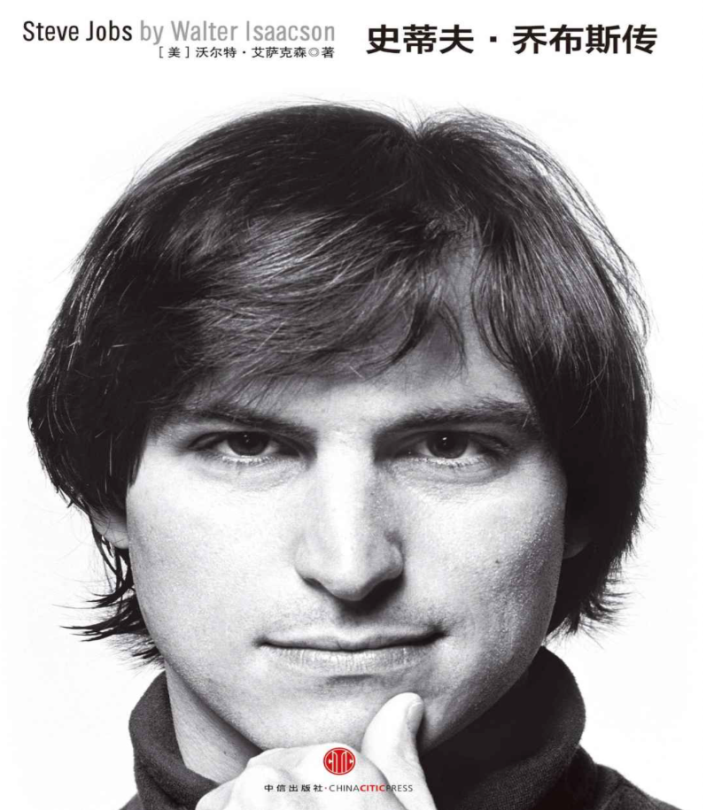

# 乔布斯传

## 事迹

苹果公司本身，乔布斯认为这是他最伟大的创作。在这里，想象力被培育、应用和执行的方式极具创造力，这使苹果成为全球最有价值的公司

- Apple II：采用沃兹尼亚克的电路板并把它变成第一台不再仅供业余爱好者使用的个人计算机。
- Mac：引发了家用电脑革命并普及了图形用户界面。
- 皮克斯：《玩具总动员》和动画大片，开创了数字影像的奇迹。
- 苹果零售店：重新塑造了商店在品牌定义中的角色。
- iPod：改变了我们消费音乐的方式。
- iTunes商店：让音乐产业重获新生。
- iPhone：把移动电话变成了音乐、照片、视频、邮件和网络设备。
- 应用商店（App Store）：生成新的内容创造产业。
- iPad：推出平板计算技术，为数字报纸、杂志、书籍和视频提供了平台。
- iCloud：使计算机不再担任管理我们内容的中心角色，并让我们的电子设备无缝同步。

## 思考与实践

### 专注过程

- 过程就是奖励（The journey is the reward.）
- 直到上市，产品才能算是完工。（It’s not done until it ships.）
- 真正专注于那些对我们来说确实重要和有意义的少数项目

### 追求简单

- 乔布斯就以追求简洁为目标。追求简洁不是要忽视复杂性，而是要化繁为简。“要把一件东西变得简单，还要真正地认识到潜在的挑战，并找出漂亮的解决方案。”他说，“这需要付出很多努力。”

### 孤注一掷

- “你已是一无所有，没理由不追随内心。”
- “孤注一掷”是他最喜欢的词之一，他也愿意把这个词用在他的新构想上。互联网泡沫的破裂导致其他科技公司减少了对新产品的投入。他回忆说：“当所有人都在削减开支的时候，我们反而决定要在情况低迷时继续投资。我们主要会投资在研发上面，发明出一些新东西，一旦低潮期过去，我们就已经领先于竞争对手了。”这种投入造就了苹果公司持续创新最辉煌的十年。”

### 关于爱情

- “20年前我们相知不多。我们跟着感觉走，你让我着迷得飞上了天。当我们在阿瓦尼举行婚礼时天在下雪。很多年过去了，有了孩子们，有美好的时候，有艰难的时候，但从来没有过糟糕的时候。我们的爱和尊敬经历了时间的考验而且与日俱增。我们一起经历了那么多，现在我们回到20年前开始的地方——老了，也更有智慧了——我们的脸上和心上都有了皱纹。我们现在了解了很多生活的欢乐、痛苦、秘密和奇迹，我们依然在一起。我感觉依然像在天上飘着，双脚从未落回地面。”

### 特立独行

- “致疯狂的人。他们特立独行。他们桀骜不驯。他们惹是生非。他们格格不入。他们用与众不同的眼光看待事物。他们不喜欢墨守成规。他们也不愿安于现状。你可以认同他们，反对他们，颂扬或是诋毁他们。但唯独不能漠视他们。因为他们改变了寻常事物。他们推动人类向前迈进。或许他们是别人眼里的疯子，但他们却是我们眼中的天才。因为只有那些疯狂到以为自己能够改变世界的人，才能真正改变世界。”