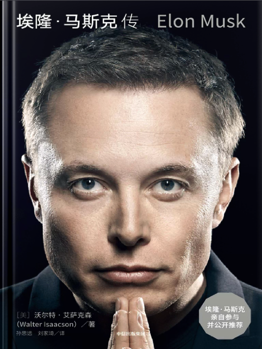

# 马斯克传

## 事迹

- Zip2：提供了在线地图服务，赚得了第一桶金
- PayPal(X.com)：通过互联网实现实时资金流转
- SpaceX：为降低太空旅行成本，实现人类多星球生存
- Tesla：加速世界向可持续能源的转变
- Boring Company：专注于解决城市交通拥堵
- Neuralink：脑机接口技术，实现人机共生
- X(Twitter)：用户的言论自由（分发自由）
- xAI：通过前沿的 AI 技术推动人类对宇宙的理解

## 思考与实践

### 第一性原理

核心：从基本物理定律出发，剥离所有假设和惯例，重新构建解决方案。

例如，马斯克在 SpaceX 中通过分析火箭材料成本，发现传统供应商的定价远超原材料价值，从而决定自主生产

### 五步工作法

质疑需求 -> 删除冗余 -> 简化流程 -> 加速迭代 -> 自动化

### 行动实践

- 快速试错与迭代
- 垂直整合与闭环生态 
- 时间管理与专注力
- 危机处理与抗压能力

## 价值观

- 长期主义与使命驱动
- 极简与聚焦