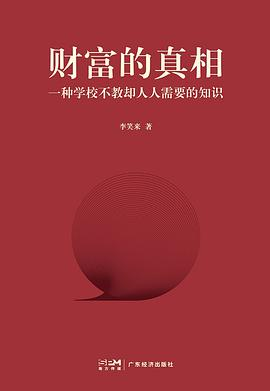

# 财富的真相

> 稻盛和夫说：唯有读书和赚钱，是一个最好的修行，前者使人不惑，后者使人不屈

<!--  -->

《财富的真相》所有的内容，都基于以下几个事实

- 财富来自生产，也出自自身
- 时间是终极的生产资料
- 钱是万物的存储
- 钱是最灵活的生产资料

用一句话讲：在这个越来越好的时代里，只要把时间花到自学、生产、销售、投资中就能赚到钱，然后还有很多的事情值得做

## 书籍摘抄

- 钱有两个用途：1. 消费 2. 积累->资金->投资
- 投资的本质是放贷收息，金融的核心也是利息
- 投机者参与的是“零和游戏”，赚到的钱是别人亏掉的钱；投资者赚到的是“发展的结果”
- 有机会购买全世界最佳企业的股票，这种投资太美好了，仅“它肯定能跑赢我作为普通人的生产效率”，一个理由足矣
- 无论如何，明天会更好。就算偶然不好，恢复得也越来越快。
- 持续学习、长期践行、专注内部
- 如何做到做更多的事？做个更有用的人
    * 对自己有用，懂得从自己的时间里挖掘一切，无论是物质财富还是精神财富
    * 对家人有用，能养家糊口，能让家人安心快乐，能教子女正常成长
    * 还有余力，对朋友有用
    * 还有余力，对社群乃至社会有用
- 社交网络前所未有地展示并放大了真实的贫富差距
- 经济危机是发展过程中必然经历的阶段，令人高兴的是，从历史趋势来看，经济危机的持续时长正在不断地缩短，因为越来越高的生产效率正在发挥越来越强的经济调节作用

