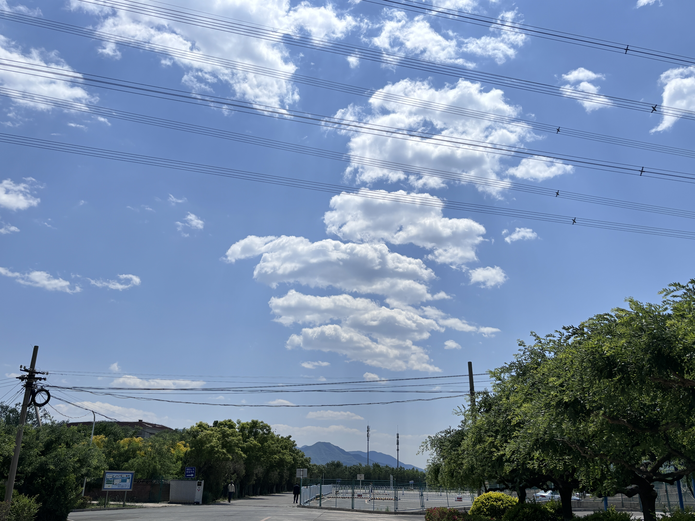
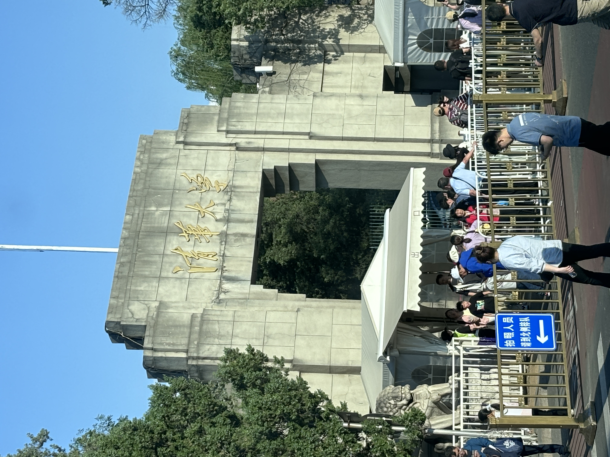

# 考驾照之旅

## 时间线

| 时间 | 事件 |
| -- | -- |  
| 2025.02.09 | 海淀驾校app上报名 | 
| 2025.02.15 | 1. 学院路海淀驾校报名中心体检   2. 科一12学时刷完 + 初次完成1600道题|
| 2025.02.22 | 科目一考试通过 | 
| 2025.03.17 | 科目二考试通过 | 
| 2025.05.17 | 科目三和科目四通过 |

## 科目一

重点先记忆扣分，超载/重，罚款，标志

**扣分题**

- 扣1分场景
    1. 违反禁令标志、禁止标线
    2. 不按规定会车
    3. 普通道路不按规定掉头、倒车
    4. 不按规定使用灯光
    5. 不按规定年检
    6. 不系安全带
- 扣3分场景
    1. 不让校车，不让行人，超车不让行
    2. 普通道路逆向行驶
    3. 高速低于规定或不按规定行驶
    4. 遇前方停车排队、借道超车、穿插等候车辆（**加塞**）
    5. 开车打电话
    6. 发生故障未按规定使用危险报警闪光灯和警告标志
    7. 不按规定安装号牌
- 扣6分场景
    1. **违反信号灯**、违法**占用应急车道**
    2. 致人轻微伤或财产损失的事故后**逃逸**
    3. 驾驶证被**暂扣**期间驾驶机动车
- 扣9分场景
    1. 污损、遮挡、未悬挂号牌
    2. 驾驶与准驾不符
    3. 高速公路违法停车
- 扣12分场景
    1. 饮酒、醉酒驾驶机动车
    2. 伪造号牌、行驶证、驾驶证
    3. 高速公路倒车、逆行、掉头 （高速玩命）
    4. 买卖分数谋取利益
    5. 致人轻伤以上或死亡的事故后逃逸

**超载**

- 未达30%：扣1分
- 30% - 50%: 扣3分
- 50%以上：扣6分

**超员**

特殊：校客旅超员，未达20%扣6分，超过20%扣12分（20%决生死）
普通车超员

| 超员 | 七座以上 | 七座以下 |
| --  | --      | --      |
| 20%-50% | 6 | 3 |
| 50%-100% | 9 | 6 | 
| 100%以上 | 12 | 12 | 

**超速**

| 普通小车 | 20%-50% | 50%以上 |
| -- | -- | -- |
| 普通路 | 3 | 6 |
| 高速路 | 6 | 12 |

特殊：校客危车

| 高速未达20% | 高速20%以上 | 普通路 10%-20% | 普通路20%-50% |  普通路50%以上 | 
| -- | -- | -- | -- | -- |
| 6 | 12 | 1 | 6 | 9 |

**罚款**

- 200元以下
    1. 转让后，30日内未办理转让登记
    2. 改变车身颜色、车身广告
    3. 未按规定进行安全技术检验
- 20-200元
    1. 补领新证用原证
    2. 实习期单独上高速
    3. 驾驶人，信息变更30天内未备案
    4. 让撤不撤造成拥堵，罚款200
- 200-500元
    1. 逾期不审验仍驾驶
    2. 身体不适仍驾驶
    3. 隐瞒、欺骗补领驾驶证
    4. 公路客运超员未达20%
- 200-2000元
    - 拼装报废超50，20-2000处吊销（口诀）
    1. 超速50%
    2. 驾驶拼装、报废车
    3. 把车交给无证人开
    4. 非法安装报警器
- 500以下
    1. 虚假材料，1年不得申领
- 2000以下
    1. 考试贿赂、舞弊，2000

**审验**

1. 弄虚作假，1000以下
2. 代替他人，2000以下
3. 组织他人，3倍以下，最高2万

- 口诀：假审1 代审2 组3倍，高2万

**代记分**

- 3倍以下罚款，最多不超过5万
    1. 请他人代为计分并支付经济利益的
    2. 代替接受积分牟取经济利益的
- 5倍以下罚款，最多不超过10万
    1. 组织实时前两款行为

- 口诀：代计分 3倍5,5倍10

**酒驾**

- 饮酒：暂扣驾驶证6个月，扣12分，罚款1000-2000
- 再饮酒：吊销，拘留10日以下，罚款1000-2000
- 醉酒：约束至酒醒，吊销5年

**吊销申领**

1. 虚假材料1年
2. 一般情形吊销后2年
3. 非法取得，撤销驾照 3年
4. 醉酒驾车 5年
5. 肇事逃逸，构成犯罪的，终生

假1吊2撤3醉5逃终生

## 科目二

- 坡起: 两次机器咯噔的声音可以松手刹
- 直角转弯: 下方门把手中间左打满
- S弯: 第一个棱出去，左打一圈，第二个棱接触线后回正，第三个棱接触后，右打一圈
- 倒车入库: 
    * 右边遇到第三个线，回正一圈，库角看不见右打死
    * 左边遮住第三个线，回正一圈，库角看不见左打死
- 侧方停车: 
    * 第一个虚线1/3，右打满，左侧门把手碰线，回正。左侧门把手进去，左打满。（棱进边线就不要倒了）
    * 打灯，先挂空档后换1档，车头第二棱出线后，回正。右侧棱接触线后，右打一圈

## 科目三

**准备**

- 递身份证，去车左前头绕车

**上车**

- 上车先抬灯(避免打着远光灯)
- 调座椅高低，前后，寄安全带

**灯光练习**

- 三次交替: 路口无灯/ 超车
- 远光灯: 无照明/照明条件不好
- 其余情况近光灯

**起步**

- 打左转灯
- 踩离合，挂1挡，左侧无车后松手刹

**升速(速度表在右侧)**

- 15升2档，25升3档，35升4档

**超车**

- 打左灯，切到左道，到左道，关灯

**降速**

- 到蓝盘附近踩刹车，降速到20变到2档

**左转**

- 直行绿灯进入待转区
- 箭头指示绿灯可左转

**直行减速(3个地方)**

- 学校，直行路口，人行横道(在桥上)

**直行加速**

- 过了斑马线后提速到3档
- 保持30的速度直行

**掉头**

- 听到口令，打左转灯
- 踩离合和刹车，降速到10-15，挂挡到1档
- 箭头处 打3/4方向盘，看情况回正

**直行加速**

- 加档到2档

**右变道**

- 打右灯，右侧无车右变道

**直行减速(2个口)**

- 人行横道
- 公交车站

**右转**

- 右转灯，降速到1档
- 先看左侧是否有人，再看右侧是否有人
- 人先过人行横道再打半圈方向盘

**会车**

- 踩下刹车

**进小路**

- 打右灯，降速到1档

**靠边停车**

- 打右灯，踩下刹车
- 靠右侧车进，回正车头
- 人在路中间，靠边停车
- 拉手刹，挂挡
- 开关车门

**注意点**

- 每次语音提示都踩下刹车
- 遇见紧急问题先踩刹车! 
- 变档离合抬慢点儿
- 降速时踩着离合，踩刹车，速度到之后再变档(不要着急变档)

## 科目四

**名词解释**

- 脚刹：行车制动
- 手刹：驻车制动

## 感想

1. 驾校来回会路过地大、油大、五道口、北大、清华，看着车外朝气蓬勃的面孔，不禁有些许羡慕。
2. 感谢对象和我弟的指导，感谢蒋宇老哥的驾校推荐
3. 终于不用坐对象的副驾了！

