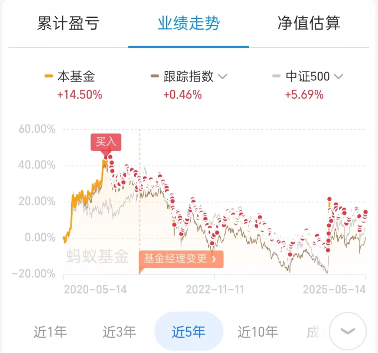
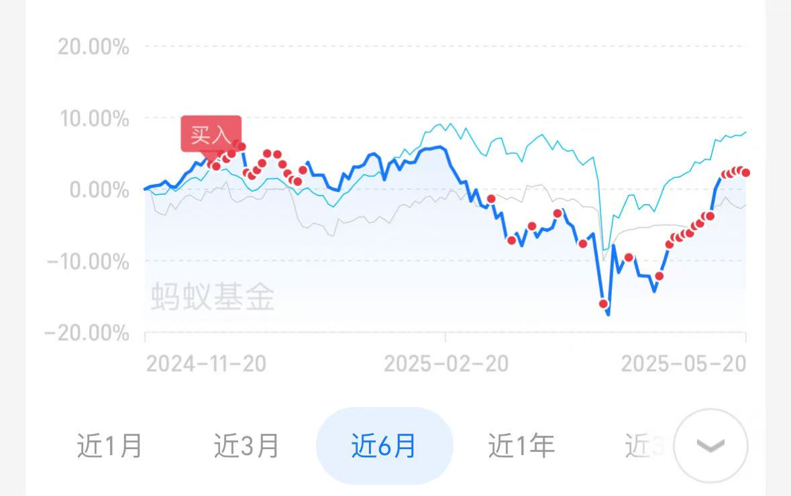
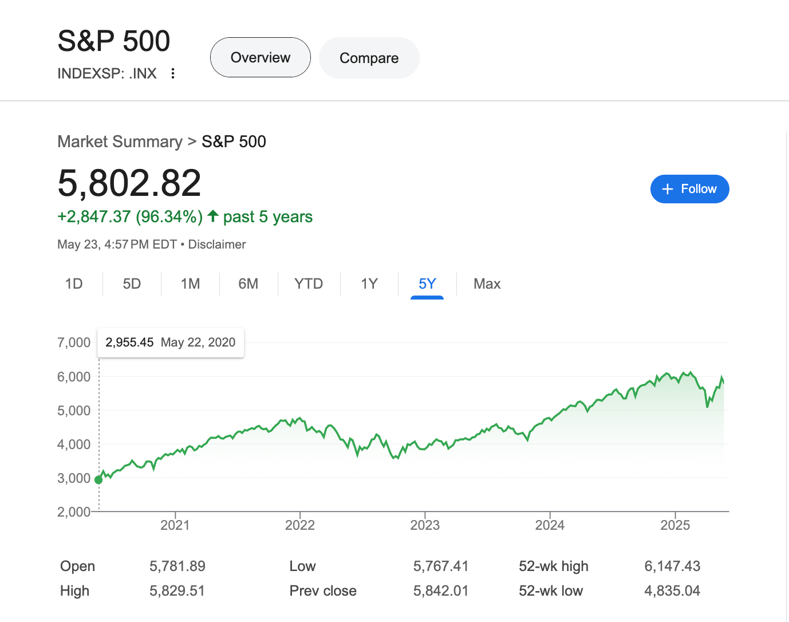
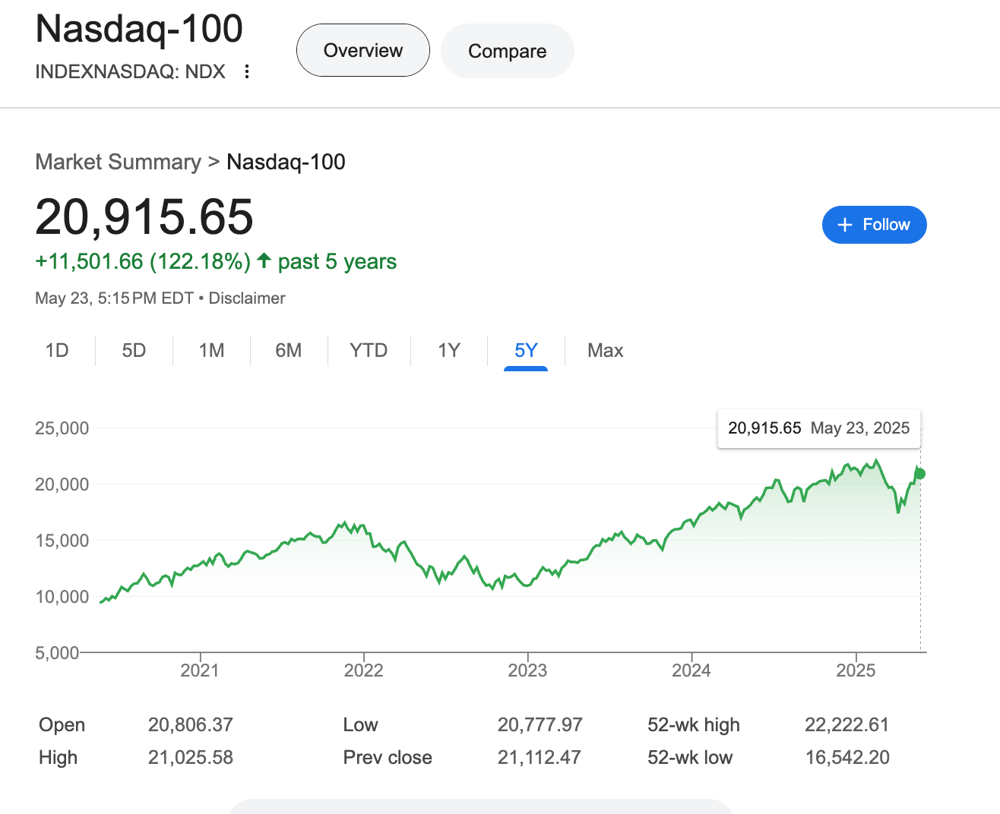
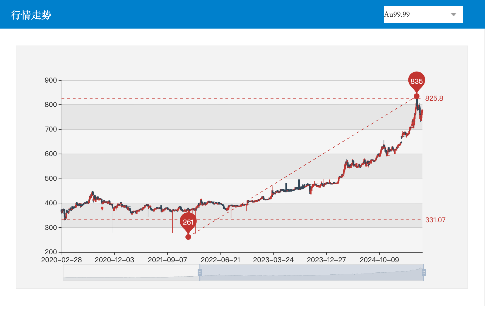

# 理财总结

> 理财有风险，投资需谨慎。

## 背景

1. 得知riba在投资层面取得不错的收益后，认真阅读了riba关于理财知识经验的分享。经过半年时间（24.11-25.05）读了理财相关的书并结合实践，认为riba的理念是非常可行的。

    > **选择优质资产并不断定投买入**。

2. 空闲时间在v2ex看酷工作下的帖子，大家都在吐槽工作忙/被裁/焦虑的话题，但xption愿意主动分享自己切实可行已落地的方案。

    > 最靠谱的副业莫过于**将积累的财富守住，想办法随着时间产生复利。**

截止2025.05.24为止

| 沪深300定投5年 | 纳指定投半年 | 
| -- | -- |
| |  |
| 持有收益率: 1% | 持有收益率: 2% |

## 想法

### 什么是资产？

资产：资产是能“钱生钱”的东西，它可以在一段时间内持续为所有者带来现金流收入。

例如，股票、房地产、优质的公司股权等，它们在合适的情况下，能够产生股息、租金等收入，不断增加你的财富。

### 什么是财务自由？

财务自由即时间自由，手中的资产可以使我无需再为维持基本生活而不得不去出卖自己的时间

### 什么是好的生意模式？

好的生意模式即:

- 利润和净现金流一直是杠杠的
- 竞争对手哪怕在很长的时间里也很难抢
- 护城河是否长期坚固 (产品的差异化的差异性，包括企业文化)
- 长期的毛利率是否合理（产品的可替代性）
- 长期的净现金流（长期看是净利润）是否满意

### 为什么是长期定投？

基于我是普通人、且无相关专业知识和经验。短期价格预测是不可能的，长期价格预测是可能的。

在全球每年货币增发的背景下，钱最终越来越多流入到”钱生钱“的领域

> 世界一直在进步，经济一直在发展。

> 参考《半泽直树》，在经济危机时期，银行更愿意无信用风险的企业贷款，即使这些企业不缺钱。

> 另一个例子就是”恒大“，为什么能积累这么高的债务？在过去地方银行的视角下，投”恒大“是政治正确+一本万利的选择。

什么领域可以”钱生钱“？ 

我认为是科技领域，他代表了当下社会最先进生产力的发展，他寄托了人类的美好前景。

### 未来的你期望你是什么样的？

希望10年后的我

- 有自己平凡但热爱的事业，自己的家庭，有源源不断的理财收入能让我无惧裁员、政策变动
- 希望我的存在能让身边的人对生活更加的热爱

理财目标：实现每年平均5%的年化收益，接受-50%的亏损。

### 你准备如何理财？

标的：投资行为所指向的对象。常见的有股票、债券、基金等。

| 标的 | 标的构成 | 投资比例 | 为什么选择 | 
| -- | -- | -- | -- |
| 纳斯达克100 | 聚焦纳斯达克上市的 100 家非金融科技龙头 | 50% | 坚定不移的相信未来科技的发展 |
| 标普500 | 覆盖美国 500 家头部上市公司，行业分布均衡 | 25% |  比纳指稳健，相信美国的长期发展 |
| 黄金ETF | 实物黄金、黄金期货投资  | 25% | 对冲通胀、对抗美股持续下跌的强心剂 | 

| 标的 | 五年为界曲线 | 
| -- | -- |
| 标普500 |  |
| 纳斯达克100 |  |
| 黄金 |  |

### 理财理念

- 长期持有，至少5年

    > 按每月20天计算，每月定投金额：8000（400*20），坚持5年大概50w（已更新理财规划，详见下方）

    > 你认为在今年的高点卖掉了，站在5年的高点后来看，今年的高点还是高点么？ 

- 别人越恐惧，我越贪婪

    > 市场坚持28原则，你和大众走一样的路，那么大概率你是80%的人

- 正常范围内的波动其实是长期抵御更大风险能力的必经之路
- 每年根据资产表现重新平衡比例（保证如上的投资比例）
- 保持稳定的现金流

    > 很有可能你在低点摸爬了很久，马上要回升了，可你没钱了

- 坚持成长，投资自己是风险最低、收益最高的选择

### 决不能做的事

[曾经厂长，炒币亏300万，妻离子散隐居在郊区开出租车](https://www.bilibili.com/video/BV1TqNyzeEnm)，视频的主人公，同我是老乡 & 大学校友

- 不能借网贷，财富数字化后很多人不知其宝贵，比如10w在App上只是一堆数字，但10w纸钱是沉甸甸的，需要好几个月的努力才能赚到的。
- 不能杠杆操作，人容易因为超高的回报忘掉当下的风险，做事要冷静，晚上不要做交易的决策。
- 不要买自己不懂的东西，大概率会亏。
- 知错要改，不要执迷不悟。积累经验，以后能赚回亏本的钱。

## 实践

定期更新行动与试错。

### 2025

#### 2025.07

经过6月的A/H/美股的上涨，以及理财经理分析我当前理财收益比较低，调整下理财计划

> 等待一个大跌的机会，逢跌手动翻倍买入

> 等纳指暴跌的时候，定投到300-500/天，标普同理，但值得商榷的点在于，大家都在持币观望，1. 逢跌买入 2. 大跌都恐惧不敢买。因此直接定投来的舒服，无惧波动

| 类型 | 相关标的 | 预期仓位 | 当前情况 | 
| --    | --      | --  | --   |
| 存款 | 朝朝宝、快赎产品 | 10%  | 完成 | 
| 固收 | R2理财、美元理财 | 30% | 完成 |
| 债基 | 利率债、信用债 | 10% | 定投300/天 | 
| A股 | 红利低波指数 | 10% | 定投500/天 | 
| 港股 | 恒科指数、红利指数 |  10% | 定投500/天 |
| 美股 | 纳指、标普 | 20% | 定投1000/天 | 
| 大宗商品 | 黄金 | 10% | 逢低买入 |

后续月度整理资金分布情况，实现整体收益率测算，动态调整仓位占比

#### 2025.06

- 2025.05.24 开始定投实践
- 2025.06.09 纳指调整为300/天，当前定投占比（纳指-300/day、标普-100/day、黄金-100/day）

## 附录

- [对投资的一些思考](https://blog.riba2534.cn/blog/2024/%E5%AF%B9%E6%8A%95%E8%B5%84%E7%9A%84%E4%B8%80%E4%BA%9B%E6%80%9D%E8%80%83/)
- 《穷爸爸，富爸爸》
- 《小狗钱钱》
- 《稀缺：我们是如何陷入贫穷与忙碌的》 
- 《时势：周期波动下的国家、社会和个人》
- 《定投改变命运》
- 《韭菜的自我修养》
- 《财富自由之路》
- 《货币未来》
- 《金钱心理学》