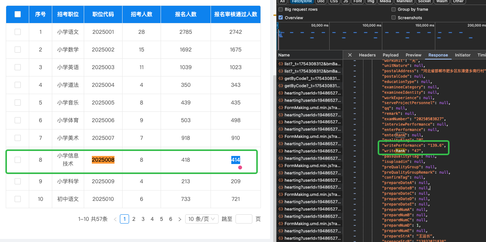

# 教师招聘记录

> 以此记录对象过去这些年的努力

## 2025考试名次统计

| 地区 | 排名 | 备注 | 截图 |
| -- | -- | -- | -- |
| 丛台区 | 排名47 | 经期去考的 |  |
| 邯山区 | 招8排18 | 考前一夜失眠，前16进面，未进面 |  |
| 经开区 |  招4排2 | 笔试第三，总成绩第二 |  | 
| 肥乡区 |  招3排2 | 笔试第三，总成绩第二|  | 

## 2024考试名次统计

| 地区 | 排名 | 备注 |
| -- | -- | -- |
| 复兴区 | 排名146 | 题考的非常乱，很不擅长 | 
| 邯山区 | 排名85 | - |
| 丛台区 | 排名88 | 经开区排得比较靠前一点 | 

## 2023-2022考试名次统计

> 由于疫情的缘故，考试时间较久，合并2023-2022年考试

| 地区 | 排名 | 备注 |
| -- | -- | -- |
| 涉县 | 招5排6 | - |
| 临漳 | 笔试第一，放弃面试 | - | 
| 曲周 | 招3排1 | 高中在编2年半 | 