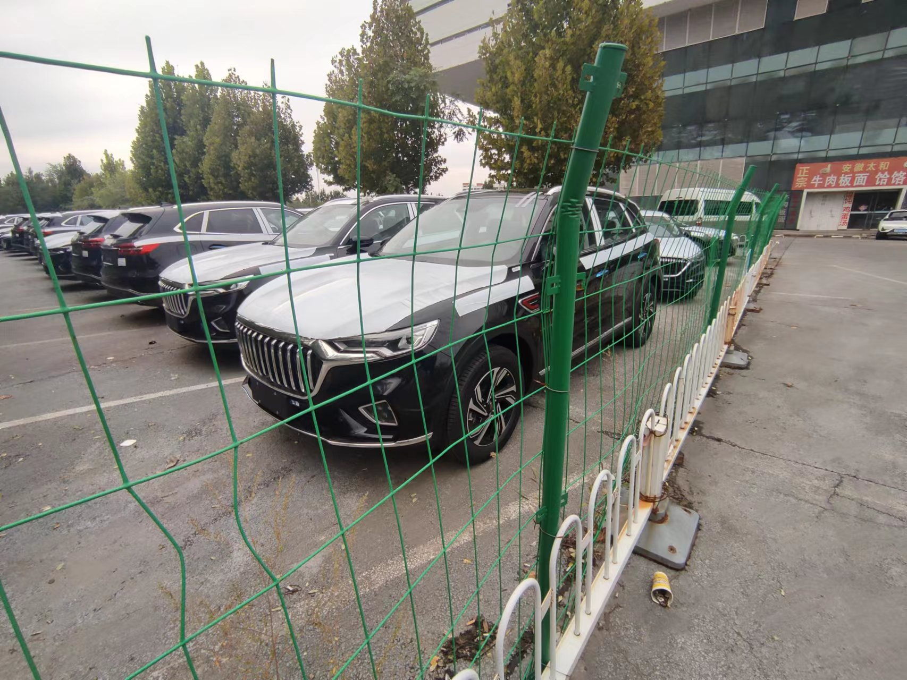
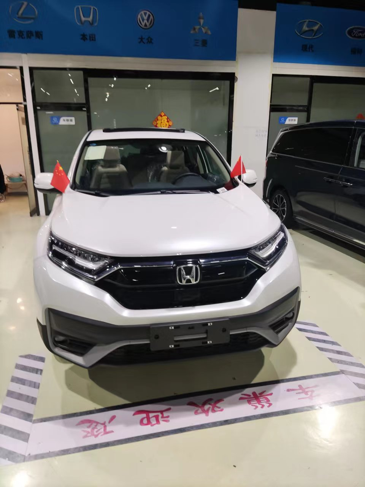

# 未来

后续用个excel 来统计分析吧。

## 买房原则

1. 首付 55w，月供7k-8k，公积金贷款80w（最多贷80w）
2. 大概110-140平，三室/四室 两厅两卫。

公积金贷款额度：min(连续缴存月数\*5000+公积金余额\*10, 80w)

## 房子

东区的规划

按照看的顺序来展示

1. 坐标，价格，公摊，面积，户型
2. 是否现房
3. 配套
4. 地下室/停车位

### 保利 · 和光尘樾

坐标邯郸东区，均为毛坯（预售证还未下来，2022.10月底下，已经出售了部分了）
不绑定车位，车位大概8w

- 125平，实际面积99.84平，价格123w
    - 三室两卫
    - 户型图：http://www.ljia.net/tu/20220208/5741644281664.html
    - 优点
        - 落地窗，窗户较厚，隔音最好，层高2.9m
        - 开放式厨房
    - 一梯两户
- 138平，实际面积105.63平，价格135w
    - 三室两卫
    - 户型图：http://www.ljia.net/tu/20220208/5151644281721.html
    - 优点
        - 落地窗，窗户较厚，隔音最好
        - 被动房（带中央空调，调节气温/湿度/净化空气）
        - 层高，3.1m
        - 开放式厨房
    - 一梯一户

### 华润 · 公园九里

不是特别感兴趣，整体感觉装修下来房子不大

坐标邯郸东区

不绑定车位，车位没问

http://www.ljia.net/tu/20210428/2641619591965.html

- 134平，毛坯，136w
- 133平，精装，127w
    - 四室两卫
- 100平，精装
    - 三室一卫
    - 缺点
        - 厨房较小

### 美的 · 剑桥郡

23年底交房，售楼处人最多

绑定车位，车位10w
听别人都说美的 的楼品质好

- 125平，精装，126w，均价9981元/平
    - 美的精装修看着还不错
- 125平，毛坯，113w，均价8943元/平

### 保利 · 时光印象

现房，不绑定车位，车位8w，处于复兴区（邯郸西部）
整体配套健全，1个月后交房

- 140平，136w
    - 现房，离武安近

http://www.ljia.net/new/778.html

## 车子

20w左右的车

- 红旗hs5

- 本田crv

