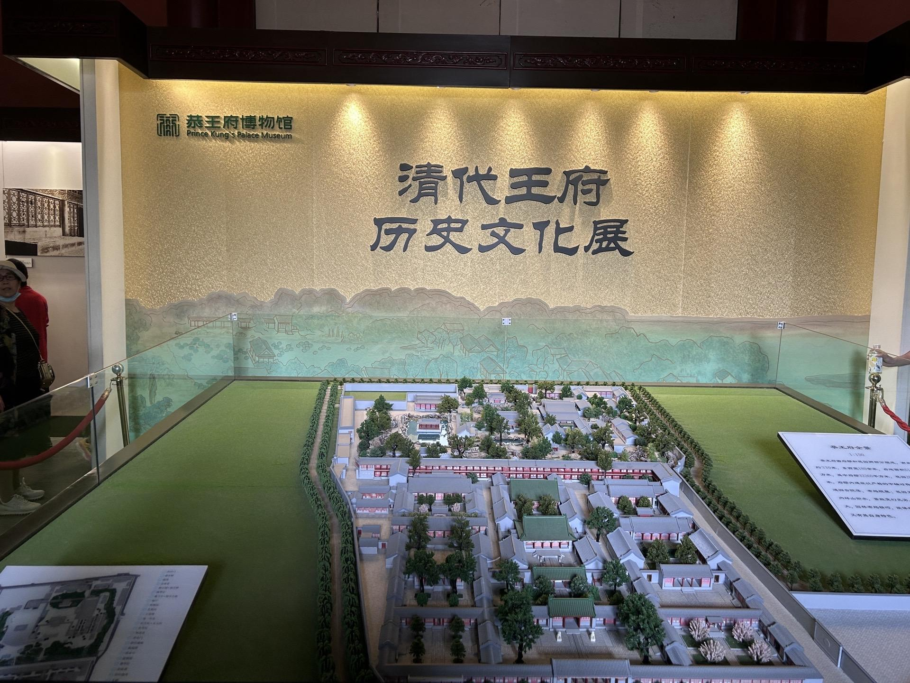
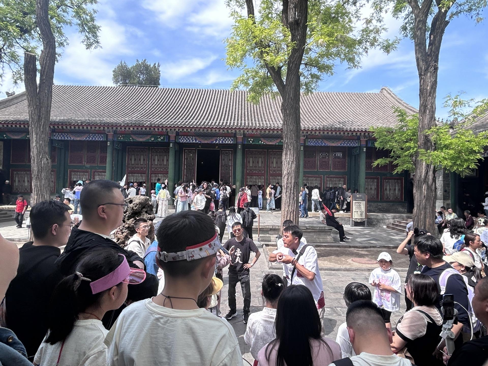
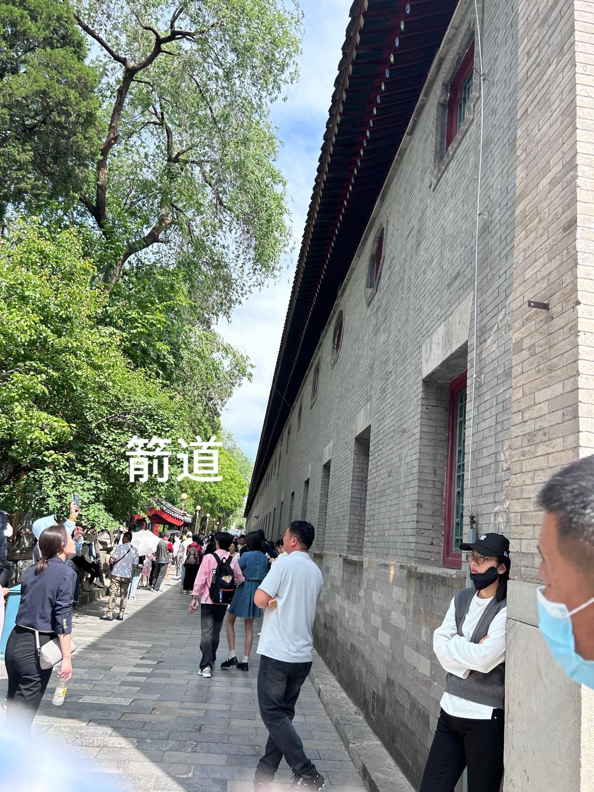
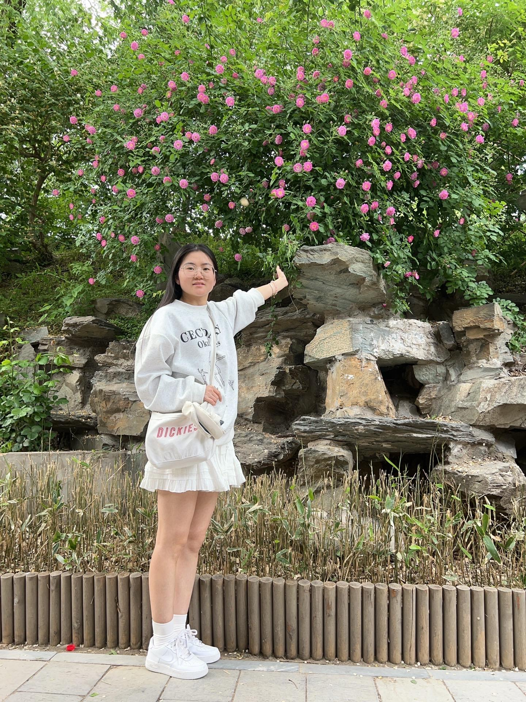
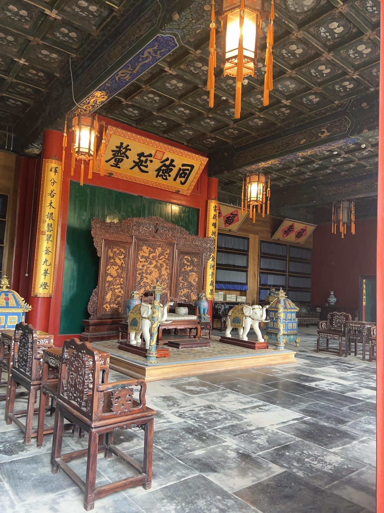
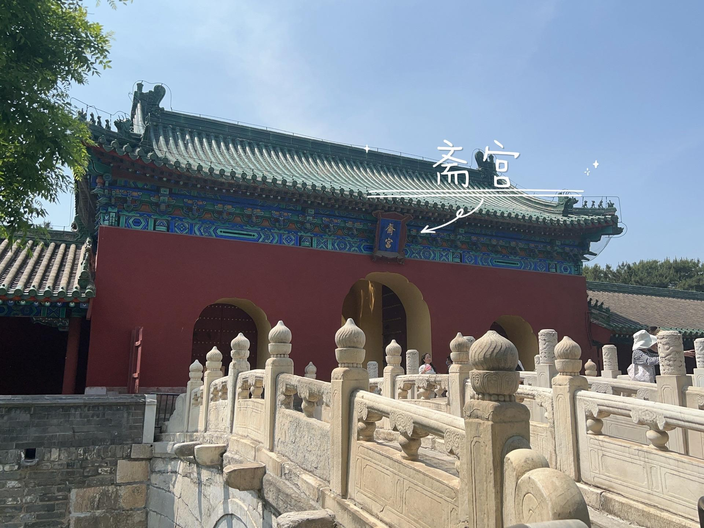
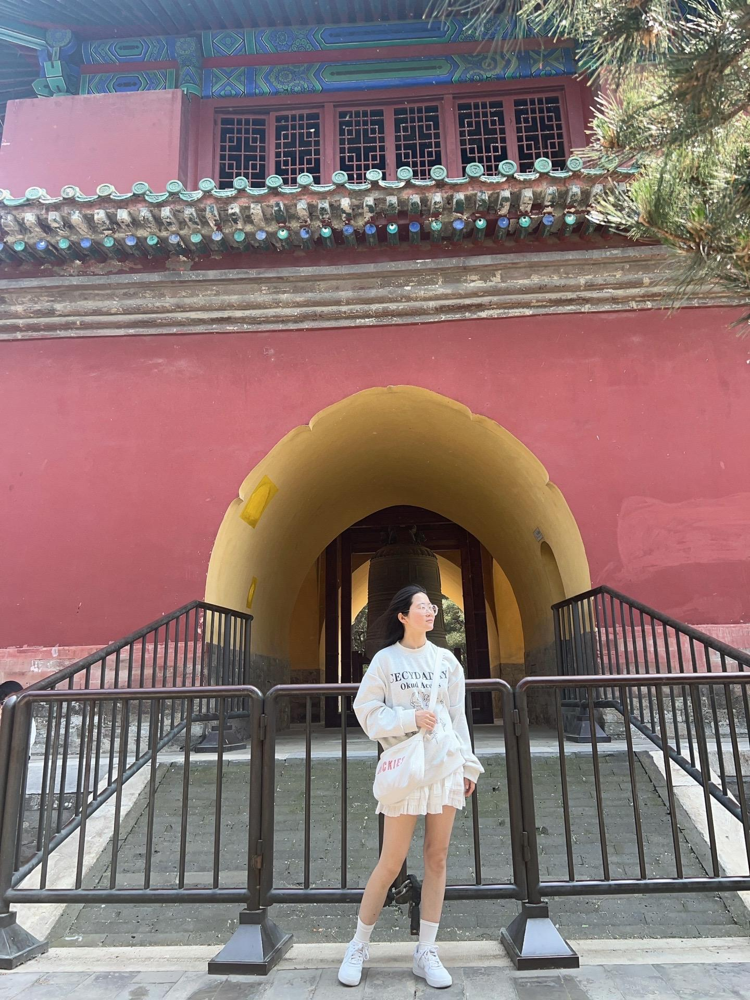
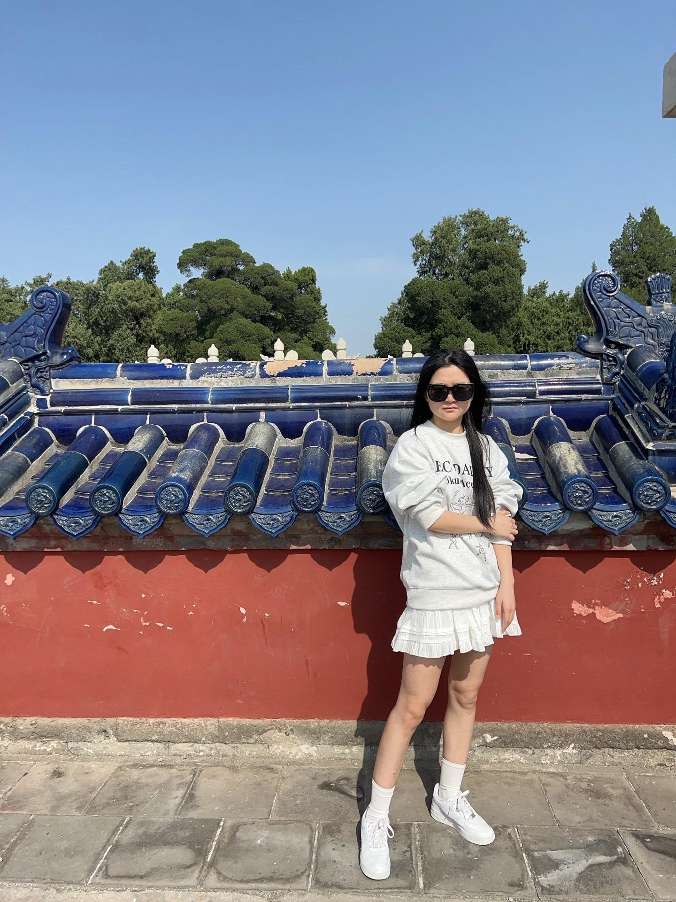

# 2024 五一北京游玩

## 04.30 闲逛奥森

王彤中午乘车到北京，大饼去地铁站接，中午吃的小区附近的武圣羊汤

下午一起逛了奥森，吃的双人餐，是辣子鸡那家店

## 05.01 畅游恭王府

大饼的小米手机反复重启，比较影响心态，用王彤的手机买的去恭王府的地铁票，去的恭王府，在现场听一个导游解说恭王府的种种

## 05.02 植物园之行

用了老手机iphone se，去的国家植物园

植物园很大，和王彤逛到了尽头，在山上拍了照

晚上回来吃了烤鱼，在超市买了酸奶

## 05.03 感受天坛人文气息

去逛了天坛，和王彤认真逛了下，比上次逛天坛有收获，有斋宫，祈年殿，回音壁，双环万寿亭

中间大饼本来想逛完天坛，再去逛前门，和王彤发生了小的争执

晚上回来品尝了门口的眉州小吃

## 05.04 返途

王彤临时接到通知开学（因为不知道周五上什么课，买了高铁回家了），匆匆返回学校