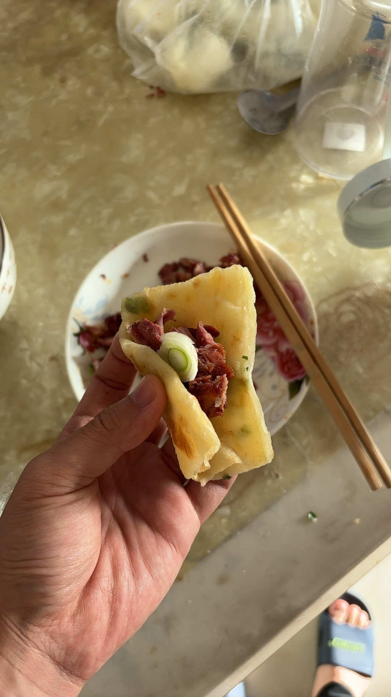
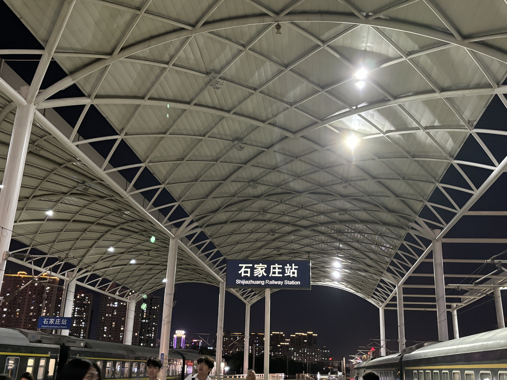
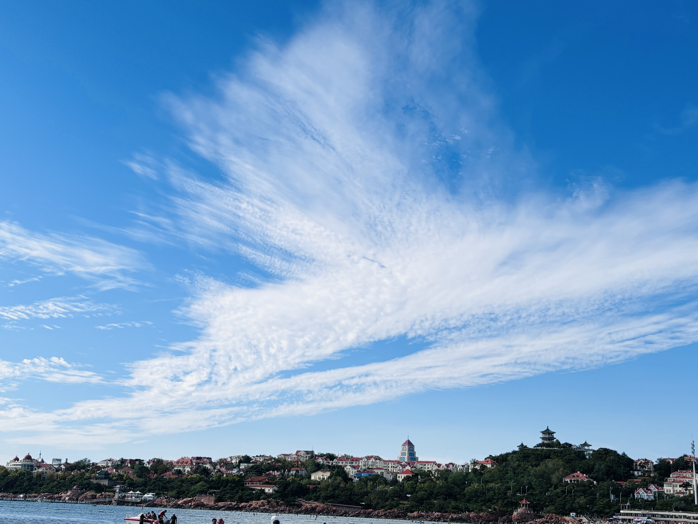
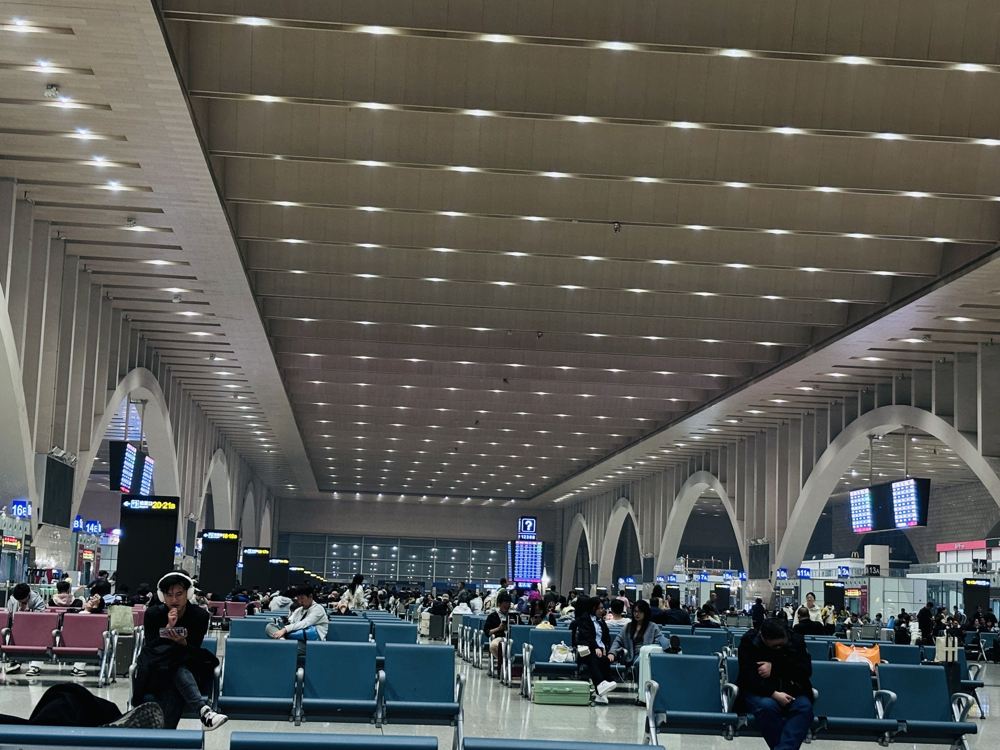

# 2024-国庆

## 09.30 坐车回家

买到了无票的城际列车，在车厢后排的位置席地而坐，时睡时醒，大概5小时到了邯郸。

出站后发觉小雨刚下完，空气中夹杂中泥土的气息，嗯，是故乡的原有气息。

候车808，第一辆看人太多，没挤进去，第二辆车抢到了座位，一路坐车到了汽车站，下车后骑共享电单车到楼下。

一进家，爸爸妈妈都在，爸爸专门给做了疙瘩汤，由于下雨天气冷的原因，让我喝汤暖暖身子。

后面就是和妈妈一起去接小宝从幼儿园回来，回家的路上不长，但小宝嚷嚷着要去玩滑滑梯，一路有些小“惊险”，大概是只有妈妈能制服小宝了。

在晚上准备睡的时候，刷B站找到一部剧《最完美的离婚》，刷到了第5集，讲的是一个直男嫌弃自己现有老婆的故事

## 10.01 惬意居家

早上6点就起床了，接着刷剧

- 直男在嫌弃自己老婆后，在路上找到了前任，并回忆起了前任的美好，但前任此时已经有了老公，虽然老公在外面拈花惹草，但前任由于母亲的缘故（母亲早早的离婚，在前任眼里是过着不幸的生活），并没有主动打破当下的“美好”局面。
- 故事发展到中期，四个人聚在一起，诉说着过去的种种，男主替前任担心前任老公“出轨”的事，女主感觉自己在男主的心中地位还不如前任，从之前的形式离婚到断舍离，从屋子里搬了出去。
- 男主在女主离家后，思念起了女主，并回忆起来过去的种种，最终误解解除，两人重归生活的美好~

靠着睡觉和刷抖音、B站、小红书度过了下午，晚上突然纠结去济南的票，以及几号去的事

- 看小红书说济南的交通不是很好，就产生了放弃过去的想法，后面突然萌生了去看海的想法，并且愈发猛烈，看了酒店，觉得能接受300的价格，就准备去青岛
- 纠结买什么时候的票，看了很多车次，最后锁定了2号出行按邯郸-石家庄-潍坊-青岛的路线，3号出行按石家庄-青岛的路线

## 10.02 启程青岛

早上同女友沟通怎么去的问题，因为常同学也要去青岛，并且已经报了团，思考多次后，觉得坐火车前往青岛，买了2号的票

妈妈中午带我去市场买行李箱，因为和女友的行李箱是同款，在知道价格的情况下，向老板砍价最后120到手

临走的时候，没敢看妈妈，成长的代价就是离自己的亲人愈发愈远，一年下来能陪父母的时间少之又少~

--- 

和女友分别从家出发前往邯郸，女友3点从家出发，不到5点就提前到了。之后女友去义商背后买了 里脊饼，肉夹馍，口袋馍

我到火车站后、和女友一起坐硬座从邯郸到石家庄，又从石家庄卧铺去潍坊

## 10.03 初遇青岛

在火车卧铺上，车一停就醒，看了下地图，邯郸到青岛中间的城市分别有聊城、济南、淄博、潍坊，其实也不多，坐快车（K字头）的情况大概城市间是2个小时，由于是从石家庄出发总共大概10-11个小时

到潍坊后转车到青岛北，大概8点到青岛北。下车下载了青岛地铁app，发现有日卡，花35买了3日卡，畅行青岛地铁

地铁第一站是先去宾馆登记入住，由于游客还没退房，先把行李寄存到了宾馆“昕隆源”

乘地铁到了栈桥，人很多，女朋友第一次看海，其实我也是第一次正经的看海，拖了鞋，踩在沙上，伴着海风，感受海水的温度

看栈桥上的人很多以为很挤，实际人流量很大，一波一波的人走，一波一波的人进，不一会就走到了头。

拿出从宾馆带来的五星红旗，在栈桥的尽头，在手机镜头前，肆意的挥舞着

接着爬山路，路上有一对熟人打闹，引得游客观望，由于导航去天主教堂的路走错了，回头走的时候，熟人已经停止了打闹，但观望的人却变多了

到了天主教堂，没有进去，手机一竖，一幢高楼立刻映入眼前，打卡的游客很多

已经下午该吃饭了，导航去了小红书推荐的小饭馆，发现要排队1个小时，便放弃了，兜兜转转，又走了很多弯路（是真的弯路，不光弯，还时而上坡时而下坡）

中间路过了连锁店，女朋友嫌不是本地的，没进去吃

后面路过了信号山公园，又去了八大关，在八大关买了5元2根的淀粉肠，此时又饿又累，准备回去找吃的

在地铁上，我靠在女朋友的身旁眯了会儿，醒来时，女友说找到了美食，于是跟着导航去了振华海鲜市场，分别花28买了扇贝和花甲，48买了螃蟹和虾，找了一家藏在市场里的春天啤酒屋花35加工了下，我吃着还不错，女友觉得味道寡淡，对海鲜产生了阴影

由于没吃饱，又在回宾馆路上买了 胡辣汤和包子

到宾馆登记后，由于定的房间空间太小，女友找老板协商换到了一个有1.5m的床，但空间略显大的房间

简单歇了会，女友和常同学聊天，沟通前往去五四广场，在五四广场人也很多，有着很美的灯光秀（第一次见到一堆大楼在同一时刻闪烁着一幅画面的场景），拍了拍照后回到宾馆，女友洗洗就睡了，大饼简单看了下视频后也准备睡了

## 10.04 吹风观海

第二天在宾馆附近吃的早餐，鸡肉馅饼让人“流连忘返”

出发打卡石老人海水浴场，海水很蓝，女友一边玩水，一边捡贝壳螃蟹，在这拍到了很多美美的照片，由于呆的地方涨潮了，便准备前往下一个景点小麦岛

此时已经是2点多了，该吃午饭了，在找湘菜的路上，发现一个小面馆，点了朝鲜冷面，海鲜面，青岛凉粉，小葱拌牛肉，还点了两瓶崂山啤酒，伴着舒适的小风，大饼浅浅的睡了

睡醒了后，前往小麦岛，在小麦岛看到了日落，还因为没拍好照，再一次和女友发生了口角。

慢慢到天色变暗，看到高楼的灯光秀再起，坐在草坪，听着歌，伴着微微的海风

回去的路上看到了李村地铁站的人们拿着很多零食，便前往李村夜市（大号的康德夜市），买了鸡肉馍，串串吃，又是忙碌的一天

## 10.05 流连忘返

先去了青岛第二海水浴场，看到了礁石，接着步行前往第一海水浴场，在海边走了个来回（不管是第一还是第二，都没有昨天打卡的石老人浴场的海水令人向往）

女友提出要吃饭，找吃的找了半天，最后去了五四广场旁的万象城，在万象城买了自助小火锅，排队又排了半个小时

终于轮到我们的号了，等锅开了，我大口吃着西瓜，喝着饮料，煮了很多肉，屎意渐起，我没有在意，又喝了杯冷饮后前往厕所，最后没忍住拉了裤里，好歹是在万象城，处理了好久的“事故”现场。

吃完太阳已经落山了，我们又在夕阳的余晖下找寻着去燕儿岛的路

在燕儿岛看到了惊涛拍岸，零星有些钓鱼人在黑夜中探寻”猎物“，坐在岛前感受海风，看着游轮和灯光秀，和女友数着有几个灯光颜色，蓝色，红色，紫色，绿色... 好多颜色

回到宾馆，安顿了下电量，收拾了下行李，就歇着了...

## 10.06 返程路上

10.6是在火车度过的一天，8:59从青岛北始发，21:45到达石家庄

过程中睡觉，听歌，和女友闲聊，在广平站送别了女友，又在广平站接到了女友弟弟，一起说话到了邯郸（1个小时）

到石家庄后，在石家庄车站候车，写了下当前的这份记录，写到晚上12点已经很困了

## 10.07 牛马返京

紧接着困意渐起，用各种姿势尝试睡觉，无果，最后还是听歌聊以自慰

到2点的时候，爸爸给打过来电话，后面打电话的时候才知道，爸爸担心我可能会误车，一直没睡，后面给我打完电话才睡... （虽然行为上有点儿蠢蠢的。但我能感受到父母对孩子的无私的爱）

终于迎来了列车检票的场景，人挺多，本该凌晨2:37出发，实际2:52出发的。

在火车上人挤人，连下脚的地方都没有，就这样听着身旁学生的唠嗑，度过了艰难的3个小时火车行程。

接下来如同往常，坐地铁回家，睡觉，洗衣服，看手机，洗澡，洗衣服，睡觉，打游戏，平常的一天

到了晚上，女友分享同事相亲的事，晚上做梦就梦到了

> 梦到你去相亲，一周之内就决定好结婚了。结婚前一天还找我试了下第一次make love，我只是进去了一下。我跟车跟到你婚礼的地方，没有闹，微信里问你，啥时候生个大胖小子

晚上看了一集多的苏东坡的纪录片，长见识且助眠，晚安~

