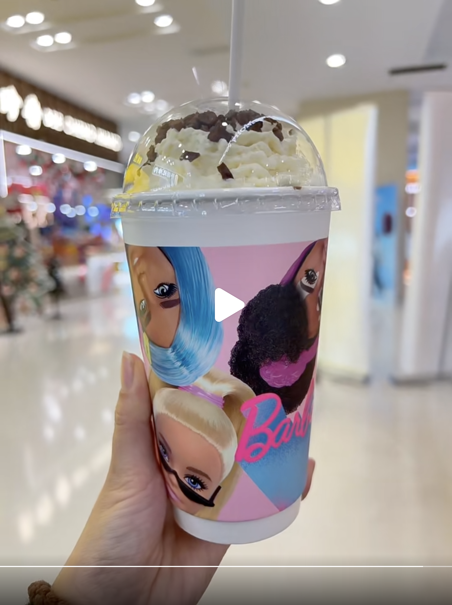
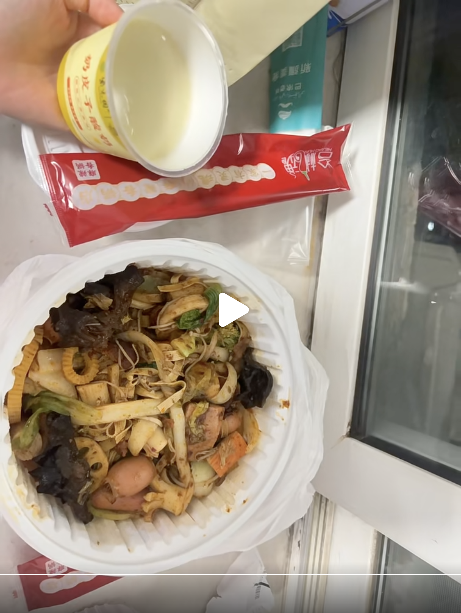

# 2024-冬季相遇

## 12.13

月彤和她对象，带着王彤去邯郸，一起在新丹兰买的饭，吃完饭后，王彤坐火车进京

到了晚上，大饼去地铁站接王彤，晚饭吃的眉州小吃，有炒饭，茄子，小酥肉豆腐，甜水鸭，吃饭时王彤说自己月经来了..

到了住宿的地方，虽然有新买的电热毯，没那么暖和...

## 12.14

上午是洗漱，磨蹭，看书，刷视频

中午点了外卖、巴依老爷，女友说饭挺好吃，晚饭热了热剩余的饭继续吃

晚上看了会儿书，王彤在刷手机

## 12.15

带王彤去了趟朝阳大悦城（并没有逛什么，没什么乐子）、买了杯奶茶、吃了煲仔皇（份量不多）

出来后，在青年路附近兑换了紫光园的奶皮子酸奶，然后坐地铁回来（地铁来回2小时，花费2人20元，不值当的体验2333）

晚上回来睡了会儿，点了外卖 麻辣香锅（做的口味一般），大饼浅浅的睡了会儿

## 12.16

大饼早上6.20早起，买了饼，坐地铁送王彤坐火车

