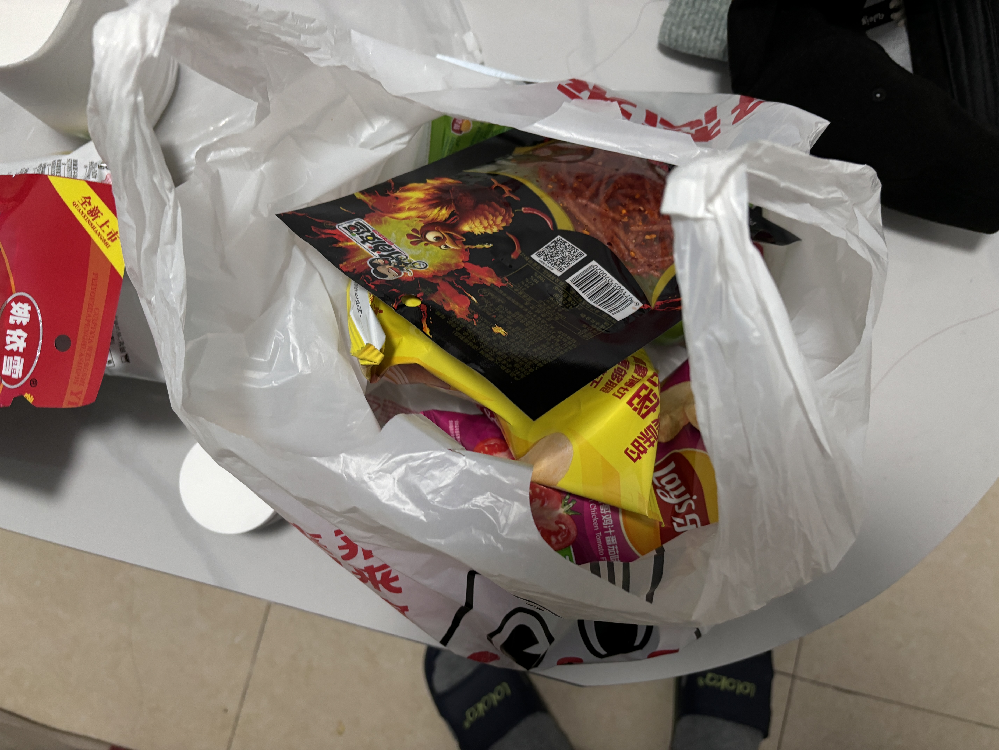
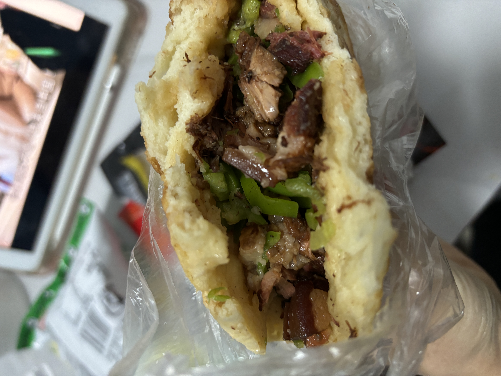
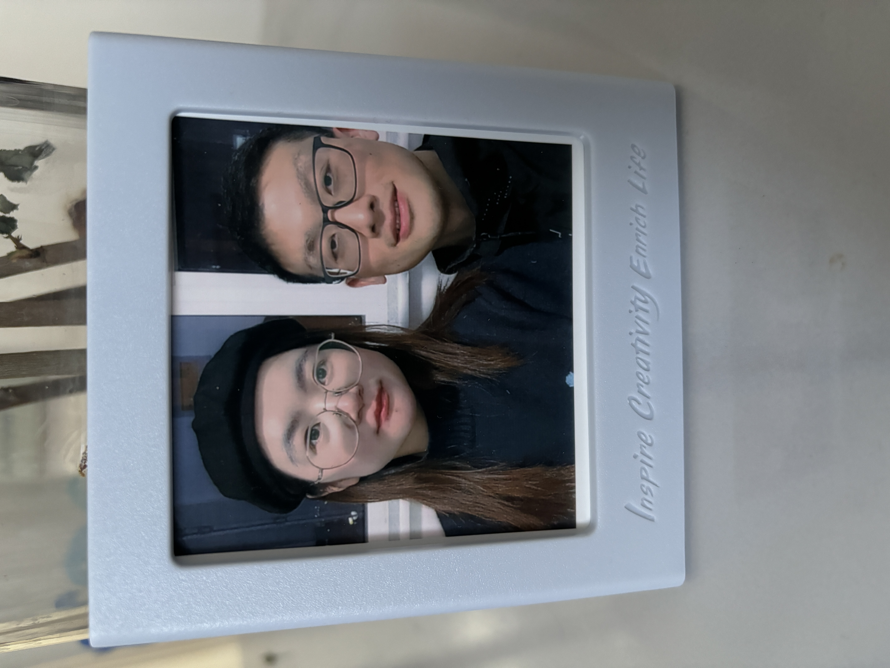
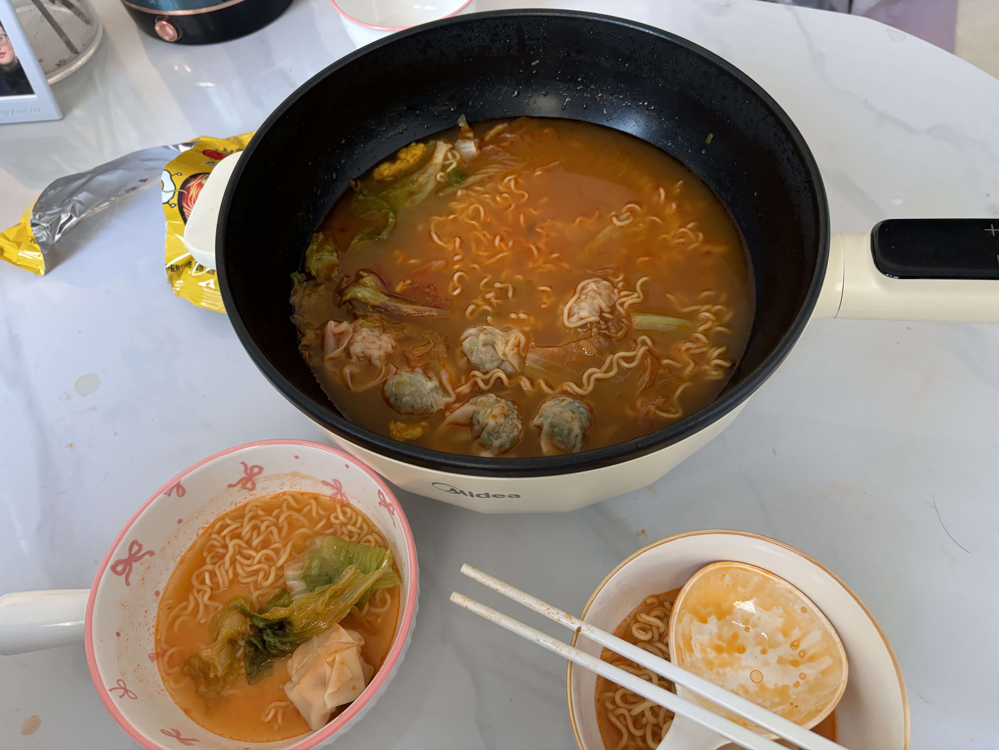
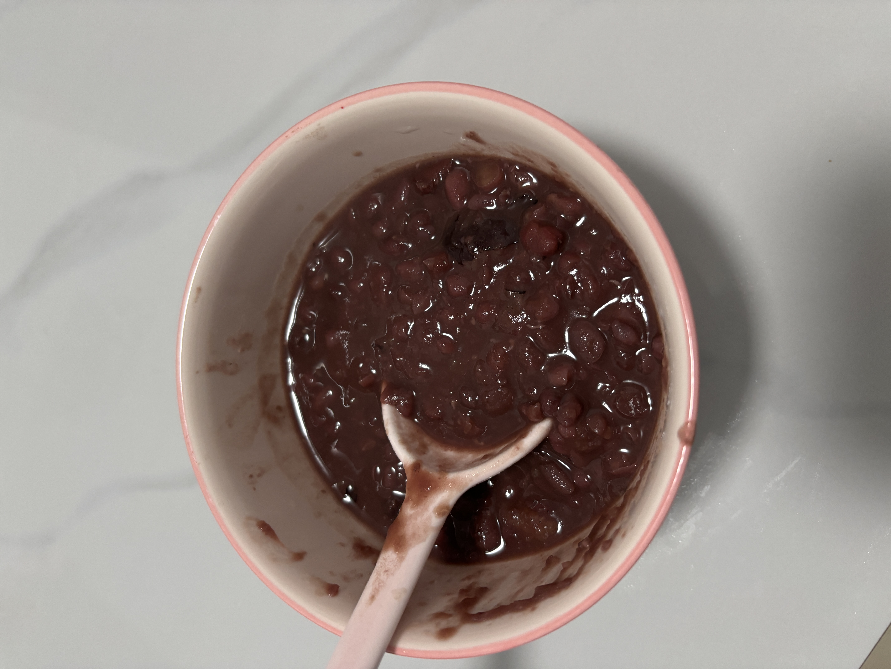
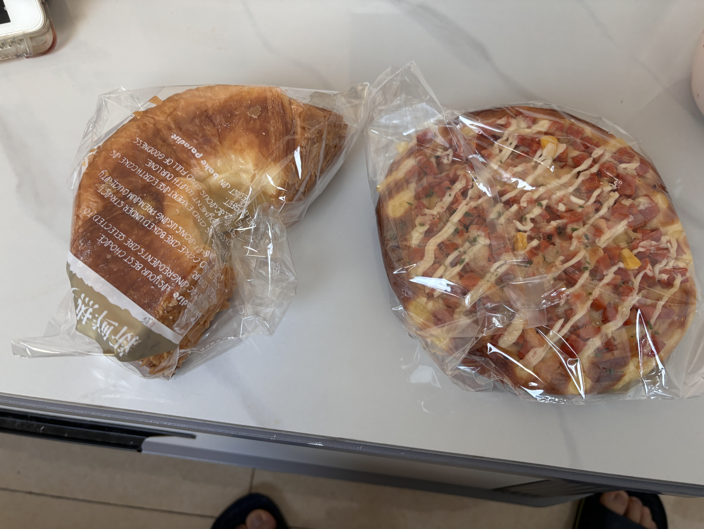
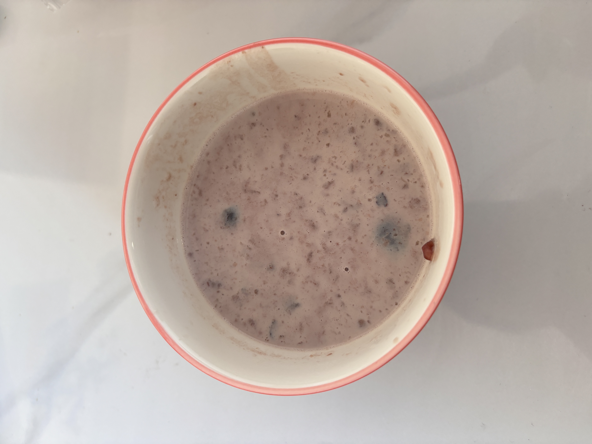
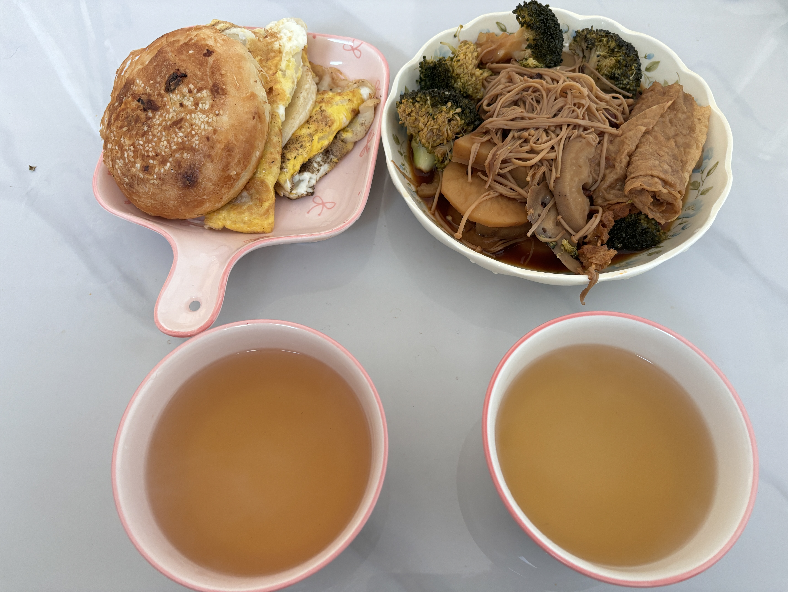
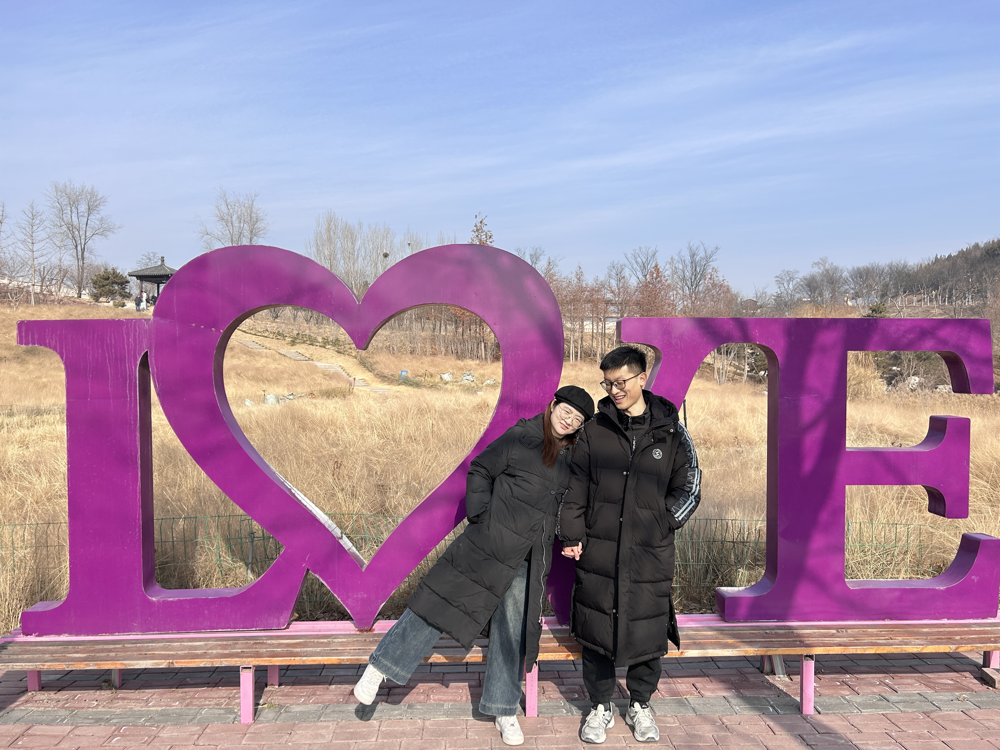

# 2026-1月

> 希望2026年的我们，更加自信阳光，重视感受和体验

## 12.30

| 时间 | 事件 | 备注 |  图片 | 
| -- | -- | -- | -- | 
| 晚上 | 坐高铁回邯郸（对象给买的票），对象买了零食和辣条吃 | - |  |

## 12.31

| 时间 | 事件 | 备注 |  图片 | 
| -- | -- | -- | -- | 
| 早上 | 对象请假打卡、买肉夹馍 | - |  |
| 中午 | 去安居东城附近吃的巴依老爷，烤羊排 | - |  |
| 下午 | 逛美乐城，体验抓娃娃机； | - |  |
| 下午 | 超市买牛羊肉，毛肚 | - |  |
| 晚上 | 东北粘稠麻辣烫 | - |  |
| 晚上 | 使用公司拍立得打印了照片 | - |  |

## 1.1

| 时间 | 事件 | 备注 |  图片 | 
| -- | -- | -- | -- | 
| 早上 | 馄饨+方便面 | - |  |
| 中午 | 丰盛的火锅 | - |  |
| 下午 | 看了常同学的新房；去从台公园打了羽毛球 | - |  |
| 晚上 | 新世纪拍了照，看了天女散花;  邯郸道看了黄金 | - |  |
| -  | 买了都市新语的面包；吃了火锅；豆沙+牛奶 | - |  |

## 1.2

| 时间 | 事件 | 备注 |  图片 | 
| -- | -- | -- | -- | 
| 早上 | 面包（红豆卷，红豆面包，小披萨），红豆沙，牛奶 | - |   |
| 中午 | 火锅 | - |  | 
| 下午 | 逛了植物园，花卉市场 | - | - |
| 晚上 | 羊汤+烧饼，烧饼从天亮等待了天黑，有鸡肉饼，火腿青椒饼； 我回来有些累，王彤又做了一锅卤菜 | - |  |

## 1.3

| 时间 | 事件 | 备注 |  图片 | 
| -- | -- | -- | -- |
| 早上 | 卤菜 | - |  |
| 中午 | 开车去紫山公园 | - |  |
| 下午 | 兰州牛肉面，地三鲜炒面 | - | - |
| 晚上 | 做了两种饼；鸡蛋灌饼、鸡蛋饼；吃了早上的卤菜 | - |  |
| 晚上 | 看《罗小黑战记2》 | - | - |

## 1.4

| 时间 | 事件 | 备注 |  图片 | 
| -- | -- | -- | -- |
| 早上 | 高铁上继续追《罗小黑战记2》；然后睡了一小时 | - | |