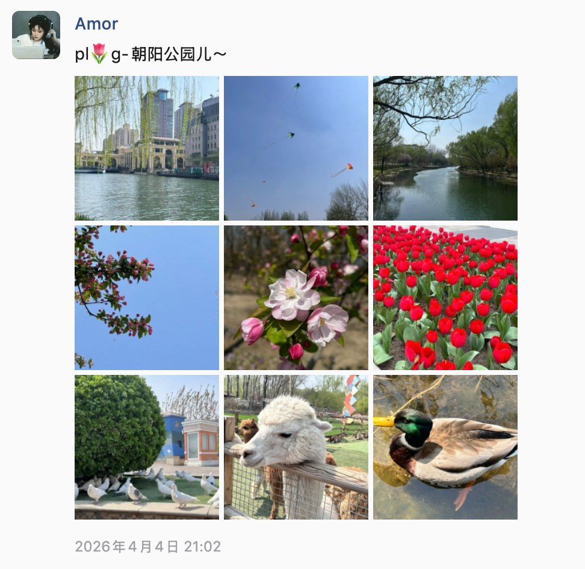
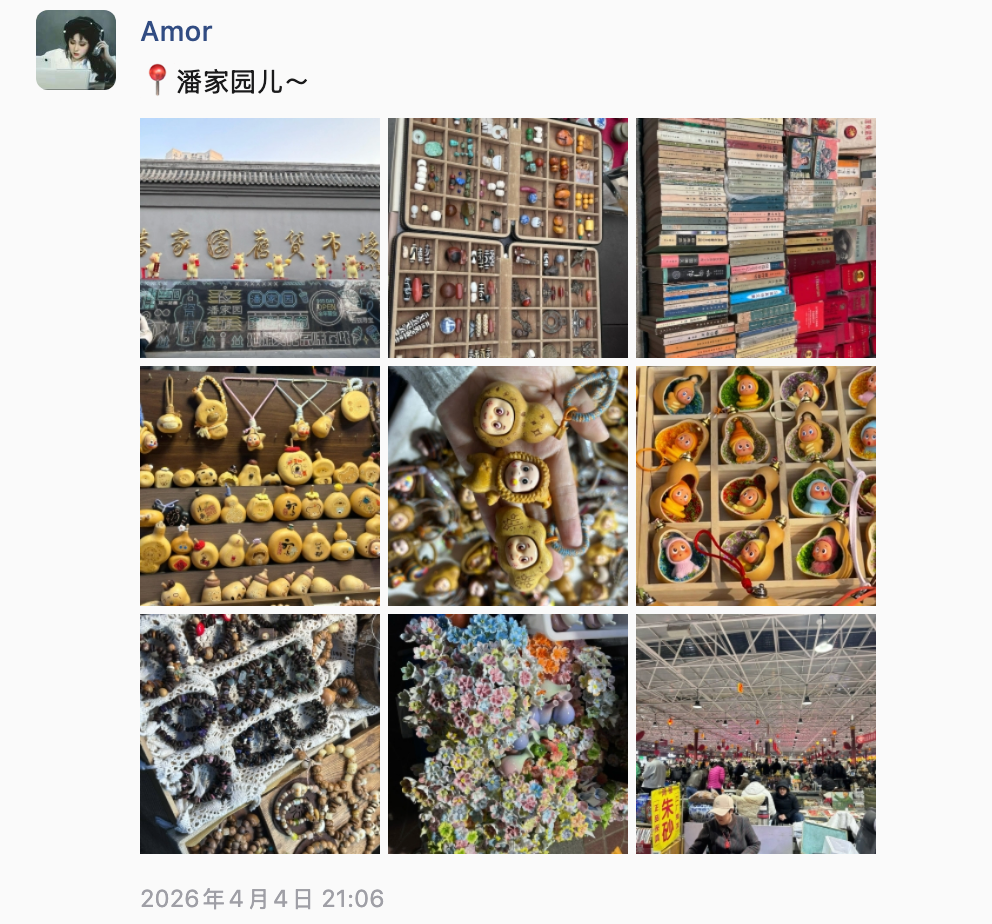
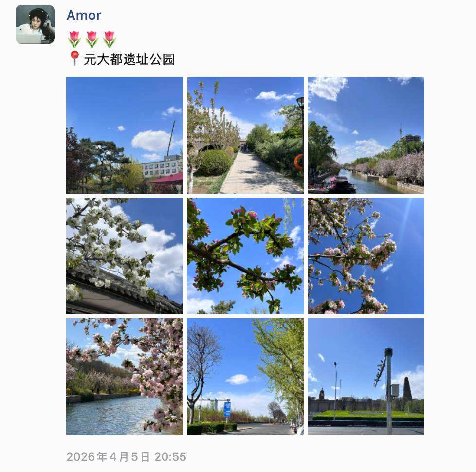
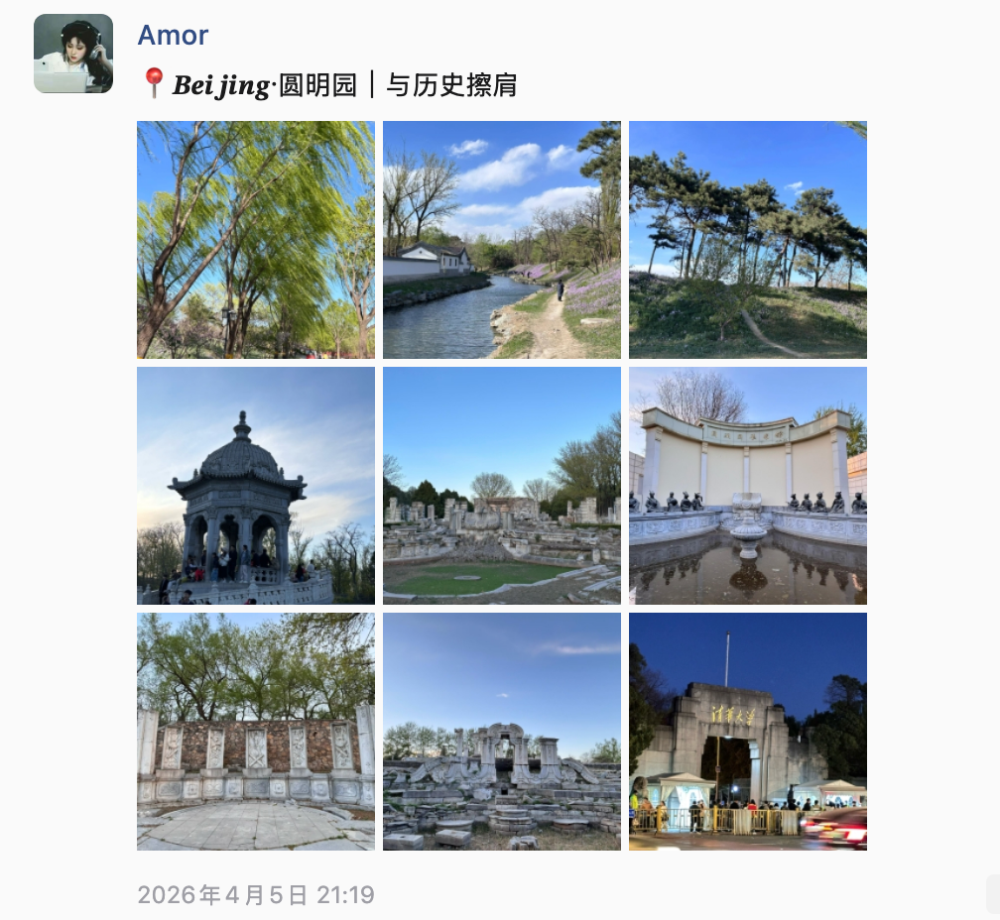

# 2026-清明

> 公园散步，感受阳光

## 经历

| 日期 | 事件 | 备注 |  图片 | 
| -- | -- | -- | -- | 
| 04.03 | 王彤请假来北京；带了很多吃的，行李很重； 见面王彤说她心跳噗通噗通的 | - | - |
| 04.04 | 早上：小谷姐姐麻辣烫； 中午：出发去朝阳公园；出公园后去商场吃的米村拌饭；做地铁去潘家园，看了眼镜，在古玩市场买了星星人；晚上回来泡面吃 | - |      |
| 04.05 | 早上： 西四包子铺  中午： 元大都遗址公园  下午：突发奇想去了圆明园 晚上回来精疲力尽了，吃了小区门口的眉州小吃 | - |   |
| 04.06 | 早上： 小谷姐姐麻辣烫； 中午： 打卡赵雷的《十九岁》提到的地名：南锣鼓巷 下午： 点了外卖俏湘厨 晚上： 送王彤去地铁站；王彤打车回家  | - | - |

## 备注

- 准备买下自拍杆，我社恐，不好意思让陌生人帮我们拍合照
- 身体欠佳，出门就一直留鼻涕，感觉像是花粉刺激？
- 准备一套睡衣，体验生活
- 调整作息，在王彤的带领下，已经知道早睡的秘诀了，关灯，看一会儿手机就困了
