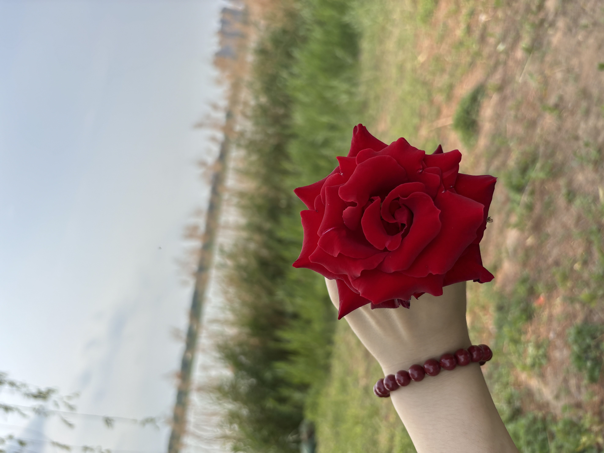

# 2026-五一

| 日期 | 事件 | 备注 | 图片 |
| -- | -- | -- | -- |
| 04.30 | 蒸米饭； 凉皮 | - | - |
| 05.01 | 炒米饭； 浙江商贸城买了一条裤子； 凉菜家+自制饼 | - | - |
| 05.02 | 蒜苔+自制饼； 北湖赶集； 螺蛳粉 | - |  |
| 05.03 | 炒米饭蒜苔； 螺蛳粉； 看车看房(租房)； 砂锅米线+鸡叉骨 | 吉利银河M7、长安深蓝S07 | - |
| 05.04 | 螺蛳粉； 鸡公煲； 赵苑公园； 邯郸道； 达美乐披萨 | - | - |
| 05.05 | 披萨； 塔斯汀汉堡； 溢泉湖； 凉菜+鸡叉骨 | - |  |
