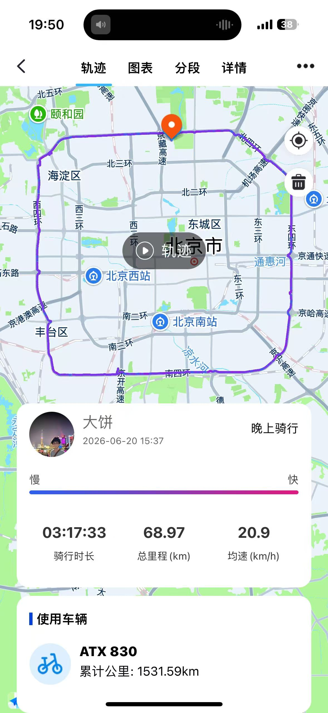
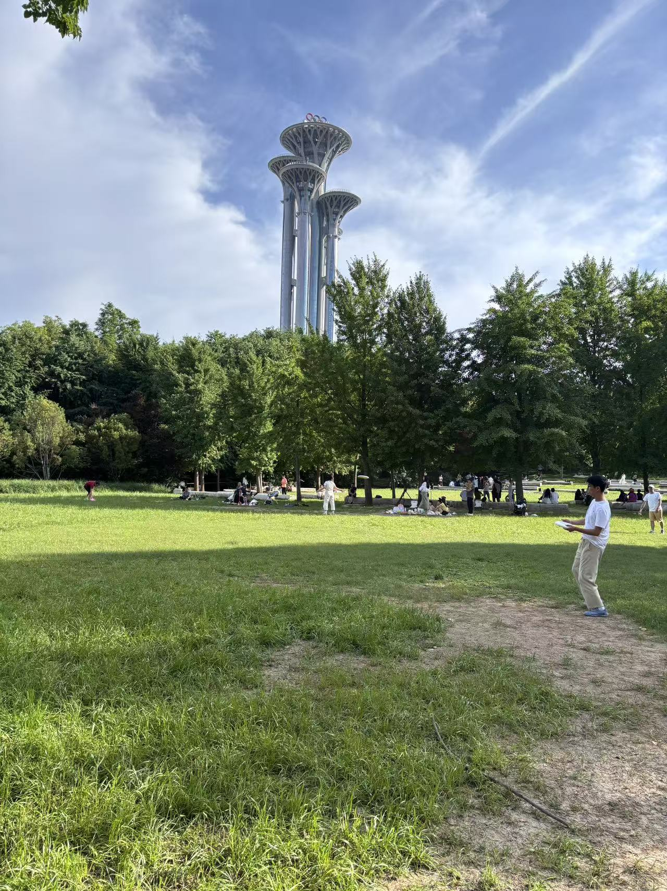

# 2026-端午

- 对象中考监考，也就没回去，一个人在北京过
- 整点儿啤酒，吃点儿肉肠，呼呼大睡，周末的生活就该这样

| 日期 | 事件 | 图片 | 备注 |
| -- | -- | -- | -- |
| 周四 | 真是灾难的一周: 生日被对象记错了日子；  被家里冻卡、对象生病、工作繁忙，感觉自己很难受 | - | - | 
| 周五 | 中午没吃饭，下午去理了个发：  点了外卖，美团买了很多零食，感慨物价真便宜；  开始看指环王 | - | - | 
| 周六 | 时隔两年重新骑车四环一圈，大半程是逆风，不好受啊 |  | - |
| 周日 | 吃火鸡面的缘故，晚上醒了两次上厕所；  中午闷闷沉沉看完了霍比特人2；  午休下，自己去奥森一个人遛弯了下 |  | - | 