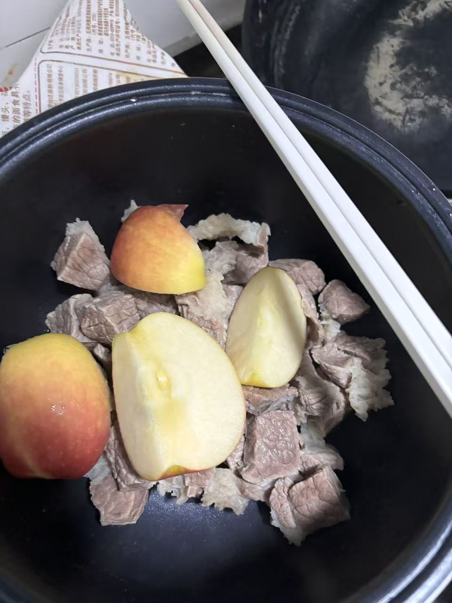
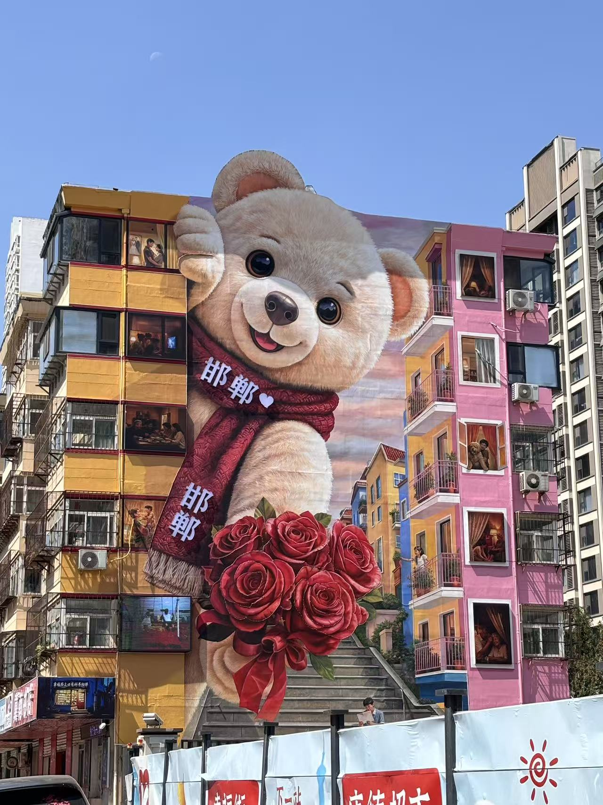
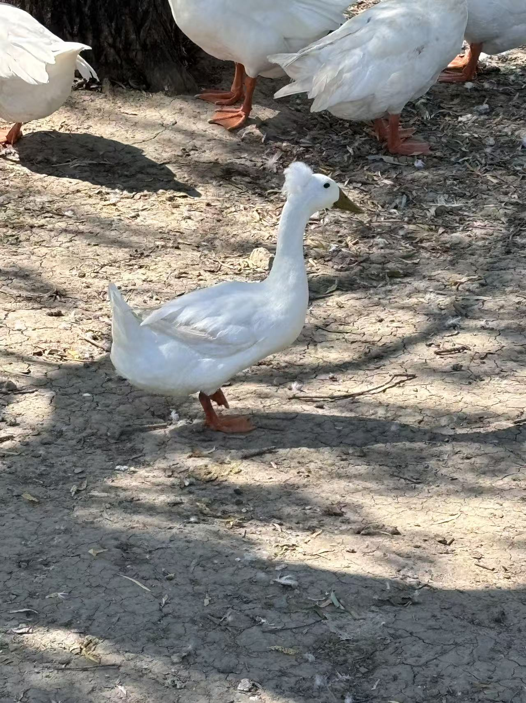
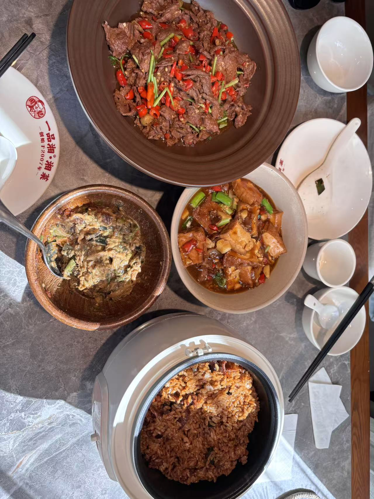
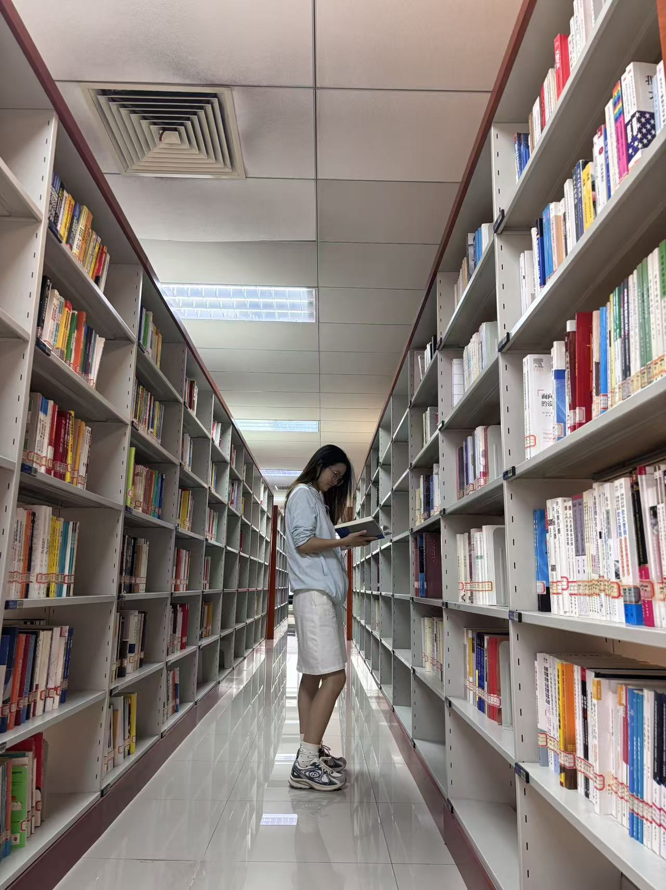
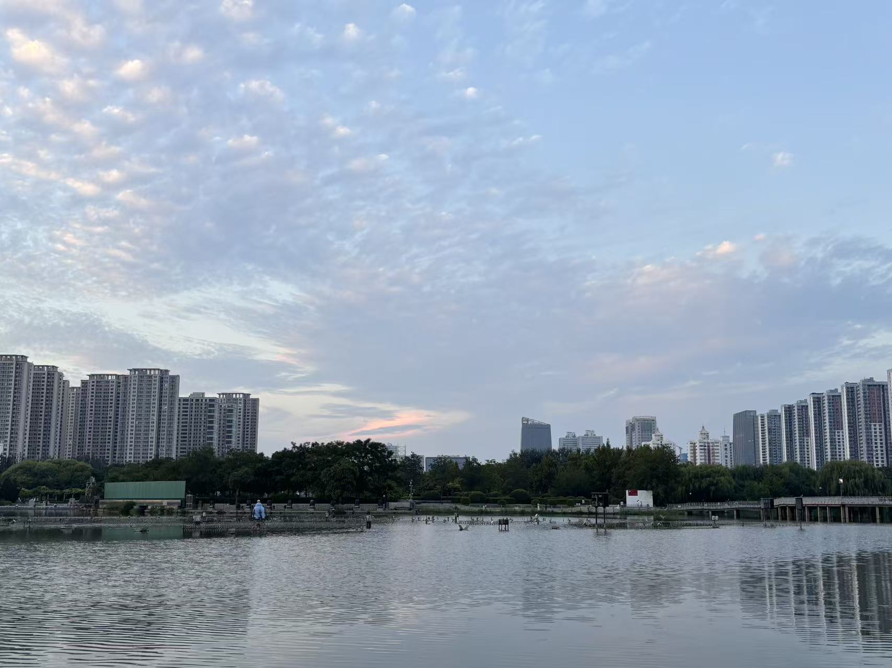
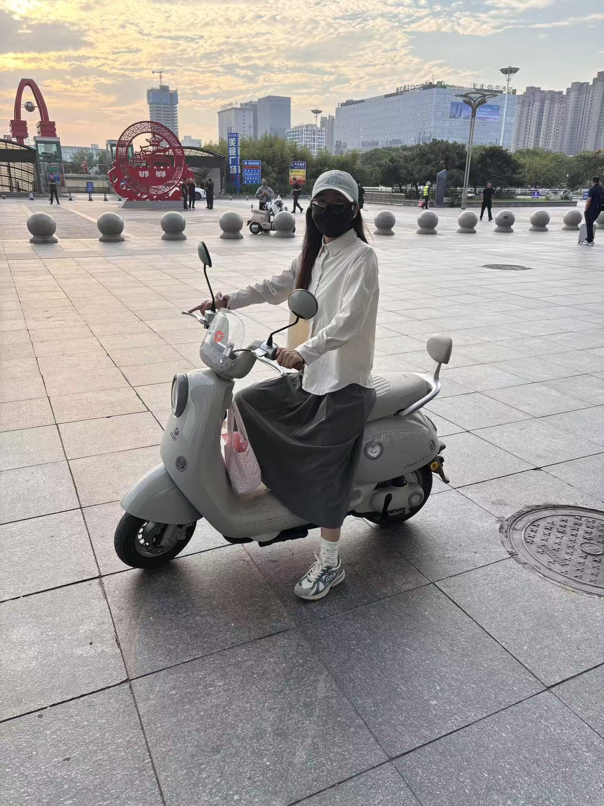

# 2026-09-04

| 日期 | 事项 | 图片 |
| -- | -- | -- |
| 09.04 | - 开了一堆激进的产品对齐会，真是不知道在忙些啥   - 发现高铁有9.30到邯郸的，后面买这个车次   - 晚上王彤买了人参果、苹果、牛肋排，炖了牛肋排 | x |
| 09.05 | - 早上吃的牛肋排、准备去公园，去好想来买了零食  - 骑电动车准备去紫山公园，结果路上看到了沁河公园，先在在路边买了两份手工面，我吃的排骨面，对象吃的牛肉面  - 在沁河公园看到了鸭子上岸，父子俩钓鱼，在公园铺了雨披睡了一会儿，被虫子咬了好多疙瘩。  - 看了康德和sanfu、骑车又去了美乐城，在美乐城逛了逛西西弗书店   - 晚上吃了螺蛳粉、烤冷面、对象还帮忙续了一次螺蛳粉。晚上8.30屯的DQ冰激凌券，买了邦邦硬。   - 晚上出来对象泪崩了，延迟满足感太久了... |     |
| 09.06 | - 早上吃的零食和牛肉，中午读书在沙发上睡了会儿  - 中午2点出门，吃了一品湘，小炒黄牛肉，豆腐，焖饭，擂椒皮蛋  - 打卡邯郸图书馆，好多考编，学生学习；图书馆书比较老旧了  - 美乐城买了茉酸奶，带到了龙湖公园去喝，冰奶沙的感觉  - 在公园从天气晴朗坐到了天渐黑，骑车回来，短暂的周末即将收尾   |    |
| 09.07 | 启程返航 |  |

