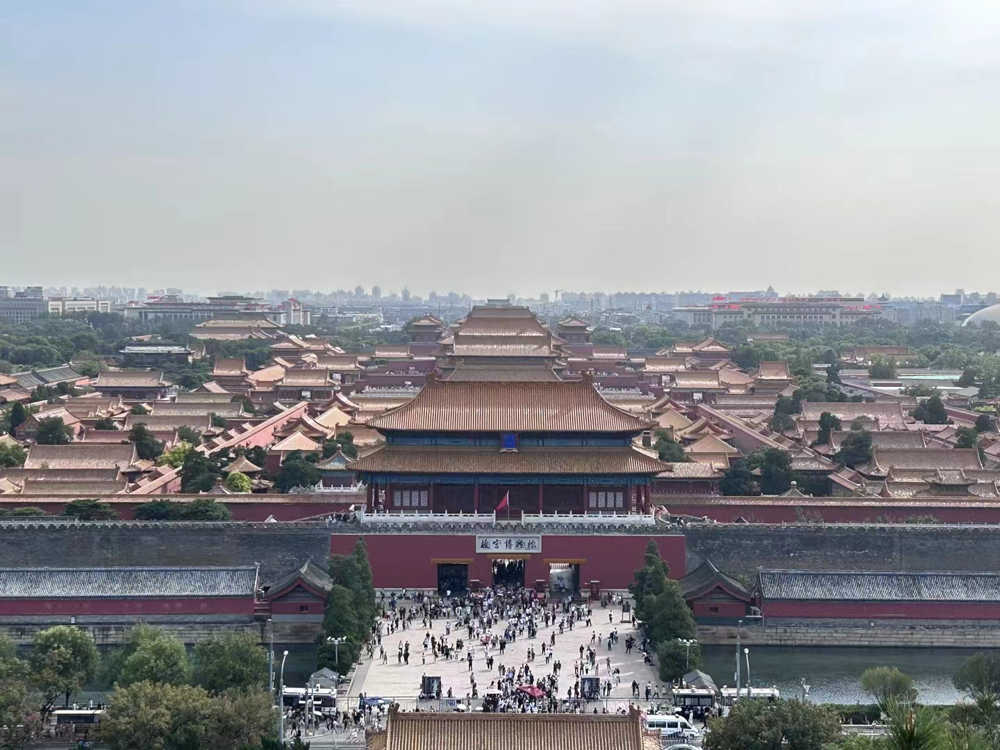
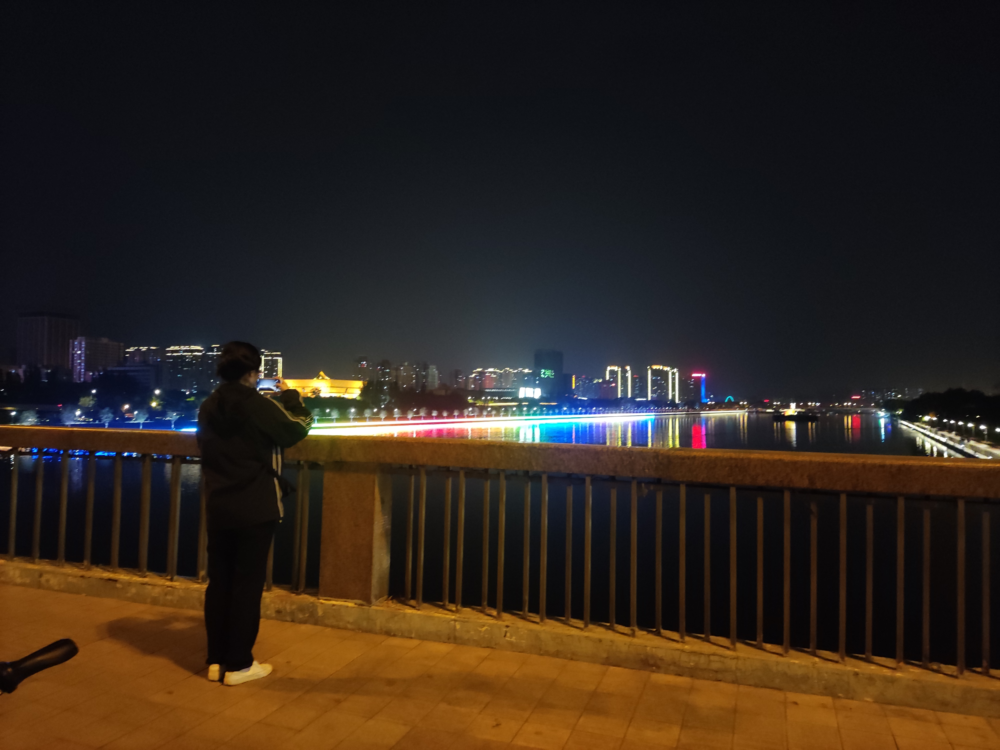
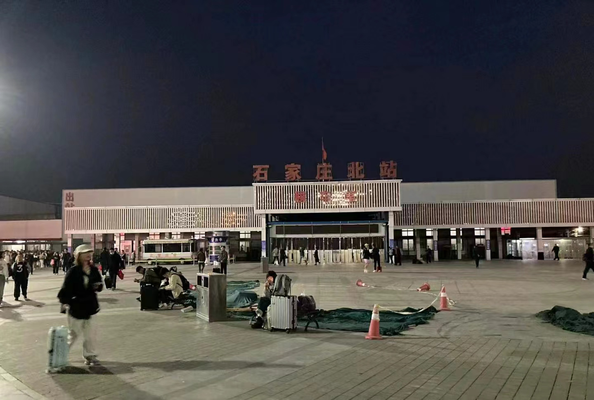
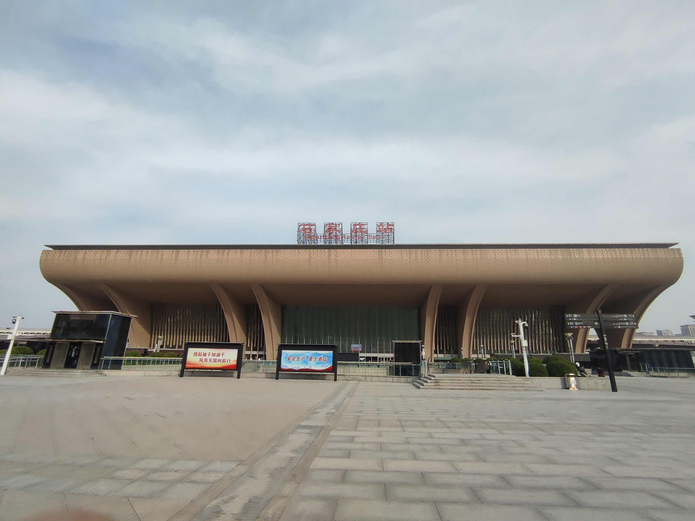
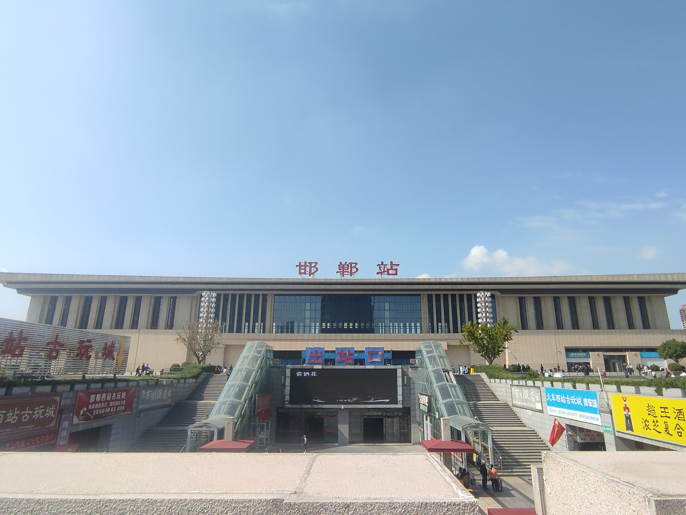
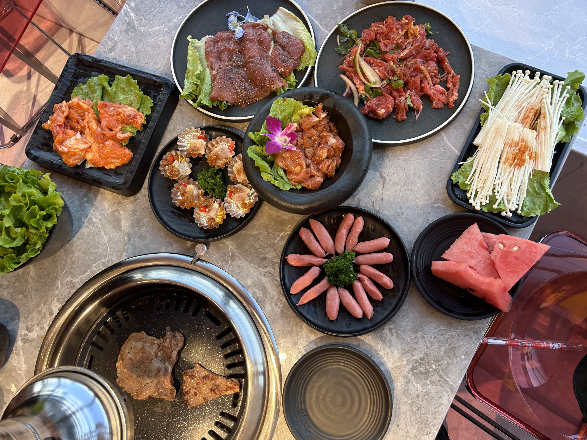

# 2023 国庆节

## 文本记录

- 9.28 - 10.1 北京，骑行景山公园，南锣鼓巷，鼓楼，什刹海
- 10.1 - 10.2 太原，漫步钟楼街与柳巷，骑行汾河。留恋美味平价的烤肉与羊肉火锅，有着人间烟火气的笼包
- 10.2-10.3 石家庄，初次尝试共享电动车，有着惊险与争吵。心满意足与女友共尝一顿湘江小炒。
- 10.4 - 10.7 武安，陪伴家人，给漏雨的墙体补胶，品茶，骑行老家。

囫囵吞枣读了当年明月《明朝那些事儿》，余秋雨《文化苦旅》。

从书籍中，感受到了，无论情形乐观或严峻，要坚持活下去，度过属于自己短暂的一生~

## 图片集

