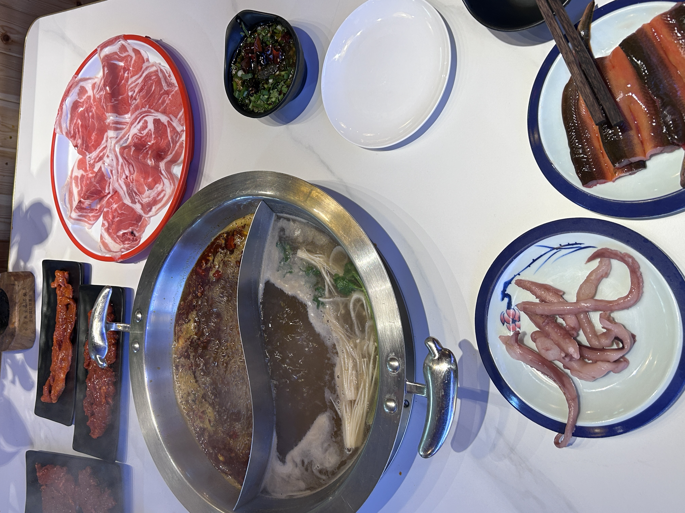

# 2023 石家庄

主人公：大饼与女友

背景：女友双休，大饼想念女友，女友说可以约一次

## 11.18 湾里庙步行街

上午大饼从北京出发到石家庄，10:21到达后，换乘石家庄的地铁

    从石家庄站西口出来，地铁在石家庄站东口，通过负二层进入
    
女友从曲周到石家庄，然后去建华快捷宾馆登记入住

放下行李后，去了老张记鲜切牛肉，排到的号是5号，等了一个多小时（），终于吃上了肉肉

    价格不便宜，抖音团伙130 + 火锅底料28 + 小料 5*2
    11:30排的队，12:30才进去吃

应该是吃了挺多肉，后面觉得腻歪了，遂给女友剥虾

    没指甲，剥虾挺麻烦，还好女友没嫌弃

吃完大概是在（2:20），又蹭了冰激凌
    
    女友不太会挖冰激凌

吃完后回宾馆休息了会儿，聊了聊天（2：30 - 4:00）

逛步行街街，在步行街兜兜转转了一圈，期间大饼上了趟厕所，女友排队兑券 沪上阿姨？

    本来从解放广场准备去勒泰的，然后发现了「湾里庙步行街」

无意间发现了新百商场

    体验了波司登的衣服，喜欢的极寒系列黑色的没有160尺码的
    女友尝试了下AJ 中帮的鞋（价格999），尺码是36.5

导航回到了宾馆，简单吃完后就休息了

    大饼简单工作了会儿，洗了个澡，去下面买了饼卷肉和水

## 11.19 北国商场和勒泰

上午女友洗澡，买了包子和饼卷肉

    女友爱吃酸豆角的包子
    大饼爱吃饼卷肉

磨蹭磨蹭找民宿，民宿名称 「石家庄蓝梦驿站」（美团名称）。
    
    女友18号晚上看到一个宾馆价格66，但19号价格71，专门打电话咨询，对方说不能便宜了
    
    纠结一阵后退房前往

    11.26 隔了一周，女朋友说住宿只要63了，但对我来说性价比也很高了

民宿环境不错，下面就是湾里庙步行街
    
    昨晚刚好在这附近上了公共厕所

在步行街吃了 鸡公煲
    
    店员态度不好，女友不知道辣度多高，店员说你看菜单有 微辣，中辣...

坐地铁去北国商场

    买地铁票的时候，大饼手机信号不好，最后是女友买的地铁票

北国商场价格都还是挺贵的，衣服都是千开头...

    试穿了下耐克的鞋子，没有特别喜欢的后，作罢
    北国商场里的8层还是10层，有个空中大平层，很安静，有一些人在作画

北国超市在负一层
    
    女友通过美团买菜买了些 卫生巾

期间大饼抱怨逛街emo，惹女朋友不开心了，接着草草去看了下勒泰，就乘地铁回去了

    等的脚累，也想快点儿回去看下LOL S13总决赛，抱怨了下逛街有点儿emo
    大饼找借口说自己没有参与感

修整一小时后，女友在抖音上团了 邬三冒烤鸭 的券

    是冒菜+烤鸭的形式，米饭饮料无限取，非常好吃~

接着去买了瓶水，在灯光带下给女友拍了几张照片
    
    手机镜头倒置

## 11.20 启程-离别

上午买了 熏肉卷饼 + 五七路板面（女友吃的洗面，我吃的板面）

女友的舍友说想带霸王别姬回去，等到最后，女友舍友并没下单，遂作罢

在解放广场拍了照片留念，就各自回去了

走的时候（女朋友给我拍的照片）

