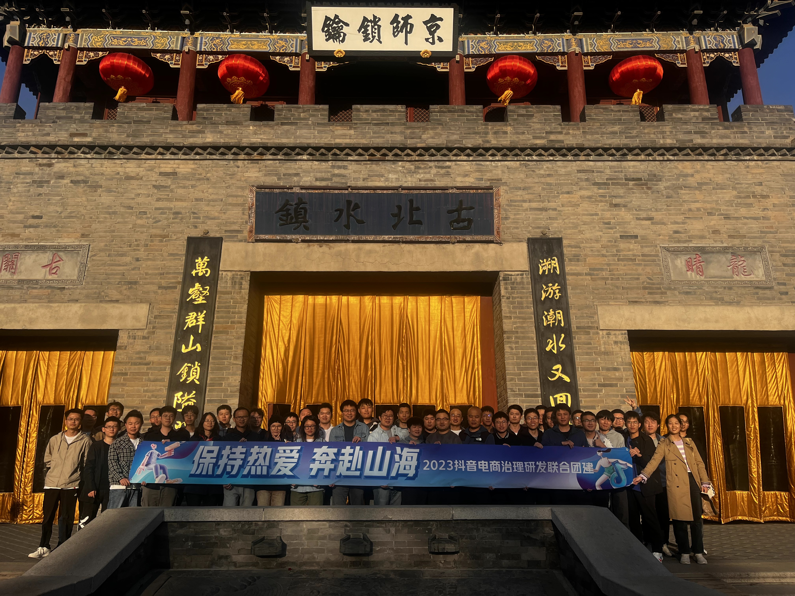
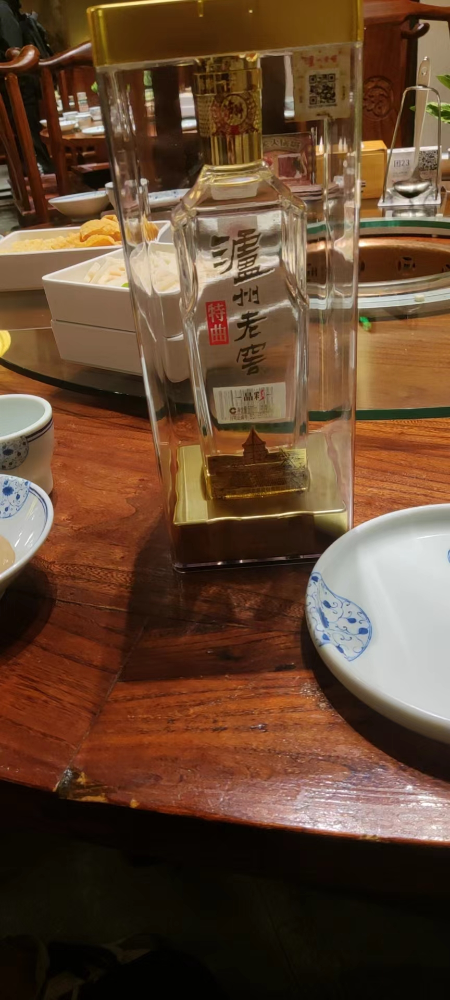
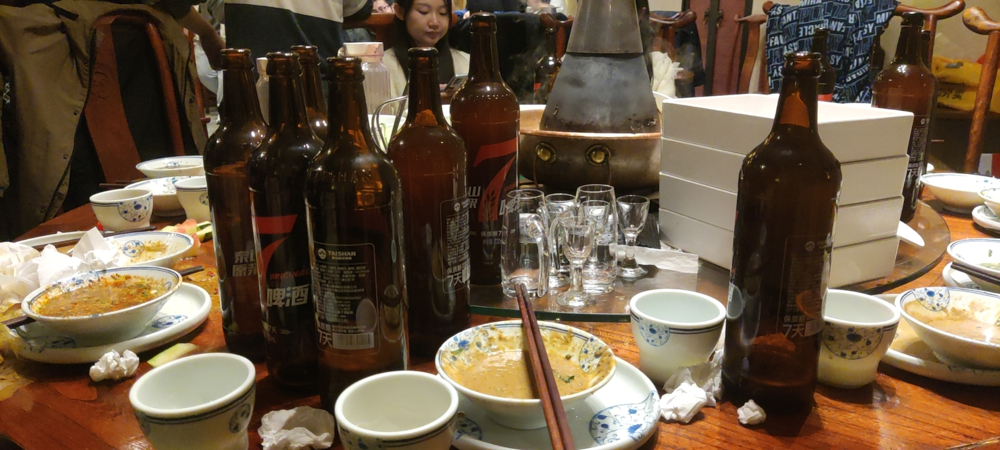
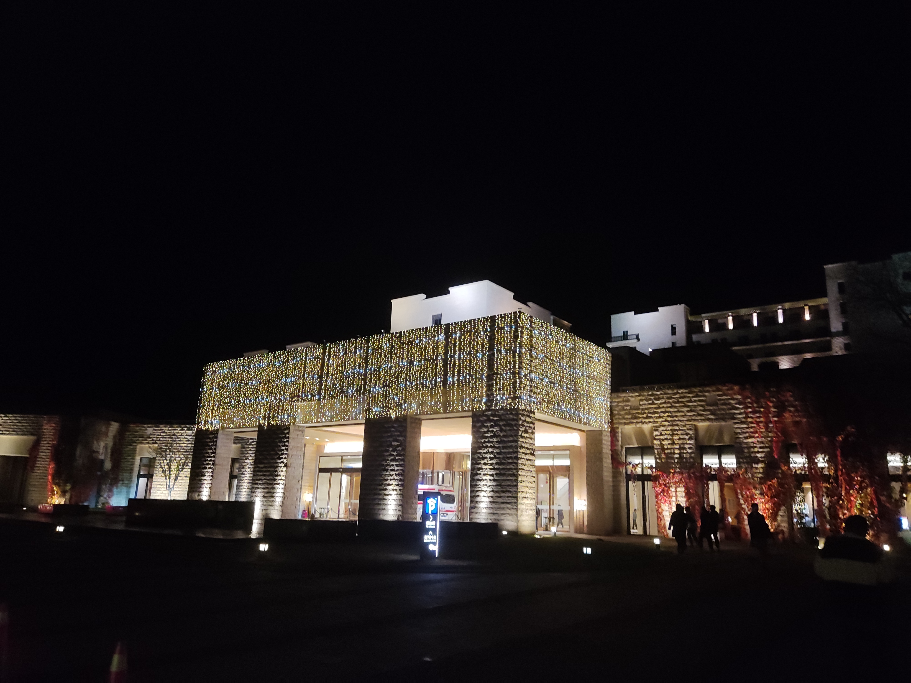
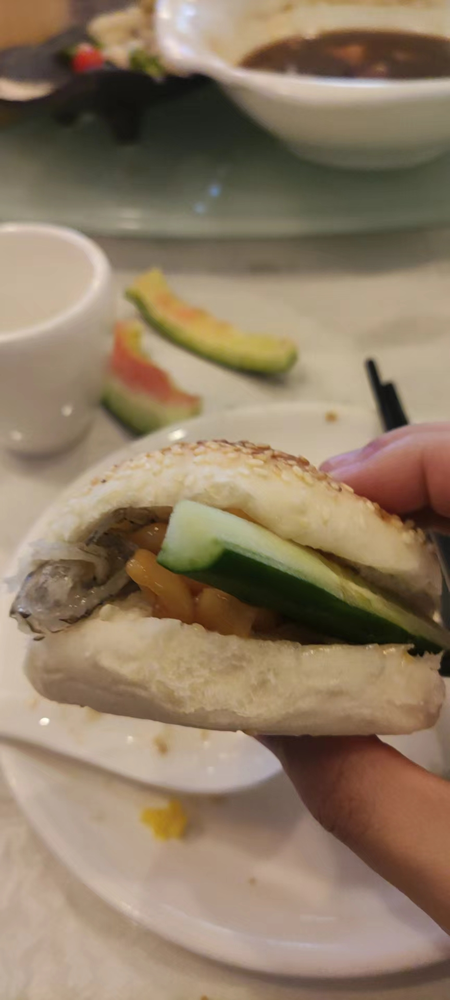
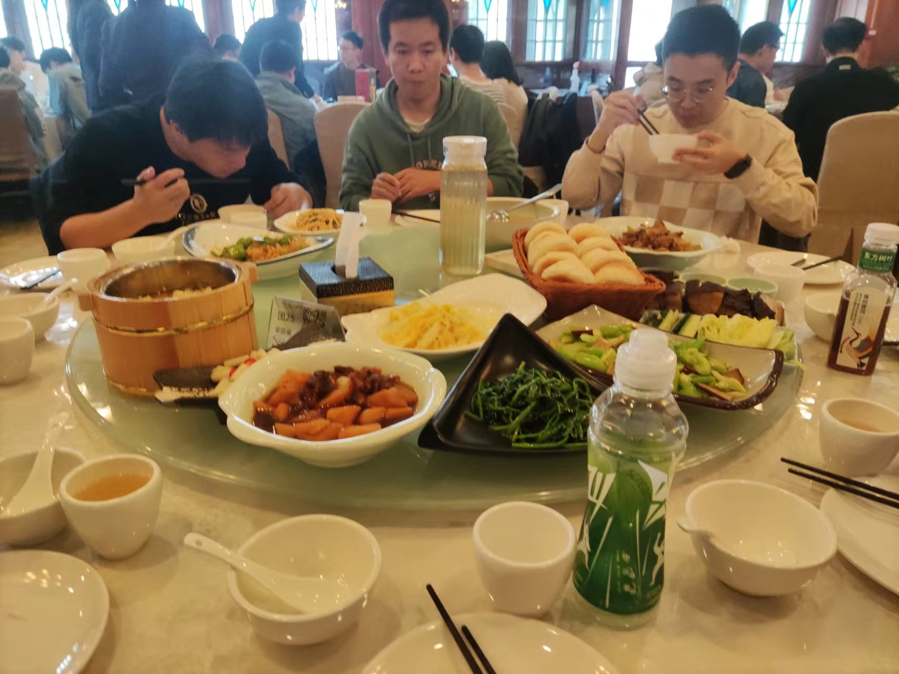

# 2023 团建

团建地：**古北水镇**

团建时间：2023.11.03 - 2023.11.04

## 11.03

11.3 中午出发，3点到水镇，到酒店办理入住。

900+的酒店，住宿的地方有阳台，（厕所的玻璃是个败笔

4点左右集合拍团队的照片

接着漫步小镇45分钟，3号 还是周五，小镇开的商铺不太多，相比4号冷清很多，而且4点-5点天气已经冷些了

小镇观光图

小镇入口

船上表演

小桥流水人家

晚上在一家火锅店吃了火锅，这次喝了接近5瓶泰山原浆（晚上上吐下泻的，下次不能这么喝了）

300一瓶的泸州老窖-晶彩，我没喝hh

喝了5瓶 泰山原浆

小镇酒店灯光

## 11.04

11.4 8点左右起床后，去酒店吃的早饭，早餐样式很多，我只吃我喜欢吃的，炒米饭，香肠

9点45左右和同事一起坐摆渡车去长城的入口，一起去爬长城。

值得提的是，一个00后的同事，我，一个96的同事，96的同事爬到第一个城楼就折返了，00后的爬长城很快，开始爬的时候就已经不见人影了（不得不服年轻人的体力）

长城入口拍照

成功登顶

下长城拍照

山水相间

欢快的鱼儿

烧肉馆，很好吃

3点启程回工区，5点30到，6点骑车到家~
