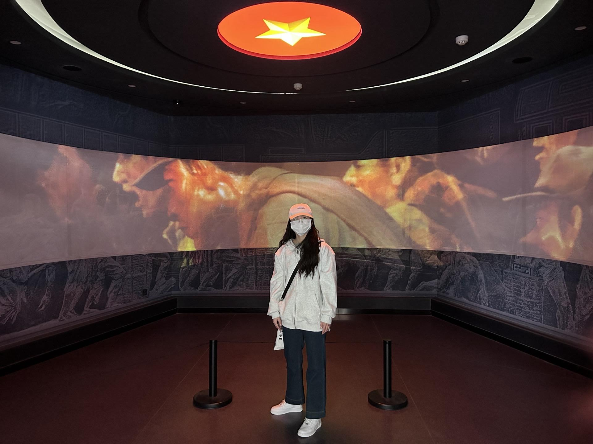

# 2024 清明

主人公：大饼与彤彤

地点：郑州、许昌

背景：大饼和彤彤，清明放4天假（各自多请了一天假），去河南品尝当地风味小吃，了解当地特色文化。

## 4.3 启程郑州

1. 早上5点醒了，大饼本来想穿新鞋，早上出来发现穿的旧鞋
3. 27广场
3. 烤肉
4. 逛丹尼斯·大卫城看了下谢瑞麟
5. 去南大街的路上，刮风下雨半途而返
6. 晚上王彤点的炸串外卖

烤肉调制的海带蛮有味道的

## 4.4 郑州 city walk

1. 对象嫌我没脑子，她在和酒店前台吵架房价便宜，我却在旁边无动于衷
2. 方中山胡辣汤
3. 商都遗址公园&博物馆
4. 紫荆山公园
5. 大象陶瓷博物馆
6. 虢国羊汤馆
7. 中原福塔
8. 千玺广场（玉米塔）
10. 炒凉皮，菠萝，烙馍卷烤串
11. 郑州12345号线地铁都坐了

## 4.5 许昌 胖东来和曹魏古城

1. 早上赶车去许昌，差点没赶上
2. 许昌北坐z3去胖东来
3. 胖东来进门要排队，逛超市要排队，银饰要限时购  9元/g 25.3g
4. 逛完胖东来累了，买了烙馍卷鸭肠和水喝
5. 逛曹魏古城，好多穿古装的女孩
6. 站着z3一路回许昌北站，脚表示歇菜了，不想服务于我了
7. 买的花甲粉还有饼

## 4.6 归途

1. 凌晨4点楼上有人ml，醒了上了趟厕所
2. 早上收拾行李
3. 买了烙馍卷菜
4. 和对象一起坐地铁 4号线转1号线（我往火车站走，对象往高铁站走）
5. 坐火车卧铺睡了一路

## 花费

共计: 1600左右

车票共 592 

- 108 * 2 （王彤郑州往返邯郸）
- 4 * 30 （郑州许昌高铁）
- 93+108 （大饼郑州往返北京）

吃饭共 406 

- 125（烤肉）+17
- 17+65（羊肉烩面，羊汤）+8（凉皮）+10（菠萝）+10（烙馍卷面筋）
- 129.8（胖东来超市）+7（许昌的烙馍鸭肠）+12（花甲粉）+ 5

住宿共 330

- 110*3=330

银饰共 228 （银手镯）

公共交通共 54

- 12 
    * 2+2 我去宾馆，3+3+2 王彤往返
- 20
    * 两个人分别 2（文庙）+3（中原福塔）+3（cbd 玉米楼）+2（回去）
- 16
    * 两个人分别 3+1+1+3
- 6

