# 2024-暑假

## 07.27 女友进京

1. 下午大饼骑车四环，王彤坐高铁进京（天气很热，女友说像中暑了，在高铁站买的饮料）
2. 晚饭一起吃的眉州小吃双人套餐，有担担面，炒饭，茄子，酥肉，大饼从家拿了瓶冰镇的饮料

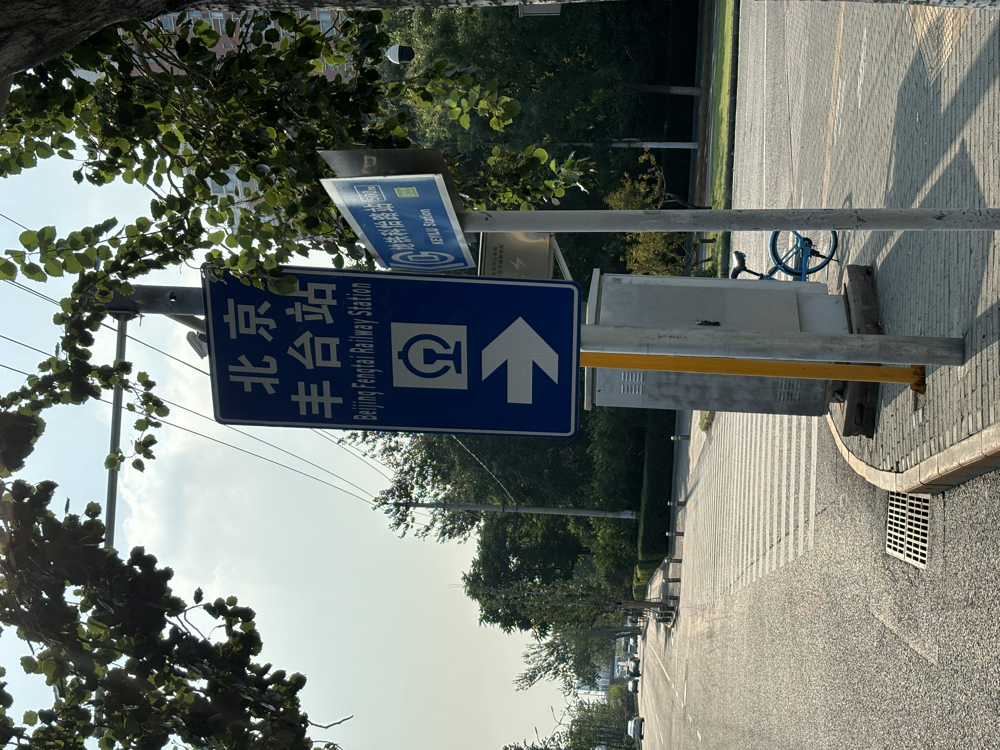
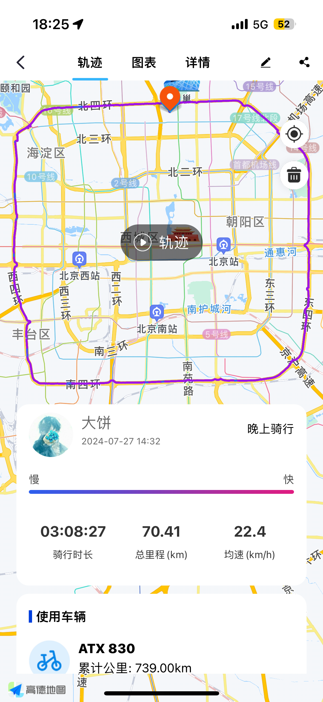

## 07.28 周日吃自助消遣

中午品尝了牛肉火锅自助，在超市买了西瓜和酸奶

## 07.29 周一通知去上海出差

1. 王彤在屋里自己煮面，大饼下午被通知去上海出差。
2. 晚上大饼纠结了很久给女友买票

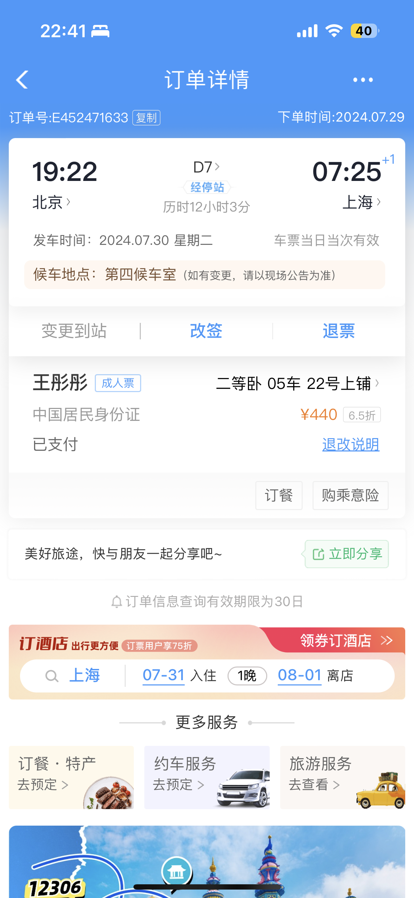

## 07.30 大饼启程上海

1. 早上下大雨通知居家办公，一起出门买了烧饼、羊汤，去超市买了泡面和雨伞
2. 大饼下午打车去北京南站，坐高铁前往上海（除了北京，路上的地方都是大晴天！）

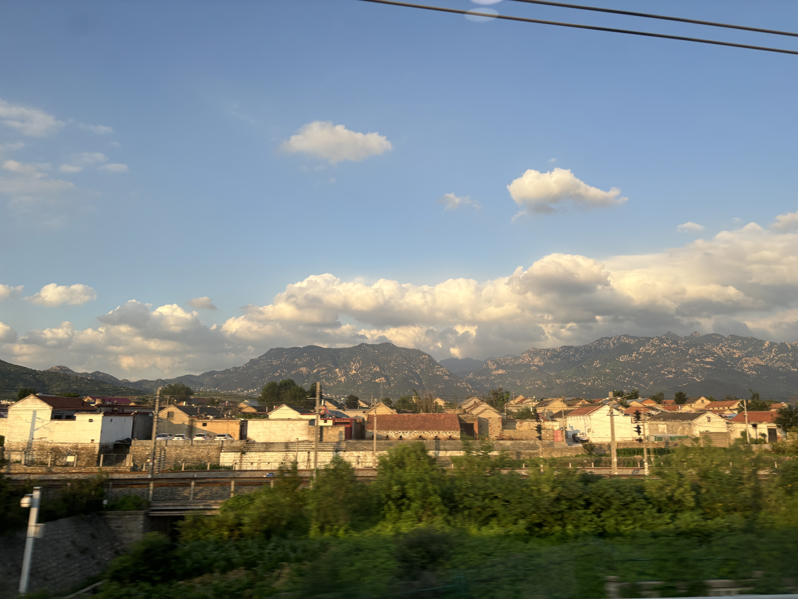
## 07.31 王彤初见上海

1. 王彤早上动车到上海，大饼早上去接
2. 王彤去了复旦大学，在商场里吃的牛肉拉面和生煎包（本来想买生煎包，没找到吃了拉面，没想到生煎包就在拉面旁）

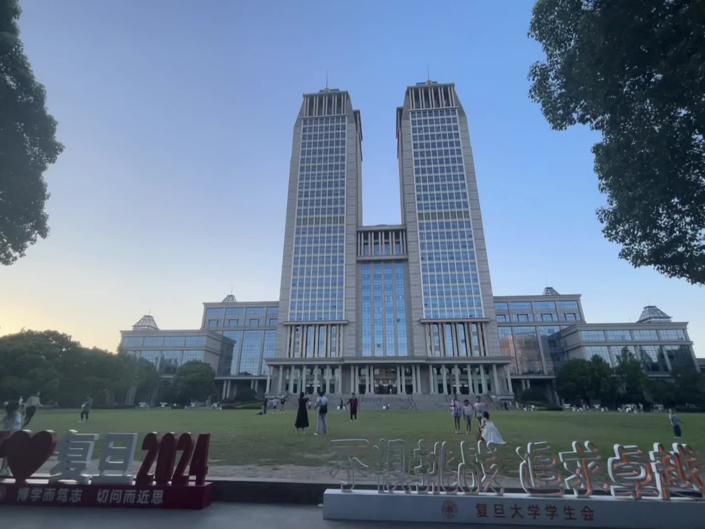
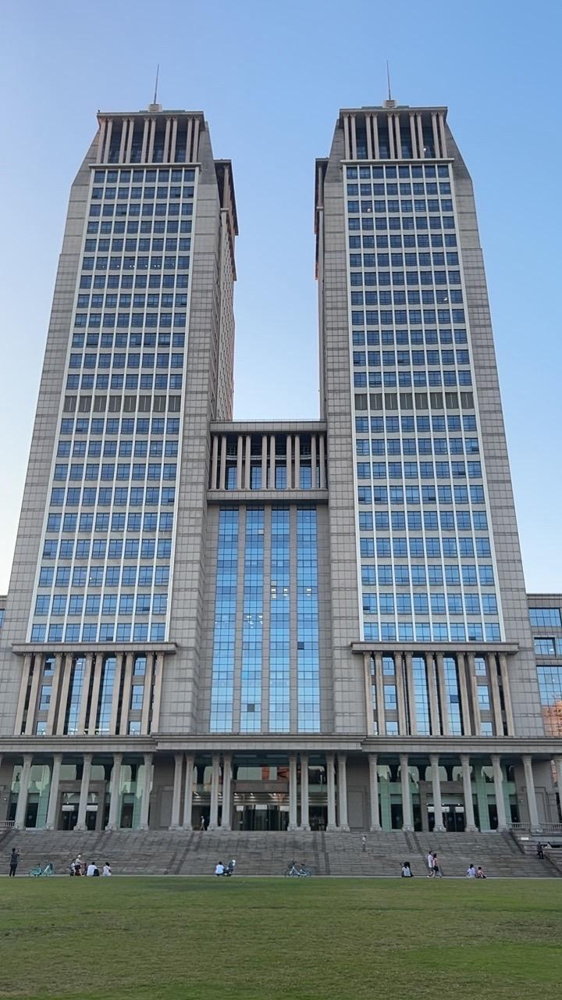
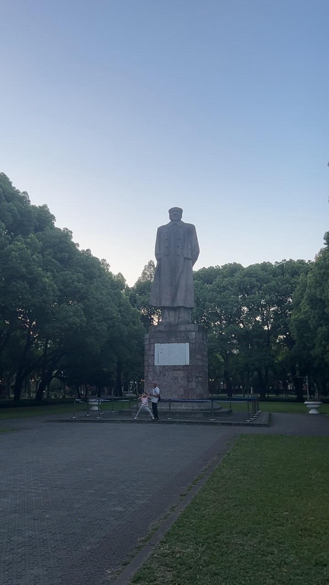
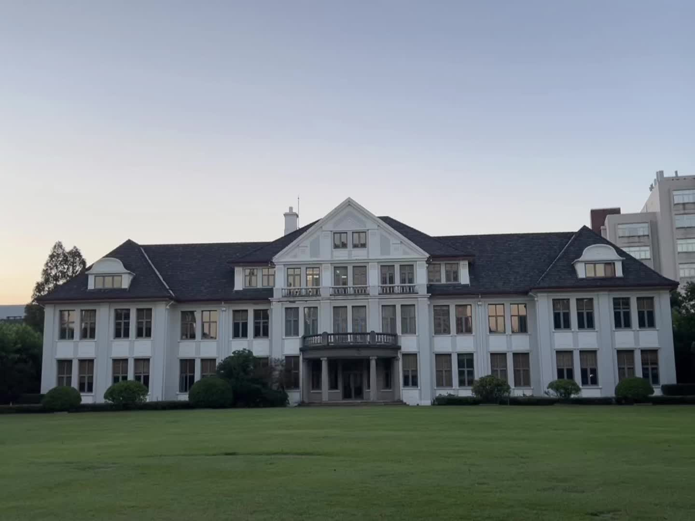

## 08.01 王彤于上海遍古寻今

1. 参观上海博物馆，买了个玩偶
2. 骑车➕步行到陆家嘴-骑车➕步行东方明珠（到楼底下了没买票）
3. 骑车先到了外滩对面（人少）-坐轮渡到对面拍照-步行到豫园地铁站回

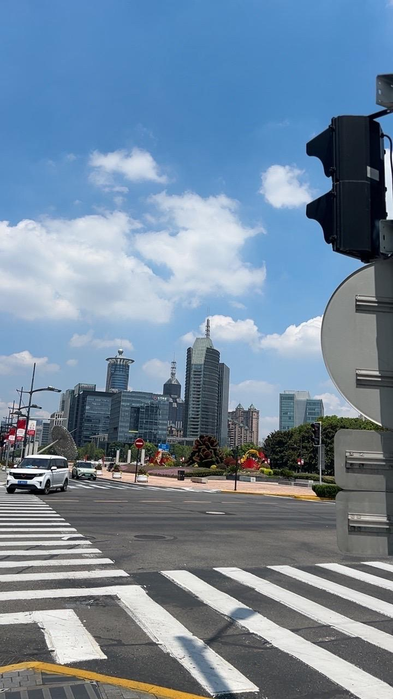
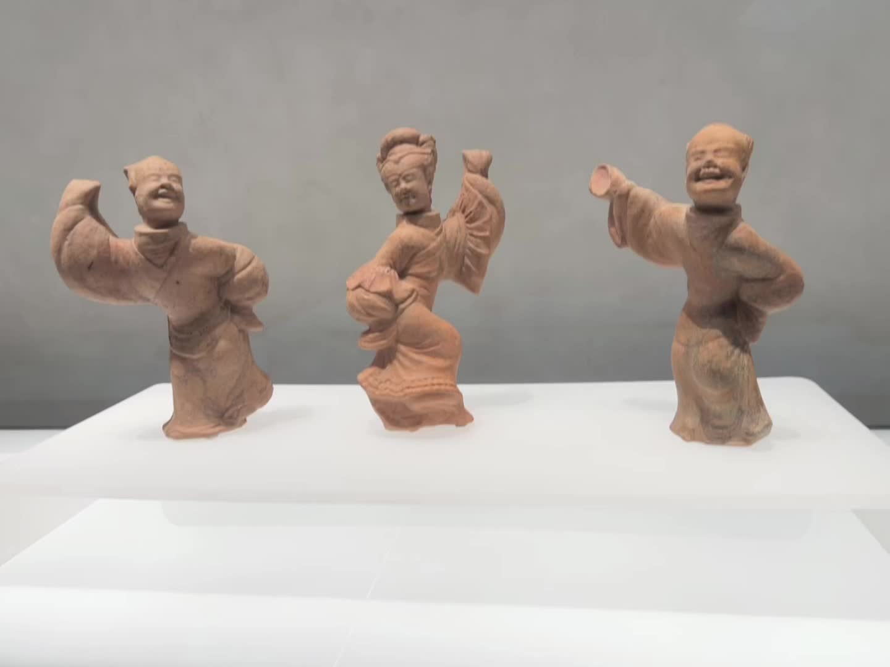
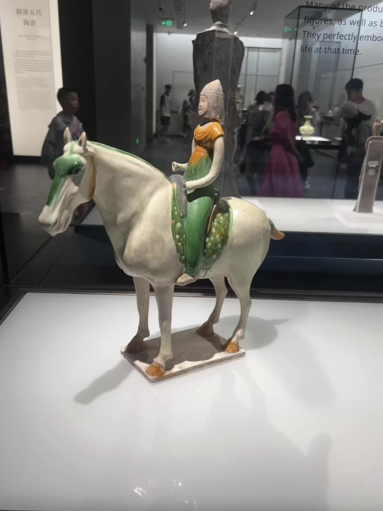

## 08.02 再次打卡上海网红地

1. 王彤逛共产党一大、二大会址
2. 王彤一个人逛梨园（类似步行街）
3. 在上海外滩拍照（女友吐槽照片没拍好-.-），从南京东路回宾馆

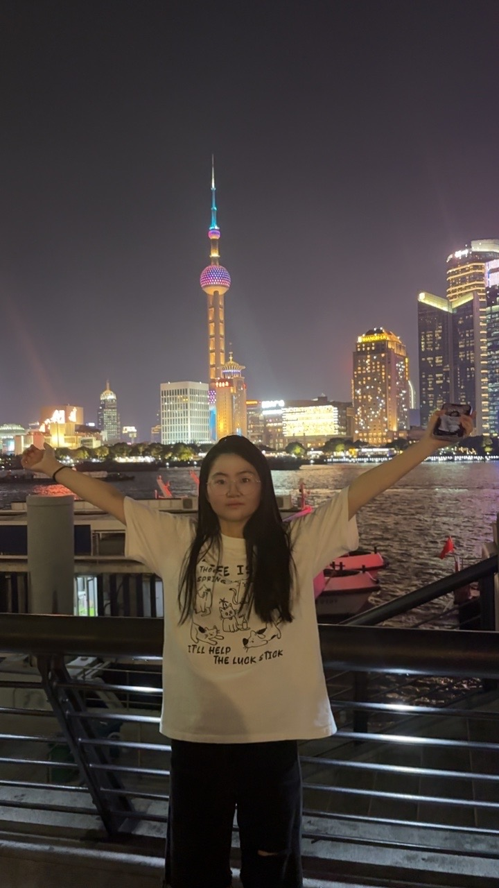

## 08.03-08.04 返途

08.03 大饼中午的高铁回北京；王彤坐火车到安阳（没买到卧铺，坐了一晚的硬座）

08.04 王彤安阳->邯郸->肥乡

