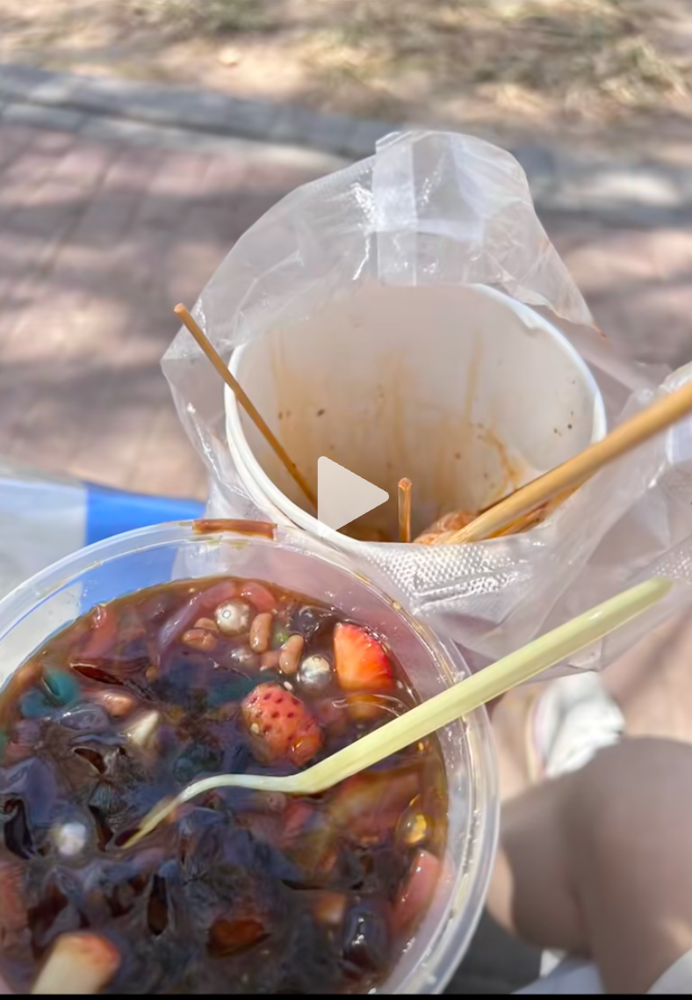
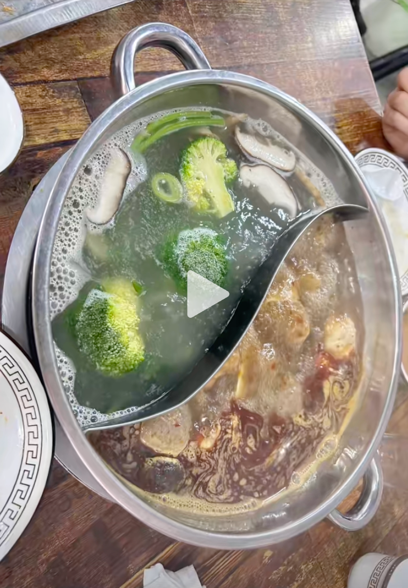
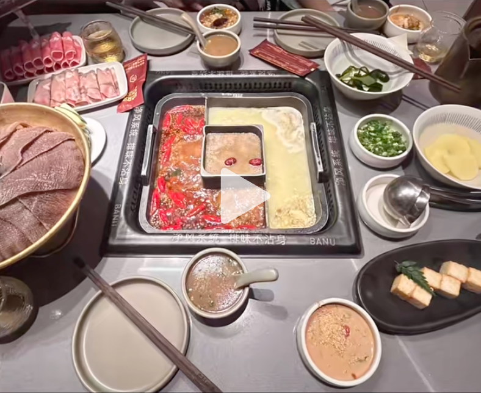
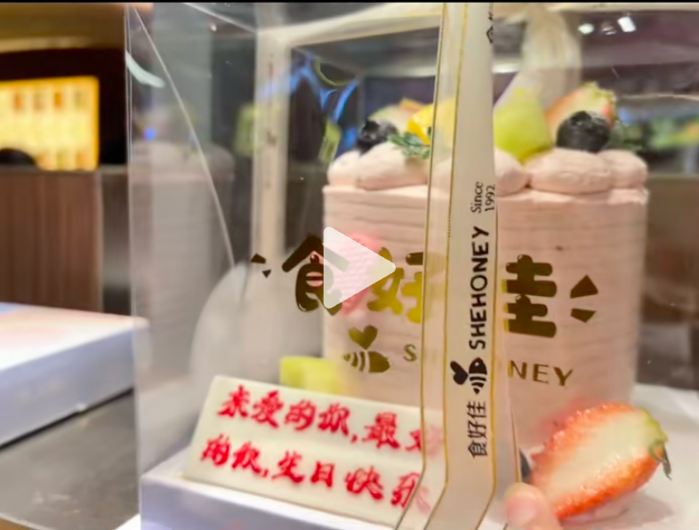
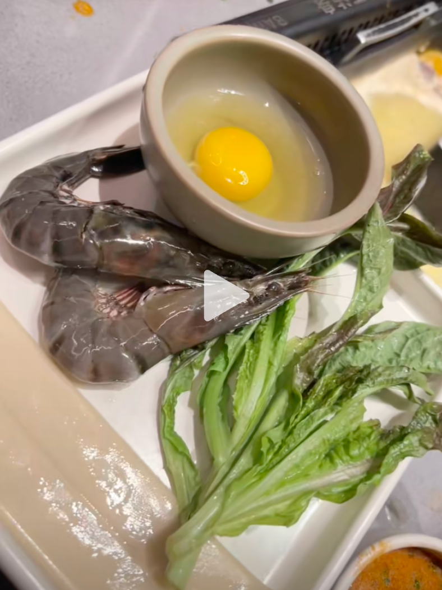
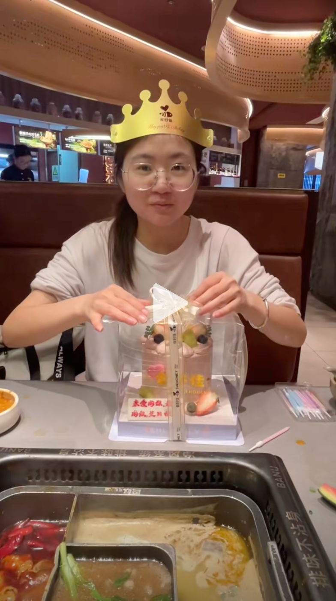
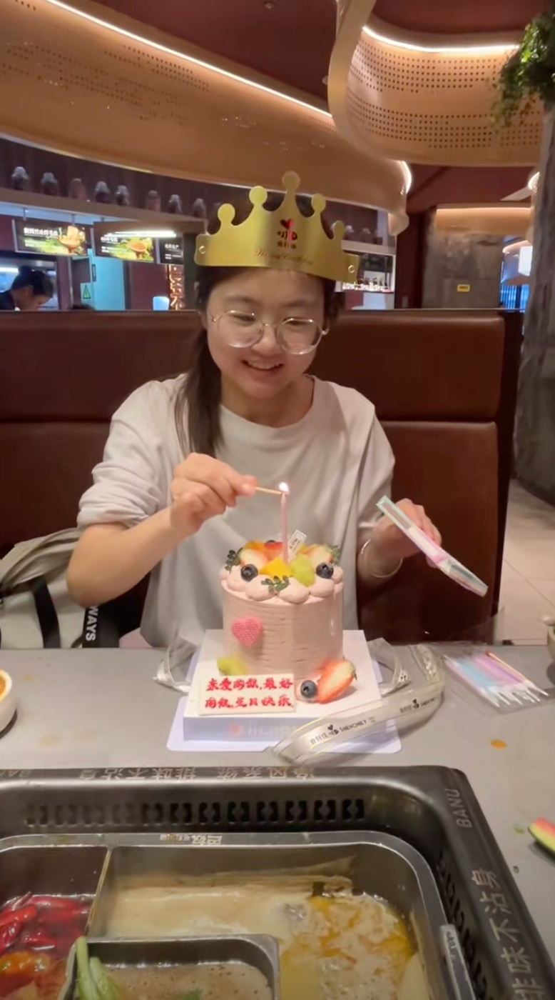
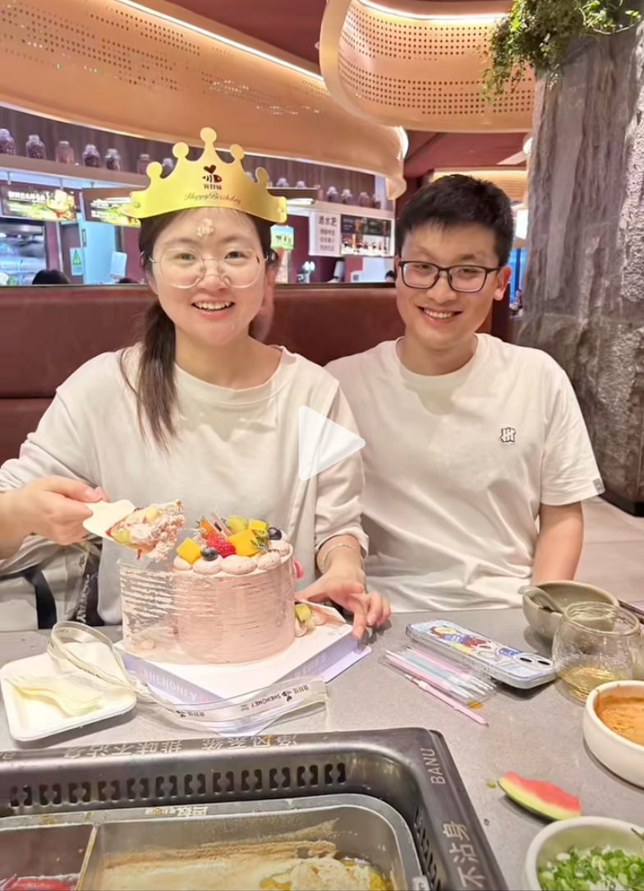

# 2025-清明

## 04.04

提前一天（04.03）在线下店买了达美乐披萨（买一赠一）

买了周六福项链、带了电脑送给女朋友做生日礼物（尴尬的是，回邯郸忘拿手机充电线了）

和女朋友磨了下口角，接着去了天鸿吃了河北小放牛，有三个菜：嘎嘎鱼、家常豆腐、鸡排

吃完以后，又闹了小别扭，我一个人去看了问界的车，女朋友去看了阿迪的鞋

晚上一起看了《苦尽甘来遇见你》的最后一集，重温一遍还是会哭😭

## 04.05

中午逛了植物园，在路边吃了冷串和冰粉儿

紧接着打车去了结石医院报销了中药的钱，骑车到了康德附近，吃了小火锅自助

接着去新世纪逛了亚瑟士，由于鞋子超了心里的预算，没买，女朋友不开心（当时风还挺大，两个人互相不搭理）

## 04.06

陪王彤在美乐城过生日，吃的巴奴火锅，常同学在网上预订了蛋糕，出人意料的是火锅店送了长寿面

骑自行车到邯郸站，时间很赶，一路上骑的腿都酸了，好在有惊无险，赶上了列车，只是由于天气的原因，上车后没有空调，一直在出汗

在火车上，刷了500-600道科目四的题

接着看了电影《六大队》，讲了嫌疑人有预谋作案，并故意让哥哥被警察逮捕，被警察误伤致死，整个六大队都坐了牢，出狱后为了弥补死去的师傅的遗憾，最终将嫌疑人抓捕归案的故事。

最后有惊无险的赶上了10号线的最后一班车，海淀黄庄->健德门，洗个澡结束了本次的清明节