# 2025-五一

## 05.01

王彤早上去邢台参加妹妹的成人礼，然后开车来邯郸。

在丛台路附近住的，路上闲逛去赵一鸣买了水和零食

走到了老万达，想找王彤高中吃的米线没找到

骑车回到了青年路，晚上买了小龙虾，西瓜(小吊瓜) ，麻辣拌吃

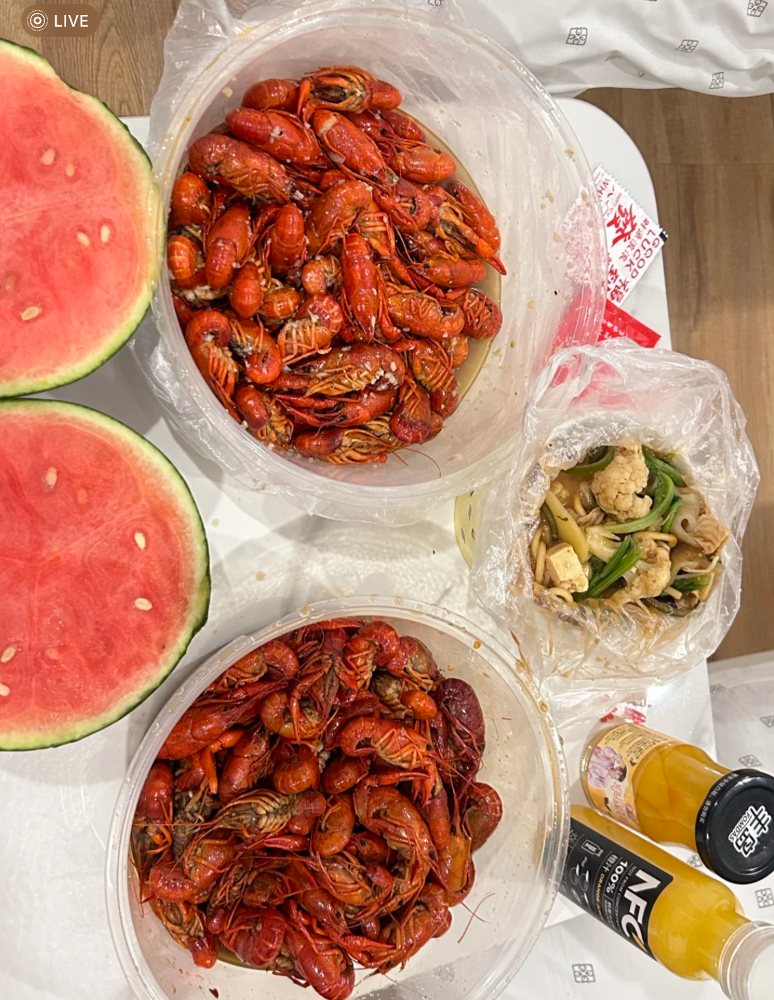

## 5.2 

开车去中介店门口，在门口的野尚膳吃了包子，中介带看了一天房子

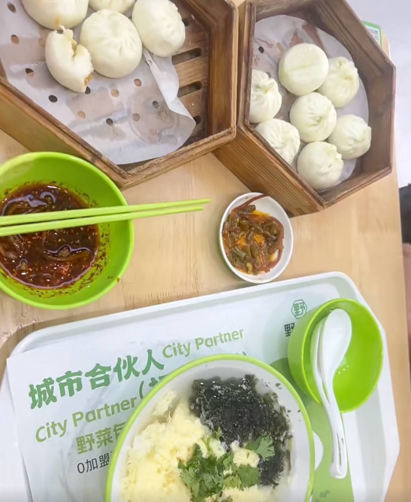

中午中介请吃的饸洛面

一天下来看了新科园、枫丹白露、东尚名庭、荣盛官邸

晚上王彤点了米线，大饼吃的零食

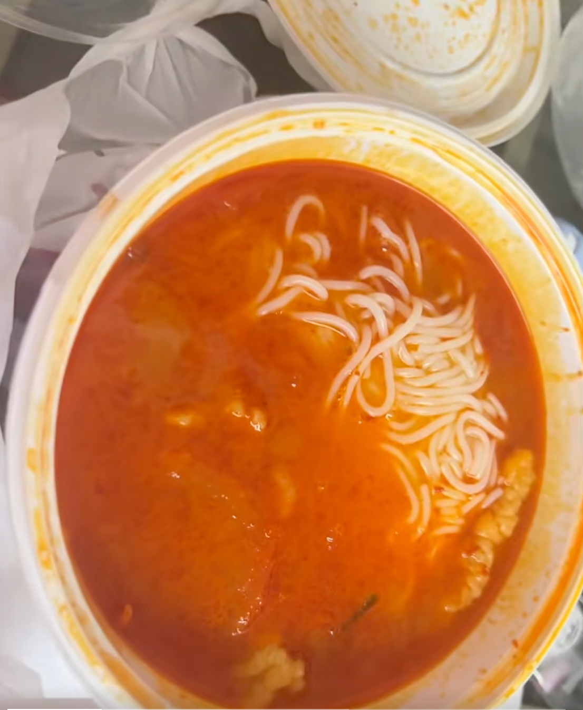

## 5.3 

早上在酒店吃了早餐
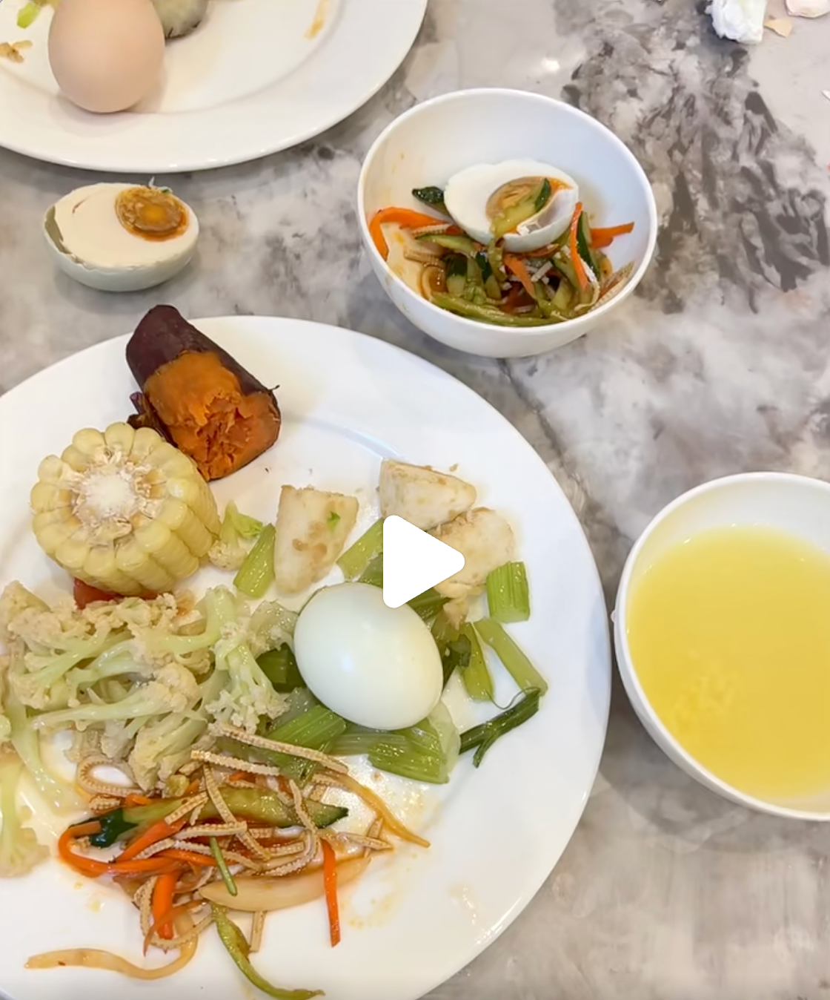

中午在罗兰春天附近的店吃的西红柿鸡蛋面，凉皮

回来晚了，酒店那里没有停车位了，并且风还挺大，好在前台引导我们停到了小区的停车位里，停车位还是升降的，挺高级！

晚上在酒店附近吃的鸡公煲

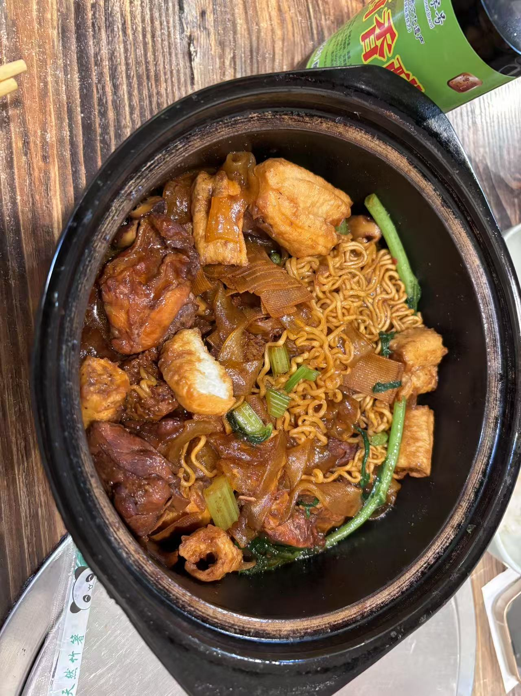

一天下来看了东部美的城、罗兰春天、君兰苑

看了看房子，晚上买了优衣库的衣服

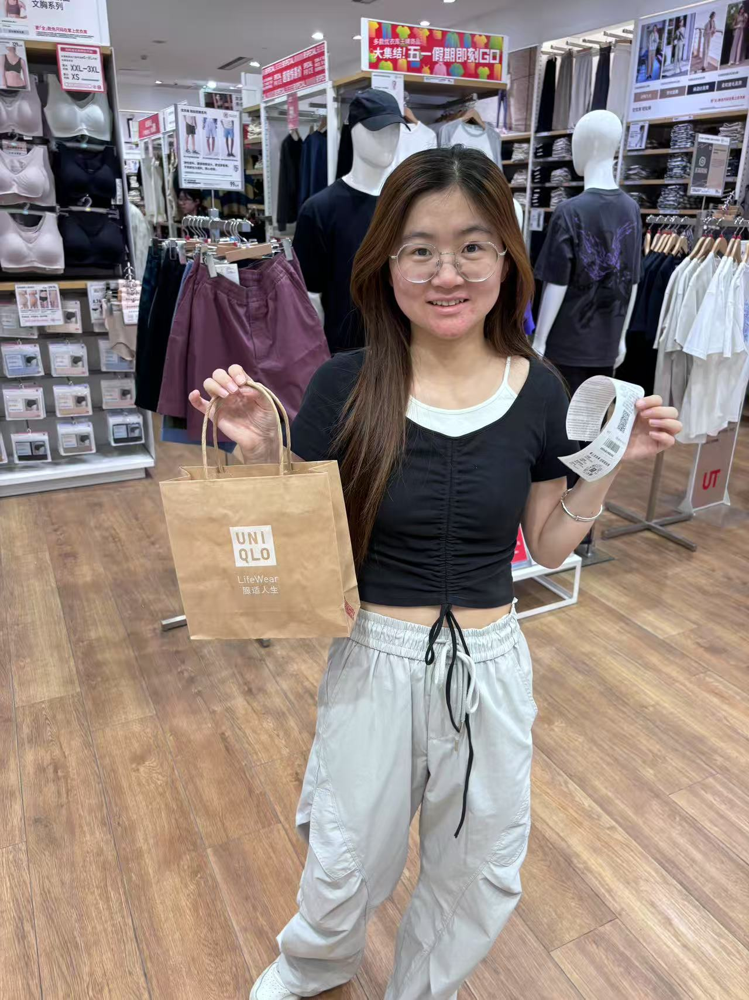

## 5.4 

早上酒店早餐

中午蛋炒饭，炒河粉

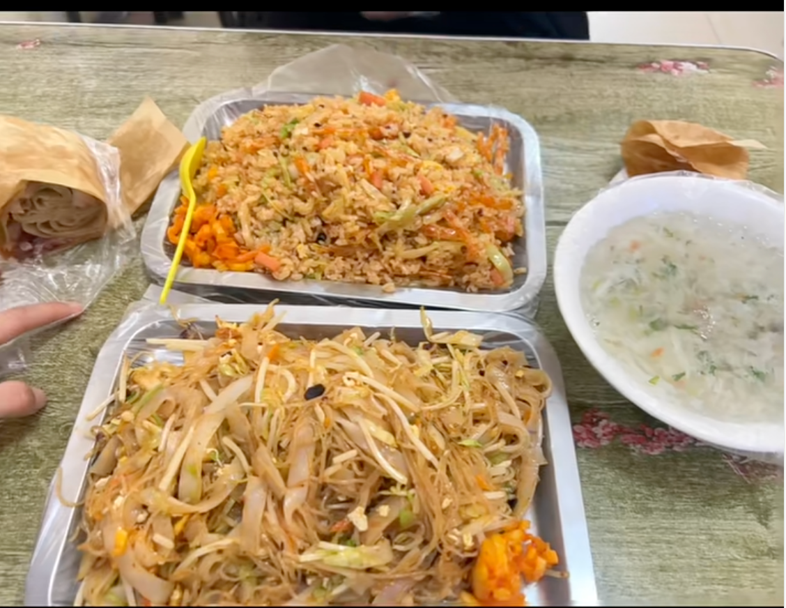

下午先找到了常同学，一起去了滏阳公园，然后常同学领我们逛了紫金台，算了下价格，140平的房子单价比130平的房子还便宜

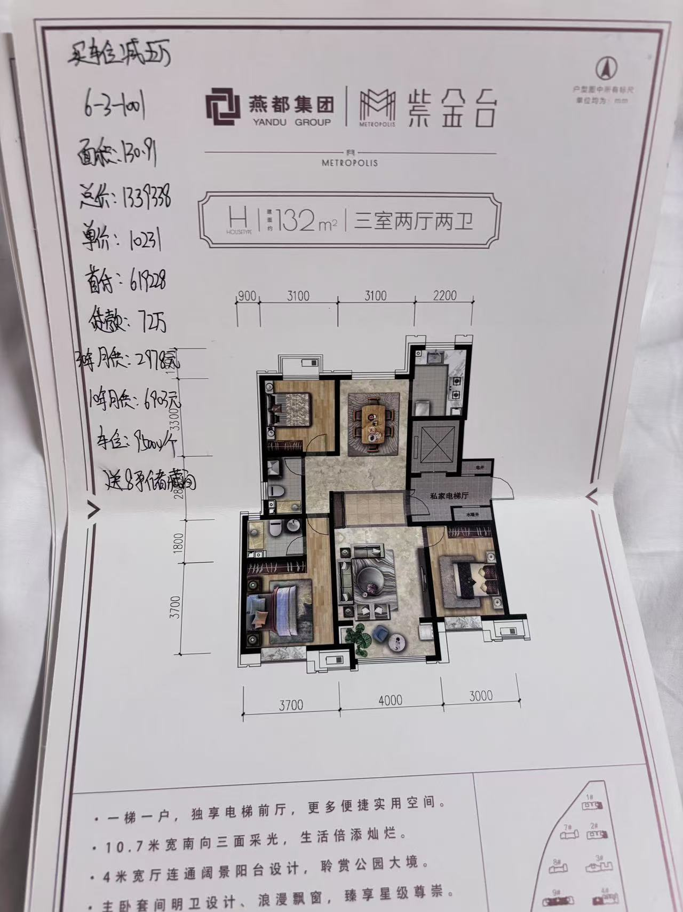
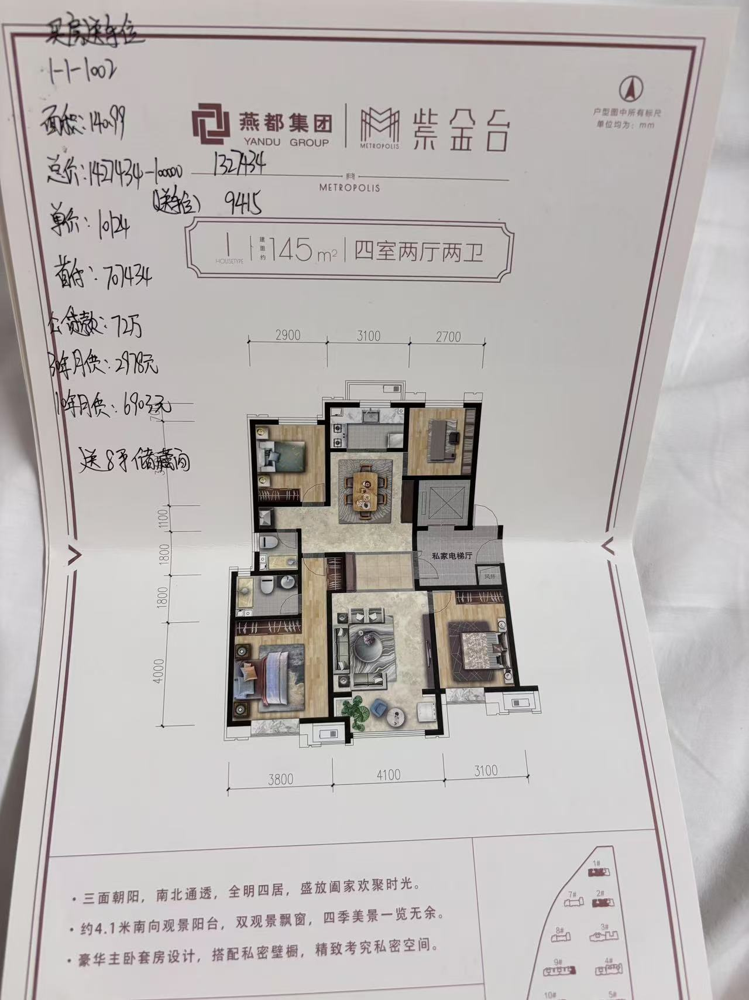

晚上在人和小区东侧买的麻辣拌，鸡蛋灌饼，炸鸡（没吃完）

值得一提的是，大哥给的麻辣拌分量很足，两个人都能将将吃饱！

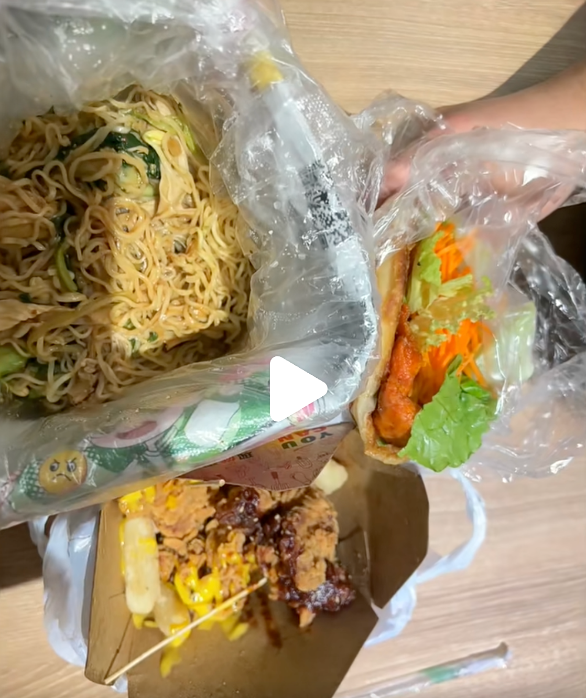

## 5.5 

骑行去了新丹兰，附近吃的平锅鱼，家常豆腐，没吃完

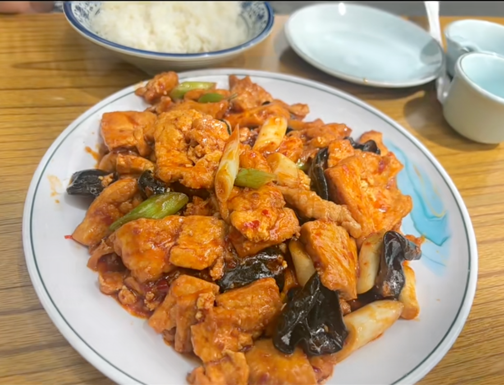
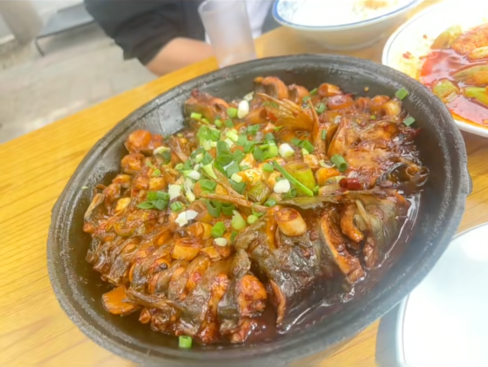

下午先去美乐城薛记炒货，又在天鸿的好想来买了些饮料喝的

晚上坐808回家，家门口在修路，还有感受就是共享电动车明显变少了

## 5.6

早饭吃了大肠，猪头肉，油条

下午坐火车，想去康德附近买吃的，但没有

晚上买了饼加鸡蛋火腿，回来洗漱洗衣服

假期结束，期待再会！

## 附录

[看房记录](https://docs.qq.com/sheet/DU05oSUVOY2xNUFdh?tab=BB08J2)

