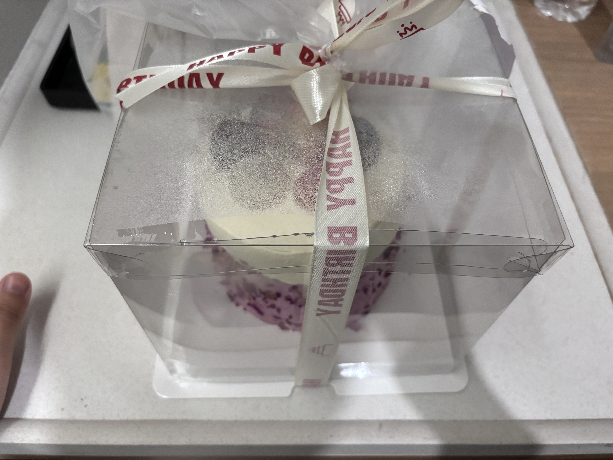
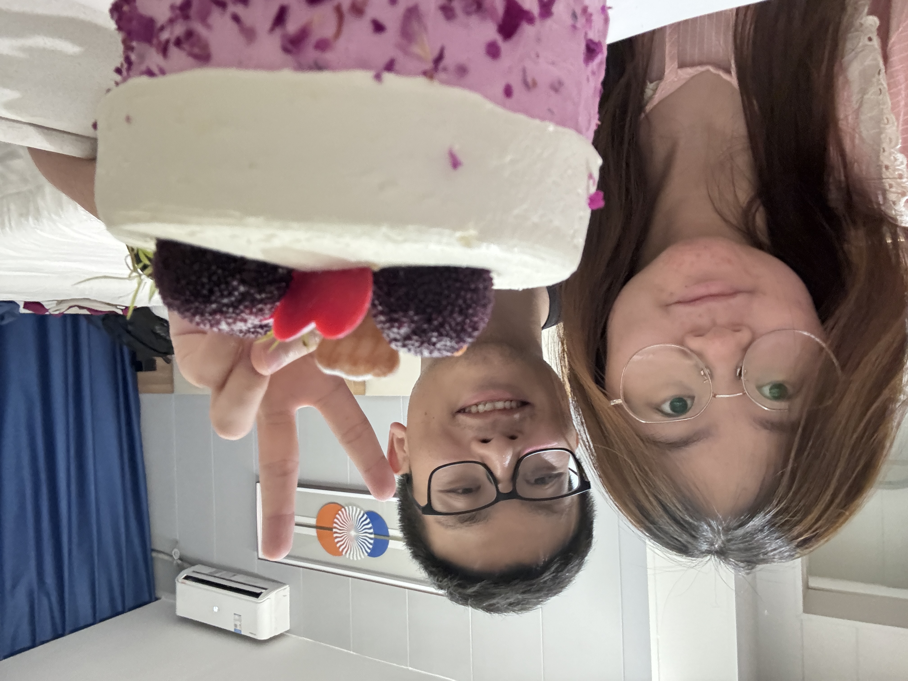
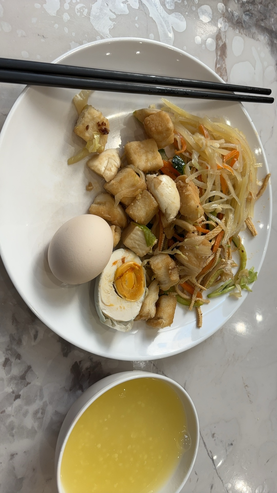
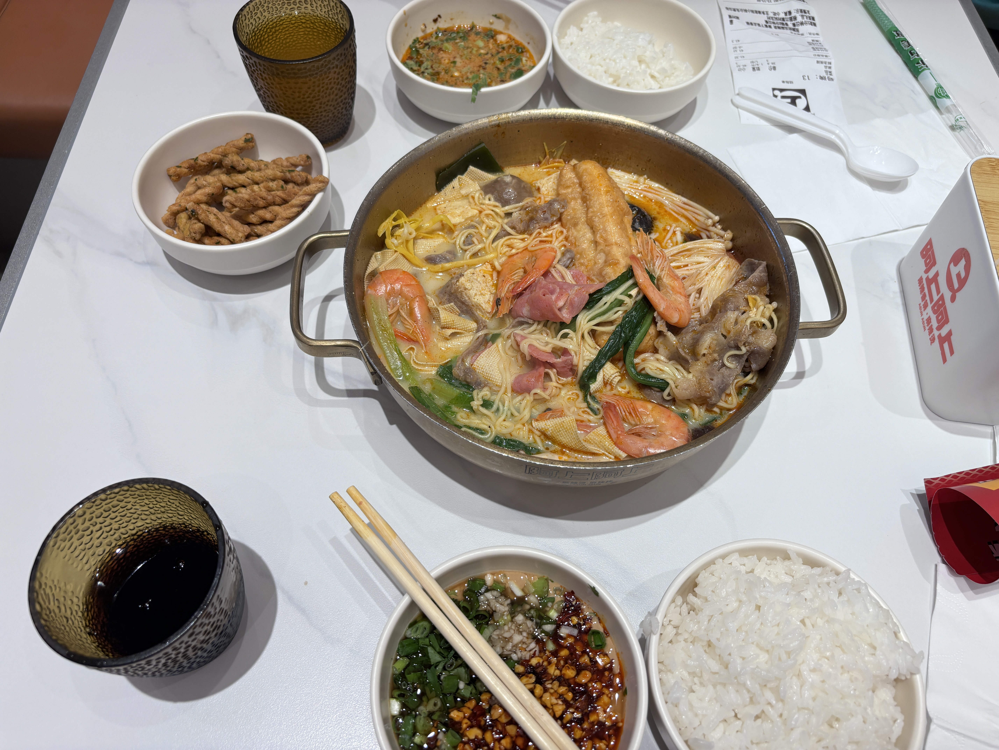
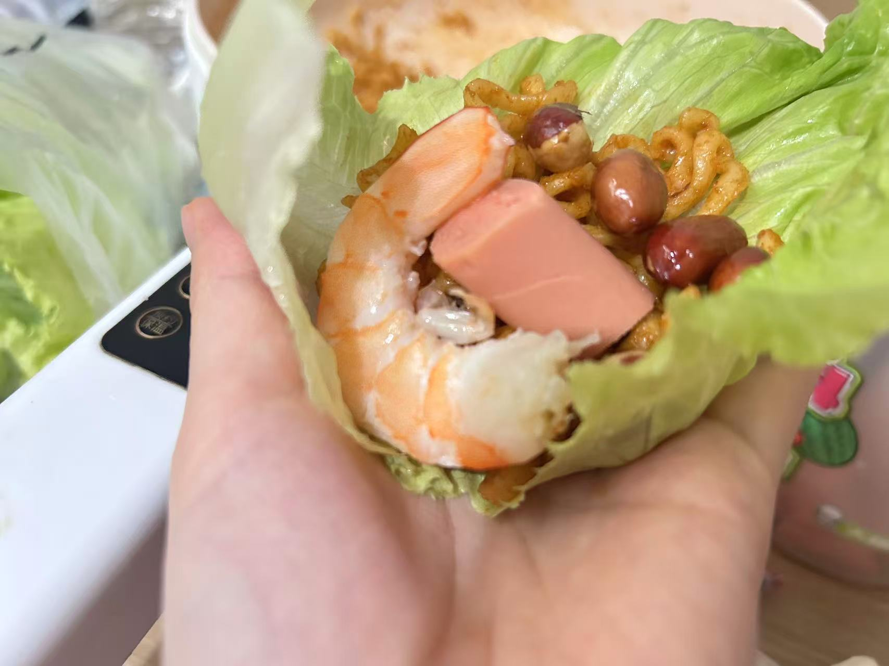
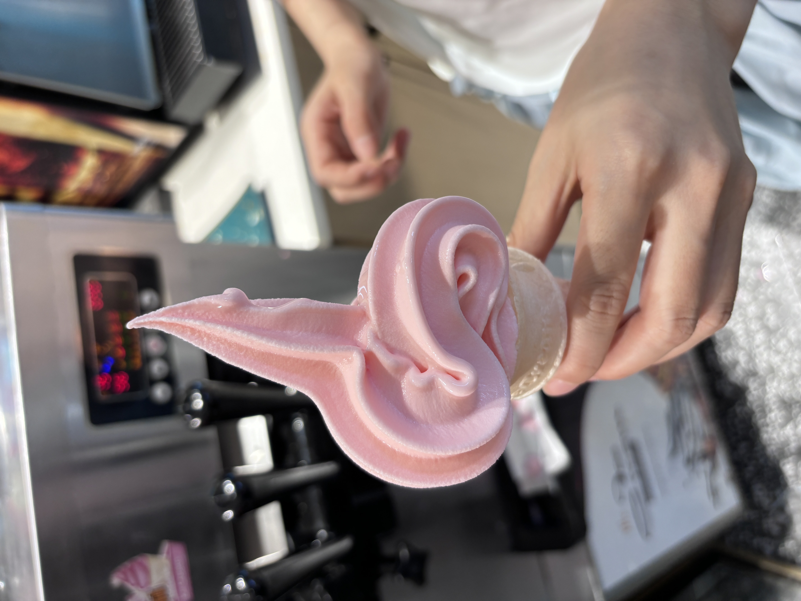
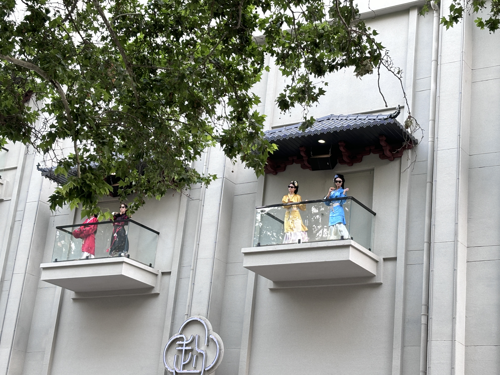

# 端午小假期

## 05.31

坐车回邯郸，和彤彤一起看房。
看了新新家园小高层3套

- 16层 110平 期望成交1w/平 (每个屋子都有窗户、但)
- 16层 147平 挂牌133w
- 3层 110平 期望成交118w

晚饭吃的王式牛肉汤，好吃不贵。到宾馆后吃了彤彤给买的生日蛋糕，非常值得纪念🙏

| 蛋糕 | 合影
| --- | --- |
|  |  |

## 06.01

早饭在饭店吃，有炒包子的原因，吃了两碗。

在出租屋听歌看书<马斯克传>

中午去天鸿吃了阿上阿上麻辣烫，还是一如既往的好吃

晚上吃的生菜卷火鸡面，肉，虾

## 06.02

早饭在饭店吃，又吃了两碗

中午吃的烤鱼诱惑，麻辣味的，但不是很辣

| 烤鱼 | 冰激凌 |
| --- | --- |
| | |

下午去医院报销了医药费，接着去从台公园故地重游，胡服骑射的台子已经免费了。公园整体整的也蛮不错的。

晚上和彤彤买的西瓜，葡萄，虾，火锅丸子，煮的螺蛳粉，很好吃。

## 06.03

早饭一起煮的螺蛳粉

未完待续~