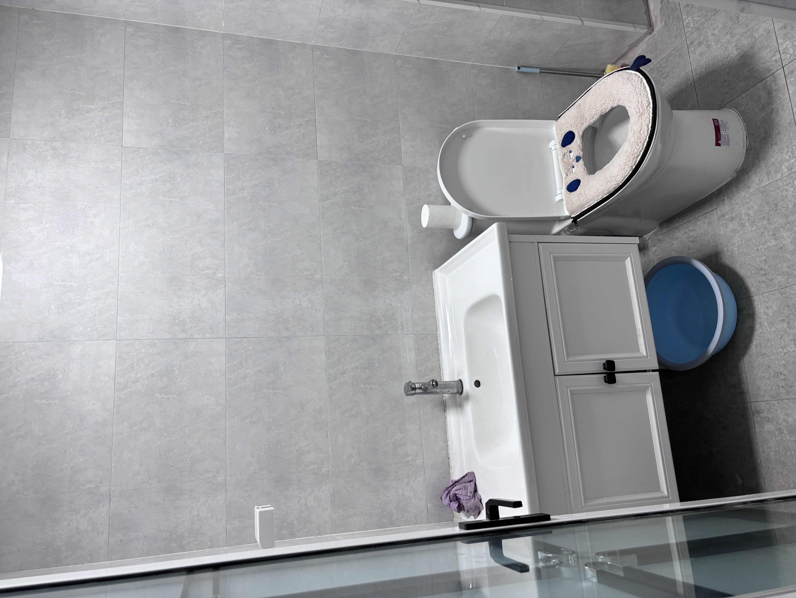
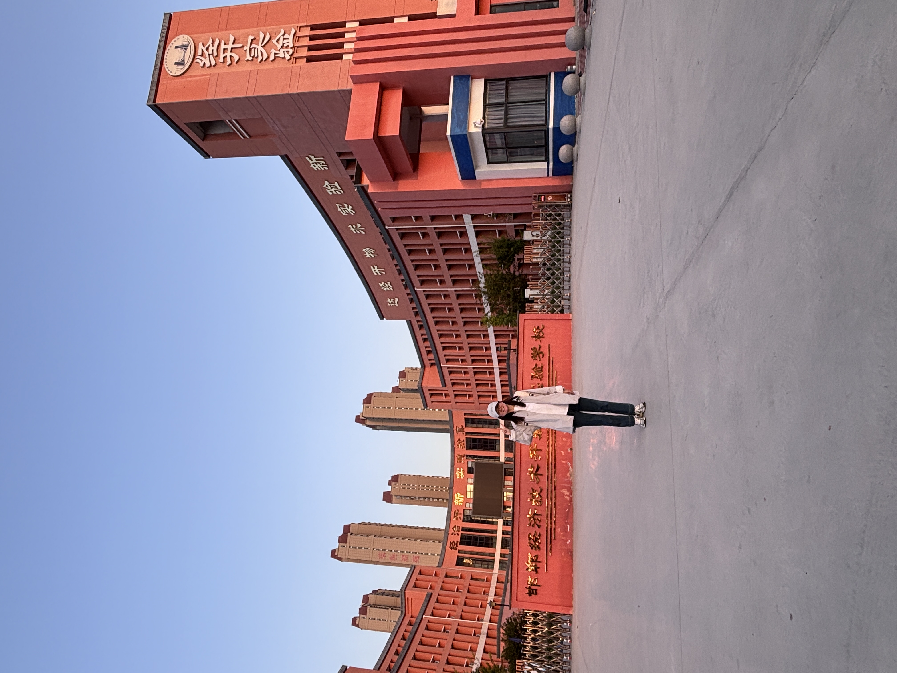
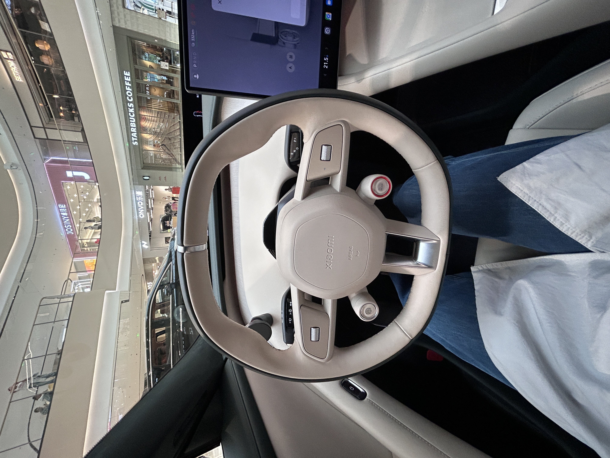
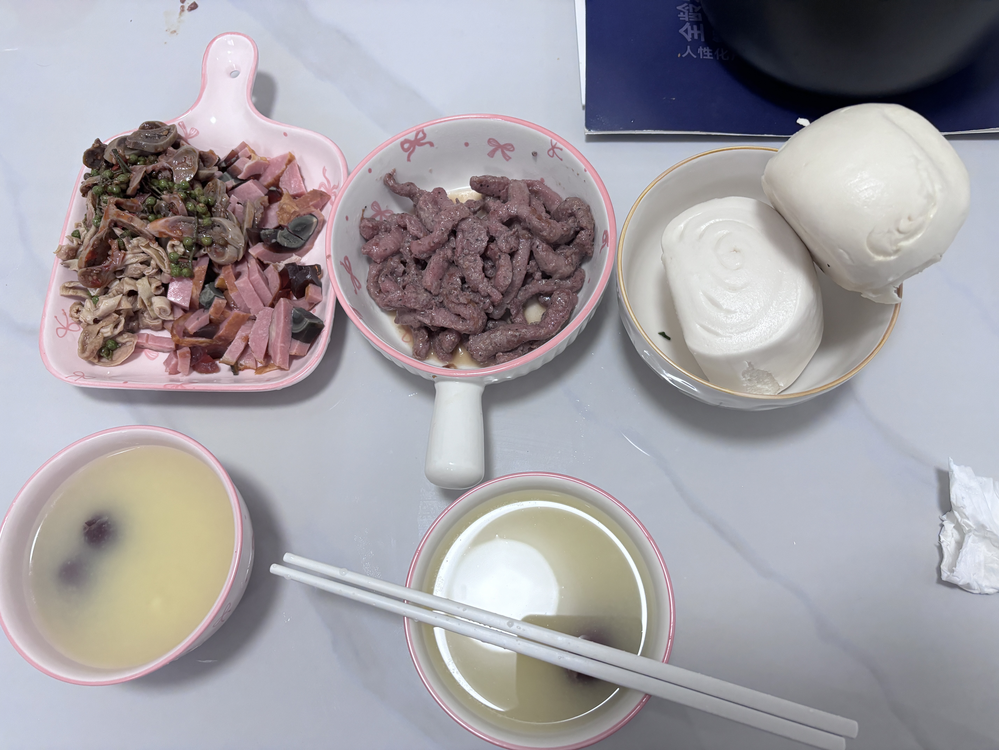
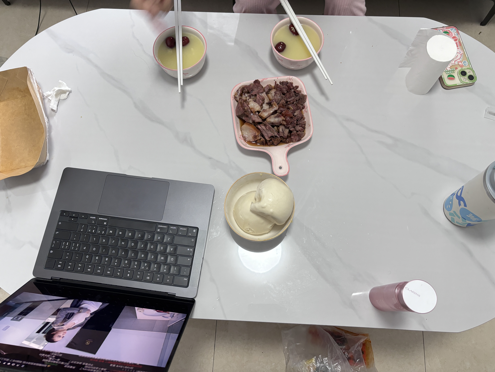

# 2025-国庆

> 体验人间烟火气

## 出租屋一览

| 客厅 | 次卧 | 厨房 | 厕所 | 
| -- | -- | -- | -- | 
|  |  |  |  |

| 厨房储物 | 冰箱储物 | 
| -- | -- | 
|  |  | 

## 09.30

| 时间 | 事件 | 备注 |  图片 | 
| -- | -- | -- | -- | 
| 早上 | 鸡蛋灌饼 | 7 | - | 
| 中午 | <li>骑车遛弯</li> <li>学校门口等wtt</li> |  - |  | 
| 晚上 | <li>明洞烤肉 </li> <li>逛超市：买牛奶、鸭蛋</li> | <li> 157.87 </li> <li>87.8</li>|   | 

## 10.01
 
| 时间 | 事件 | 备注 | 图片 | 
| -- | -- | -- | -- | 
| 早上 | 开车回wtt家，下地装玉米 | - |      | >
| 中午 | <li> 水饺、木须肉、水煮肉片、卤鸡 </li> <li>六个核桃、月饼</li> <li>送wtt老姑剑南春礼盒、牛奶、鸭蛋</li>| <li>82</li> <li>68</li> <li>-</li>| - | - | 
| 晚上 | 开车高速回邯郸 | - | - |

## 10.02

| 时间 | 事件 | 备注 | 图片 | 
| -- | -- | -- | -- | 
| 早上 | <li>电影：分手清单</li><li>阿虎结婚随礼</li><li>早饭：方中山胡辣汤、油饼、牛肉饼、水煎包</li> | <li>-</li><li>666</li> <li>17</li>|   | 
| 中午 | 逛万象汇 <li>体验小米，乐道，极氪</li><li>逛超市</li> |   <li>-</li> <li>165.89</li> |  | 
| 晚上 | 煮云吞、火腿 | - |   | 

## 10.03

| 时间 | 事件 | 备注 | 图片 | 
| -- | -- | -- | -- | 
| 早上 | 提交工资材料、逛尚壁镇 | 44.5 | - | 
| 中午 | wtt做的鸡蛋火腿炒面 | - |  | - | 
| 下午 | wtt找曲周同事吃饭 | - | - | 
| 晚上 | 逛超市买了牛腱子、猪脸 | 262.32 | - | 

## 10.04

| 时间 | 事件 | 备注 | 图片 | 
| -- | -- | -- | -- | 
| 早上 | 小米粥、鸭肠、馒头 | - |  |
| 中午 | [房屋记录](https://docs.qq.com/sheet/DU1FFc1B0SEJKak9P?tab=BB08J2) | - | - | 
| 晚上 | 约常同学吃火锅，聊天 | 常同学带了奶茶、西瓜、香蕉 | - |

## 10.05

| 时间 | 事件 | 备注 | 图片 | 
| -- | -- | -- | -- | 
| 早上 | 小米粥、松花火腿 | - |  | 
| 中午 | 淋雨办银行卡 |  办银行卡，必须在户籍地 or 提供所在区的工作证明 |  - | 
| 晚上 | 螺蛳粉火锅 | - |  | 

## 10.06

| 时间 | 事件 | 备注 | 图片 | 
| -- | -- | -- | -- | 
| 早上 | 小米粥、猪头肉牛腱子 | - |  |
| 中午 | 炒面、西红柿牛肉汤 | - |  |
| 晚上 | <li>wtt回肥乡;我回武安，到武安路上没车，走路回去的</li><li>妈妈给整的猪头肉，小菜，鸡腿</li> | - |   |

## 10.07

| 时间 | 事件 | 备注 | 图片 | 
| -- | -- | -- | -- | 
| 早上 | <li>妈妈做的炒菜。蘑菇，花菜，豆腐皮渣</li><li>给爸妈交了养老保险</li> | - |  |
| 中午 | 陪小娃玩耍、睡觉 | - | - |
| 晚上 | <li>wtt说难受，我就坐车过来了</li><li>辣椒鸡蛋</li> | - |   |

## 10.08

| 时间 | 事件 | 备注 | 图片 | 
| -- | -- | -- | -- | 
| 早上 | 小米粥（忘记放红枣） | - |  |
| 中午 | 鸡排、牛排、西红柿牛肉方便面 | - |  |
| 晚上 | 螺蛳粉火锅 | - |  |

## 10.09

大风密雨的一天

| 时间 | 事件 | 备注 | 图片 | 
| -- | -- | -- | -- | 
| 早上 | <li>两个饼夹肉</li><li>叠被子、拖地、刷鞋</li> | - | - |
| 中午 | - | - | - |
| 晚上 | - | - | - |`
