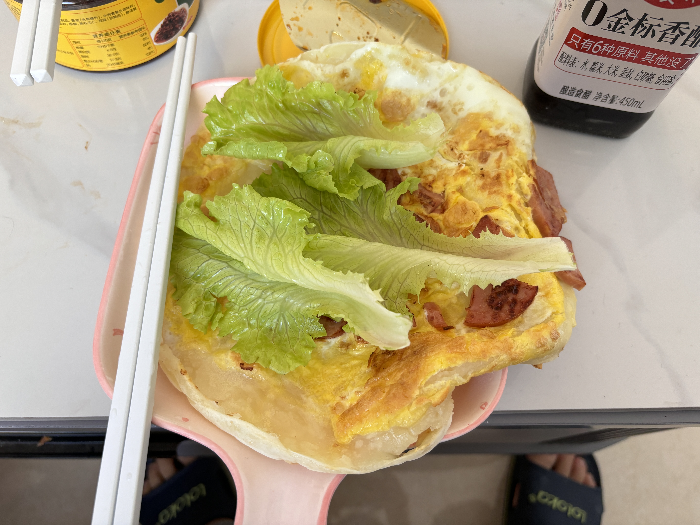

# 2025-初冬

> 响应号召，离国庆已过去一个月，回去陪下女友~

## 11.15

| 时间 | 事件 | 备注 |  图片 | 
| -- | -- | -- | -- | 
| 中午 | 彤彤当天来月经，中午点的小笼包和粥 | - | - |
| 晚上 | 晚上彤彤点的外卖：牛肉煲 | - | - |
| - | 晚上我9:40坐高铁到邯郸，彤彤接我回小窝 | - |  |

## 11.16

| 时间 | 事件 | 备注 |  图片 | 
| -- | -- | -- | -- | 
| 早上 | 和王彤做了一小时的饼（第一次） | - |  |
| 中午 | 去天鸿喝喜茶，等了蛮久 | - |  |
| 下午 | 试驾车: 海狮06，理想L6，问界M5 | 更喜欢理想L6 | - | 
| 晚上 | 和常同学、臭妮儿吃的铜锅涮肉  | - |  | 
| - | 逛了逛鹿岛，买了一个内胆衣服，还买了束花 | 刚好降温穿正合适 |  |

## 11.17

| 时间 | 事件 | 备注 |  图片 | 
| -- | -- | -- | -- | 
| 上午 | 我在睡觉，王彤做好了鸡蛋饼 |  |  |
| 中午 | 看了二手房荣科枫林苑（新房普遍有增值税，不喜欢）。新房：十里安澜 | 新房如果交付效果好的话，也可以买 | - |
| 下午 | 简单逛了下万象汇，在超市买了牛排还有麻辣烫。 | - |  |
| 下午 | 中午在家做的西红柿鸡蛋，牛排面。接着下午小睡了下 | - |  |
| 晚上 | 晚饭做了西红柿鸡蛋，麻辣烫，鸡蛋饼卷猪头肉，蛮满足的 | - |  |

## 11.18

| 时间 | 事件 | 备注 |  图片 | 
| -- | -- | -- | -- | 
| 早上 | 6:20的闹钟，王彤骑电动车载我去高铁站，6:50送到 | 天气很冷，但有对象，心里很暖 |  |
| 上午 | 在车上补了会儿觉，还是提早到公司的 | - | - |

## 未完待续~

