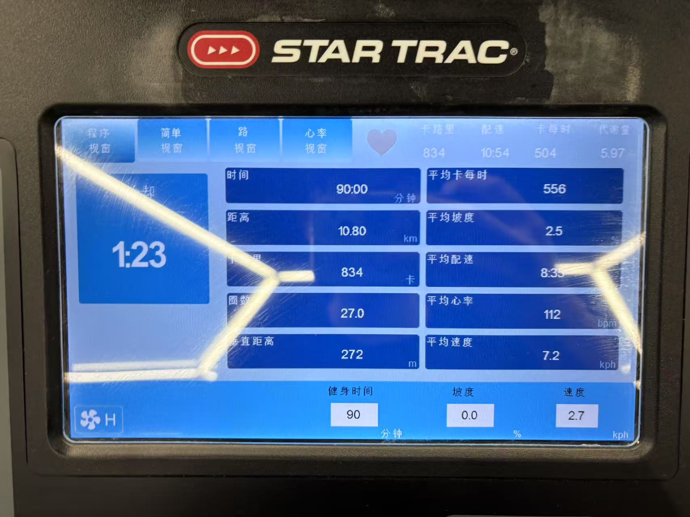
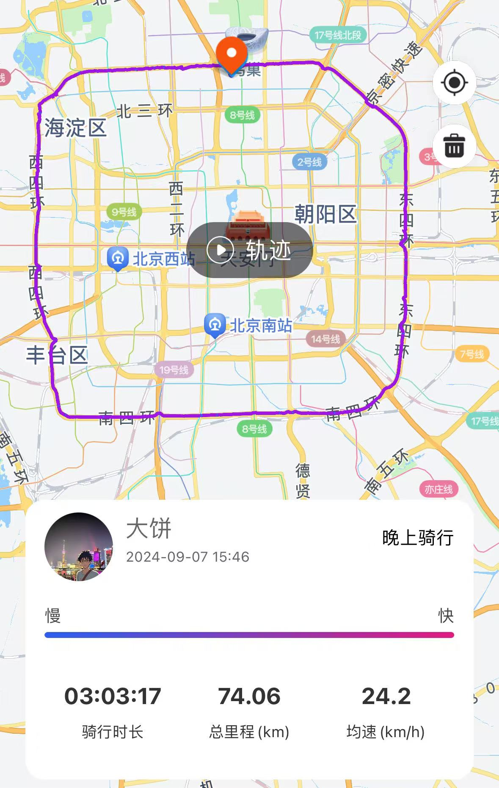
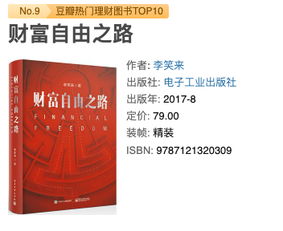
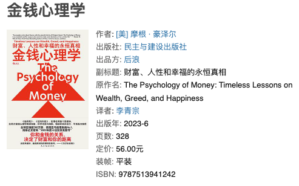

# Draymonder Docs

## About

大饼，邮箱：Draymonders#gmail.com

> 十年一梦，梦如花开。花开烂漫，一梦十年。

## What I'm Doing

> 不积跬步，无以至千里；不积小流，无以成江海

- 保持健康：周度骑车和跑步，保持充足睡眠。
- 增强专注：持续学习，提升知识深度和广度，定期归纳总结。
- 珍惜时间：梳理核心问题，分析其中矛盾并攻坚主要矛盾。
- 相信复利：一切进步需要长期持续的行动。

| 跑步 | 骑车 | 读书| 
| -- | -- | -- |
|  |  |    |

## Reference

* `mkdocs serve` - Start the live-reloading docs server.

For full documentation visit [mkdocs.org](https://www.mkdocs.org).