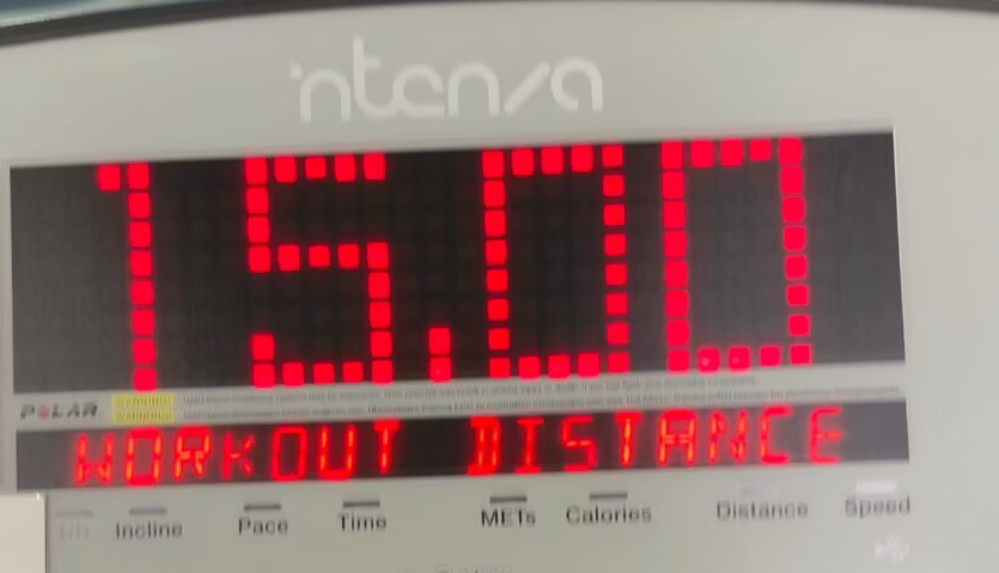
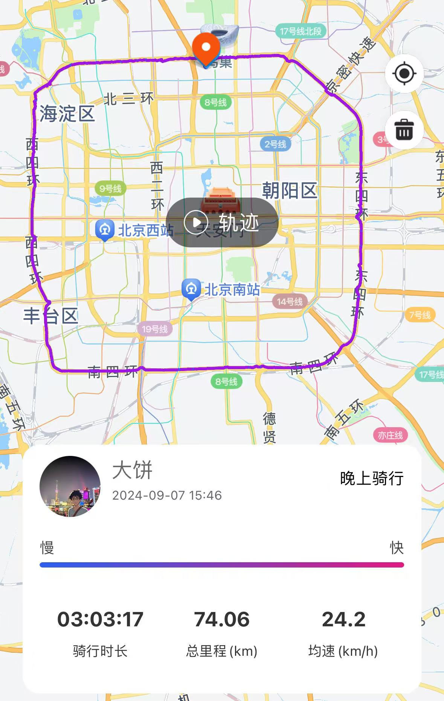
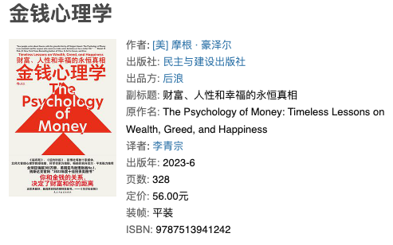

# Draymonder Docs

## About

大饼，邮箱：Draymonders#gmail.com

> 十年一梦，梦如花开。花开烂漫，一梦十年

> 希望我的存在能让身边的人对生活更加的热爱

## What I'm Doing

> 不积跬步，无以至千里；不积小流，无以成江海

- 健康优先：周度骑车和跑步，保持充足睡眠
- 保持专注：持续学习，提升知识深度和广度，定期归纳总结
- 抓住核心：找到问题的核心痛点和卡点，尝试突破解决并总结反思
- 相信复利：一切进步需要长期持续的行动

| 跑步 | 骑行 | 阅读 | 
| -- | -- | -- |
|  |  |  |

## Reference

* `mkdocs serve` - Start the live-reloading docs server.

For full documentation visit [mkdocs.org](https://www.mkdocs.org).